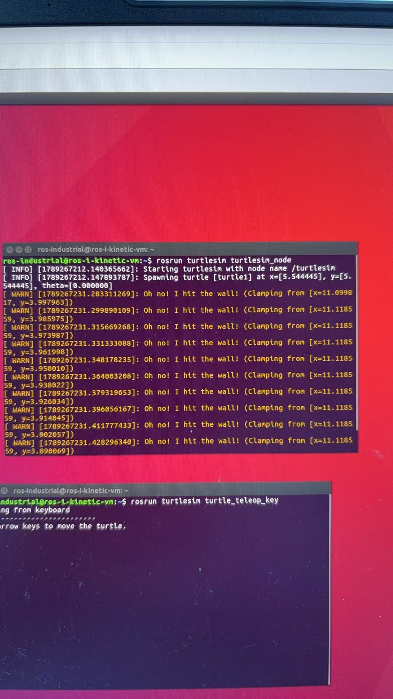
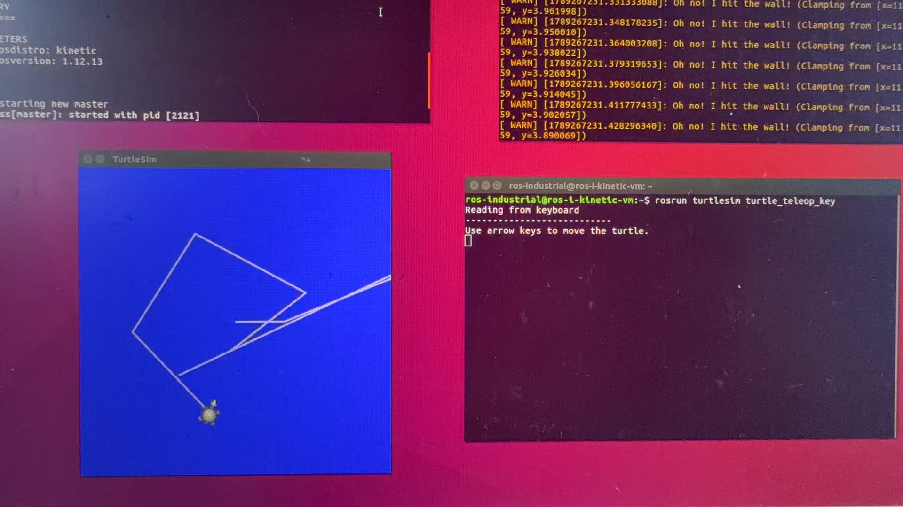

# git-ros-schoolwork
# ROS1 Kinetic — 小海龟 turtlesim 作业
姓名：吴泽鸿
环境：Ubuntu16.04
 + ROS‑Kinetic
功能：键盘 WASD 控制仿真小海龟移动

## 操作步骤
### 1. 安装功能包
```bash
sudo apt-get install ros-kinetic-turtlesim
2. 启动 ROS 核心（roscore）
打开终端 1，执行，运行之后不关
```bash
roscore
## 运行截图

3. 启动小海龟仿真窗口
打开终端 2
```bash
rosrun turtlesim turtlesim_node
## 运行截图

执行后弹出蓝色 turtlesim 仿真画布，出现小海龟。
4. 启动键盘控制节点
打开终端 3（全新终端）
```bash
#运行
rosrun turtlesim turtle_teleop_key
## 运行截图

