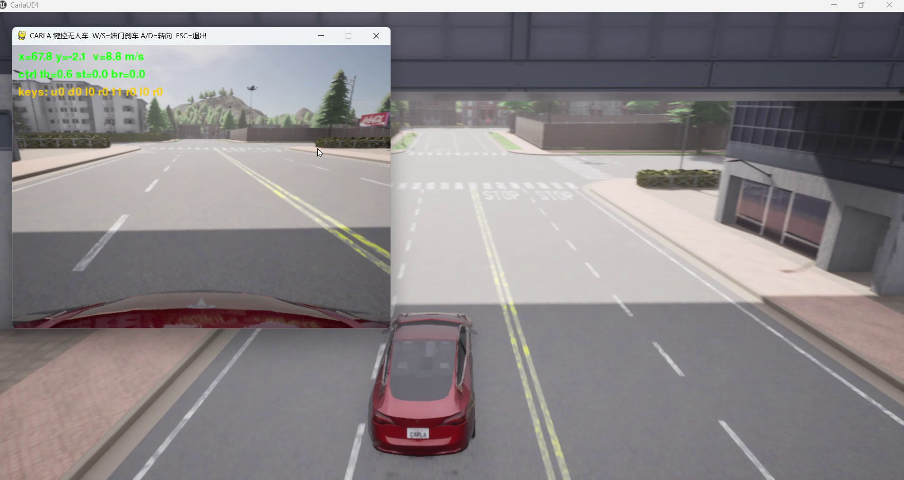
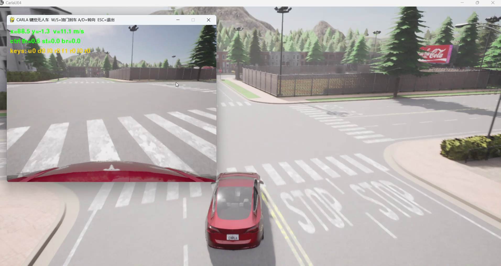
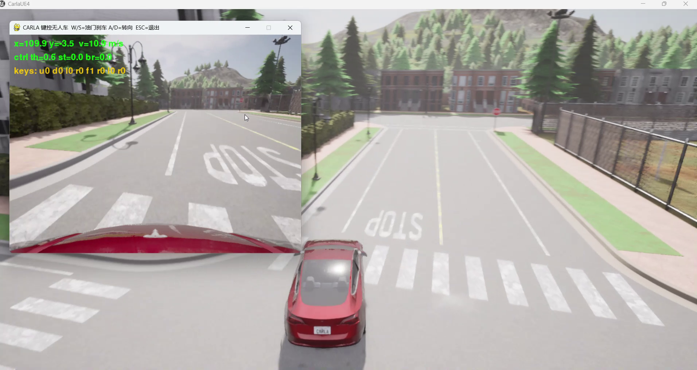

# 作业一 · CARLA 无人车键盘运动控制

> 对应老师任务 (1)：对车辆进行物理仿真，通过键盘进行运动控制。

## 1. 任务目标

在 CARLA 0.9.16 中加载无人车（`vehicle.tesla.model3` 蓝图），实时渲染车头相机
3D 画面，并通过键盘控制油门、转向、刹车，验证**物理仿真 + 运动控制**链路。

## 2. 仿真环境

| 组件 | 说明 |
|---|---|
| 仿真器 | CARLA 0.9.16（UE4 引擎） |
| 车辆 | `vehicle.tesla.model3` |
| 传感器 | 前视 RGB 相机 `camera0` |
| 控制窗口 | pygame |
| 地图 | Town05（默认） |

## 3. 计算原理

### 3.1 车辆运动学

CARLA 的 `VehicleControl` 接受 `(throttle, steer, brake, reverse)`。车辆纵向服从
近似一阶动力学：

$$
\dot{v} = \frac{\tau \cdot T - c_d v^2 - F_f}{m}
$$

其中 $\tau \in [0,1]$ 为油门，$T$ 最大驱动力，$c_d$ 风阻系数，$F_f$ 摩擦阻力。
转向角 $\delta = \text{steer} \cdot \delta_{\max}$ 经阿克曼几何转化为前轮转角。

### 3.2 同步步进

通过 `world.get_settings().synchronous_mode = True` 打开同步模式，固定
`fixed_delta_seconds=0.05s`。每次 `world.tick()` 推进一帧，保证相机/雷达与
物理状态对齐：

$$
t_{k+1} = t_k + \Delta t,\qquad \Delta t \equiv 0.05\text{s}
$$

## 4. 算法流程

```
连接 CARLA → load_world(Town05) → 开同步模式
→ spawn 自车 vehicle.tesla.model3
→ 挂 RGB 相机(640×480, fov=90) → pygame 打开窗口
→ 循环：
    读键盘 W/S/A/D/方向键 → 映射 (throttle, steer, brake)
    → apply_control → world.tick()
    → 把相机帧显示到 pygame + HUD(位置/速度/控制量)
→ ESC 退出 → 释放车辆
```

## 5. 源码解析（`common.py` / `01_control/main.py`）

- `common.py`：
  - `connect()`：`carla.Client` 连接并 `load_world`，开启同步模式。
  - `spawn_vehicle()`：`world.try_spawn_actor(bp, tf)`，出生点不可用时
    用 `map.get_waypoint(loc)` 找最近路面点。
  - `make_rgb_camera()`：挂相机，回调接收 `carla.Image`，由 `_decode_image()`
    把 BGRA 重排成 RGB。
  - `apply_control()`：构造 `carla.VehicleControl`。
- `01_control/main.py`：
  - `keyboard_control()`：主循环，读键→控制→`world.tick()`→渲染 HUD。
    控制量按**真实驾驶逻辑**生成：`S` 在有速度时刹车、静止时自动挂倒挡倒车；
    `W` 加油门，`A/D` 转向：
    ```python
    speed = get_speed(vehicle)
    if KEYS["fwd"]:
        throttle = 0.6
    elif KEYS["rev"]:
        if speed < 0.5:           # 几乎停住 → 挂倒挡
            reverse, throttle = True, 0.5
        else:                     # 有速度 → 刹车
            brake = 0.8
    apply_control(vehicle, throttle=throttle, steer=steer, brake=brake, reverse=reverse)
    ```

## 6. 运行步骤

### 6.1 启动 CARLA
```bash
./CarlaUE4.sh -carla-rpc-port=2000 -quality-level=Low
```

### 6.2 独立运行
```bash
source .venv/bin/activate
python main.py --task control
# 等效：python 01_control/main.py
```

### 6.3 ROS1 Noetic / ROS2 Humble launch
```bash
# ROS2 Humble
source /opt/ros/humble/setup.bash
ros2 launch 01_control/launch/main.launch.py

# ROS1 Noetic
source /opt/ros/noetic/setup.bash
roslaunch carla_assignment 01_control.launch
```

## 7. 操作说明（录屏剧本）

1. CARLA 服务端窗口出现小镇场景，弹出 pygame 小车操作窗口。
2. **W** = 加速、**A** / **D** = 转向、**S** = 刹车（静止时自动倒车）、方向键等同、**ESC** 退出。

!!! note "运行效果（Windows 原生实测截图）"
    
    
    

## 7.1 Ubuntu 20.04 虚拟机（ROS Noetic/Humble 环境）运行验证

在老师提供的 Ubuntu 20.04 虚拟机（`ros_noetic_humble_gazebov11`，Python 3.10）
上，仅安装 CARLA 0.9.16 的 **Python 客户端模块**（`carla` wheel）即可直接连接
宿主机的 CARLA 服务端运行，无需在虚拟机内安装仿真器：

```bash
# ① 安装 Python 3.10 与客户端依赖
sudo apt-get install -y python3.10 python3.10-venv
python3.10 -m pip install numpy pygame
# ② 安装 CARLA 0.9.16 客户端（Linux wheel）
python3.10 -m pip install carla-0.9.16-cp310-cp310-manylinux_2_31_x86_64.whl
# ③ 运行作业一，--host 指向宿主机 CARLA，--follow 让镜头跟随自车
cd carla_assignment
python3.10 main.py --task control --host <宿主机IP> --follow
```

> 连接验证：`python3.10 -c "import carla; c=carla.Client('<宿主机IP>',2000);
> c.set_timeout(10); print(c.get_world().get_map().name)"` 输出
> `Carla/Maps/Town10HD_Opt` 即表示虚拟机客户端已成功连上宿主机 CARLA。
>
> 该方法把 CARLA 服务端放在 Windows/宿主机（GPU 渲染），虚拟机仅作为
> ROS/客户端环境，避免虚拟机内 3D 渲染卡顿，符合老师"Windows 原生 /
> 虚拟机 / Ubuntu"多运行配置的要求。

## 8. 性能评价

- 车辆能平滑加速/转向/刹车，HUD 实时显示位置与速度曲线。
- 在直道可稳定加速到目标速度，弯道转向响应及时。
