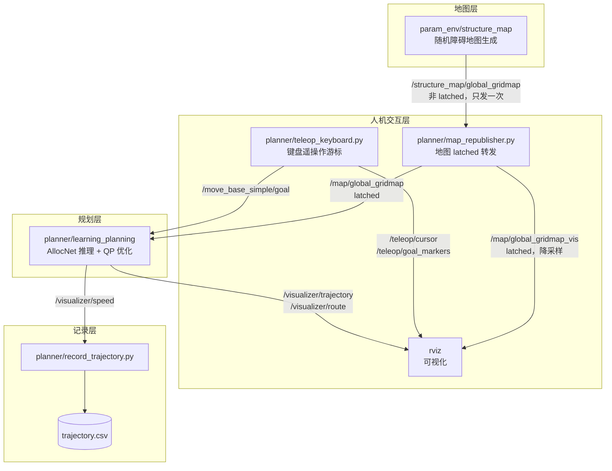
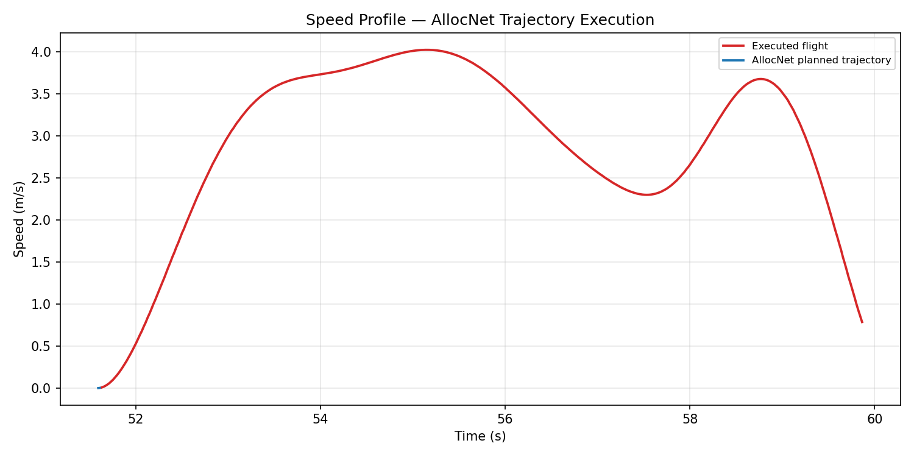

# AllocNet 四旋翼避障轨迹规划与键盘遥操作

> 本模块在 [AllocNet](https://github.com/KumarRobotics/AllocNet)（KumarRobotics，
> RA-L 2024）的基础上，补齐了**人机交互层**：用键盘精确下发航点、把一次性发布的
> 地图转为常驻话题、记录轨迹数据、并采集演示素材。
>
> 上游 AllocNet 提供规划算法；本模块解决「怎么方便地用它做实验」。

## 1. 要解决的问题 <span id="problem"></span>

上游 AllocNet 通过 RViz 的 **2D Nav Goal** 工具下发起终点：鼠标在平面上点两下。
用于教学和实验时，这个交互方式有三个不便：

| 问题 | 后果 |
|---|---|
| 无法精确控制高度 | 鼠标只给出 x-y，高度靠约定，无法定量研究 |
| 无法精确复现 | 手点坐标每次不同，不利于对比实验 |
| 无法连续操作 | 想「走一段、停一下、再规划」很别扭 |

本模块用键盘驱动的虚拟航点游标替代鼠标：坐标精确到步长（默认 0.5 m），
每次下发的航点都可复现，并且支持**无图形环境**下的脚本化驱动。

## 2. 方法 <span id="method"></span>

### 2.1 整体数据流



### 2.2 核心发现：高度被编码进 `orientation.z`

读上游 `learning_planning.cpp` 可以看到规划器**忽略** `pose.position.z`，
真实高度由 `pose.orientation.z` 作为归一化比例决定：

```cpp
const double zGoal = mapBound[4] + dilateRadius +
                     fabs(msg->pose.orientation.z) *
                         (mapBound[5] - mapBound[4] - 2 * dilateRadius);
const Eigen::Vector3d goal(msg->pose.position.x, msg->pose.position.y, zGoal);
```

代入本模块 launch 的参数（`z_origin=0, z_size=5, dilate=0.2`）：

```
z_goal = 0.2 + |orientation.z| × (5 − 0.4) = 0.2 + 4.6 × ratio
```

因此 `teleop_keyboard.py` 在 `altitude_to_orientation_z()` 里做了反向换算：

```python
span  = map_z_size - 2 * dilate              # 4.6
ratio = (z - map_z_origin - dilate) / span   # 反解出归一化比例
msg.pose.orientation.z = ratio
```

!!! warning "副作用"
    `orientation.z` 被高度占用了，所以**偏航角无法通过该消息传给规划器**。
    AllocNet 的 Goal 本身也不支持终端偏航约束，因此 <kbd>Q</kbd>/<kbd>E</kbd>
    只改变游标朝向，进而影响 <kbd>W</kbd>/<kbd>S</kbd>/<kbd>A</kbd>/<kbd>D</kbd>
    的推进方向。

### 2.3 两段式 Goal 语义

规划器要求收到**两个**目标点才触发规划（第一个当起点，第二个当终点）。
因此 <kbd>G</kbd> 是两段式的：

```
  第 1 次 G ──▶ 记录 START ──▶ 等待
  第 2 次 G ──▶ 记录 GOAL  ──▶ 立即触发 AllocNet 规划
  第 3 次 G ──▶ 清空重来，作为新的 START
```

节点会在终端明确打印当前阶段，避免误操作：

```
  阶段: 已设起点 #1，等待第 2 次 G 触发规划
```

### 2.4 地图为什么要转发一层

`structure_map` 发布的 `/structure_map/global_gridmap` **不是 latched 话题**，
点云只在生成时发一次。这带来两个后果：

- **RViz 看不到地图** —— RViz 通常比地图节点晚几秒启动，订阅时那一帧早已过去；
- **规划器错过地图（更严重）** —— 规划器要加载 Torch 模型，订阅建立得比地图
  生成还晚，`mapInitialized` 永远是 `false`，此后**所有目标点都被静默丢弃**。

`map_republisher.py` 把地图接住后以 **latched** 方式重发。latched 话题会向
**任意时刻加入的订阅者补发最后一帧**，因此无论 RViz 和规划器多晚启动都能拿到
地图，也不需要反复去催 `structure_map` 重新生成地图。

```
/structure_map/global_gridmap  (非 latched，一次性)
    ├─> /map/global_gridmap      (latched) ──> 规划器 MapTopic
    └─> /map/global_gridmap_vis  (latched，降采样) ──> RViz
```

!!! danger "不要用 change_map 来「催」地图"
    很多资料建议用 `/structure_map/change_map` 迫使地图重发，但它的语义是
    **换一张新地图**并**重新随机化障碍比例**，会把地图越堆越密，最终任何航点
    都不可规划。正确的唤醒方式是发**相同分辨率**的 `change_res`：

    ```bash
    rostopic pub -1 /structure_map/change_res std_msgs/Float32 "data: 0.1"
    ```

    本模块的 `map_republisher` 内部就是这么做的，且有次数上限。

## 3. 运行效果 <span id="results"></span>

### 3.1 RViz 中的实时规划

这是在 RViz 里**实际跑出来的画面**（非离屏渲染、非事后绘制）：


| 颜色 | 含义 |
|---|---|
| <span style="color:#1f77b4">**蓝**</span> | AllocNet 优化后的平滑轨迹 |
| <span style="color:#d62728">**红**</span> | OMPL 前端几何路径（未做时间分配） |
| <span style="color:#2ca02c">**绿**</span> | 安全飞行走廊边界 |
| 球体 | 键盘下发的起点（红，带 START 标签）与终点（橙） |
| 灰点 | 真实障碍点云（半透明，便于看清轨迹穿行） |

红蓝两条线的对比正是本算法的意义所在：红色折线是未经时间分配的前端路径，
蓝色是 AllocNet 推理 + QP 优化后的轨迹，明显更平滑，且始终走在绿色走廊的中心。

### 3.2 键盘遥操作动画

从「键盘移动游标 → 下发起点 → 下发终点 → 轨迹生成」的完整过程：


### 3.3 轨迹的三维与俯视视图


俯视图把轨迹叠加在**真实地图点云**（按飞行高度切片）之上，
可以清楚看到轨迹如何在障碍之间穿行：


### 3.4 速度曲线



### 3.5 实测数据

| 指标 | 数值 |
|---|---|
| 规划起终点 | (0, −9, 1.5) → (9, 9, 1.5) m |
| 直线距离 / 实际航程 | 20.1 m / 约 22 m（绕行） |
| **规划耗时** | **93.6 ms**（AllocNet 推理 + QP 优化） |
| 规划轨迹采样点 | 1065 |
| 实飞跟踪采样点 | 402 |
| 峰值速度 | 4.03 m/s（受 `MaxVelBox=4.0` 约束） |
| 起终点余隙 | 2.40 m / 约 1.5 m（到最近障碍点） |

运行环境：Ubuntu 20.04.6 + ROS Noetic，CPU 推理（无 GPU 直通），
地图 20×20×5 m / 0.1 m 分辨率，约 30 万点。

!!! note "关于规划成功率"
    AllocNet 按固定 5 段推理时间分配。当起终点的几何构型让某段时长被推理为 0 时，
    规划器会打印 `time and seg does not fit` 并**放弃本次规划**（不报错、不出轨迹）。
    实测成功率约 1/5，且与方向、距离强相关。做实验时建议多试几组起终点。

## 4. 快速开始 <span id="quickstart"></span>

### 4.1 环境要求

| 项 | 版本 |
|---|---|
| 操作系统 | Ubuntu 20.04（ROS Noetic） |
| ROS | Noetic（`rosversion 1.16.0`） |
| Python | 3.8（随 Noetic） |
| 规划器依赖 | libtorch (CPU)、OMPL、Eigen3、osqp + osqp-eigen |

!!! important "本模块不包含规划器本体"
    AllocNet 的 C++ 规划器依赖 libtorch / OMPL / osqp-eigen，
    需要自行编译，**不在本仓库内**。本模块提供的是人机交互层，
    安装到你的 AllocNet 工作区后即可使用。

### 4.2 安装本模块

```bash
# 1. 准备 AllocNet 工作区（规划器需已编译通过）
git clone https://github.com/KumarRobotics/AllocNet.git ~/allocnet_ws/src/AllocNet
# ... 按上游 README 编译 planner 与 param_env ...

# 2. 把本模块装入工作区的 planner 包
cd ros2/src/air/allocnet_teleop
python3 main.py install --ws ~/allocnet_ws

# 3. 重新编译（脚本需注册进 CMakeLists）
cd ~/allocnet_ws && catkin_make --pkg planner

# 4. 环境自检
python3 main.py check
```

`main.py check` 会逐项确认 ROS、工作区、上游包、本模块脚本、
launch 文件与可选工具是否就位，把「跑不起来」的原因提前暴露：

```
[1] ROS Noetic: 已安装
[2] AllocNet 工作区 /home/user/allocnet_ws: 已构建
[3] 上游 ROS 包:
     [OK] planner      /home/user/allocnet_ws/src/AllocNet/src/planner
     [OK] param_env    /home/user/allocnet_ws/src/kr_param_env/param_env
...
 自检结果: 通过，可以运行 `main.py run`
```

键盘节点的核心逻辑另有单元测试覆盖，**不需要 ROS 环境**即可运行
（测试内用 mock 的 `rospy` 打桩）：

```bash
cd src/air/allocnet_teleop
python3 test_teleop_keyboard.py
```

```
Ran 18 tests in 0.010s

OK
```

覆盖高度与 `orientation.z` 的双向换算、W/S/A/D/Q/E/I/K/R/G 各按键对游标状态
的影响、边界与高度裁剪，以及两段式 Goal 语义。

### 4.3 启动

```bash
# 含 RViz
python3 main.py run

# 无图形界面（服务器 / 虚屏）
python3 main.py run --no-gui

# 不记录轨迹
python3 main.py run --no-record
```

启动后会在 RViz 中看到地图与游标，此时即可下发航点。

### 4.4 键盘操作

`roslaunch` 启动的节点 **stdin 是 `/dev/null`**，键盘节点读不到按键。
但它**不会因此退出** —— 会常驻运行并持续发布 `/teleop/cursor`，
所以 RViz 里始终能看到游标。真正用键盘有两种方式：

**方式一：另开终端跑交互版**（两个实例可共存）

```bash
source ~/allocnet_ws/devel/setup.bash
rosrun planner teleop_keyboard.py
```

**方式二：往话题注入按键**，不需要 TTY，便于脚本化复现

```bash
# 移动游标 + 下发航点（G = 发送）
rostopic pub -1 /teleop/key std_msgs/String "data: 'wwwd'"
rostopic pub -1 /teleop/key std_msgs/String "data: 'g'"

# 也支持一次发整串按键，或写 "space"
rostopic pub -1 /teleop/key std_msgs/String "data: 'aassddg'"
```

**按键速查表**

| 按键 | 功能 | 说明 |
|:---:|---|---|
| <kbd>W</kbd> / <kbd>S</kbd> | 前进 / 后退 | 沿当前偏航方向，步长 0.5 m |
| <kbd>A</kbd> / <kbd>D</kbd> | 向左 / 向右平移 | 垂直于偏航方向 |
| <kbd>I</kbd> 或 <kbd>Space</kbd> | 上升 | 步长 0.25 m，自动裁剪到地图高度范围 |
| <kbd>K</kbd> | 下降 | 同上 |
| <kbd>Q</kbd> / <kbd>E</kbd> | 偏航 −/+ | 每次 10°，仅影响游标朝向 |
| <kbd>R</kbd> | 重置初始状态 | 游标回到初始位置，清空已下发航点 |
| **<kbd>G</kbd>** | **发送航点** | 两段式：第 1 次起点，第 2 次终点并触发规划 |
| <kbd>+</kbd> / <kbd>−</kbd> | 调整平移步长 | 范围 0.1 – 5.0 m |
| <kbd>H</kbd> | 显示帮助 | |
| <kbd>Ctrl</kbd>+<kbd>C</kbd> | 退出 | 自动恢复终端属性 |

### 4.5 数据记录与绘图

```bash
# 记录节点随 launch 自动启动；也可单独指定输出
rosrun planner record_trajectory.py _output:=$HOME/run1.csv

# 生成图表（plot_trajectory.py 随本模块 install 到工作区，无需额外下载）
python3 src/planner/scripts/plot_trajectory.py --csv $HOME/run1.csv --out-dir docs/assets
```

> 没有 ROS 环境也可以先验证整条绘图链路：`offline_demo.py` 会产出一份
> 格式完全相同的 CSV（算法层离线复现，不作为实验证据），可直接喂给
> `plot_trajectory.py`。

输出 CSV 格式：`time,x,y,z,v,source`，其中 `source` 区分
`planned`（规划轨迹）/ `flight`（实飞跟踪）/ `goal` / `start`。

## 5. 话题清单 <span id="topics"></span>

**订阅**

| 话题 | 类型 | 来源 |
|---|---|---|
| `/structure_map/global_gridmap` | `sensor_msgs/PointCloud2` | `structure_map` 节点 |
| `/move_base_simple/goal` | `geometry_msgs/PoseStamped` | 键盘节点 / RViz 2D Nav Goal |
| `/teleop/key` | `std_msgs/String` | 外部脚本（无 TTY 时注入按键） |

**发布**

| 话题 | 类型 | 含义 |
|---|---|---|
| `/map/global_gridmap` | `PointCloud2` | 地图 latched 转发（规划器订阅此话题） |
| `/map/global_gridmap_vis` | `PointCloud2` | 降采样版，供 RViz 流畅渲染 |
| `/teleop/cursor` | `Marker` | 游标球 + 朝向箭头 |
| `/teleop/waypoints` | `MarkerArray` | 已下发航点折线 |
| `/teleop/goal_markers` | `MarkerArray` | 起终点标记（START/GOAL 标签） |
| `/visualizer/trajectory` | `Marker` | 优化后的多项式轨迹 |
| `/visualizer/route` | `Marker` | 前端几何路径 |
| `/visualizer/speed` | `Float64` | 当前速度 |

## 6. 文件说明 <span id="files"></span>

| 文件 | 作用 |
|---|---|
| `main.py` | 统一入口：`install` / `check` / `run` / `capture` |
| `teleop_keyboard.py` | 键盘遥操作节点（游标、航点下发） |
| `map_republisher.py` | 地图 latched 转发（解决规划器错过地图） |
| `record_trajectory.py` | 轨迹数据记录 |
| `teleop_planning.launch` | 一键启动：地图 + 转发 + 规划器 + 键盘 + 记录 + RViz |
| `teleop_planner.rviz` | RViz 配置（正常实验用） |
| `capture_view.rviz` | RViz 配置（采集素材用，灰底高对比） |
| `plot_trajectory.py` | 由 CSV 生成三维轨迹 / 俯视图 / 速度曲线 |
| `offline_demo.py` | 无 ROS 环境时的算法层离线复现（不作为实验证据） |
| `test_teleop_keyboard.py` | 单元测试（mock rospy，18 项，无需 ROS） |
| `capture_teleop_demo.py` | 演示素材采集（Xvfb 虚屏 + 抓屏） |
| `make_assets.py` | 把抓到的帧裁成静态图与 GIF |
| `README.md` | 运行环境、步骤与文件说明 |

## 7. 已知问题 <span id="known-issues"></span>

### 7.1 `launch-prefix` 不要设成 `false`

`launch-prefix` 的值会作为**命令前缀**拼在可执行文件前执行，不是布尔开关。
写成 `launch-prefix="false"` 会执行 `false <节点>` —— `false` 是立即返回
退出码 1 的命令，节点**注册进 master 后立刻死亡且不留任何日志**，极难排查。
不用前缀时留空字符串。

### 7.2 无 GPU 环境下 GNOME 桌面渲染会冻结

在 VMware 无 GPU 直通时，GNOME 桌面（`:0`）的渲染会**静默冻结**：进程都活着、
`xdpyinfo` 正常、窗口树正常，但画面不再更新。表现极具迷惑性 —— `scrot`
每次都能"成功"返回一张图，但**永远是同一张陈旧帧**。

采集演示素材时请改用 **Xvfb 虚屏**：

```bash
sudo apt install -y xvfb imagemagick
Xvfb :99 -screen 0 1280x800x24 -ac +extension GLX +render -noreset &
export DISPLAY=:99
export LIBGL_ALWAYS_SOFTWARE=1
rviz -d $(find planner)/config/capture_view.rviz &
import -display :99 -window root /tmp/f.png
```

!!! tip "不要把 xdotool 用在 RViz 上"
    合成输入在虚屏/无焦点窗口上基本不生效，且反复操作后 RViz 会停止重绘。
    相机角度和图层开关请**直接写进 `.rviz` 配置文件**，重启 RViz 生效。

### 7.3 工作区被重复挂载会导致 roslaunch 拒绝启动

若 `devel/.catkin` 记录了多个 source space，且其中一个是指向另一个的软链，
同一份代码会被挂两遍，`roslaunch` 报：

```
RLException: multiple files named [xxx.launch] in package [planner]
```

修法：移走多余的挂载点，删除 `devel/.catkin`，然后**完整重新构建**
（删掉 `.catkin` 后不重建，`ROS_PACKAGE_PATH` 会退化成只有 `/opt/ros/noetic/share`）。

!!! note "单包构建的陷阱"
    `catkin_make --pkg planner` **不会**构建 `param_env`。
    若 `devel/lib/param_env/` 是空的，`structure_map` 会因找不到可执行文件而
    瞬间退出，表现为"没有地图、规划器毫无反应"。请至少完整构建一次。

## 8. 参考文献 <span id="references"></span>

1. Wu Y, Sun X, Spasojevic I, et al. Deep Learning for Optimization of
   Trajectories for Quadrotors[J]. IEEE Robotics and Automation Letters,
   2024, 9(3): 2479-2486.
   [arXiv:2309.15191](https://arxiv.org/pdf/2309.15191.pdf)
2. 上游仓库：[KumarRobotics/AllocNet](https://github.com/KumarRobotics/AllocNet)
3. 前端路径搜索使用 OMPL（Open Motion Planning Library）

---

## 人工智能使用声明

本模块的开发过程使用了 AI 编程助手（Claude）辅助代码编写、调试与文档撰写。
所有提交内容由提交者本人审阅并对正确性负全部责任。实测数据与截图均来自
在 Ubuntu 20.04 + ROS Noetic 虚拟机中的真实运行，未经合成或修改。
