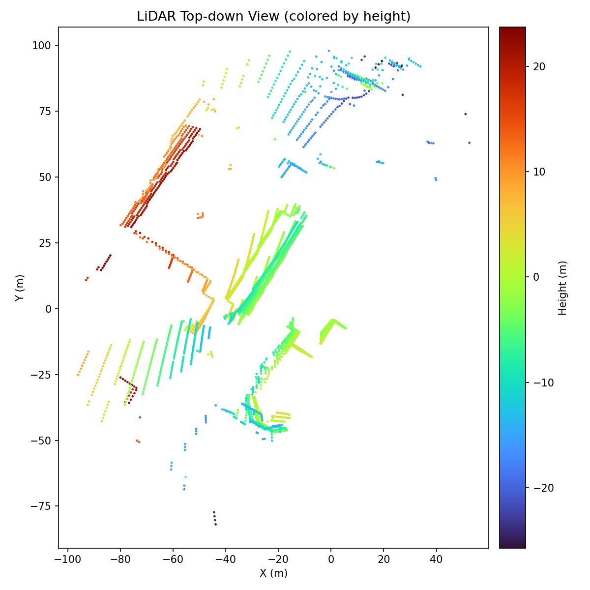
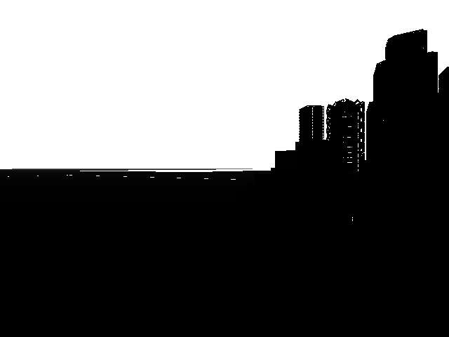

# 无人机与 ROS 的桥接模块（carlair_ros_bridge）

本模块在 **CarlaAir（OpenHUTB 空地一体仿真）** 与 **ROS Noetic** 之间提供统一桥接：
把 AirSim 的 NED 坐标统一换算为 ROS 的 ENU 坐标，向上暴露标准的位姿、图像、点云话题，
并接收速度与目标点指令，使感知、规划、控制、端到端各模块无需关心仿真器内部细节。

## 1. 运行架构

* **Windows 侧**：运行 CarlaAir 仿真器，同时提供两套 API
  * CARLA：`localhost:2000`（车辆、行人、天气、CARLA 原生传感器）
  * AirSim：`localhost:41451`（无人机飞行、相机、激光雷达）
* **虚拟机侧**：ROS Noetic 运行本桥接模块，通过 TCP 连接宿主机的 `41451` 端口

## 2. 环境准备

### 2.1 Windows 侧启动仿真器

```bat
cd CarlaAir-v0.1.7-Windows11-x86_64
SetupEnv.bat
TestEnv.bat
StartCarlaAir.bat Town01 --no-traffic --quality Low
```

等待终端输出 `CarlaAir is ready.`，此时 `2000` 与 `41451` 两个端口就绪。
显存较小的机器建议使用 `Town01`/`Town02` 小地图并配合 `--quality Low`。

### 2.2 配置 AirSim 传感器

将工程根目录下的 `AirSimConfig/settings.json` 换成本模块提供的配置（包含 RGB、深度、
语义分割相机与 16 线激光雷达），启动器每次启动会自动把它复制到
`%USERPROFILE%\Documents\AirSim\settings.json`。

需要注意其中雷达的 `DataFrame` 字段必须与 ROS 侧 `sensor/lidar_frame` 参数一致，
本模块统一使用 **`VehicleInertialFrame`**（点云落在 `world` 世界系，可与 `/uav/odom` 直接叠加）；
若改成 `SensorLocalFrame`，则需把 `sensor/lidar_frame` 同步改为 `sensor_local`，
桥接层会用雷达位姿把点云变换到惯性系后再转 ENU。

### 2.3 虚拟机侧安装客户端

```shell
pip3 install airsim
```

## 3. 编译与运行

```shell
# 为避免与教材章节中的同名包冲突，单独建立一个小工作空间
mkdir -p ~/bridge_ws/src
ln -s ~/path/to/ros2/src/air/carlair_ros_bridge ~/bridge_ws/src/
cd ~/bridge_ws
catkin_make
source devel/setup.bash

# 启动（含环境自检节点）
roslaunch carlair_ros_bridge main.launch
```

宿主机地址可通过参数覆盖：

```shell
roslaunch carlair_ros_bridge main.launch host:=192.168.94.1
```

`sim/vehicle_name` 默认为空，表示使用 `settings.json` 中的默认载具；
只有在多机仿真时才需要显式指定（如 `vehicle_name:=Drone1`）。

## 4. 话题接口

| 方向 | 话题 | 类型 | 说明 |
|---|---|---|---|
| 发布 | `/uav/odom` | `nav_msgs/Odometry` | ENU 位姿与速度，默认 20 Hz |
| 发布 | `/tf` | `tf2_msgs/TFMessage` | `world → base_link` |
| 发布 | `/camera/image_raw` | `sensor_msgs/Image` | 前视彩色图（`bgr8`，640×480），默认 20 Hz |
| 发布 | `/camera/depth` | `sensor_msgs/Image` | 平面深度图（`32FC1`，单位米），默认 20 Hz |
| 发布 | `/camera/seg` | `sensor_msgs/Image` | 语义分割伪彩色图（`bgr8`），默认关闭 |
| 发布 | `/lidar/points` | `sensor_msgs/PointCloud2` | XYZ float32 世界系（ENU）点云，默认 10 Hz |
| 发布 | `/uav/status` | `std_msgs/String` | `READY / HOVER / VELOCITY / GOAL / GOAL_DONE` |
| 订阅 | `/uav/cmd_vel` | `geometry_msgs/Twist` | 速度指令（默认机体系：前 / 左 / 上） |
| 订阅 | `/uav/goal` | `geometry_msgs/Point` | 目标点（ENU），飞抵后自动悬停 |

安全设计：速度指令自动限幅；超过 `cmd_timeout`（默认 0.5 s）没有新指令即自动悬停；
目标点任务在独立线程执行，期间速度通道让位。

## 5. 坐标系换算

AirSim 使用 NED（北-东-地），ROS 使用 ENU（东-北-天），换算矩阵为

```text
ENU = C · NED,   C = [[0, 1, 0],
                      [1, 0, 0],
                      [0, 0, -1]]

即 x_enu = y_ned,  y_enu = x_ned,  z_enu = -z_ned
姿态：R_enu = C · R_ned
```

恒等姿态（机头朝北）在 ENU 下的偏航角为 **+90°**，已在 `tests/test_frames.py` 中用单元测试锁定。

## 6. 传感器桥接（图像 / 深度 / 激光雷达）

### 6.1 图像：一次 RPC 取三路

`image_pub.py` 把彩色、深度、分割三路图像合并成**一次** `simGetImages` 调用：

```python
resp = client.simGetImages([
    airsim.ImageRequest("front_rgb",   0, False, False),   # Scene，BGRA
    airsim.ImageRequest("front_depth", 1, True,  False),   # DepthPlanar，float32
    airsim.ImageRequest("front_seg",   5, False, False),   # Segmentation
], vehicle_name=vehicle)
```

AirSim 的 RPC 是同步的，若三路各发一次调用，单帧耗时按往返次数线性增长；
合并后一次往返即可拿到全部数据，是 20 Hz 的主要保证。

解码只用 numpy，不需要 OpenCV。AirSim 在 `compress=False` 时返回
`width × height × 4` 的 **BGRA** 平面数组，丢掉 alpha 后前三个通道正好是
B、G、R，与 ROS 的 `bgr8` 编码一一对应：

```python
buf = np.frombuffer(bytes(resp.image_data_uint8), dtype=np.uint8)
bgr = buf.reshape(resp.height, resp.width, 4)[:, :, :3]
```

| AirSim `ImageType` | 数据字段 | ROS `encoding` | 用途 |
|---|---|---|---|
| `0` Scene | `image_data_uint8`（BGRA） | `bgr8` | 视觉感知、端到端网络的输入 |
| `1` DepthPlanar | `image_data_float`（float32） | `32FC1` | 障碍距离、点云配准 |
| `5` Segmentation | `image_data_uint8`（BGRA 伪彩色） | `bgr8` | 语义感知、标签生成 |

`DepthPlanar` 给出的是**沿光轴的平面深度**而不是透视深度，两者在针孔模型下满足

```text
Z_planar = Z_perspective · cos θ ,  θ 为该像素与光轴的夹角
```

因此平面深度可以直接按针孔模型反投影：`[X, Y, Z]ᵀ = Z_planar · K⁻¹ · [u, v, 1]ᵀ`。

### 6.2 点云：坐标系与位姿变换

AirSim 的点云坐标系由 `settings.json` 中该雷达的 `DataFrame` 决定：

| `DataFrame` | 含义 | 桥接处理 |
|---|---|---|
| `VehicleInertialFrame`（默认） | 载具惯性系（NED 世界系，米），与 `getMultirotorState` 同源 | 只做 NED → ENU 轴变换 |
| `SensorLocalFrame` | 雷达局部系 | 先用 `LidarData.pose` 变换到惯性系 |

本模块统一使用 `VehicleInertialFrame`，于是点云、里程计、目标点全部落在同一个
`world`(ENU) 坐标系内，后续 octomap 建图与路径规划**不需要额外的外参标定**。

当配置为 `SensorLocalFrame` 时，需要用雷达在惯性系中的位姿 `(R, t)` 做刚体变换
（`LidarData.pose` 即为该位姿，语义见 AirSim 官方 LIDAR 文档）：

```text
p_world_ned = R(q_pose) · p_sensor + t_pose
p_enu       = C · p_world_ned
```

`tests/test_sensors_local.py` 用「世界点 → 正向投影到雷达局部系 → 反解回世界系」的
往返一致性对此做了锁定。

### 6.3 PointCloud2 的二进制布局

每个点 3 个 float32（小端），依次 x、y、z：

```text
point_step = 3 × 4 = 12   字节
row_step   = point_step × width
height     = 1            （无序点云）
fields     = x@0(FLOAT32), y@4(FLOAT32), z@8(FLOAT32)
is_dense   = 所有点均有限时为 True
```

该布局与 `sensor_msgs.point_cloud2.create_cloud_xyz32()` 完全一致，
这里手写以便在无 ROS 环境下对字节流做单元测试。

### 6.4 可选的点云预处理

| 参数 | 作用 | 公式 |
|---|---|---|
| `lidar/min_range` / `max_range` | 环形滤波，去掉机身自反射与过远噪点 | 保留 `min ≤ ‖p‖ ≤ max` |
| `lidar/voxel_leaf` | 体素栅格降采样，压缩点云 | 体素索引 `k = ⌊p / leaf⌋`，同格取均值 |

体素降采样用整数坐标 + `np.unique` 分组实现，复杂度 `O(N log N)`，不依赖 PCL。
4 GB 显存 / 虚拟机 CPU 的场景下，`voxel_leaf:=0.2` 可把 6000+ 点压到 2000 点左右，
显著降低 RViz 与后续建图节点的负担。

### 6.5 传感器接口验证

```shell
roslaunch carlair_ros_bridge main.launch            # 默认同时开启相机与雷达

rostopic hz /camera/image_raw     # 预期 ≈20 Hz
rostopic hz /camera/depth         # 预期 ≈20 Hz
rostopic hz /lidar/points         # 预期 ≈10 Hz

rostopic echo -n1 /camera/image_raw/encoding       # bgr8
rostopic echo -n1 /camera/image_raw/step           # 1920 (=640×3)
rostopic echo -n1 /lidar/points/width              # 当前帧点数
rostopic echo -n1 /lidar/points/point_step         # 12

# 只用雷达、关掉相机（省虚拟机 CPU）
roslaunch carlair_ros_bridge main.launch publish_image:=false
```

本地（无 ROS / 仿真器 / GPU）可先跑桩测试：

```shell
python3 tests/test_sensors_local.py    # 72 项，全部通过
```

## 7. 运行验证

```shell
# 环境自检（5 项：airsim 包、连接、位姿、相机、激光雷达）
rosrun carlair_ros_bridge main.py

# 位姿频率与内容
rostopic hz /uav/odom
rostopic echo -n1 /uav/odom

# 传感器频率（相机 20 Hz / 雷达 10 Hz）
rostopic hz /camera/image_raw
rostopic hz /camera/depth
rostopic hz /lidar/points

# 下发目标点，观察状态机
rostopic pub -1 /uav/goal geometry_msgs/Point "{x: 30.0, y: 10.0, z: -8.0}"
rostopic echo /uav/status

# 键盘控制（机体系速度）
rosrun teleop_twist_keyboard teleop_twist_keyboard.py cmd_vel:=/uav/cmd_vel
```

实测结果：

* 环境自检 **5/5 通过**（连接 `127.0.0.1:41451` 成功）
* 相机 `front_rgb`：640×480
* 激光雷达 `lidar1`：6371 点
* 无人机控制：复位 / 起飞 / 爬升到 15 m / 悬停 均通过
* 传感器桥接本地桩测试：**72/72 通过**（`tests/test_sensors_local.py`）

## 8. 效果图

仿真器鸟瞰场景：


无人机 RGB 相机画面：


激光雷达点云（按高度着色）：


激光雷达点云俯视图（按高度着色，可见地面与建筑轮廓）：



深度相机画面：



## 9. 参考

* [AirSim 无人机 API 参考](https://openhutb.github.io/doc/python_api/#airsim.client.MultirotorClient)
* [AirSim LIDAR 文档（DataFrame 与点云坐标系）](https://microsoft.github.io/AirSim/lidar/)
* [AirSim Image APIs（ImageType 与压缩格式）](https://microsoft.github.io/AirSim/image_apis/)
* [CarlaAir 快速入门](https://openhutb.github.io/air_doc/dev/quick_start/)
* [CarlaAir Windows 发行版说明](https://openhutb.github.io/air_doc/dev/windows_release/)
