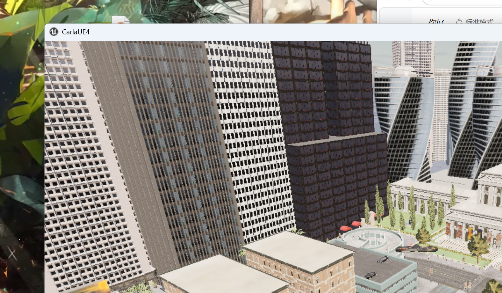
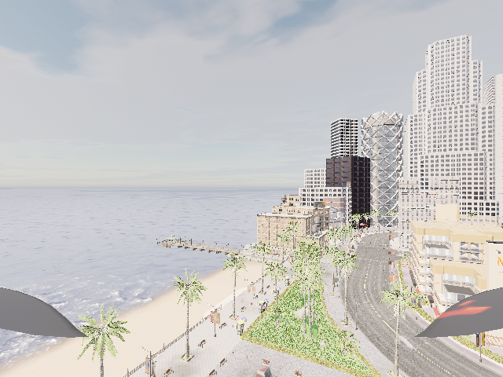
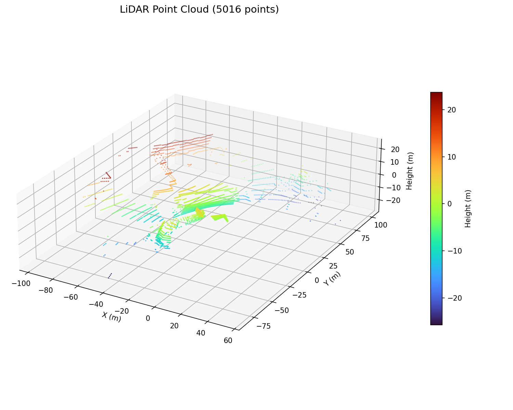

# 无人机与 ROS 的桥接模块（carlair_ros_bridge）

本模块在 **CarlaAir（OpenHUTB 空地一体仿真）** 与 **ROS Noetic** 之间提供统一桥接：
把 AirSim 的 NED 坐标统一换算为 ROS 的 ENU 坐标，向上暴露标准的位姿、图像、点云话题，
并接收速度与目标点指令，使感知、规划、控制、端到端各模块无需关心仿真器内部细节。

## 1. 运行架构

* **Windows 侧**：运行 CarlaAir 仿真器，同时提供两套 API
  * CARLA：`localhost:2000`（车辆、行人、天气、CARLA 原生传感器）
  * AirSim：`localhost:41451`（无人机飞行、相机、激光雷达）
* **虚拟机侧**：ROS Noetic 运行本桥接模块，通过 TCP 连接宿主机的 `41451` 端口

## 2. 环境准备

### 2.1 Windows 侧启动仿真器

```bat
cd CarlaAir-v0.1.7-Windows11-x86_64
SetupEnv.bat
TestEnv.bat
StartCarlaAir.bat Town01 --no-traffic --quality Low
```

等待终端输出 `CarlaAir is ready.`，此时 `2000` 与 `41451` 两个端口就绪。
显存较小的机器建议使用 `Town01`/`Town02` 小地图并配合 `--quality Low`。

### 2.2 配置 AirSim 传感器

将工程根目录下的 `AirSimConfig/settings.json` 换成本模块提供的配置（包含 RGB、深度、
语义分割相机与 16 线激光雷达），启动器每次启动会自动把它复制到
`%USERPROFILE%\Documents\AirSim\settings.json`。

### 2.3 虚拟机侧安装客户端

```shell
pip3 install airsim
```

## 3. 编译与运行

```shell
# 为避免与教材章节中的同名包冲突，单独建立一个小工作空间
mkdir -p ~/bridge_ws/src
ln -s ~/path/to/ros2/src/air/carlair_ros_bridge ~/bridge_ws/src/
cd ~/bridge_ws
catkin_make
source devel/setup.bash

# 启动（含环境自检节点）
roslaunch carlair_ros_bridge main.launch
```

宿主机地址可通过参数覆盖：

```shell
roslaunch carlair_ros_bridge main.launch host:=192.168.94.1 vehicle_name:=SimpleFlight
```

## 4. 话题接口

| 方向 | 话题 | 类型 | 说明 |
|---|---|---|---|
| 发布 | `/uav/odom` | `nav_msgs/Odometry` | ENU 位姿与速度，默认 20 Hz |
| 发布 | `/tf` | `tf2_msgs/TFMessage` | `world → base_link` |
| 发布 | `/uav/status` | `std_msgs/String` | `READY / HOVER / VELOCITY / GOAL / GOAL_DONE` |
| 订阅 | `/uav/cmd_vel` | `geometry_msgs/Twist` | 速度指令（默认机体系：前 / 左 / 上） |
| 订阅 | `/uav/goal` | `geometry_msgs/Point` | 目标点（ENU），飞抵后自动悬停 |

安全设计：速度指令自动限幅；超过 `cmd_timeout`（默认 0.5 s）没有新指令即自动悬停；
目标点任务在独立线程执行，期间速度通道让位。

## 5. 坐标系换算

AirSim 使用 NED（北-东-地），ROS 使用 ENU（东-北-天），换算矩阵为

```text
ENU = C · NED,   C = [[0, 1, 0],
                      [1, 0, 0],
                      [0, 0, -1]]

即 x_enu = y_ned,  y_enu = x_ned,  z_enu = -z_ned
姿态：R_enu = C · R_ned
```

恒等姿态（机头朝北）在 ENU 下的偏航角为 **+90°**，已在 `tests/test_frames.py` 中用单元测试锁定。

## 6. 运行验证

```shell
# 环境自检（5 项：airsim 包、连接、位姿、相机、激光雷达）
rosrun carlair_ros_bridge main.py

# 位姿频率与内容
rostopic hz /uav/odom
rostopic echo -n1 /uav/odom

# 下发目标点，观察状态机
rostopic pub -1 /uav/goal geometry_msgs/Point "{x: 30.0, y: 10.0, z: -8.0}"
rostopic echo /uav/status

# 键盘控制（机体系速度）
rosrun teleop_twist_keyboard teleop_twist_keyboard.py cmd_vel:=/uav/cmd_vel
```

实测结果：

* 环境自检 **5/5 通过**（连接 `127.0.0.1:41451` 成功）
* 相机 `front_rgb`：640×480
* 激光雷达 `lidar1`：6371 点
* 无人机控制：复位 / 起飞 / 爬升到 15 m / 悬停 均通过

## 7. 效果图

仿真器鸟瞰场景：



无人机 RGB 相机画面：



激光雷达点云（按高度着色）：



## 8. 参考

* [AirSim 无人机 API 参考](https://openhutb.github.io/doc/python_api/#airsim.client.MultirotorClient)
* [CarlaAir 快速入门](https://openhutb.github.io/air_doc/dev/quick_start/)
* [CarlaAir Windows 发行版说明](https://openhutb.github.io/air_doc/dev/windows_release/)
