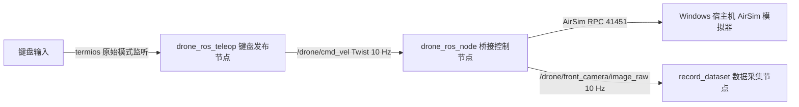
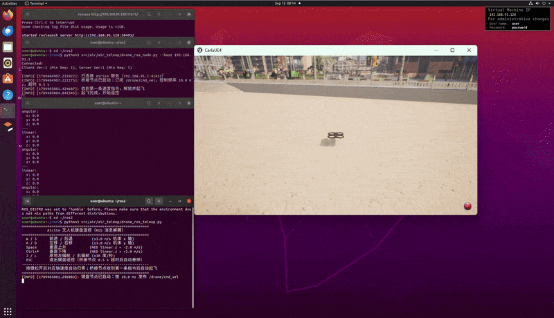
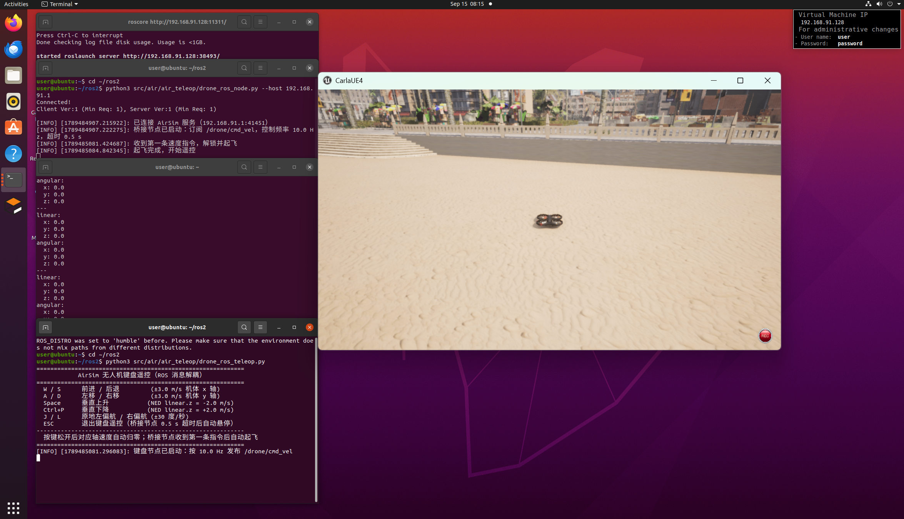
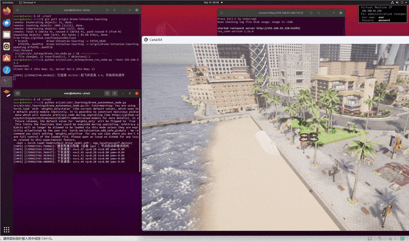
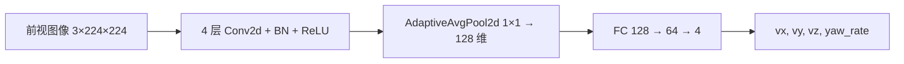

# 基于 ROS 消息解耦的无人机键盘遥控

本文介绍如何通过键盘遥控 Windows 宿主机上 AirSim 仿真环境中的多旋翼无人机。与直接在脚本中调用
AirSim 客户端不同，本方案将**键盘输入**与**仿真器控制**拆分为两个独立的 ROS 节点，二者之间只通过
`/drone/cmd_vel` 话题（`geometry_msgs/Twist`）交换数据，从而实现消息层面的解耦。

代码位于 `src/air/air_teleop/` 目录：

| 文件 | 节点名 | 职责 |
| --- | --- | --- |
| `drone_ros_teleop.py` | `drone_ros_teleop` | 用 `termios` 原始模式监听键盘（`tty.setraw`），按 10 Hz 把当前按键状态发布为 `Twist` 消息 |
| `drone_ros_node.py` | `drone_ros_node` | 订阅 `/drone/cmd_vel`，经 AirSim RPC 驱动无人机；另以独立后台线程抓取前置相机图像，缩放后发布 `/drone/front_camera/image_raw` |

## 双节点架构



两个节点都运行在虚拟机的 ROS 主控上，只有桥接节点与宿主机上的 AirSim 发生网络通信。解耦带来的好处：

* 键盘节点不关心仿真器细节，桥接节点不关心输入设备；
* 更换输入方式（摇杆、路径规划器等）时，只需向 `/drone/cmd_vel` 发布同格式的消息；
* 任一节点异常退出都不影响另一节点的安全收尾（详见下文安全机制一节）。

## 坐标系约定

AirSim 使用 **NED 坐标系**：x 轴指向前方、y 轴指向右侧、z 轴指向地面。因此 `/drone/cmd_vel`
中的消息内容按 NED 机体坐标系解释：

| Twist 字段 | 含义 | 备注 |
| --- | --- | --- |
| `linear.x` | 机体 x 轴线速度（m/s） | 正值前进 |
| `linear.y` | 机体 y 轴线速度（m/s） | 正值右移 |
| `linear.z` | 机体 z 轴线速度（m/s） | **负值上升、正值下降** |
| `angular.z` | 偏航角速度（rad/s） | 正值右偏航（顺时针，从上方看） |

## 安装依赖

```shell
# 拉取仓库并进入仓库根目录
git clone https://github.com/OpenHUTB/ros2.git
cd ros2
# 安装两个节点运行所需的依赖（airsim）
python -m pip install -r src/requirements.txt
```

### 安装 rospy 运行环境

两个节点均基于 `rospy` 编写，若新环境中仅按上述步骤安装依赖，运行节点时可能报错：

```text
ModuleNotFoundError: No module named 'rospy'
```

此时需补齐 ROS 的 Python 运行环境，依次执行：

```shell
sudo apt-get install python3-roslib
pip install rospkg
pip install catkin-tools
source /opt/ros/noetic/setup.bash
python -c "import rospy"   # 无报错即表示 rospy 可用
```

若 AirSim 客户端连接报 numpy 相关错误，请参考[建立虚拟机和空域载具之间的连接](./setup_and_connect.md)
安装兼容版本的 `numpy` 与 `msgpack-rpc-python`。

## 启动步骤

### 1. 启动宿主机上的 AirSim 模拟器

在 Windows 宿主机上运行（以 AbandonedPark 场景为例）：

```bat
cd AbandonedPark\WindowsNoEditor\
AbandonedPark.exe
```


### 2. 在虚拟机中启动 ROS 主控

```shell
source /opt/ros/noetic/setup.bash
roscore
```

### 3. 启动桥接控制节点

另开一个终端，`--host` 后面填宿主机（Windows）的 IP 地址（通过 `ipconfig` 查看）：

```shell
source /opt/ros/noetic/setup.bash
python src/air/air_teleop/drone_ros_node.py --host 172.21.108.47
```

!!! 注意
    桥接节点必须能访问宿主机 AirSim RPC 服务的 41451 端口。连接失败时请检查：
    宿主机防火墙是否放行 41451 端口；虚拟机网络模式（NAT/桥接）下能否 `ping` 通宿主机 IP。
    宿主机 IP 一般和这里的 `172.21.108.47` 不一致，以 `ipconfig` 实际输出为准。

### 4. 启动键盘发布节点

再开一个终端：

```shell
source /opt/ros/noetic/setup.bash
python src/air/air_teleop/drone_ros_teleop.py
```

桥接节点收到第一条速度指令后会自动解锁、起飞并进入遥控状态，模拟器窗口中可以看到无人机起飞：


## 实飞效果

按上述步骤启动后，在键盘节点窗口中按住 `W`/`A`/`S`/`D` 等按键即可遥控无人机，
完整实飞演示见下方动图：



实飞过程中的模拟器画面截图：



## 参数配置

桥接节点同时支持命令行参数与 ROS 私有参数，**命令行参数优先级更高**：

| 命令行参数 | 私有参数 | 默认值 | 说明 |
| --- | --- | --- | --- |
| `--host` | `~host` | `127.0.0.1` | 宿主机（AirSim 服务）IP 地址 |
| `--port` | `~port` | `41451` | AirSim RPC 端口 |
| `--vehicle` | `~vehicle` | `""` | 载具名称，空串表示通过 `listVehicles()` 自动获取第一架载具（失败回退 `SimpleFlight`） |
| — | `~timeout` | `0.5` | 无指令超时时间（s），超时自动悬停 |
| — | `~rate` | `10.0` | 控制频率（Hz） |
| — | `~camera` | `front_center` | 前置相机名称 |
| — | `~camera_rate` | `10.0` | 图像发布频率（Hz，推荐 8~10） |
| `--camera-width` | `~camera_width` | `320` | 发布图像最大宽度（像素），原图超限时缩小 |
| `--camera-height` | `~camera_height` | `180` | 发布图像最大高度（像素），原图超限时缩小 |

桥接节点另以**独立后台线程**抓取前置相机图像（默认 10 Hz），抓图使用独立的 AirSim
客户端，耗时 RPC 不会阻塞 10 Hz 的飞行控制循环；原图超过 320×180 时会先缩小再发布到
`/drone/front_camera/image_raw`，降低跨机网络传输与内存开销（供任务四数据采集使用）。

通过参数服务器设置私有参数的示例（效果与 `--host` 相同）：

```shell
rosparam set /drone_ros_node/host 172.21.108.47
python src/air/air_teleop/drone_ros_node.py
```

## 键位映射

| 按键 | 功能 | NED 指令 |
| :---: | :---: | --- |
| `W` / `S` | 前进 / 后退 | `vx = ±3.0 m/s` |
| `A` / `D` | 左移 / 右移 | `vy = ∓3.0 m/s` |
| `Q` / `E` | 左前方 / 右前方 | `vx = +3.0, vy = ∓2.5 m/s` |
| `Z` / `C` | 左后方 / 右后方 | `vx = -3.0, vy = ∓2.5 m/s` |
| `J` / `L` | 左偏航 / 右偏航 | `angular.z = ∓0.5 rad/s` |
| `Space` / `X` | 上升 / 下降 | `vz = -2.0 / +2.0 m/s` |
| `K` | 强制急刹 | 全 0 速度 |
| `ESC` / `Ctrl+C` | 退出键盘遥控 | 停止发布，桥接节点超时后自动悬停 |

**提示：**

* 键盘节点通过 `tty.setraw` 进入原始模式：关闭字符回显、单字符非阻塞监听（无需按 Enter，即按即发）；
* 终端按键无法多键并发，斜向飞行由复合按键 `Q`/`E`/`Z`/`C` 直接给出整组速度指令；
* 原始模式下探测不到按键松开事件，改为“按住窗口”：每次按下刷新最近按键时刻，0.4 s 无新按键即以最后指令速度为起点线性衰减 0.5 s 至 0（平滑悬停，避免硬刹触发飞控制动阻尼），等效于松开按键；
* 无任何按键时持续发布全零指令，无人机原地保持；
* 按键监听基于标准输入（stdin），虚拟机桌面终端与 SSH 终端均可运行，不再依赖 `pynput`。

## 安全机制

* **自动起飞**：桥接节点收到第一条速度指令时解锁电机并爬升到安全高度；
* **超时悬停**：连续 0.5 s 未收到任何指令（键盘节点退出、网络中断等）时自动悬停；
* **安全退出**：桥接节点退出（`Ctrl+C` 或 `rosnode kill`）时，通过 `rospy.on_shutdown`
  回调先悬停、再调用 `enableApiControl(False)` 释放 AirSim API 控制权；
* 键盘节点按 `ESC` 退出后，桥接节点因超时自动悬停，无需手工干预。

## 验证话题

```shell
source /opt/ros/noetic/setup.bash
rostopic list                 # 应能看到 /drone/cmd_vel
rostopic echo /drone/cmd_vel  # 按住 W 键可看到 linear.x = 3.0
```

## 常见问题

* **连接宿主机失败**：检查 `--host` 是否为宿主机 IP、宿主机防火墙是否放行 41451 端口；
* **键盘无响应**：确认键盘节点在终端中直接运行（SSH 或虚拟机桌面终端均可），stdin 未被重定向，且该窗口获得焦点；若屏幕回显按键字符说明原始模式未生效，请确认在 Linux/macOS 环境运行；
* **无人机无动作**：用 `rostopic echo /drone/cmd_vel` 确认话题有消息，并确认桥接节点日志中已打印“已连接 AirSim 服务”。

## 端到端视觉行为克隆自主巡航 (air_learning)

本节介绍基于**行为克隆（Behavior Cloning）**的无人机端到端单目视觉自主巡航方案：用轻量级卷积
神经网络直接建立「前视图像 → 飞控速度指令」的映射，替代手工设计的感知-规划-控制流水线。相关代码
位于 `src/air/air_learning/` 目录，沿用上文的 `drone_ros_node` 桥接节点以及
`/drone/front_camera/image_raw`、`/drone/cmd_vel` 两个话题。

### 效果展示



### 环境依赖

| 依赖 | 用途 |
| --- | --- |
| PyTorch (`torch`) | 策略网络 `DronePolicyNet` 的定义、训练与 CPU/GPU 推理 |
| torchvision | 图像预处理与数据集加载（`src/requirements.txt` 中已声明） |
| OpenCV (`opencv-python`) / `cv_bridge` | 相机图像编解码，`/drone/front_camera/image_raw` 与 numpy 互转 |
| AirSim (`airsim`) | 与宿主机 AirSim 仿真器的 RPC 通信 |
| rospy（`geometry_msgs`/`sensor_msgs`） | ROS 节点及 `Twist`、`Image` 消息收发 |

```shell
python -m pip install -r src/requirements.txt   # 安装 airsim、opencv-python、torch、torchvision
```

`rospy` 运行环境与 `numpy`/`msgpack-rpc-python` 兼容问题请参照上文「安装依赖」一节补齐。

### 模型结构与原理

策略网络 `DronePolicyNet` 是一个轻量级 CNN 回归网络：输入单目前视图像，直接回归输出 NED 机体
坐标系下的 4 维动作向量 `[vx, vy, vz, yaw_rate]`（与 `/drone/cmd_vel` 同量纲，线速度 m/s、
偏航角速度 rad/s），整体可概括为「**CNN 提取前视特征 → 全连接层回归速度指令**」：

1. **卷积特征提取**：4 层 `Conv2d` 逐层 `stride=2` 下采样（`224 → 112 → 56 → 28 → 14 → 7`），
   每层后接 BatchNorm + ReLU；首层 7×7 大卷积核扩大感受野，捕获整帧纹理与障碍物边缘；
2. **全局平均池化**：`AdaptiveAvgPool2d(1)` 将 7×7×128 特征图压成 128 维全局特征向量，解耦输入
   分辨率；
3. **全连接回归头**：`128 → 64 → 4` 两层线性层，中间 ReLU + Dropout；**输出层不加激活函数**，
   因为速度与角速度均为有符号实数，直接线性回归。



* 模型网络结构见 [模型实现源码 (src/air/air_learning/model.py)](../../src/air/air_learning/model.py)；
* 训练入口见 [训练脚本 (src/air/air_learning/train.py)](../../src/air/air_learning/train.py)。

训练采用 **MSE 损失 + Adam 优化器**（默认 30 轮、学习率 1e-3、批大小 16），数据集按 8:2 固定种子
划分训练/验证集，只在验证集 Loss 创新低时落盘 `models/best_drone_model.pth`，保证可复现。

### 复现使用方法

完整闭环分为四步：**采集专家示范 → 训练 → 仿真桥接 → 自主巡航推理**。

#### 1. 采集专家示范数据

按上文「启动步骤」先启动宿主机 AirSim、桥接节点与键盘节点，待无人机起飞后，再开一个终端启动
数据采集节点，边遥控边录制：

```shell
source /opt/ros/noetic/setup.bash
python src/air/air_teleop/record_dataset.py
```

采集节点订阅 `/drone/front_camera/image_raw` 与 `/drone/cmd_vel`，收到图像即以当前缓存的速度指令
为标签落盘到 `data/dataset/`（`images/*.png` + `labels.csv`），`Ctrl+C` 结束采集。

#### 2. 训练策略网络

在仓库根目录运行训练脚本（自动检测 CUDA/CPU）：

```shell
python src/air/air_learning/train.py
# 或指定数据集目录与训练轮数
python src/air/air_learning/train.py --data data/dataset --epochs 20
```

训练结束将验证集 Loss 最优权重保存到 `models/best_drone_model.pth`。

#### 3. 启动仿真桥接

重新启动（或保持）宿主机 AirSim 与桥接节点，桥接节点负责起飞定高、以 10 Hz 发布前视图像并直通
下发速度指令：

```shell
source /opt/ros/noetic/setup.bash
python src/air/air_teleop/drone_ros_node.py --host 172.21.108.47
```

#### 4. 启动自主巡航推理

再开一个终端，启动自主节点：加载训练权重，订阅图像 → 前向推理 → 发布速度指令，闭环自主巡航：

```shell
source /opt/ros/noetic/setup.bash
python src/air/air_learning/drone_autonomous_node.py
```

自主节点启动即加载 `models/best_drone_model.pth`，对每帧图像推理输出 `[vx, vy, vz, yaw_rate]`，
其中 `vz` 锁死 0（定高巡航）、`vy` 与 `yaw_rate` 分别软限幅 ±0.2 m/s 与 ±0.1 rad/s 后经
`/drone/cmd_vel` 下发。

## 参考

* [建立虚拟机和空域载具之间的连接](./setup_and_connect.md)
* [空域模拟器的 ROS 封装器](./ros_pkgs.md)
* [AirSim 官方 ROS 封装（airsim_ros_pkgs）](https://microsoft.github.io/AirSim/airsim_ros_pkgs/)
