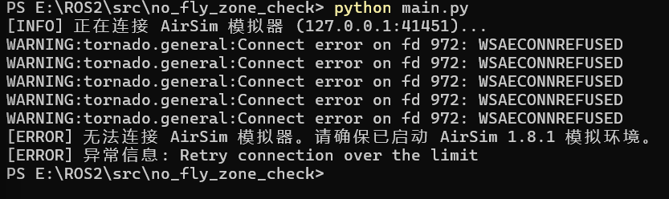

# 禁飞区检测模块

## 功能说明

本模块为无人机配送场景提供**禁飞区安全校验**功能。用户输入取货点和送货点的经纬度坐标，模块自动判断这两个点是否落在预设的禁飞区范围内。

## 应用场景

在无人机执行配送任务前，需要确认航线起止点不会进入敏感区域（如机场、军事基地、学校上空）。本模块提供了一种基于球面距离的快速检测方法。

## 算法原理

使用 **Haversine 公式** 计算两个经纬度坐标之间的球面距离，公式如下：

$$
a = \sin^2\left(\frac{\Delta\varphi}{2}\right) + \cos\varphi_1 \cdot \cos\varphi_2 \cdot \sin^2\left(\frac{\Delta\lambda}{2}\right)
$$

$$
c = 2 \cdot atan2\left(\sqrt{a}, \sqrt{1-a}\right)
$$

$$
d = R \cdot c
$$

其中：

- φ₁、φ₂ 为两点的纬度（弧度）
- Δφ、Δλ 为两点纬度和经度的差值
- R 为地球平均半径，取值 6371000 米
- d 为最终距离（米）

## 使用方法

需要配合 AirSim 模拟器运行：

    cd src/air/no_fly_zone_check
    python main.py

## 运行效果

程序启动后会尝试连接 AirSim 模拟器。

**说明**：上图为本地启动 AirSim 1.8.1 模拟器并成功连接后的运行结果，获取到无人机位置并完成禁飞区检测