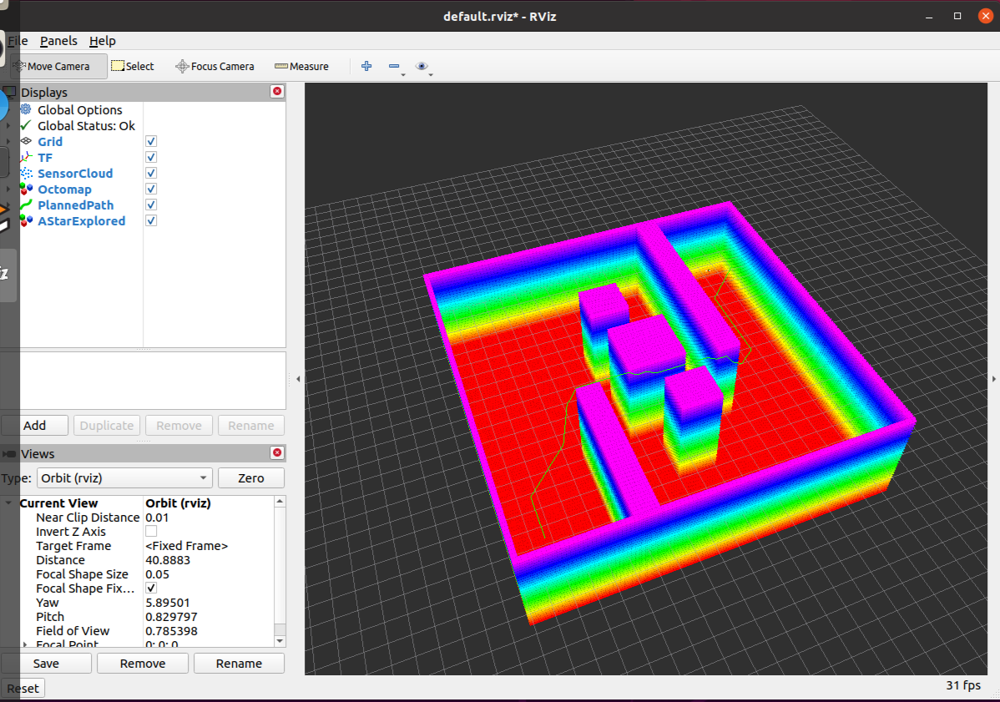
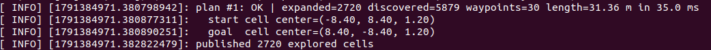

# 八叉树上的 A* 全局寻路

本文介绍空域载具八叉树三维寻路项目中的**规划环节**：在上一节建好的八叉树占用地图上
做 A\* 搜索，规划一条从飞行器当前位置到目标点的无碰撞路径。

对应总纲第 4 节「八叉树上的 A\* 全局寻路」。

---

## 1. 输入与输出

| 方向 | 话题 | 类型 | 说明 |
|---|---|---|---|
| 订阅 | `/octomap_full` | `octomap_msgs/Octomap` | 八叉树占用地图，由建图节点以 latched 方式发布 |
| 订阅 | `/uav/goal` | `geometry_msgs/Point` | 目标点（世界系 ENU）。收到一次规划一次 |
| 查询 | TF `world` ← `base_link` | — | 取飞行器当前位置作为路径起点 |
| 发布 | `/uav/path` | `nav_msgs/Path` | 规划出的路径 |
| 发布 | `/uav/explored_markers` | `visualization_msgs/MarkerArray` | A\* 展开过的节点（按尺寸着色） |

**本节点只做规划、不控制飞行。** 把路径喂给控制器实现闭环飞行是后续阶段的事。

---

## 2. 核心问题：八叉树不是均匀网格

这是本节全部难度的来源。二维栅格 A\* 里每个格子大小相同、邻居关系固定；
八叉树这两点都不成立：

| 问题 | 具体表现 |
|---|---|
| **节点大小不一** | 空旷区域被 octomap 塌缩成一个粗节点，障碍物附近才细分到 0.3 m 叶节点。同一棵树里节点边长可能差上百倍 |
| **邻居关系复杂** | 找某个方向上的邻居时，可能碰上同样大、**更大**（父级）、**更小**（子级）三种情况 |
| **代价不能按"步"算** | 跨一个大节点和跨一个小节点，实际位移完全不同，必须按几何距离计算 |

### 为什么不把八叉树展开成均匀栅格

那样实现会简单很多，但代价不可接受：

* **内存**：0.3 m 分辨率、20×20×6 m 的场景就是 67×67×20 ≈ 9 万个叶节点；
  真实场景（70×70×35 m）更是 **635 万**个体素，每个还要存 g/h/parent
* **丢掉八叉树的意义**：八叉树的价值恰恰在于"空旷处用大节点表示"，
  展开成栅格等于把建图阶段省下来的内存又还回去

**因此走树遍历式：搜索图的节点就是八叉树的叶节点本身。**

---

## 3. 邻接：26 邻域在八叉树上怎么找

### 3.1 探测点法

对叶节点 \(n\)，记中心为 \(\boldsymbol{c}\)、边长为 \(s\)。对 26 个方向
\(\boldsymbol{o} \in \{-1,0,1\}^3 \setminus \{\boldsymbol{0}\}\)，沿该方向挪出自身表面：

\[
\boldsymbol{p} = \boldsymbol{c} + \boldsymbol{o} \odot \left(\frac{s}{2} + \frac{r}{2}\right)
\]

其中 \(r\) 是八叉树分辨率。

**为什么这个点必定落在紧贴的邻居体内**：任何合法邻居的边长都 \(\ge r\)，
所以从自身表面再往里走半个最小体素，既出了自己的范围、又还没跨过邻居。
由于八叉树的格子是轴对齐且互不重叠的，含有该点的叶子必定与本节点相邻。

比手动遍历树去"找兄弟节点"简单得多，而且天然处理了粗细不一的情况。

### 3.2 三种情况

| 探测结果 | 处理 |
|---|---|
| 落在**未知空间**（该分支未分配节点） | 不可通行，跳过 |
| 邻居边长 \(\ge s\) | **同层或更粗** → 就是它，计入 1 个邻居 |
| 邻居边长 \(< s\) | **邻居更细** → 需要展开，见下 |

### 3.3 细侧展开

当邻居比本节点更细时，探测点只命中了接触面上**许多小子节点中的一个**。
接触面上的子节点数量取决于接触类型：

| 接触类型 | 方向特点 | 子节点数 |
|---|---|---|
| 面接触 | 只有一个分量非零 | \(k \times k\) |
| 棱接触 | 两个分量非零 | \(k \times 1\) |
| 角接触 | 三个分量非零 | \(1 \times 1\) |

其中 \(k = s / s_{nb}\)（两个边长都是 2 的幂，所以是整数）。

对面接触，在接触面上均匀取 \(k \times k\) 个采样点各查一次，去重后得到该方向上的全部邻居。

### 3.4 计算量控制：\(k_{\max}\)

空旷处一个被塌缩的空闲节点边长可达几十米，而它旁边紧挨的细碎结构只有 0.3 m ——
此时 \(k\) 可以大到 128，面接触要采 **16384 个点**，不可接受。

因此设上限 \(k_{\max}\)（默认 4）：

* \(k \le k_{\max}\) → 完整展开
* \(k > k_{\max}\) → **放弃该方向**

**为什么放弃是安全的**：\(k\) 大意味着"我是一个大空闲节点，但那个方向紧挨着一片
细碎结构" —— 这几乎总出现在障碍物附近或传感器噪声区域。放弃它只会让路径**绕远**，
**不会产生穿墙路径**。这是一个保守的近似。

---

## 4. 代价与启发

### 4.1 代价：两节点中心的欧氏距离

\[
\text{cost}(n, n') = \lVert \boldsymbol{c}_{n'} - \boldsymbol{c}_n \rVert_2
\]

**不能数"步数"** —— 跨一个大节点和跨一个小节点的实际位移可能差两个数量级。

对粗邻居，中心距会**略微高估**实际移动代价 —— 这是保守方向，会让 A\* 偏向细分路径，
但不会产生不安全的路径。

### 4.2 启发：欧氏距离

\[
h(n) = \lVert \boldsymbol{c}_n - \boldsymbol{c}_{\text{goal}} \rVert_2
\]

**可采纳**（任何路径的实际长度都 \(\ge\) 直线距离），因此保证最优解。

需要更快收敛时可引入权重 \(w > 1\) 做**加权 A\***，牺牲最优性换速度。
默认 \(w = 1.0\)。

---

## 5. 可通行性判定

在 octomap 里三种状态的**存储表现并不对称**：

| 状态 | 在树里的表现 | 判定方式 |
|---|---|---|
| **占用** | 有节点，`isNodeOccupied()` 为 true | 障碍 |
| **空闲** | 有节点（可能是塌缩后的粗节点） | 可通行 |
| **未知** | **根本没有节点** —— 该分支从未被分配 | 按点查找时返回"找不到" |

**未知区域一律当障碍。** 这是保守的选择：宁可规划不出路径让用户去多扫一圈，
也不要规划一条穿过从未观测区域的路径。

> 未知区域在 octomap 里**没有节点对象**，因此也无法作为图节点参与搜索。
> 真有"必须在未扫描区域规划"的需求时，正确做法是**让建图侧把该区域显式标记**，
> 而不是在规划侧开特例。

---

## 6. 实现：astar_planner 节点

核心算法在 `include/octree_uav_3d_pathfinding/astar.h`，**与 ROS 完全解耦** ——
它只依赖 octomap 与 STL，因此可以离线单元测试（`tests/test_astar.cpp`）。
ROS 节点只是它的一层外壳，负责收发话题、查 TF、把结果转成 ROS 消息。

收到目标点后的流程：

1. **查 TF**：`world` ← `base_link`，得到飞行器当前位置作为起点
2. **吸附起终点**：用户给的位置可能落在障碍或未知区域里，
   此时以该点为中心按体素为步长逐层向外扫，找最近的可通行叶节点
3. **A\***：以自由叶节点为图节点，按第 3 节的邻接规则扩展
4. **回溯**：沿父指针回到起点，把每个节点的中心连成路径
5. **发布**：`nav_msgs/Path` + 已展开节点的 `MarkerArray`

### 关于"已展开节点"的可视化

节点会把 A\* **实际展开过的节点**发成 `MarkerArray`，**按节点尺寸着色**：

* **偏蓝** = 小节点（障碍物附近，需要细碎地走）
* **偏红** = 大节点（空旷区域，一步跨过去）

这一路输出是理解 A\* 在八叉树上行为最直观的方式 ——
**一张图就能看出跨分辨率邻接是否真的生效**。

---

## 7. 参数说明

参数位于 `config/params.yaml` 的 `astar_planner` 组。

| 参数 | 默认值 | 说明 |
|---|---|---|
| map_topic / goal_topic | /octomap_full / /uav/goal | 输入 |
| path_topic / explored_topic | /uav/path / /uav/explored_markers | 输出 |
| world_frame / body_frame | world / base_link | 坐标系 |
| **k_max** | 4.0 | 细侧邻居展开上限，见 3.4 |
| max_iterations | 200000 | A\* 最大展开次数，防止跑飞 |
| heuristic_weight | 1.0 | 启发权重，>1 为加权 A\* |
| search_radius | 3.0 | 起终点落在障碍里时的吸附搜索半径（m） |
| plan_timeout | 10.0 | 单次规划超时（s） |
| max_expanded_markers | 20000 | 展开节点可视化的上限，防止 RViz 卡顿 |

**调参建议**：

* **`k_max` 是最值得注意的一个**。调小会让路径更容易绕远（放弃的邻接更多），
  调大会让单次节点扩展变慢。4 是本场景下的平衡点。
* 规划失败且原因是"找不到可行节点"时，**先看地图的覆盖率** ——
  多半是目标点落在还没扫描到的区域里了。

---

## 8. 运行方法与效果

```shell
# 编译
cd ~/uav_ws && catkin_make
source ~/uav_ws/devel/setup.bash

# 启动（桥接 + 建图 + 规划 + 自检 + RViz）
roslaunch octree_uav_3d_pathfinding main.launch
```

**前置条件**：模拟器已启动、`params.yaml` 里的 `host` 已改成自己的宿主机地址
（见[环境配置与前置准备](./env_setup.md)）。

飞行器起飞并扫描一段时间、地图建起来之后，下发目标点：

```shell
# 目标点是 ROS 世界系 ENU
rostopic pub -1 /uav/goal geometry_msgs/Point "{x: 30.0, y: 0.0, z: 15.0}"
```

规划节点会打印统计信息：

```
[INFO] plan #1: OK | expanded=2720 discovered=5879 waypoints=30 length=31.36 m in 35.0 ms
[INFO]   start cell center=(-8.40, 8.40, 1.20)
[INFO]   goal  cell center=(8.40, -8.40, 1.20)
[INFO] published 2720 explored cells
```

RViz 中会显示绿色路径。下图为**离线验证场景** —— 20×20×6 m 的封闭房间，
里面立着两道错开的墙（**从地面一直顶到天花板**）和几根柱子；
起点在左上角、终点在右下角，**路径必须穿过两个缺口，形成一个 S 形**
（31.36 m，而两点直线距离只有 21.2 m）：



规划节点每次规划都会输出统计信息：总体一行（**展开节点数、航点数、路径长度与耗时**），
再加上起终点**实际吸附到的叶节点中心**，以及可视化的节点个数：



> **补充观察：怎么看"跨分辨率"是否真的生效**
>
> 节点还会把 A\* **实际展开过的节点**发布到 `/uav/explored_markers`
> （`MarkerArray`，每个节点一个立方体、边长就是节点边长，并按尺寸着色：
> 偏蓝是细节点、偏红是粗节点）。在 RViz 里**单独显示这一路**（其余显示项关掉），
> 就能直观看到算法在空旷区一步跨过大节点、在障碍附近才细碎展开。
> 展开节点可能上万，可视化会比较密集 —— 按需调小 `max_expanded_markers` 即可。
>
> **不依赖图形界面也能确认**：看单元测试的用例 4 —— 它构造了一个边长
> 16.00 m 的粗空闲节点（分辨率 0.50 m），断言 **A\* 相邻航点的最大间距
> 达到 17.32 m，即 34.6 倍分辨率**。如果邻接退化成"只在最细分辨率上一点点挪"，
> 这个数字会掉到 1~2 倍，测试立刻失败。

### 离线验证（**不需要模拟器**）

上面那组数据就是用它跑出来的。`mock_cloud_publisher.py` 会发布一个确定的房间场景，
并且**让传感器依次驻留房间四个角** —— 这样地图会被从多个视角扫过，
障碍物背后的"阴影"（永远扫不到、因而在地图里是未知的区域）才会被填掉。

```shell
# 终端 1：离线点云（不需要模拟器，也不需要 airsim_bridge）
rosrun octree_uav_3d_pathfinding mock_cloud_publisher.py

# 终端 2：建图 + 规划 + RViz（跳过桥接与自检；
#         离线场景只广播 world -> lidar_link，所以体坐标系要指到它）
roslaunch octree_uav_3d_pathfinding main.launch bridge:=false check:=false body_frame:=lidar_link

# 等约 60 秒让传感器巡游一圈把地图扫满，再在终端 3 下发目标点
rostopic pub -1 /uav/goal geometry_msgs/Point "{x: 7.5, y: -7.5, z: 0.0}"
```

---

## 9. 主要话题

| 话题 | 类型 | 方向 | 说明 |
|---|---|---|---|
| /octomap_full | octomap_msgs/Octomap | 订阅 | 八叉树占用地图（latched） |
| /uav/goal | geometry_msgs/Point | 订阅 | 目标点（世界系 ENU） |
| /uav/path | nav_msgs/Path | 发布 | 规划出的路径 |
| /uav/explored_markers | visualization_msgs/MarkerArray | 发布 | A\* 展开的节点 |

排查用命令：

```shell
# 看规划结果（latched，一连上就能看到上一条）
rostopic echo /uav/path

# 确认 RViz 订阅上了（Subscribers 里应该有 /rviz）
rostopic info /uav/path
```

---

## 10. 开发中踩到的几个坑

这三个问题都很隐蔽，记录下来供参考。

### 10.1 叶子查找不能用 `OcTree::search()`

octomap 的 `search(point)` 会一路下潜到指定深度，**中途缺少子节点就返回 NULL**：

```cpp
for (unsigned int k = tree_depth; k > depth; --k) {
  n = n->getChild(computeChildIdx(key, k));
  if (!n) return NULL;          // ← 这里
}
```

而**被剪枝后的粗节点恰恰就是"没有子节点"** —— 于是这个**有效的空闲大节点**
会被误判成"未知"。而 A\* 的路径正是要走这些大空闲节点。

**解法**：自己实现下潜 —— **遇到没有子节点的节点就把它当叶子返回**；
只有"子节点槽位存在但为空"才判定为未知。另外 octomap 1.9 把 `node->hasChildren()`
标记为废弃、`node->getChild()` 干脆不存在，要改用树上的
`tree->nodeHasChildren()` / `tree->nodeChildExists()` / `tree->getNodeChild()`。

### 10.2 `NodeId` 必须折算到叶子自己那一层

同一个叶子，用不同的点去查会得到不同的**最大深度键**。如果把探测点的键直接当作
节点标识，那么：

* `closed` / `g_score` 去重完全失效，同一节点被反复展开
* **终点判定永远匹配不上** —— A\* 走到终点叶子时的 id 来自某个探测点，
  而目标节点的 id 来自用户给的终点坐标

**解法**：把键右移 `(树深 − 叶子深度)` 位，折算到叶子自己所在的那一层。

**只有"叶子边长恰好等于分辨率"时两者才巧合地相等** —— 这也解释了为什么
细碎场景能跑通、而有大片粗节点的场景全崩。

### 10.3 子节点编号的位序是 `(z<<2)|(y<<1)|x`

octomap 的子节点编号约定是 **x 在最低位**，而不是直觉上的 x 在最高位。
文档里没有明确说明。

用错位序的后果是灾难性的：遍历地图里的前 2000 个自由叶节点、
用它们各自的中心反查一遍，**1883 个查不回来**。

**为什么这么难发现**（三个巧合叠加）：

1. 起点 `(0,0,0)` 的键是 `(32768, 32768, 32768)` —— **三个分量完全相同**，
   任何位序都算出同一个索引，所以起点永远查得到；
2. `±y`、`±z` 方向的探测点，x 与 z 分量仍然相等，两种位序给出相同结果；
3. 占用体素铺满墙面，**RViz 里的房间看起来完全正常** ——
   而空闲空间在 RViz 里根本看不见，所以"自由空间读不出来"没有任何视觉迹象。

**怎么抓出来的**：写了一个自检 —— **遍历地图里的自由叶节点，对每个节点取它的中心
再反查一遍，看能不能找回同一个节点**。这个"自己查自己"的自检一次就暴露了
1883/2000 的失配率，然后把 4 种位序各试一遍，直接测出正确位序。

> 这个自检保留成了节点的常驻诊断。**当"一部分能工作、一部分不能"时，
> 要找正常与不正常样本之间的共同点** —— 这次就是"起点三个键分量相同"这个巧合。

### 10.4 障碍物表面采样过稀会导致"射线穿缝"

这是感知层的经典问题，在建图环节也踩到过：如果障碍物表面的采样点间距
大于八叉树分辨率，**射线会从采样点的缝里钻进去、穿到障碍物另一侧**，
把障碍物**内部也标成空闲** —— 于是规划器会给出"穿墙"路径。

**判断方法**：如果路径长度和直线距离几乎一样，那多半不是绕行而是穿过去了。

**解法**：障碍物表面的采样间距要明显小于地图分辨率。

---

## 11. 参考

* [OctoMap 官网](https://octomap.github.io/)
* Hart, Nilsson, Raphael, *A Formal Basis for the Heuristic Determination of Minimum Cost Paths*, IEEE Transactions on Systems Science and Cybernetics, 1968
* [nav_msgs/Path 消息定义](http://docs.ros.org/en/noetic/api/nav_msgs/html/msg/Path.html)
* 模块源码：`src/air/octree_uav_3d_pathfinding/`

---

本文档及配套模块代码在编写过程中使用了 AI 大模型辅助（方案讨论、代码与文档起草、问题排查）。
全部内容经过实际运行验证：模块在 Ubuntu 20.04.6 + ROS Noetic + AirSim 1.8.1 环境下
通过 `roslaunch octree_uav_3d_pathfinding main.launch` 运行，并得到上述规划结果。
作者对提交内容的正确性与完整性负全部责任。
