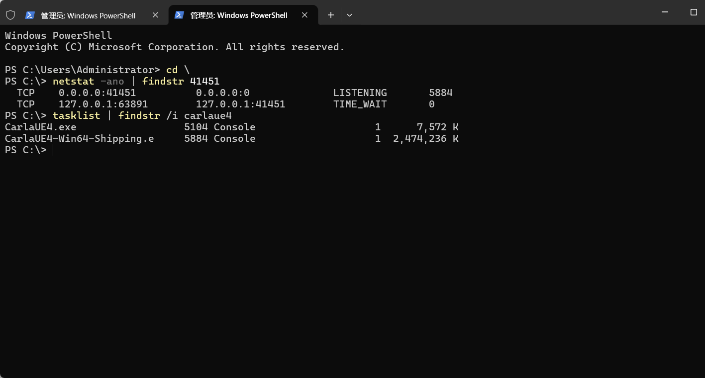
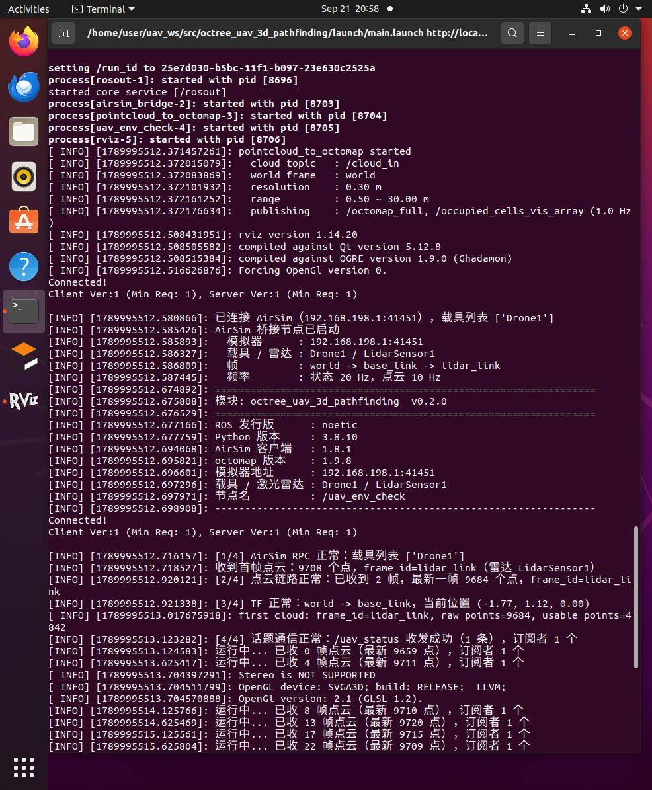

# 空域载具八叉树三维寻路的环境配置与前置准备

本文说明在本项目中搭建**空域载具三维寻路**开发环境所需的完整配置流程，包括虚拟机环境、
ROS 与 AirSim 模拟器的安装验证、octomap 三维地图依赖，以及工作空间的建立。

本项目采用"**模拟器在宿主 Windows、ROS 在客户机 Ubuntu**"的分工 —— 模拟器是
Windows/Unreal 程序，无法装进虚拟机。这一点决定了整个环境配置的形态，详见第 5 节。

---

## 1. 环境一览

| 位置 | 类别 | 项目 | 版本 |
|---|---|---|---|
| 宿主 | 操作系统 | Windows | 11 |
| 宿主 | 虚拟化平台 | VMware Workstation | 17.6.4 |
| 宿主 | **模拟器** | **AirSim**（随 OpenHUTB 发行版提供） | **1.8.1** |
| 客户机 | 操作系统 | Ubuntu | 20.04.6 LTS（内核 5.15） |
| 客户机 | 硬件配置 | 6 vCPU / 8 GiB 内存 / 70 GB 磁盘 | |
| 客户机 | ROS | Noetic（ROS 1） | 1.16.0 |
| 客户机 | 三维地图 | octomap | 1.9.8 |
| 客户机 | 点云库 | PCL | 1.10 |
| 客户机 | 构建工具 | catkin | 0.8.10 |

> 虚拟机可从零安装，也可使用预装 ROS 的镜像。本文以**预装镜像 + 验证配置**的方式说明。

---

## 2. 虚拟机配置

### 2.1 硬件配置建议

| 项目 | 建议值 | 说明 |
|---|---|---|
| CPU | ≥ 4 核 | RViz 与点云处理同时运行时的下限 |
| 内存 | ≥ 8 GB | 可视化 + 点云 + 八叉树 |
| 磁盘 | ≥ 40 GB 可用 | ROS 桌面版、octomap/PCL、catkin 编译产物 |
| 显卡 | 开启 3D 加速 | 否则 RViz 退化为软件渲染，帧率很低 |
| 网络 | NAT | 与宿主共享网络，便于访问软件源，也是连模拟器的前提 |

下图为 VMware 中该虚拟机的处理器与内存配置：


> **注意**：模拟器本身不跑在虚拟机里，所以虚拟机的显卡性能只影响 RViz，不影响仿真质量。

### 2.2 虚拟网络与登录

虚拟机默认使用 NAT 模式，可通过 `ip` 命令查看地址：

```shell
# 查看虚拟机 IP 地址
ip -4 -br addr
# 输出示例：ens33  UP  192.168.198.128/24
```


**记下你自己宿主机的 VMnet8 地址** —— 后面连模拟器要用它，**不能用 `127.0.0.1`**
（在客户机里 `127.0.0.1` 指向客户机自己，不是宿主）：

```shell
# 查看默认网关，宿主的 VMnet8 地址就在这个网段里
ip route | grep default
```

> 本文档实测环境中宿主是 `192.168.198.1`，但这是 VMware 的网段分配结果，
> **每台机器可能不同**。下文出现的 `192.168.198.1` 请一律替换为你自己查到的地址。

---

## 3. 系统配置

### 3.1 时区与时间同步

虚拟机镜像的时区常常不是本地时区，且 VMware Tools 的时间同步可能被关闭。时间不准会导致日志时间戳混乱、多机通信异常，**务必先修正**：

```shell
# 设置为东八区
sudo timedatectl set-timezone Asia/Shanghai
# 启用网络时间同步
sudo timedatectl set-ntp true
# 确认：Time zone 为 Asia/Shanghai，System clock synchronized 为 yes
timedatectl
```


### 3.2 确认系统版本

```shell
# 确认发行版为 Ubuntu 20.04
lsb_release -a
cat /etc/os-release | head -3
uname -r
```

---

## 4. ROS 环境

### 4.1 确认 ROS 版本

本机同时存在两个 ROS 发行版，需明确各自路径：

```shell
# 查看已安装的 ROS 发行版
ls -1 /opt/ros/
```

**本项目使用 ROS 1 Noetic。** 注意两套环境不可同时 `source`，否则环境变量互相覆盖，`rosversion`、`rospack` 等命令会失效。

```shell
# 每次打开新终端后都要 source
source /opt/ros/noetic/setup.bash

# 验证：应输出 noetic
rosversion -d
# 查看可用包数量
rospack list | wc -l
```


### 4.2 检查关键依赖包

```shell
# 逐个检查三维寻路所需的包是否存在
for p in octomap octomap_msgs octomap_ros pcl_ros pcl_conversions \
         visualization_msgs rviz tf tf2_ros; do
  printf '%-20s %s\n' "$p" "$(rospack find $p 2>/dev/null || echo MISSING)"
done
```

| 包 | 用途 |
|---|---|
| `octomap` / `octomap_msgs` / `octomap_ros` | 八叉树地图核心库与 ROS 消息 |
| `pcl_ros` / `pcl_conversions` | 点云处理与格式转换 |
| `visualization_msgs` | 占用体素的可视化消息 |
| `rviz` | 三维可视化 |
| `tf` / `tf2_ros` | 坐标变换 |

各包的实际检查结果：


> 与早期方案相比，这里**不再需要 `gazebo_ros` / `gazebo_plugins`** ——
> 模拟器换成了宿主上的 AirSim，与 ROS 之间走的是 RPC 而不是 Gazebo 插件。

---

## 5. 模拟器：AirSim 的启动与连接

这是本项目环境配置中最特殊的一步：**模拟器不在虚拟机里**。

### 5.1 为什么模拟器在宿主上

模拟器是 **AirSim 1.8.1**（随 [OpenHUTB 低空模拟器](https://openhutb.github.io/air_doc/) 发行版提供），
本质上是一个 Windows/Unreal 打包程序，**无法安装到 Ubuntu 虚拟机内**。

AirSim 的架构是"**一个 RPC 服务端 + 任意多个客户端**"，所以天然适合这种分工：

```
宿主 Windows  ── RPC(41451) ──►  客户机 Ubuntu（ROS、我们的节点、RViz）
```

### 5.2 启动模拟器（宿主侧）

模拟器是解压即用的绿色发行版，**解压到哪个目录都可以**，但有一个硬性要求：
**必须在模拟器的安装目录里启动它** —— 因为模拟器要读**同目录**下的 `settings.json`，
载具与激光雷达的配置就写在那里；从别处启动它会找不到配置文件，也就不会有激光雷达。

在 Windows 上进入该目录后运行 `CarlaUE4.exe`（或在资源管理器里直接双击它）：

```bat
cd <模拟器安装目录>
CarlaUE4.exe
```

安装目录里应该能看到这几项，可以用来自查：

```text
<模拟器安装目录>\
    CarlaUE4.exe      ← 启动程序
    settings.json     ← AirSim 配置（载具、激光雷达）
    CarlaUE4\         ← 程序资源
    Engine\           ← 引擎
```

> **本文档不写死具体路径**，因为每个人把发行版解压到哪里都不一样（放在哪个盘、
> 哪个目录都可以，不必和本文一致）。请以你自己的安装位置为准 ——
> 只要那个目录里有上面这几项就对了。

首次启动、以及第一次加载城市地图时，画面可能要等 30~60 秒才逐渐渲染出来，这是正常的。
启动完成后应能看到城市场景：


确认 AirSim 的 RPC 端口已经在监听：

```bat
netstat -ano | findstr 41451
```



> **如果这个端口不监听**：说明模拟器没有进入 AirSim 的多旋翼模式。
> 需要检查模拟器包内的 `Config/DefaultEngine.ini`，把 `GlobalDefaultGameMode`
> 指向 AirSim（该发行版里已定义别名 `AIR` → `/Script/AirSim.AirSimGameMode`）。
> 若仍不生效，直接写 `/Script/AirSim.AirSimGameMode`。

### 5.3 放行防火墙（宿主侧）

Windows 防火墙默认拦截入站连接，必须显式放行 41451：

```powershell
# 管理员 PowerShell
New-NetFirewallRule -DisplayName "AirSim RPC 41451" -Direction Inbound `
  -Protocol TCP -LocalPort 41451 -Action Allow -Profile Any
```

> **一个很难查的坑**：Windows 防火墙里**显式 Block 规则优先于显式 Allow 规则**。
> 如果某个程序第一次监听时弹过"是否允许通信"的窗口并被点了取消，
> 系统会自动建一条针对该程序的 Block 规则。此时按端口加 Allow **完全无效**，
> 必须先把它禁用：
>
> ```powershell
> Get-NetFirewallRule | Where-Object { $_.DisplayName -match 'Carla|hutb|AirSim|41451' } |
>   Select-Object DisplayName, Direction, Action, Enabled | Format-Table -AutoSize
> Set-NetFirewallRule -DisplayName "<那条 Block 规则的名字>" -Enabled False
> ```

### 5.4 安装 Python 客户端（客户机侧）

客户机要连 AirSim 的 RPC，需要装它的 Python 客户端：

```shell
# 注意顺序不能反！
pip3 install numpy
pip3 install msgpack-rpc-python
pip3 install airsim
```

> **为什么顺序不能反**：`airsim` 的 `setup.py` 会 `import airsim` 自己，
> 而包内的 `types.py` 需要 `msgpackrpc`。如果先装 `airsim`，会在构建元数据阶段
> 就报 `ModuleNotFoundError: No module named 'msgpackrpc'`。

### 5.5 验证连通性（客户机侧）

> **⚠️ 先确认前置条件：模拟器的 `settings.json` 已经配好。**
> 本节的测试用到载具名 `Drone1` 与雷达名 `LidarSensor1`。
> 如果 `settings.json` 还没按 [AirSim 载具与位置控制](./flight_control.md) 第 2 节配好，
> **第 2 步会直接报错**：`listVehicles()` 返回的是 `['SimpleFlight']` 这类默认名，
> 紧接着 `getLidarData(lidar_name='LidarSensor1')` 就会抛 `RPCError`。
> 请先配好再往下测。

**第 1 步：测端口通不通**

```shell
# 0 = 通
python3 -c "import socket;s=socket.socket();s.settimeout(2);print(s.connect_ex(('192.168.198.1',41451)))"
```

返回值的含义**必须分清**：

| 返回值 | 含义 | 处理 |
|---|---|---|
| **0** | 连通 | 继续第 2 步 |
| **11** | **连接超时 / 包被丢弃** | 是**防火墙**问题，回到 5.3 |
| **111** | **连接被拒绝** | 端口没人监听，模拟器没起来或没进 AirSim 模式 |

**第 2 步：测能不能取到激光数据**

```shell
python3 -c "
import airsim
c = airsim.MultirotorClient(ip='192.168.198.1', port=41451)
c.confirmConnection(); print('RPC OK', c.listVehicles())
d = c.getLidarData(lidar_name='LidarSensor1')
print('lidar points:', len(d.point_cloud)//3)
"
```

**期望输出**：`RPC OK ['Drone1']`，以及一个正的点数（本项目实测约 9700）。

**如果载具列表不是 `['Drone1']`**，说明载具名对不上 —— 回到[第 2 节](#52-启动模拟器宿主侧)
核对：`settings.json` 是否放在**模拟器安装目录**下、里面的载具名与雷达名是否写对了。

---

## 6. 建立工作空间与功能包

ROS 1 使用 catkin 构建系统。为避免与系统中已有的工作空间混杂，本项目建立独立工作空间：

```shell
# 建立工作空间
mkdir -p ~/uav_ws/src
cd ~/uav_ws/src && catkin_init_workspace

# 首次编译
cd ~/uav_ws && catkin_make
```

本模块的功能包为 `octree_uav_3d_pathfinding`，把它放到工作空间里即可：

```shell
# 将本模块放入 ~/uav_ws/src/
# 编译
cd ~/uav_ws && catkin_make
source devel/setup.bash
```

编译成功时，日志里会先列出工作空间中的包（`-- ~~ traversing 1 packages`），
最后以 `Built target` 结束 —— 后者出现即表示编译完成：

```
[ 50%] Building CXX object octree_uav_3d_pathfinding/CMakeFiles/pointcloud_to_octomap.dir/src/pointcloud_to_octomap.cpp.o
[100%] Linking CXX executable /home/user/uav_ws/devel/lib/octree_uav_3d_pathfinding/pointcloud_to_octomap
[100%] Built target pointcloud_to_octomap
```


> 本包的 C++ 节点依赖 octomap 的头文件与库，若编译报找不到 `octomap/octomap.h`：
>
> ```shell
> sudo apt install liboctomap-dev
> ```

---

## 7. 编译与运行验证

环境就绪后，编译并运行本模块的主入口，即可一次验证**模拟器层**与 **ROS 层**的整条链路。

> **⚠️ 运行前必须先改一个参数**：`config/params.yaml` 里的 `host`。
> 它默认写的是本项目实测环境的地址，**每台机器都不一样**，不改就会连不上模拟器
> （表现是自检第 1 项报"无法连接 AirSim"）。
>
> ```shell
> # 1) 先查你自己宿主机的 VMnet8 地址（见第 2.2 节）
> ip route | grep default
>
> # 2) 再改 config/params.yaml，两组里的 host 都要改：
> #      uav_env_check.host
> #      airsim_bridge.host
> ```

```shell
# 载入工作空间环境
source ~/uav_ws/devel/setup.bash

# 启动桥接、点云建图、环境自检与 RViz
roslaunch octree_uav_3d_pathfinding main.launch
```

主入口的自检节点会依次输出运行环境信息（ROS 发行版、Python 版本、AirSim 客户端版本、
octomap 版本），并检查四项：**AirSim RPC 连接**、**激光点云链路**、**TF 坐标变换**、
**话题通信**。自检节点在数秒后自动退出，而仿真与桥接节点继续运行，便于进一步观察点云与飞行器的运动；
模块的完整说明与运行效果见源码目录下的 README.md。

四项检查全部通过时的输出如下：

```
[INFO] 模块: octree_uav_3d_pathfinding  v0.2.0
[INFO] ROS 发行版      : noetic
[INFO] AirSim 客户端   : 1.8.1
[INFO] octomap 版本    : 1.9.8
[INFO] 模拟器地址      : 192.168.198.1:41451
[INFO] [1/4] AirSim RPC 正常：载具列表 ['Drone1']
[INFO] [2/4] 点云链路正常：已收到 1 帧，最新一帧 9669 个点，frame_id=lidar_link
[INFO] [3/4] TF 正常：world -> base_link，当前位置 (-1.77, 1.12, 0.00)
[INFO] [4/4] 话题通信正常：/uav/status 收发成功（1 条），订阅者 1 个
[INFO] 检查结果：
[INFO]   [通过] AirSim RPC 连接
[INFO]   [通过] 激光点云链路
[INFO]   [通过] TF 坐标变换
[INFO]   [通过] 话题通信
[INFO] 环境与链路自检全部通过，模块可以开始后续开发。
```

四项的实际运行结果：



详细的编译步骤与参数说明见模块源码目录下的 `README.md`。

---

## 参考

- [ROS Noetic 安装说明](https://wiki.ros.org/noetic/Installation/Ubuntu)
- [AirSim 激光雷达文档](https://microsoft.github.io/AirSim/lidar/)
- [OpenHUTB 低空模拟器文档](https://openhutb.github.io/air_doc/)
- [OctoMap 官网](https://octomap.github.io/)
- [catkin 构建系统](https://wiki.ros.org/catkin)

---

## 附：大模型使用声明

本文档及配套模块代码在编写过程中使用了 AI 大模型辅助（需求分析、方案讨论、代码与文档起草、问题排查）。全部内容已经过实际运行验证：环境配置步骤在 Ubuntu 20.04.6 + ROS Noetic + AirSim 1.8.1 环境下逐条执行确认，模块通过 `roslaunch octree_uav_3d_pathfinding main.launch` 运行并输出上述自检结果。作者对提交内容的正确性与完整性负全部责任。
