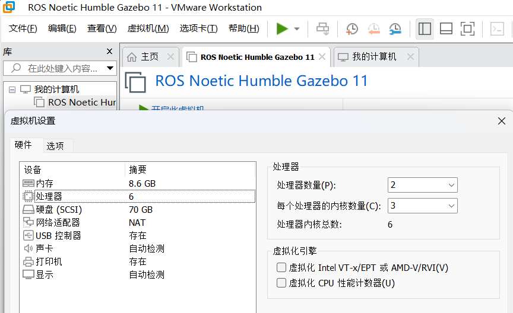
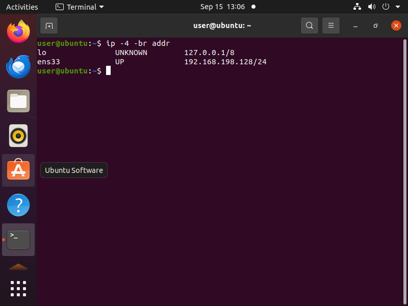
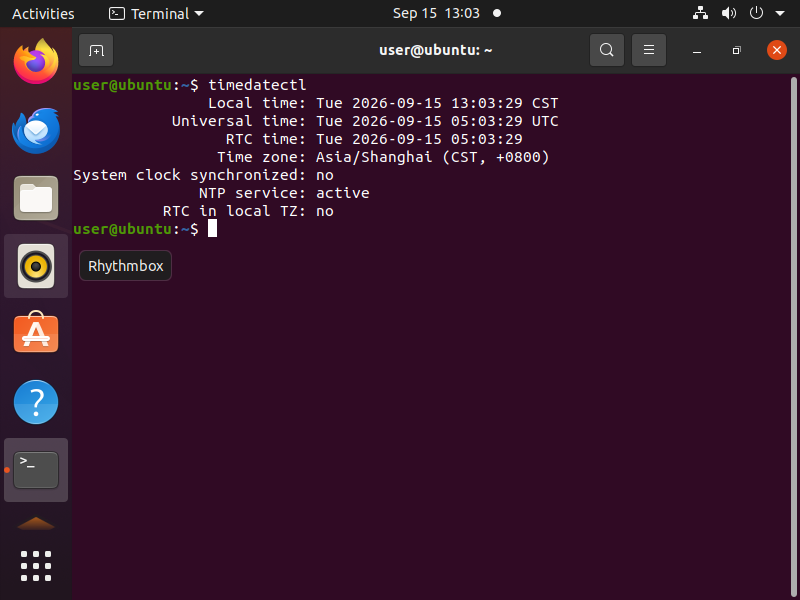
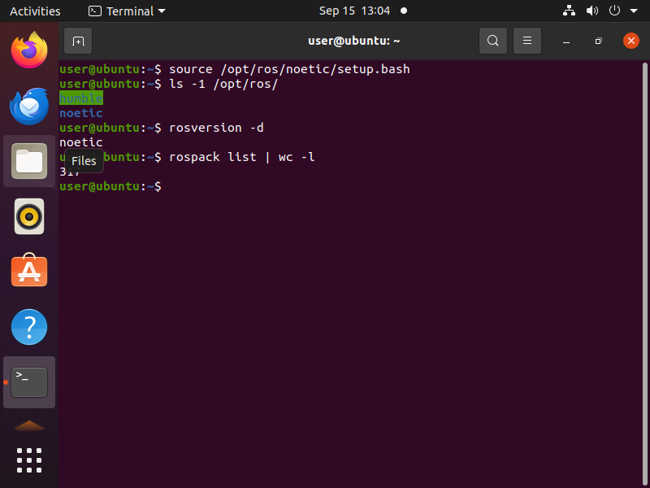
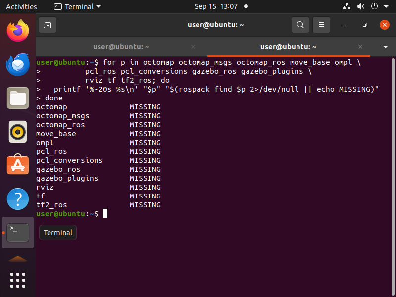
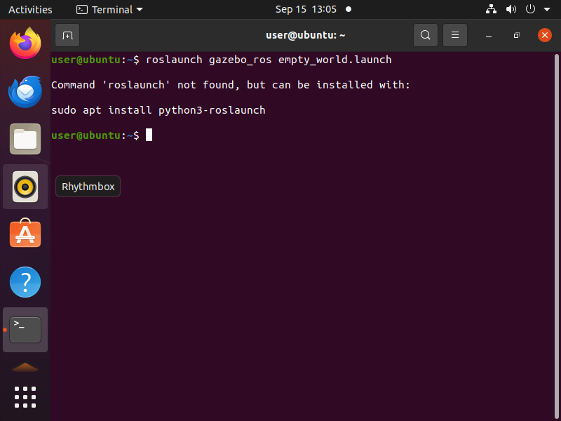
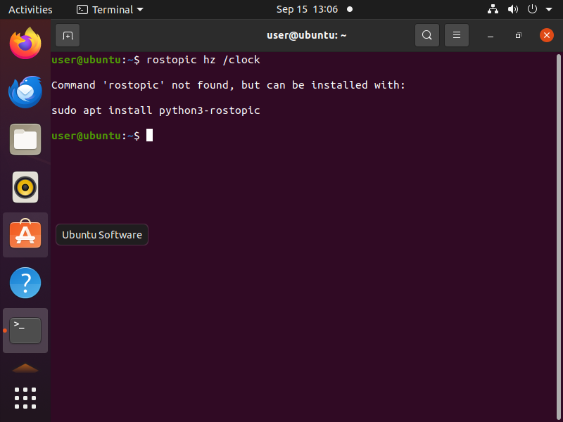
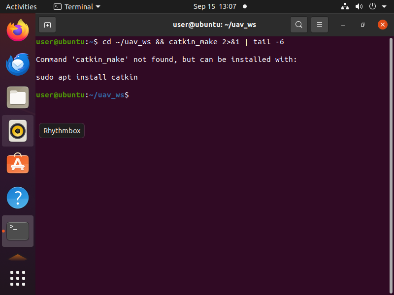

# 空域载具八叉树三维寻路的环境配置与前置准备

本文说明在本项目中搭建**空域载具三维寻路**开发环境所需的完整配置流程，包括虚拟机环境、ROS 与 Gazebo 的安装验证、octomap 三维地图依赖，以及工作空间的建立。

---

## 1. 环境一览

| 类别 | 项目 | 版本 |
|---|---|---|
| 宿主 | 操作系统 | Windows 11 |
| 宿主 | 虚拟化平台 | VMware Workstation 17.6.4 |
| 虚拟机 | 操作系统 | Ubuntu 20.04.6 LTS（内核 5.15） |
| 虚拟机 | 硬件配置 | 6 vCPU / 8 GiB 内存 / 70 GB 磁盘 |
| ROS | 发行版 | Noetic（ROS 1，1.16.0） |
| 仿真 | Gazebo | 11.13.0 |
| 三维地图 | octomap | 1.9.8 |
| 点云库 | PCL | 1.10 |

> 虚拟机可从零安装，也可使用预装 ROS 与 Gazebo 的镜像。本文以**预装镜像 + 验证配置**的方式说明。

---

## 2. 虚拟机配置

### 2.1 硬件配置建议

| 项目 | 建议值 | 说明 |
|---|---|---|
| CPU | ≥ 4 核 | Gazebo 物理引擎与 RViz 同时运行时的下限 |
| 内存 | ≥ 8 GB | 仿真 + 可视化 + 点云处理 |
| 磁盘 | ≥ 40 GB 可用 | ROS 桌面版、Gazebo 模型库、octomap/PCL |
| 显卡 | 开启 3D 加速 | 否则 Gazebo 退化为软件渲染，帧率很低 |
| 网络 | NAT | 与宿主共享网络，便于访问软件源 |

下图为 VMware 中该虚拟机的处理器与内存配置：



### 2.2 虚拟网络与登录

虚拟机默认使用 NAT 模式，可通过 `ip` 命令查看地址：

```shell
# 查看虚拟机 IP 地址
ip -4 -br addr
# 输出示例：ens33  UP  192.168.198.128/24
```



---

## 3. 系统配置

### 3.1 时区与时间同步

虚拟机镜像的时区常常不是本地时区，且 VMware Tools 的时间同步可能被关闭。时间不准会导致日志时间戳混乱、多机通信异常，**务必先修正**：

```shell
# 设置为东八区
sudo timedatectl set-timezone Asia/Shanghai
# 启用网络时间同步
sudo timedatectl set-ntp true
# 确认：Time zone 为 Asia/Shanghai，System clock synchronized 为 yes
timedatectl
```



### 3.2 确认系统版本

```shell
# 确认发行版为 Ubuntu 20.04
lsb_release -a
cat /etc/os-release | head -3
uname -r
```

---

## 4. ROS 环境

### 4.1 确认 ROS 版本

本机同时存在两个 ROS 发行版，需明确各自路径：

```shell
# 查看已安装的 ROS 发行版
ls -1 /opt/ros/
```

**本项目使用 ROS 1 Noetic。** 注意两套环境不可同时 `source`，否则环境变量互相覆盖，`rosversion`、`rospack` 等命令会失效。

```shell
# 每次打开新终端后都要 source
source /opt/ros/noetic/setup.bash

# 验证：应输出 noetic
rosversion -d
# 查看可用包数量
rospack list | wc -l
```



### 4.2 检查关键依赖包

```shell
# 逐个检查三维寻路所需的包是否存在
for p in octomap octomap_msgs octomap_ros move_base ompl \
         pcl_ros pcl_conversions gazebo_ros gazebo_plugins \
         rviz tf tf2_ros; do
  printf '%-20s %s\n' "$p" "$(rospack find $p 2>/dev/null || echo MISSING)"
done
```

| 包 | 用途 |
|---|---|
| `octomap` / `octomap_msgs` / `octomap_ros` | 八叉树地图核心库与 ROS 消息 |
| `pcl_ros` / `pcl_conversions` | 点云处理与格式转换 |
| `gazebo_ros` / `gazebo_plugins` | Gazebo 与 ROS 的桥接、传感器插件 |
| `rviz` | 三维可视化 |
| `tf` / `tf2_ros` | 坐标变换 |

各包的实际检查结果：



---

## 5. 仿真环境验证

启动前需先 `source` ROS 环境。使用 `roslaunch` 可一次性启动 ROS 主节点、Gazebo 服务端与客户端。

```shell
# 终端 1：启动空世界仿真
source /opt/ros/noetic/setup.bash
roslaunch gazebo_ros empty_world.launch
```

启动成功后应弹出 Gazebo 界面：



```shell
# 终端 2：验证 Gazebo 与 ROS 的时钟桥接
source /opt/ros/noetic/setup.bash
rostopic hz /clock
```

输出如下即表示桥接正常（`/clock` 由 Gazebo 发布，用于仿真时间）：

```
subscribed to [/clock]
average rate: 1000.000
	min: 0.001s max: 0.001s std dev: 0.00002s window: 1000
```



> **常见问题**：若直接运行 `gzserver` 而不通过 `roslaunch`，ROS 主节点不会被启动，`/clock` 话题不会出现，且 `rostopic` 会报 `Unable to communicate with master!`。

---

## 6. 建立工作空间与功能包

ROS 1 使用 catkin 构建系统。为避免与系统中已有的工作空间混杂，本项目建立独立工作空间：

```shell
# 建立工作空间
mkdir -p ~/uav_ws/src
cd ~/uav_ws/src && catkin_init_workspace

# 首次编译
cd ~/uav_ws && catkin_make
```

创建本项目的功能包，并声明三维寻路所需依赖：

```shell
cd ~/uav_ws/src
catkin_create_pkg uav_octree_planner roscpp rospy \
    std_msgs sensor_msgs nav_msgs geometry_msgs \
    tf tf2_ros octomap_msgs octomap_ros pcl_ros pcl_conversions

# 建立目录骨架
cd uav_octree_planner && mkdir -p launch config models rviz

# 重新编译验证
cd ~/uav_ws && catkin_make
```

编译日志中出现以下内容即为成功：

```
-- ~~  traversing 1 packages in topological order:
-- ~~  - uav_octree_planner
-- Configuring done
-- Generating done
#### Running command: "make -j6 -l6" in "/home/user/uav_ws/build"
```



---

## 7. 编译与运行验证

环境就绪后，编译并运行本模块的主入口，即可一次性验证运行环境与三条关键链路。

```shell
# 载入工作空间环境
source ~/uav_ws/devel/setup.bash

# 一条命令启动仿真器与主入口节点
roslaunch octree_uav_3d_pathfinding main.launch
```

主入口节点会依次输出运行环境信息（ROS 发行版、Python 版本、Gazebo 版本、octomap 版本），
并检查仿真时钟桥接、Gazebo 服务、话题通信三项。运行结束后自动退出。

三项检查全部通过时的输出如下：

```
[INFO] 模块: octree_uav_3d_pathfinding  v0.1.0
[INFO] ROS 发行版      : noetic
[INFO] [1/3] 仿真时钟桥接正常：已收到 1455 帧 /clock 数据
[INFO] [2/3] Gazebo 服务正常：当前世界包含 2 个模型
[INFO] [3/3] 心跳话题正常：已向 /uav_status 发布消息
[INFO] 检查结果：
[INFO]   [通过] 仿真时钟桥接
[INFO]   [通过] Gazebo 服务
[INFO]   [通过] 话题通信
[INFO]   /clock 平均频率: 1000.0 Hz（累计 1005 帧）
[INFO] 环境自检全部通过，模块可以开始后续开发。
```

详细的编译步骤与参数说明见模块源码目录下的 `README.md`。

---

## 参考

- [ROS Noetic 安装说明](https://wiki.ros.org/noetic/Installation/Ubuntu)
- [Gazebo 11 官方文档](https://classic.gazebosim.org/)
- [OctoMap 官网](https://octomap.github.io/)
- [catkin 构建系统](https://wiki.ros.org/catkin)

---

## 附：大模型使用声明

本文档及配套模块代码在编写过程中使用了 AI 大模型辅助（需求分析、方案讨论、代码与文档起草、问题排查）。全部内容已经过实际运行验证：环境配置步骤在 Ubuntu 20.04.6 + ROS Noetic + Gazebo 11.13.0 环境下逐条执行确认，模块通过 `roslaunch octree_uav_3d_pathfinding main.launch` 运行并输出上述自检结果。作者对提交内容的正确性与完整性负全部责任。
