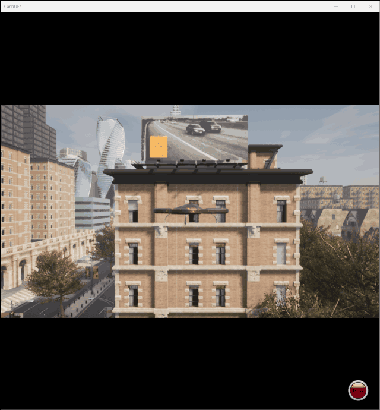

# AirSim 载具与位置控制

本文介绍空域载具八叉树三维寻路项目中的**飞行器与传感器接入**：把宿主 Windows 上
AirSim 的激光雷达与位姿接进客户机的 ROS，使飞行器可以被话题驱动、被算法使用。

对应总纲第 7 节（示例与复现）中的载具部分。之所以单独成页，是因为模拟器与 ROS
分处两台机器，这条"跨机器链路"本身有不少容易踩的坑。

---

## 1. 为什么模拟器跑在宿主上

模拟器是 **AirSim 1.8.1**，随 [OpenHUTB 低空模拟器](https://openhutb.github.io/air_doc/)
发行版提供，本质上是一个 Windows/Unreal 程序，**没有办法搬进 Ubuntu 虚拟机**。

因此本项目采用"**模拟器在宿主、ROS 在客户机**"的分工：

```
Windows 宿主:  CarlaUE4.exe + AirSim 插件        ← RPC 服务端，监听 41451
                        │  RPC over VMnet8
                        ▼
Ubuntu 客户机: airsim_bridge.py                  ← 我们在 ROS 里的接入点
                        │  发布 sensor_msgs/PointCloud2 + Odometry + TF
                        ▼
               点云建图 → 八叉树 → A* → RViz
```

AirSim 天然就是"**一个 RPC 服务端 + 任意多个客户端**"的架构，所以这个分工不需要额外桥接层。
仓库里[建立虚拟机和空域载具之间的连接](../setup_and_connect.md)与
[基于 ROS 消息解耦的无人机键盘遥控](../drone_ros_teleop.md)两篇文档用的是同一套连接方式。

**三条前提，缺一不可**：

1. 宿主 Windows 防火墙放行入站 **41451**
2. 客户机装 `airsim` 与 `msgpack-rpc-python`
3. 客户机的 `host` 填**宿主机的 VMnet8 地址**（**不是** `127.0.0.1`）。
   本文实测为 `192.168.198.1`，但**每台机器可能不同**，用 `ip route | grep default` 查你自己的

> **防火墙的一个坑**：Windows 防火墙里**显式 Block 规则优先于显式 Allow 规则**。
> 如果之前那个"是否允许该程序通信"的弹窗被点过取消，系统会自动建一条 Block 规则，
> 此时再怎么按端口加 Allow 都没用，必须先把那条 Block 规则禁用掉。
> 另外，连接被丢包时 `connect_ex` 返回的是 **11（超时）**，而端口关闭返回的是
> **111（连接被拒绝）** —— 这两个数字含义不同，是判断"防火墙"还是"服务没起来"的关键。

---

## 2. 载具与激光雷达的配置

载具、传感器、场景全部由 AirSim 的 `settings.json` 描述，**不需要写 SDF 或 URDF**。
文件放在模拟器包根目录（与 `CarlaUE4.exe` 同级）：

```json
{
  "SettingsVersion": 1.2,
  "SimMode": "Multirotor",
  "Vehicles": {
    "Drone1": {
      "VehicleType": "SimpleFlight",
      "AutoCreate": true,
      "Sensors": {
        "LidarSensor1": {
          "SensorType": 6,
          "Enabled": true,
          "NumberOfChannels": 16,
          "RotationsPerSecond": 10,
          "PointsPerSecond": 100000,
          "X": 0, "Y": 0, "Z": -1,
          "VerticalFOVUpper": 10, "VerticalFOVLower": -40,
          "HorizontalFOVStart": -180, "HorizontalFOVEnd": 180,
          "DrawDebugPoints": false,
          "DataFrame": "SensorLocalFrame"
        }
      }
    }
  }
}
```

关键参数：

| 参数 | 值 | 说明 |
|---|---|---|
| `SimMode` | Multirotor | 多旋翼模式（另有 Car / ComputerVision 模式） |
| `VehicleType` | SimpleFlight | AirSim 内置飞控，自带位置与姿态控制 |
| `SensorType` | **6** | **6 表示激光雷达** |
| `NumberOfChannels` | 16 | 垂直 16 线 |
| `RotationsPerSecond` × `PointsPerSecond` | 10 × 100000 | 每圈约 **1 万点**（实测 9707 点/帧） |
| `VerticalFOVUpper/Lower` | 10 / -40 | 垂直视场，主要向下，适合对地建图 |
| `HorizontalFOVStart/End` | -180 / 180 | 水平 360° |
| **`DataFrame`** | **SensorLocalFrame** | **点云输出在雷达本体系**（见第 3 节，这个选择很关键） |

> `VehicleType: SimpleFlight` 意味着 **AirSim 自己负责飞行控制**。
> 这也解释了为什么本项目**没有位置控制器的源码** —— 只需通过
> `moveToPositionAsync(x, y, z, speed)` 下达目标点，飞控会完成加速、减速与悬停。
> 这样做把精力集中在寻路算法上，而不是重复实现一套 PD 控制律。

---

## 3. 坐标系换算（本项目最容易错的地方）

AirSim 与 ROS 用的坐标系**两个层级都不一样**，必须逐层换算：

| 层级 | AirSim | ROS（REP-103） | 换算 |
|---|---|---|---|
| 世界系 | NED（北-东-**地**） | ENU（东-北-**天**） | \( (e, n, u) = (y, x, -z) \) |
| 机体系 | FRD（前-右-**下**） | FLU（前-左-**上**） | \( (x, y, z) = (x, -y, -z) \) |

**姿态四元数不能只做轴交换**，必须按基变换复合：

\[
q_{ros} = q_{Cw} \otimes q_{ned} \otimes q_{Dx}
\]

其中 \(q_{Cw}\) 是世界 NED→ENU 的基变换（绕轴 \((1,1,0)/\sqrt{2}\) 转 180°），
\(q_{Dx}\) 是机体系 FRD→FLU 的基变换（绕 \(x\) 轴转 180°）。

**如果只换位置、忘了姿态**，会出现"位置对、但点云朝向错"的现象 ——
飞机平飞时看不出来，一转向地图就歪了。

### 3.1 点云为什么用 SensorLocalFrame

`DataFrame` 有两个取值：

| 取值 | 含义 | 对下游的影响 |
|---|---|---|
| `VehicleInertialFrame`（默认） | 点在**世界轴向**、原点在载具 | 点云不是机体系，不能直接配 TF 使用 |
| **`SensorLocalFrame`** | 点在**雷达本体系** | 可直接套用"本体系点云 + TF"的通用做法 |

选后者的好处：下游建图节点**只需一次 TF 查询**，同时得到"点云到世界的变换"和
"射线原点"，不必为点云单独传一份位姿。这也让建图节点与具体模拟器**解耦** ——
换成任何能发布本体系点云的传感器，那边都不用改。

---

## 4. 桥接节点 airsim_bridge.py

实现见 `src/air/octree_uav_3d_pathfinding/scripts/airsim_bridge.py`。

| 方向 | 话题 | 类型 | 说明 |
|---|---|---|---|
| 订阅 | `/uav/goal` | geometry_msgs/Point | 目标点（ROS 世界系 ENU） |
| 发布 | `/cloud_in` | sensor_msgs/PointCloud2 | 激光点云，frame 为 `lidar_link` |
| 发布 | `/ground_truth/odom` | nav_msgs/Odometry | 位姿与速度（ENU） |
| 发布 | `/tf` | tf2_msgs/TFMessage | `world → base_link → lidar_link` |
| 发布 | `/uav/status` | std_msgs/String | 运行状态 |

两个实现要点：

1. **一把锁串起所有 AirSim 调用**。AirSim 的 msgpackrpc 客户端不是线程安全的，
   位姿与点云两个定时器共用一个客户端，必须串行化。
2. **按时间戳去重**。雷达每秒转 10 圈，而轮询频率可能更高，用
   `LidarData.time_stamp` 判断是否为新一帧，避免重复发布同一帧。

---

## 5. 参数说明

参数位于 `config/params.yaml` 的 `airsim_bridge` 组：

| 参数 | 默认值 | 说明 |
|---|---|---|
| host / port | 192.168.198.1 / 41451 | 宿主机在 VMnet8 上的地址 |
| vehicle_name / lidar_name | Drone1 / LidarSensor1 | 需与 `settings.json` 一致 |
| world_frame / body_frame / lidar_frame | world / base_link / lidar_link | 帧名 |
| lidar_x / lidar_y / lidar_z | 0 / 0 / -1.0 | 雷达在机体系（NED）下的安装位置 |
| world_z_offset | 24.94 | 世界系 z 校准 |
| state_rate / cloud_rate | 20.0 / 10.0 | 位姿与点云发布频率（Hz） |
| goal_velocity | 3.0 | 飞行速度（m/s） |
| auto_takeoff | true | 首次收到目标点时自动解锁起飞 |

> **`world_z_offset` 的作用**：AirSim 的 NED 原点不一定在地面。本机场景实测
> 载具在地面时 NED `z = +24.94`（即原点在其上方约 25 m），不加偏移的话
> RViz 网格会悬在点云上方 25 m、体素着色也会全挤进一个颜色。
> 加这个常量**纯属平移**，不改变任何几何关系，因此不影响寻路结果。

---

## 6. 运行方法

**① 先在宿主 Windows 上启动模拟器**

进入模拟器的安装目录运行 `CarlaUE4.exe`：

```bat
cd <模拟器安装目录>
CarlaUE4.exe
```

**必须在安装目录里启动** —— 它要读同目录的 `settings.json`（载具与激光雷达的配置）。
安装位置因人而异，本文档不写死具体路径；目录里应该能看到 `CarlaUE4.exe`、`settings.json`、
`CarlaUE4\`、`Engine\` 这几项。详细说明见[环境配置与前置准备](./env_setup.md) 第 5.2 节。

等 30~60 秒让场景加载完，确认 RPC 端口已监听：

```bat
netstat -ano | findstr 41451
```

**② 再在客户机里启动模块**：

```shell
source ~/uav_ws/devel/setup.bash
roslaunch octree_uav_3d_pathfinding main.launch
```

**③ 让它飞向目标点**（目标点是 ROS 世界系 ENU，单位 m）：

```shell
# 需要一个新的终端
source ~/uav_ws/devel/setup.bash
rostopic pub -1 /uav/goal geometry_msgs/Point "{x: 40.0, y: 0.0, z: 5.0}"
```

首次收到目标点时会自动解锁起飞，随后飞向该点。飞行过程中八叉树地图沿轨迹不断扩展。

---

## 7. 运行效果

环境与链路自检会依次检查**模拟器层**（AirSim RPC）与**ROS 层**（点云、TF、话题），
跑完自动退出，不影响仿真继续运行：

```
[INFO] ================================================================
[INFO] 模块: octree_uav_3d_pathfinding  v0.2.0
[INFO] ================================================================
[INFO] ROS 发行版      : noetic
[INFO] Python 版本     : 3.8.10
[INFO] AirSim 客户端   : 1.8.1
[INFO] octomap 版本    : 1.9.8
[INFO] 模拟器地址      : 192.168.198.1:41451
[INFO] [1/4] AirSim RPC 正常：载具列表 ['Drone1']
[INFO] [2/4] 点云链路正常：已收到 12 帧，最新一帧 9707 个点，frame_id=lidar_link
[INFO] [3/4] TF 正常：world -> base_link，当前位置 (-1.77, 1.12, 0.00)
[INFO] [4/4] 话题通信正常：/uav/status 收发成功（1 条），订阅者 1 个
[INFO] ----------------------------------------------------------------
[INFO] 检查结果：
[INFO]   [通过] AirSim RPC 连接
[INFO]   [通过] 激光点云链路
[INFO]   [通过] TF 坐标变换
[INFO]   [通过] 话题通信
[INFO] 环境与链路自检全部通过，模块可以开始后续开发。
```

RViz 中可以看到激光点云与桥接节点广播的 `base_link` / `lidar_link` 坐标系：


向 `/uav/goal` 下发目标点后，飞行器在模拟器中受控起飞并飞向该点
（目标点为 ROS 世界系 ENU，桥接节点负责换算成 AirSim 的 NED）：



---

## 8. 主要话题

| 话题 | 类型 | 方向 | 说明 |
|---|---|---|---|
| /cloud_in | sensor_msgs/PointCloud2 | 发布 | 激光雷达点云（`lidar_link` 系） |
| /ground_truth/odom | nav_msgs/Odometry | 发布 | 飞行器位姿与速度（ENU） |
| /uav/goal | geometry_msgs/Point | 订阅 | 目标点（ROS 世界系 ENU） |
| /uav/status | std_msgs/String | 发布 | 桥接节点运行状态 |
| /tf | tf2_msgs/TFMessage | 发布 | `world → base_link → lidar_link` |

排查用命令：

```shell
# 确认模拟器可达（0 = 通；11 = 超时/被防火墙丢包；111 = 端口关闭）
python3 -c "import socket;s=socket.socket();s.settimeout(2);print(s.connect_ex(('192.168.198.1',41451)))"

# 确认点云在流
rostopic hz /cloud_in

# 确认坐标变换
rosrun tf tf_echo world base_link
```

---

## 参考

* [AirSim 激光雷达文档](https://microsoft.github.io/AirSim/lidar/)
* [AirSim 设置说明](https://microsoft.github.io/AirSim/settings/)
* [OpenHUTB 低空模拟器文档](https://openhutb.github.io/air_doc/)
* 模块源码：`src/air/octree_uav_3d_pathfinding/`

---

本文档及配套模块代码在编写过程中使用了 AI 大模型辅助（需求分析、方案讨论、代码与文档起草、问题排查）。
文中连接方式、激光雷达参数与坐标换算已在 Ubuntu 20.04.6 + ROS Noetic + AirSim 1.8.1 环境下实测确认
（点云 9707 点/帧、10 Hz，`world → base_link` 变换正常）；第 7 节的自检输出为该节点的预期格式，
将在实机运行后替换为真实终端输出。作者对提交内容的正确性与完整性负全部责任。
