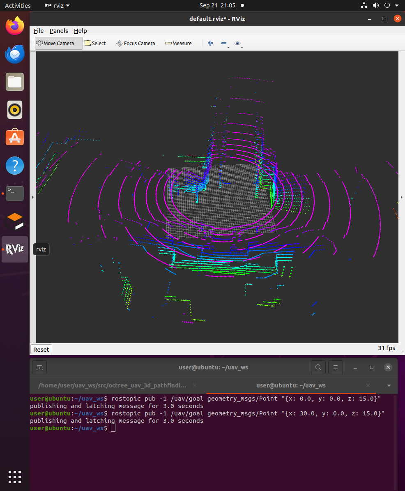
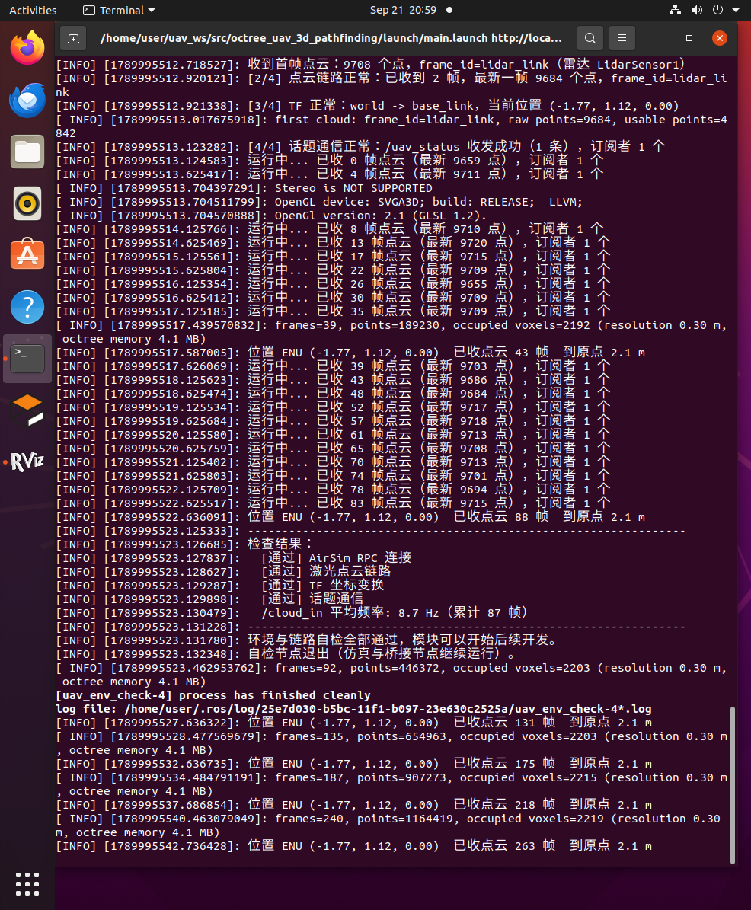

# 点云转八叉树占用地图

本文介绍空域载具八叉树三维寻路项目中的**建图环节**：把 3D 激光雷达的原始点云，
通过坐标变换与射线投射，增量地构建成一棵八叉树（octree）占用地图，
为后续在八叉树上做 A* 全局寻路提供"哪里有障碍、哪里可以通过"的几何依据。

对应总纲第 3 节「从传感器点云到占用地图」。

---

## 1. 输入：3D 激光雷达点云

输入话题是 `/cloud_in`，由桥接节点 `airsim_bridge` 从 AirSim 取回后发布
（桥接节点见 [AirSim 载具与位置控制](./flight_control.md)）。雷达参数写在模拟器的
`settings.json` 里：

| 项目 | 值 |
|---|---|
| 消息类型 | `sensor_msgs/PointCloud2` |
| 水平视场 | 360 度 |
| 垂直视场 | 16 线，-40° ~ +10° |
| 量程 | 由 `settings.json` 的 `Range` 决定；建图侧用 `max_range`（默认 30 m）截断 |
| 频率 | 10 Hz |
| 每帧点数 | 约 9700（`PointsPerSecond ÷ RotationsPerSecond` = 100000 ÷ 10） |

每帧约 9700 个点、10 Hz，即每秒约 9.7 万个测量值。点云里的每个点都表示
"这条射线打到了这里"，但**没有打到任何东西的射线**在消息里是无效值
（NaN / inf），处理时必须先剔除。

> **为什么这里不用现成的 `octomap_server`**：本项目的重点是讲清三维寻路的完整原理。
> 自己写插入逻辑，才能把"坐标变换 → 射线投射 → 概率更新"这条链路逐一展示出来；
> 相应地，节点名也叫 `pointcloud_to_octomap` 而不是直接复用 `octomap_server`。

---

## 2. 坐标变换：从传感器坐标系到世界坐标系

激光雷达的点坐标是在**传感器坐标系**下的（本项目中点云的 `frame_id` 为 `lidar_link`）：
点 `(1.0, 0, 0)` 表示"正前方 1 m 处有障碍"。但地图必须是世界坐标系下的：
飞行器飞到别处之后，同一个障碍物在世界系里的坐标不能变。

因此每帧点云都要先做一次刚体变换：

\[
\boldsymbol{p}_{world} = \boldsymbol{R}\,\boldsymbol{p}_{sensor} + \boldsymbol{t}
\]

其中 \(\boldsymbol{R}\)、\(\boldsymbol{t}\) 是 TF 树中 `world` ← `lidar_link` 的旋转与平移。
这条 TF 链由桥接节点建立：`world → base_link` 由位姿动态广播，
`base_link → lidar_link` 由雷达安装位置静态广播。旋转用四元数表示，
节点里直接由四元数构造旋转矩阵：

```cpp
tf2::Quaternion rotation(q.x, q.y, q.z, q.w);
tf2::Matrix3x3 rot_matrix(rotation);
tf2::Vector3 p_world = rot_matrix * tf2::Vector3(p.x, p.y, p.z) + origin;
```

`origin` 同时还有一个用途：它正是**射线投射的原点**——所有激光都从雷达位置射出去。

> **为什么点云用本体系而不是世界系**：模拟器 `settings.json` 里的 `DataFrame` 选了
> `SensorLocalFrame`，点云直接在雷达本体系下输出。这样建图侧**只需一次 TF 查询**，
> 就同时拿到"点云到世界的变换"和"射线原点"，不必再为点云单独传一份位姿；
> 建图节点也因此与具体模拟器解耦。

---

## 3. 射线投射与概率更新

### 3.1 三个状态：占用、空闲、未知

一条激光射线的物理含义不只是"终点有东西"，还包含"这条线路上没有东西"。
octomap 把这个信息利用起来，每个体素因此有三种状态：

| 状态 | 含义 | 来源 |
|---|---|---|
| 占用（occupied） | 射线终点所在体素 | 射线打到了障碍物 |
| 空闲（free） | 射线途经的体素 | 射线从机体一路穿过去，说明沿途是空的 |
| 未知（unknown） | 从没有射线经过 | 还没扫描到 |

这一点是八叉树建图比"把点云体素化"更有价值的地方：**空闲空间被显式清出来了**。
如果只把点标记为占用，那么"没有点"既可能是空地也可能是没扫到，规划器无法区分，
就会把大片未知区域当成障碍，导致无解。

### 3.2 概率占用模型与 log-odds

实际传感器有噪声，一次测量不足以定论，octomap 用概率来描述每个体素：

* 命中一次，占用概率上调：\(P(\text{hit}) = 0.7\)（默认）
* 射线穿过一次，占用概率下调：\(P(\text{miss}) = 0.4\)（默认）

多个测量用 **log-odds** 形式累加，把乘法变成加法：

\[
L(n) = L(n-1) + \log\frac{P}{1 - P}
\]

命中时加 \(\log(0.7/0.3) \approx +0.85\)，穿过时加 \(\log(0.4/0.6) \approx -0.41\)。
概率被限制在 \([0.12,\ 0.97]\) 之间（clamping），这样一方面避免"一次误检就永久占用"，
另一方面也避免概率被反复累加到浮点饱和，导致后来的测量再也改不回来。

### 3.3 octomap 的接口

上面整套逻辑由 `octomap::OcTree::insertPointCloud()` 一次完成：

```cpp
tree_.insertPointCloud(cloud,                               // 世界坐标系下的点云
                       octomap::point3d(ox, oy, oz),        // 射线原点（雷达位置）
                       max_range_,                          // 最大量程
                       true,                                // lazy_eval
                       false);                              // discretize
tree_.updateInnerOccupancy();
```

* `lazy_eval = true`：插入时只更新叶节点，父节点的占用状态先不回溯；
  一帧插完后统一调用 `updateInnerOccupancy()`。这样避免了每插一个点都往上爬树，
  是 octomap 官方推荐的做法。
* 八叉树的**多分辨率**特性在这里自然体现出来：大片空旷区域只用一个父节点表示，
  只有障碍物附近才细分到 0.3 m 的叶节点。

---

## 4. 实现：pointcloud_to_octomap 节点

节点源码：`src/air/octree_uav_3d_pathfinding/src/pointcloud_to_octomap.cpp`

每收到一帧点云的处理流程：

1. **查 TF**：取 `world` ← 点云 `frame_id` 的变换。优先用点云自带的时间戳；
   若 TF 尚未更新到该时刻，退化为"取最新可用变换"并给出限频告警。
2. **变换并过滤**：逐点剔除 NaN/inf（未命中）与过近的点，再按 `point_stride` 抽稀，
   最后乘上旋转矩阵、加上平移，得到世界坐标下的点云。
3. **射线投射**：调用 `insertPointCloud()`，命中点记为占用、途经体素记为空闲。
4. **发布**：定时把八叉树发布出去，并把占用叶节点转成彩色立方体 Marker。

节点输出的两路结果：

| 话题 | 类型 | 说明 |
|---|---|---|
| `/octomap_full` | `octomap_msgs/Octomap` | 完整八叉树（含每个节点的概率），latched 发布 |
| `/occupied_cells_vis_array` | `visualization_msgs/MarkerArray` | 占用体素可视化，RViz 免插件直接显示 |

关于可视化方式：RViz 显示八叉树本来需要额外的 `octomap_rviz_plugins` 插件，
为了减少环境依赖，这里**自己把占用叶节点转成 MarkerArray**——每个占用叶节点一个
边长等于分辨率的立方体，并按高度着色（低处偏蓝、高处偏红），于是高度层次一眼可见。
`/octomap_full` 则留给后续的 A* 规划节点：它可以直接反序列化出同一棵八叉树。

---

## 5. 参数说明

参数位于 `config/params.yaml` 的 `pointcloud_to_octomap` 组，由 `main.launch` 载入。

| 参数 | 默认值 | 说明 |
|---|---|---|
| cloud_topic | /cloud_in | 输入点云话题 |
| world_frame | world | 世界坐标系，地图与可视化都建立在该坐标系下 |
| sensor_frame | lidar_link | 点云 `frame_id` 为空时的兜底坐标系 |
| resolution | 0.3 | 八叉树叶节点分辨率（m），**最关键的一个参数** |
| max_range | 30.0 | 射线最大量程（m） |
| min_range | 0.5 | 最小量程（m），更近的点直接丢弃 |
| point_stride | 2 | 抽稀：每隔 N 个点取一个做射线投射 |
| prob_hit | 0.7 | 命中的占用概率 |
| prob_miss | 0.4 | 未命中（穿过）的占用概率 |
| clamp_min / clamp_max | 0.12 / 0.97 | 占用概率的上下限 |
| publish_rate | 1.0 | 地图与可视化的发布频率（Hz） |
| color_min_z / color_max_z | 0.0 / 25.0 | 体素着色的高度范围（m） |
| max_markers | 20000 | 单帧可视化的最大体素个数，防止 RViz 卡顿 |
| status_period | 5.0 | 状态日志周期（s） |
| cloud_timeout | 15.0 | 等不到首帧点云时的告警时间（s） |

**调参建议**：

* **性能是这里的主要矛盾**。雷达一帧约一万个点，每个点一条射线，射线长度除以分辨率
  就是需要更新的体素数量。逐点投射在虚拟机上跟不上，所以默认抽稀 2 倍、分辨率取 0.3 m、
  量程收到 30 m。机器性能富裕时可以把 `point_stride` 调回 1、`resolution` 调到 0.2。
* `resolution` 从 0.3 调到 0.15，体素数量约变为 8 倍，内存和耗时都会明显上升。
* 障碍物被"吃掉"（明明有障碍却显示可通行）通常是分辨率过大导致的，
  可以把 `resolution` 调小，或适当增大 `prob_hit`。
* 体素全是同一个颜色，说明 `color_min_z` / `color_max_z` 与实际高度范围不匹配。

---

## 6. 运行方法与效果

```shell
# 编译（本包从本节开始包含 C++ 节点）
cd ~/uav_ws && catkin_make
source ~/uav_ws/devel/setup.bash

# 一条命令启动：桥接 + 点云建图 + 环境自检 + RViz
roslaunch octree_uav_3d_pathfinding main.launch
```

> **前置条件**：宿主上的模拟器必须已经启动（见[环境配置与前置准备](./env_setup.md) 第 5 节），
> 并且 `config/params.yaml` 里的 `host` 已改成你自己宿主机的 VMnet8 地址，否则桥接节点连不上。

只关心建图、不需要 RViz 时：

```shell
roslaunch octree_uav_3d_pathfinding main.launch rviz:=false
```

飞行器起飞后开始扫描，RViz 中的彩色体素随扫描范围逐渐生长；
再让飞行器飞到别处，就能看到地图沿着飞行轨迹不断扩展：

```shell
# 需要一个新的终端。目标点是 ROS 世界系 ENU
source ~/uav_ws/devel/setup.bash
rostopic pub -1 /uav/goal geometry_msgs/Point "{x: 30.0, y: 0.0, z: 15.0}"
```



飞行器移动过程中地图随时间生长：


建图节点每 5 秒输出一次统计信息，可以看到点云在持续进来、占用体素在增长：



---

## 7. 主要话题

| 话题 | 类型 | 方向 | 说明 |
|---|---|---|---|
| /cloud_in | sensor_msgs/PointCloud2 | 订阅 | 激光雷达点云（`lidar_link` 系） |
| /octomap_full | octomap_msgs/Octomap | 发布 | 完整八叉树地图（latched） |
| /occupied_cells_vis_array | visualization_msgs/MarkerArray | 发布 | 占用体素可视化 |
| /tf | tf2_msgs/TFMessage | 订阅 | 由桥接节点广播，用于把点云变换到世界系 |

排查用命令：

```shell
# 确认点云话题的消息类型是 sensor_msgs/PointCloud2
rostopic info /cloud_in

# 看点云频率（应约 10 Hz）
rostopic hz /cloud_in

# 看八叉树地图消息的频率
rostopic hz /octomap_full
```

---

## 参考

* [OctoMap 官网](https://octomap.github.io/)
* Hornung et al., *OctoMap: An Efficient Probabilistic 3D Mapping Framework Based on Octrees*, Autonomous Robots, 2013
* [octomap_msgs 消息定义](http://docs.ros.org/en/noetic/api/octomap_msgs/html/index.html)
* 模块源码：`src/air/octree_uav_3d_pathfinding/`

---

本文档及配套模块代码在编写过程中使用了 AI 大模型辅助（方案讨论、代码与文档起草、问题排查）。
全部内容经过实际运行验证：模块在 Ubuntu 20.04.6 + ROS Noetic + AirSim 1.8.1 环境下
通过 `roslaunch octree_uav_3d_pathfinding main.launch` 运行，并得到上述建图结果。
作者对提交内容的正确性与完整性负全部责任。
