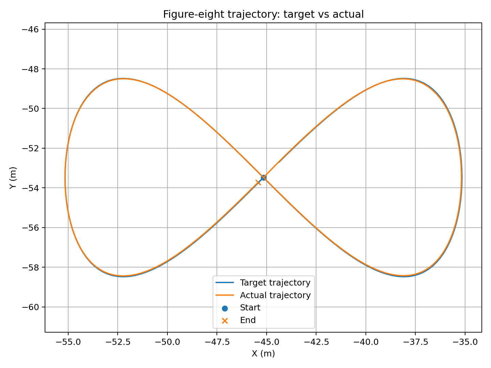
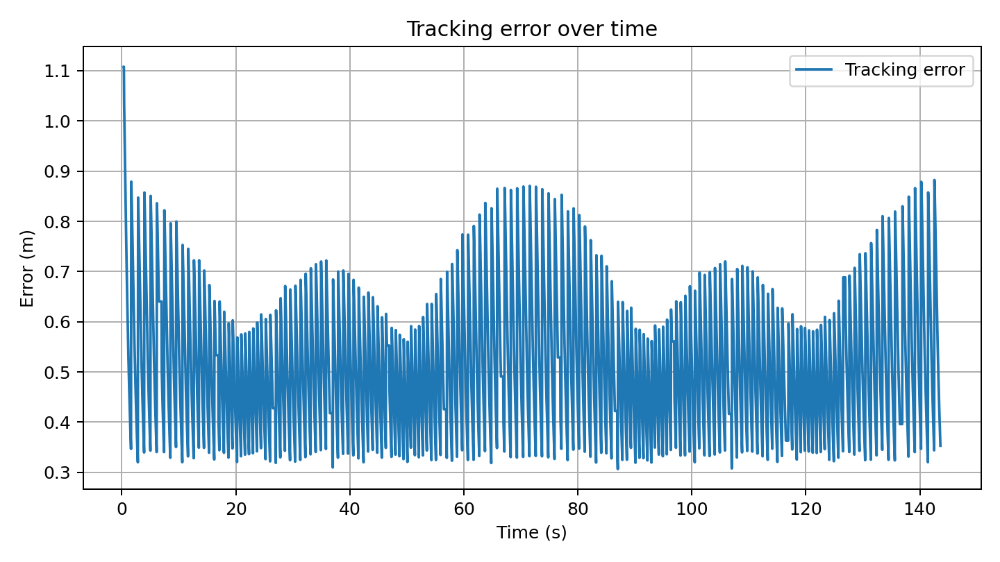
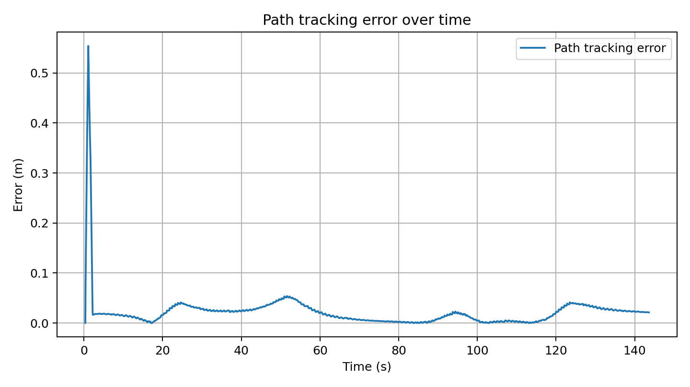
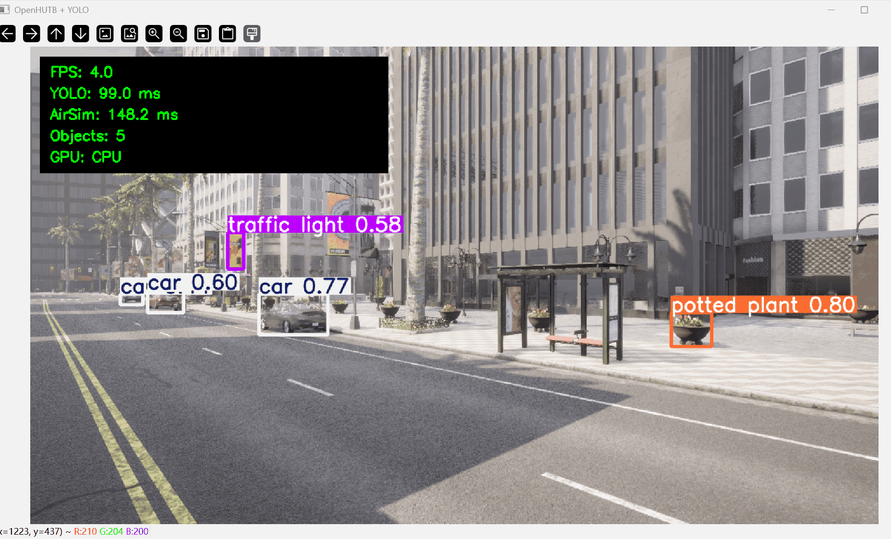

# OpenHUTB YOLO 与 MLP 八字轨迹控制

本文介绍一个基于 ROS 2 的 OpenHUTB 无人机感知与轨迹控制示例。系统通过 ROS 2 节点封装 OpenHUTB/AirSim RPC 接口，使用 YOLO11n 对模拟器 RGB 图像进行实时目标检测，并使用 MLP 控制器跟踪八字形轨迹。

本示例将**模拟器接口、视觉感知、轨迹生成和飞行控制解耦**。除 `airsim_bridge` 外，其余节点不直接调用 AirSim API，而是通过标准 ROS 2 消息交换数据，便于后续替换检测器、控制器或轨迹规划算法。

本文以下命令以 **Ubuntu 22.04 / ROS 2 Humble** 为主，同时适用于在 **WSL2 Ubuntu** 中运行 ROS 2、在 Windows 主机运行 OpenHUTB 的场景。

## 系统架构

```text
OpenHUTB / AirSim
       ^
       | RPC
       v
+-------------------+
|   airsim_bridge   |
+-------------------+
   |            ^
   |            |
   |            +---------------- /openhutb/cmd_vel
   |
   +-- /openhutb/camera/rgb --> yolo_detector
   |                              |
   |                              +-- /openhutb/detections
   |                              +-- /openhutb/yolo/image
   |
   +-- /openhutb/odom ----------> mlp_controller
                                   ^          |
                                   |          +-- /openhutb/cmd_vel
                                   |
trajectory_target ----------------+
       |
       +-- /openhutb/target
       +-- /openhutb/trajectory_done
```

YOLO 感知链路与八字轨迹控制链路可以分别运行，也可以通过 `main.launch.py` 同时启动。

## 功能与节点

| 节点 | 作用 | 主要输入/输出 |
| --- | --- | --- |
| `airsim_bridge` | 连接 OpenHUTB/AirSim，将模拟器数据转换为 ROS 2 消息，并执行控制指令 | 发布图像、里程计；订阅速度指令 |
| `yolo_detector` | 对 RGB 图像执行 YOLO11n 实时目标检测 | 订阅 `/openhutb/camera/rgb`；发布检测结果和标注图像 |
| `trajectory_target` | 根据无人机当前位置生成八字形目标轨迹 | 订阅 `/openhutb/odom`；发布 `/openhutb/target` |
| `mlp_controller` | 根据当前位置、速度和目标点预测速度控制量 | 订阅里程计与目标点；发布 `/openhutb/cmd_vel` |

主要 ROS 2 话题如下：

| 话题 | 消息类型 | 含义 |
| --- | --- | --- |
| `/openhutb/camera/rgb` | `sensor_msgs/Image` | OpenHUTB 相机 RGB 图像 |
| `/openhutb/odom` | `nav_msgs/Odometry` | 无人机位置和速度 |
| `/openhutb/detections` | `vision_msgs/Detection2DArray` | YOLO 检测结果 |
| `/openhutb/yolo/image` | `sensor_msgs/Image` | 带检测框的图像 |
| `/openhutb/target` | `geometry_msgs/PointStamped` | 当前八字轨迹目标点 |
| `/openhutb/cmd_vel` | `geometry_msgs/Twist` | 控制器输出的速度指令 |
| `/openhutb/trajectory_done` | `std_msgs/Bool` | 八字轨迹完成标志 |

## 环境与依赖

推荐环境为：

- Ubuntu 22.04；
- ROS 2 Humble；
- Python 3.10；
- OpenHUTB AIR 模式；
- WSL2 场景下由 Windows 主机运行 OpenHUTB，WSL2 Ubuntu 运行 ROS 2。

建议优先在 Linux/WSL2 自身文件系统中进行 ROS 2 构建，例如 `~/openhutb_ros_ws`，以减少 `/mnt/c`、`/mnt/d` 等跨文件系统目录带来的构建和文件访问开销。

先加载 ROS 2 环境：

```bash
source /opt/ros/humble/setup.bash
```

可使用带系统包访问能力的 Python 虚拟环境安装非 ROS Python 依赖：

```bash
python3 -m venv --system-site-packages .venv
source .venv/bin/activate
python -m pip install --upgrade pip
python -m pip install -r src/air/openhutb_yolo_mlp_control/requirements.txt
```

`rclpy`、`sensor_msgs`、`nav_msgs`、`geometry_msgs`、`std_msgs`、`vision_msgs`、`launch` 和 `launch_ros` 等 ROS 2 依赖由 ROS 环境提供。

## OpenHUTB/AirSim RPC 连接

OpenHUTB AIR 模式使用 AirSim RPC 接口，本示例默认端口为 `41451`。

### 原生 Linux 环境

如果 OpenHUTB 与 ROS 2 运行在同一 Linux 主机，可使用：

```bash
export AIRSIM_IP=127.0.0.1
```

### WSL2 连接 Windows 主机上的 OpenHUTB

如果 OpenHUTB 在 Windows 主机运行，而 ROS 2 在 WSL2 Ubuntu 中运行，WSL2 默认 NAT 网络模式下不应直接假定 `127.0.0.1` 一定能够访问 Windows 侧 RPC 服务。

可先在 WSL2 中获取默认网关地址：

```bash
export AIRSIM_IP=$(ip route | awk '/default/ {print $3; exit}')
echo "$AIRSIM_IP"
```

然后检查 RPC 端口是否可访问：

```bash
nc -vz "$AIRSIM_IP" 41451
```

如果系统尚未安装 `nc`，可以执行：

```bash
sudo apt update
sudo apt install -y netcat-openbsd
```

端口连通时会看到类似：

```text
Connection to 172.x.x.x 41451 port [tcp/*] succeeded!
```

如果出现 `Connection refused` 或超时，应先确认 OpenHUTB 已经进入 AIR 模式，并检查 Windows 防火墙、WSL2 网络配置以及实际监听地址。

> WSL2 网络模式可能因系统配置不同而有所差异。如果已经使用支持 localhost 转发的网络模式，也可以测试 `127.0.0.1:41451`；最终以 `nc` 的实际连通结果为准。

## YOLO11n 模型

YOLO11n 权重需要单独准备，并通过 launch 参数传入本地模型路径。

- [YOLO11n 模型下载地址](https://pan.baidu.com/s/1nHSTqk4aYdC5HOpih6jPrg?pwd=fffa)
- 提取码：`fffa`

建议将权重放在 Linux/WSL2 文件系统中，例如：

```bash
mkdir -p ~/models
```

如果权重当前位于 Windows 的 `D:\models\yolo11n.pt`，在 WSL2 中对应路径通常为：

```text
/mnt/d/models/yolo11n.pt
```

可以直接使用该路径，也可以复制到 WSL2 文件系统：

```bash
cp /mnt/d/models/yolo11n.pt ~/models/yolo11n.pt
```

启动前建议先确认文件存在：

```bash
test -f ~/models/yolo11n.pt && echo "YOLO model found"
```

运行本示例时建议显式传入本地绝对路径，不依赖 Ultralytics 自动联网下载。这样可以避免网络受限时出现 GitHub Release `403 Forbidden` 或下载失败。

## MLP 八字轨迹控制

MLP 控制器输入为：

```text
[ex, ey, ez, vx, vy, vz]
```

其中 `ex`、`ey`、`ez` 为目标位置与当前位置之间的误差，`vx`、`vy`、`vz` 为当前速度。

网络输出为：

```text
[vx_cmd, vy_cmd, vz_cmd]
```

控制器通过 `/openhutb/cmd_vel` 发布 `geometry_msgs/Twist`。

当前 ROS 接口保持 OpenHUTB/AirSim 使用的 NED 坐标约定。轨迹生成器使用无人机开始执行轨迹时的当前高度，不强制跳变到固定高度，从而降低轨迹开始阶段的瞬时垂直误差。

软件包内提供 `mlp_controller.pth`，其中包含 MLP 网络参数以及运行所需的输入、输出归一化信息。安装 ROS 2 包后，`trajectory_control.launch.py` 和 `main.launch.py` 会通过 ROS 2 package share 路径自动定位该模型，通常不需要手动指定路径。

如需重新生成训练数据并训练模型，可执行：

```bash
ros2 run openhutb_yolo_mlp_control generate_training_data
ros2 run openhutb_yolo_mlp_control train_mlp
```

## 构建

在仓库或 ROS 2 工作空间根目录执行：

```bash
source /opt/ros/humble/setup.bash
source .venv/bin/activate

colcon build \
  --packages-select openhutb_yolo_mlp_control \
  --symlink-install
```

构建完成后加载工作空间：

```bash
source install/setup.bash
```

每次打开新的终端，建议按以下顺序恢复环境：

```bash
source /opt/ros/humble/setup.bash
source .venv/bin/activate
source install/setup.bash
```

修改 launch 文件、`setup.py`、资源文件或模型安装配置后，应重新执行 `colcon build`。

## 运行方式

运行前先启动 OpenHUTB AIR 模式，并确认 RPC 端口能够访问。

如果是原生 Linux 同机运行：

```bash
export AIRSIM_IP=127.0.0.1
```

如果是 WSL2 连接 Windows 主机上的 OpenHUTB：

```bash
export AIRSIM_IP=$(ip route | awk '/default/ {print $3; exit}')
```

建议在正式启动前执行：

```bash
nc -vz "$AIRSIM_IP" 41451
test -f "$HOME/models/yolo11n.pt"
```

### 运行 YOLO 感知

在支持 WSLg 或原生 Linux 图形桌面的环境中，优先显示实时 YOLO 检测窗口，便于直接观察目标检测结果：

```bash
ros2 launch openhutb_yolo_mlp_control perception.launch.py \
  airsim_ip:="$AIRSIM_IP" \
  model_path:="$HOME/models/yolo11n.pt" \
  show_window:=true
```

该模式不会接管无人机轨迹控制，只发布相机图像、检测结果和标注后的图像，并显示实时检测窗口。

如果当前环境没有图形界面，例如通过纯 SSH 终端运行，可以关闭窗口显示：

```bash
ros2 launch openhutb_yolo_mlp_control perception.launch.py \
  airsim_ip:="$AIRSIM_IP" \
  model_path:="$HOME/models/yolo11n.pt" \
  show_window:=false
```

### 仅运行八字轨迹控制

如果无人机已经处于空中，可以关闭自动起飞，并将轨迹数据保存到 `~/openhutb_results`：

```bash
mkdir -p ~/openhutb_results

ros2 launch openhutb_yolo_mlp_control trajectory_control.launch.py \
  airsim_ip:="$AIRSIM_IP" \
  auto_takeoff:=false \
  figure8_scale:=10.0 \
  figure8_points:=160 \
  use_vertical_control:=true \
  result_dir:="$HOME/openhutb_results"
```

默认情况下会自动加载软件包中的 `models/mlp_controller.pth`。轨迹执行过程中，控制器会将目标位置、实际位置、误差和控制指令记录到：

```text
~/openhutb_results/eight_trajectory.csv
```

轨迹完成后，结束当前 launch 进程，再运行分析脚本生成轨迹图：

```bash
python -m openhutb_yolo_mlp_control.analyze_eight_trajectory \
  --csv "$HOME/openhutb_results/eight_trajectory.csv" \
  --outdir "$HOME/openhutb_results/analysis"
```

分析结果保存在 `~/openhutb_results/analysis`，其中主要包括：

```text
trajectory_xy.png
tracking_error.png
path_tracking_error.png
```

三张图片分别用于观察目标轨迹与实际轨迹的平面形状、离散航点跟踪误差以及连续路径跟踪误差。

### 一键运行 YOLO + 八字轨迹控制

`main.launch.py` 会同时启动 OpenHUTB/AirSim ROS 2 桥接、YOLO11n 实时检测、八字形目标轨迹生成和 MLP 轨迹控制器。

```bash
mkdir -p ~/openhutb_results

ros2 launch openhutb_yolo_mlp_control main.launch.py \
  airsim_ip:="$AIRSIM_IP" \
  yolo_model_path:="$HOME/models/yolo11n.pt" \
  auto_takeoff:=false \
  figure8_scale:=10.0 \
  figure8_points:=160 \
  result_dir:="$HOME/openhutb_results" \
  show_window:=false
```

如果希望由系统自动执行起飞流程，可将：

```text
auto_takeoff:=true
```

传给启动文件。

`main.launch.py` 默认从安装后的 ROS 2 package share 目录读取 `models/mlp_controller.pth`，因此 MLP 模型路径不依赖启动命令所在的当前目录。

可通过以下命令查看 launch 支持的参数：

```bash
ros2 launch openhutb_yolo_mlp_control main.launch.py --show-args
```

## ROS 2 节点与话题检查

完整系统启动后，可在另一个已经加载 ROS 2 工作空间的终端中执行：

```bash
ros2 node list
ros2 topic list
```

正常情况下可以看到：

```text
/airsim_bridge
/yolo_detector
/trajectory_target
/mlp_controller
```

检查主要话题频率：

```bash
ros2 topic hz /openhutb/odom
ros2 topic hz /openhutb/camera/rgb
ros2 topic hz /openhutb/target
ros2 topic hz /openhutb/cmd_vel
```

查看 YOLO 检测消息：

```bash
ros2 topic echo /openhutb/detections
```

## 轨迹结果与分析

`mlp_controller` 会在 `result_dir` 中生成：

```text
eight_trajectory.csv
```

CSV 记录目标位置、实际位置、位置误差和控制指令等信息。

轨迹分析脚本支持 `--csv` 和 `--outdir` 参数：

```bash
python -m openhutb_yolo_mlp_control.analyze_eight_trajectory \
  --csv ~/openhutb_results/eight_trajectory.csv \
  --outdir ~/openhutb_results/analysis
```

分析脚本会生成：

```text
trajectory_xy.png
tracking_error.png
path_tracking_error.png
trajectory_stats.json
trajectory_report.txt
```

其中：

- `trajectory_xy.png`：目标八字轨迹与实际飞行轨迹对比；
- `tracking_error.png`：当前位置到当前离散 waypoint 的误差；
- `path_tracking_error.png`：当前位置到完整理想八字轨迹最近线段的距离；
- `trajectory_stats.json`：轨迹统计数据；
- `trajectory_report.txt`：实验统计报告。

`tracking_error.png` 会受到 waypoint 切换影响，因此可能出现周期性峰值。评价连续路径跟踪质量时，可以结合 `trajectory_xy.png` 和 `path_tracking_error.png` 观察整体轨迹形状与连续路径偏差。

## 实验效果

### 八字形目标轨迹与实际轨迹

下图对比目标八字形路径和无人机实际路径，用于观察轨迹形状和整体跟踪效果。



### 航点跟踪误差

下图表示无人机当前位置到当前离散 waypoint 的距离。轨迹目标从一个 waypoint 切换到下一个 waypoint 时，误差可能发生跳变。



### 连续路径跟踪误差

下图计算实际位置到完整理想八字轨迹最近线段的距离。相比离散 waypoint 误差，该指标能够减少 waypoint 切换造成的误差跳变，更适合观察连续路径跟踪偏差。



### OpenHUTB + YOLO 实时检测

下图展示 OpenHUTB 相机图像经过 YOLO11n 后的实时检测效果。检测窗口可以显示 FPS、YOLO 推理耗时、OpenHUTB/AirSim 图像获取耗时、检测目标数量和推理设备等运行信息。



## OpenHUTB 控制接口说明

当前实现中，`airsim_bridge` 对外保持标准的 `geometry_msgs/Twist` 速度控制接口。桥接层负责将 ROS 2 控制指令转换为 OpenHUTB/AirSim 可以执行的控制调用。

因此控制器只依赖 `/openhutb/odom`、`/openhutb/target` 和 `/openhutb/cmd_vel` 等 ROS 2 接口。后续如果替换控制后端，主要调整桥接层即可，不需要改变 MLP 控制节点的 ROS 2 接口。

## 软件包结构

```text
openhutb_yolo_mlp_control/
├── package.xml
├── setup.py
├── setup.cfg
├── requirements.txt
├── README.md
├── config/
│   └── openhutb_ros.yaml
├── launch/
│   ├── main.launch.py
│   ├── perception.launch.py
│   └── trajectory_control.launch.py
├── models/
│   └── mlp_controller.pth
├── resource/
│   └── openhutb_yolo_mlp_control
├── tools/
│   └── vendor_openhutb_pythonclient.ps1
└── openhutb_yolo_mlp_control/
    ├── __init__.py
    ├── airsim_bridge_node.py
    ├── yolo_node.py
    ├── trajectory_target_node.py
    ├── mlp_control_node.py
    ├── mlp_model.py
    ├── generate_training_data.py
    ├── train_mlp.py
    ├── evaluate_trajectories.py
    ├── analyze_eight_trajectory.py
    └── vendor/
```

## 常见问题

### `ConnectionRefusedError: [Errno 111] Connection refused`

该错误表示 `airsim_bridge` 已经尝试建立 TCP/RPC 连接，但目标地址的 `41451` 端口没有接受连接。

先检查当前使用的地址：

```bash
echo "$AIRSIM_IP"
nc -vz "$AIRSIM_IP" 41451
```

如果 ROS 2 运行在 WSL2、OpenHUTB 运行在 Windows，不要只根据默认参数假定 `127.0.0.1` 可以访问 Windows 侧服务。可以重新获取 WSL2 默认网关：

```bash
export AIRSIM_IP=$(ip route | awk '/default/ {print $3; exit}')
nc -vz "$AIRSIM_IP" 41451
```

仍然无法连接时，应确认：

- OpenHUTB 已经进入 AIR 模式并完成加载；
- Windows 防火墙允许对应网络上的 RPC 连接；
- 端口 `41451` 没有被其他程序占用；
- WSL2 与 Windows 主机之间网络可达。

### YOLO 启动时尝试联网下载并出现 `403 Forbidden`

如果日志中出现类似：

```text
Loading YOLO model: yolo11n.pt
Download failure ... 403 Client Error: Forbidden
```

通常表示本地没有找到 `yolo11n.pt`，Ultralytics 随后尝试从网络自动下载模型，但当前网络无法访问下载地址。

先检查本地模型：

```bash
ls -lh ~/models/yolo11n.pt
```

然后显式传入本地绝对路径：

```bash
ros2 launch openhutb_yolo_mlp_control main.launch.py \
  airsim_ip:="$AIRSIM_IP" \
  yolo_model_path:="$HOME/models/yolo11n.pt" \
  show_window:=false
```

建议不要依赖运行时自动下载模型。

### YOLO 模型可以找到，但节点仍无法加载

可以在当前虚拟环境中单独测试模型加载：

```bash
python - <<'PY'
from pathlib import Path
from ultralytics import YOLO

path = Path.home() / "models" / "yolo11n.pt"
YOLO(str(path))
print(f"YOLO model loaded successfully: {path}")
PY
```

如果这里仍然报错，应优先检查当前虚拟环境中的 `torch`、`ultralytics` 版本以及模型文件是否完整。

### WSL2 中无法显示 YOLO OpenCV 窗口

检测本身不依赖 GUI。没有 WSLg 或图形转发环境时，使用：

```text
show_window:=false
```

仍可通过 ROS 2 的 `/openhutb/yolo/image` 话题获取标注图像。

### MLP 控制器找不到模型

正常安装后，launch 文件会自动加载软件包中的 `models/mlp_controller.pth`。可检查 ROS 2 是否已经找到该包：

```bash
ros2 pkg prefix openhutb_yolo_mlp_control
```

如果刚修改过 `setup.py`、模型文件或安装配置，应重新构建：

```bash
colcon build \
  --packages-select openhutb_yolo_mlp_control \
  --symlink-install
source install/setup.bash
```

### 无人机已经起飞但启动后再次执行起飞动作

启动时使用：

```text
auto_takeoff:=false
```

### 航点误差存在周期性峰值

`tracking_error.png` 记录当前位置到当前离散 waypoint 的距离，目标点切换时可能产生跳变。连续轨迹跟踪效果可以结合 `path_tracking_error.png` 和 XY 轨迹图进行判断。

## 功能扩展与未来规划

当前版本实现了“OpenHUTB/AirSim → ROS 2 → YOLO 感知”和“ROS 2 → MLP 八字轨迹控制”两条相互解耦的链路，可以在现有 ROS 2 接口基础上继续扩展。

### 感知结果参与飞行控制

当前 YOLO 与八字轨迹控制并行运行，检测结果尚未直接进入控制回路。后续可以增加目标跟踪或视觉伺服节点，将 `/openhutb/detections` 转换为目标方位、图像中心偏差或三维目标位置，实现目标跟随、目标居中、动态目标追踪，以及根据指定类别触发任务切换。

### 基于道路场景的复杂轨迹测试

当前版本暂时采用较为规整的八字轨迹，便于验证控制链路、观察跟踪误差，并在不同实验之间进行可重复的性能比较。后续可以进一步引入更复杂、更接近实际交通场景的飞行路线，以检验算法在连续弯道、路口和长距离路径等情况下的控制效果。

OpenHUTB 地图对应的 OpenDRIVE 文件包含道路几何和车道信息，可根据道路中心线或车道参考线生成飞行轨迹，并在地面道路上方保持设定的高度偏移，使无人机沿道路网络飞行。这样可以将控制测试从规则的人工轨迹扩展到真实地图中的复杂道路结构。

在此基础上，还可以进一步获取由 Traffic Manager 控制的地面自动驾驶车辆的位置和运动状态，将车辆的实时轨迹作为无人机的动态跟踪目标，使控制任务由预先定义的静态轨迹跟踪扩展为对地面移动车辆的实时伴随或跟踪，为后续感知、规划与控制闭环研究提供测试场景。

### 多控制器对比

在相同 `/openhutb/odom`、`/openhutb/target` 和 `/openhutb/cmd_vel` 接口下，可以增加 PID、LQR、MPC 等控制器，与 MLP 控制器在相同轨迹上进行对比，并统一统计 MAE、RMSE、最大路径误差、控制指令平滑度和轨迹完成时间等指标。

### 在线轨迹评估

可以增加 ROS 2 在线评估节点，实时订阅 `/openhutb/odom` 和 `/openhutb/target`，发布 waypoint 误差、连续路径误差、滑动窗口 RMSE、控制频率和消息延迟等指标，并配合 `rqt_plot`、Foxglove 或 PlotJuggler 观察控制性能。

### YOLO 性能与部署优化

后续可增加 CPU/CUDA 推理性能统计、ONNX 或 TensorRT 推理后端、类别筛选、检测帧率限制、感兴趣区域裁剪、无界面运行以及 rosbag2 离线回放等功能。

### 自动化测试与可重复实验

可以补充 launch smoke test、ROS 2 topic 连通性检查、MLP checkpoint 加载测试、固定轨迹数据回归测试和自动轨迹统计报告。与 OpenHUTB 图形模拟器相关的完整测试可以作为集成测试运行。

## 说明

本文档整理、代码重构和问题排查过程中使用了大模型辅助；提交者已检查全部内容并对最终结果负责。
