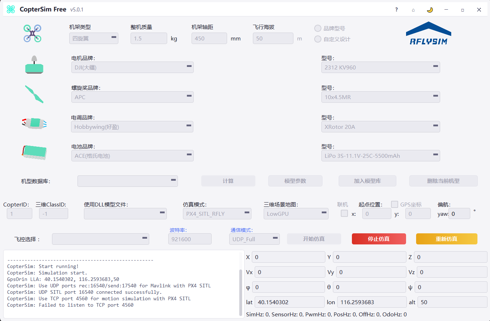
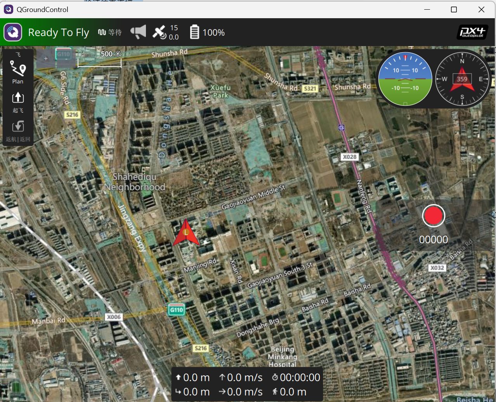
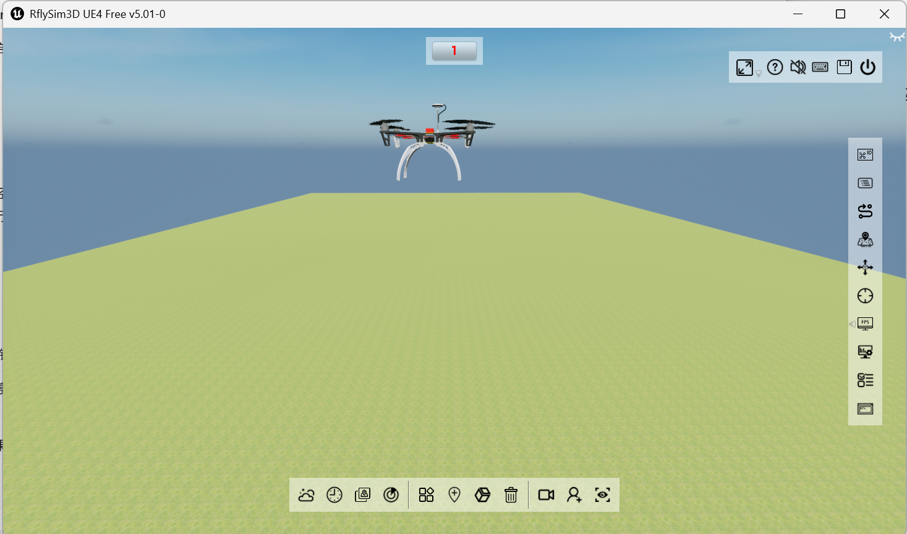

# RflySim：Windows 与 WSL2 单机起飞实验

本实验记录 RflySim 的 PX4 软件在环（SITL）启动、TCP 端口故障排查，以及使用 QGroundControl 起飞和降落的方法。已确认地面站连接成功、显示 Ready To Fly，三维场景正常显示无人机。

## 1. 实验环境与组件

| 组件 | 本次环境或作用 |
| --- | --- |
| Windows | Windows 11，系统构建号 26200.9457 |
| RflySim | CopterSim Free v5.0.1 / RflySim3D UE4 Free v5.01 |
| 安装目录 | `C:\PX4PSP` |
| WSL | WSL 2.6.3.0，分发名称 `RflySim-20.04`，运行于 WSL2 |
| PX4 | 1.12.3，在 WSL 内运行飞控算法 |
| CopterSim | 计算无人机运动和模拟传感器数据 |
| RflySim3D | 显示三维场景和无人机姿态 |
| QGroundControl | 显示飞控状态，下发起飞、降落等指令 |

软件在环指飞控程序和动力学模型都运行在计算机中，无需实体飞控板。QGroundControl 通过 MAVLink 与飞控交换信息；三维窗口负责显示，不能仅凭窗口打开就判断飞控已连接。

## 2. 检查安装并启动

以下命令均在 Windows PowerShell 中执行。复制代码内容即可，不要复制提示符或 Markdown 标记。

```powershell
wsl -l -v
```

应能看到 `RflySim-20.04`，VERSION 为 `2`。分发名称是安装器使用的名称，不应仅据名称判断内部 Ubuntu 版本。

本次安装最初选择 WinWSL（WSL1）时出现 `WSL_E_WSL1_NOT_SUPPORTED`。改选安装器支持的 WinWSL2 后安装成功。VMware 中的 Ubuntu 与这个 WSL 分发是两个独立环境。

使用安装器提供的低显卡负载启动脚本：

```powershell
Start-Process -FilePath "C:\PX4PSP\RflySimAPIs\SITLRunLowGPU.bat" -WorkingDirectory "C:\PX4PSP\RflySimAPIs" -Verb RunAs
```

输入无人机数量 `1`，等待 CopterSim、RflySim3D 和 QGroundControl 启动。此脚本是本实验入口，不需要再次手动启动另一套仿真。

本次 CopterSim 设置为 CopterID `1`、仿真模式 `PX4_SITL_RFLY`、地图 `LowGPU`、通信模式 `UDP_Full`。

## 3. TCP 4560 监听失败的排查



图 1：故障时的 CopterSim 界面。左下角显示 `Failed to listen to TCP port 4560`，底部 `SimHz`、`SensorHz` 和 `PwmHz` 均为 0，表明此时仿真数据尚未正常更新。

本次 CopterSim 报错：

```text
CopterSim: Use UDP ports rec:16540/send:17540 for Mavlink with PX4 SITL
CopterSim: UDP SITL port 16540 connected successfully.
CopterSim: Use TCP port 4560 for motion simulation with PX4 SITL
CopterSim: Failed to listen to TCP port 4560
```

PX4 日志则停在：

```text
PX4 SIM HOST: localhost
INFO [simulator] Waiting for simulator to accept connection on TCP port 4560
```

这里由 Windows 上的 CopterSim 监听 TCP 4560，PX4 主动连接。UDP 初始化成功并不表示整个仿真链路成功。WSL 内没有 TCP 4560 监听也不一定是故障。

### 3.1 区分进程占用与系统保留

```powershell
Get-NetTCPConnection -LocalPort 4560 -ErrorAction SilentlyContinue | Format-Table LocalAddress,LocalPort,State,OwningProcess -AutoSize
netsh interface ipv4 show excludedportrange protocol=tcp
netsh interface ipv6 show excludedportrange protocol=tcp
```

本次未发现端口监听，却发现 IPv4、IPv6 排除范围都包含 `4540～4639`，覆盖了 4560。排除范围由系统保留，因此“没有进程占用”不等于“应用可以使用”。

进一步检查动态端口分配范围：

```powershell
netsh interface ipv4 show dynamicport tcp
netsh interface ipv6 show dynamicport tcp
```

本机两者均为起始端口 `1024`、端口数 `13977`，不同于通常的 Windows 默认范围。

### 3.2 本机采用的修复方法

以下操作修改整台 Windows 的 TCP 动态端口范围，仅适用于确认存在上述配置问题的机器；如机器有专门的网络配置，应先确认用途。

保存工作、关闭仿真，在**以管理员身份运行的 PowerShell** 中执行：

```powershell
netsh interface ipv4 set dynamicport tcp start=49152 num=16384
netsh interface ipv6 set dynamicport tcp start=49152 num=16384
```

然后手动重启 Windows。修改动态范围不会立即移除已有排除项，重启后需要重新检查，不能把命令成功等同于问题已解决。

本次重启后 IPv4 排除范围只剩 `2869`、`5357` 和 `50000～50059`，不再覆盖 4560。重新运行启动脚本后，QGroundControl 成功显示 Ready To Fly。

没有删除整段系统排除范围，也没有修改 PX4 或 CopterSim 的端口。安装目录中的 `UdpPortFree.bat` 主要通过结束进程释放端口，不能据此认定它可以解决系统保留端口问题。

## 4. 验证连接效果



图 2：修复端口问题后的 QGroundControl。截图显示 Ready To Fly、卫星数 15、电量 100%，相对高度为 0.0 m。这些是模拟飞控的状态反馈，不代表真实无人机状态。左侧“起飞”按钮是下一步操作入口。



图 3：RflySim3D 的三维运行画面，顶部编号为 1，场景中已显示无人机。单张图片无法证明悬停持续时间或准确高度，应结合地面站遥测判断。

若仍未连接，可查看 TCP 状态和 PX4 日志：

```powershell
Get-NetTCPConnection -LocalPort 4560 -ErrorAction SilentlyContinue | Format-Table LocalAddress,LocalPort,RemoteAddress,RemotePort,State,OwningProcess -AutoSize
Get-Content -LiteralPath "C:\PX4PSP\Firmware\build\px4_sitl_default\instance_1\out.log" -Tail 80
Get-Content -LiteralPath "C:\PX4PSP\Firmware\build\px4_sitl_default\instance_1\err.log" -Tail 80
```

`Listen` 表示端口正在监听，`Established` 表示 TCP 连接已建立，但还需要核对传感器更新和地面站状态。历史日志中的等待信息不必消失，重点看后续新日志。

Windows 的 `Get-Process px4` 不会可靠反映 WSL 内的 PX4；应这样检查：

```powershell
wsl -d RflySim-20.04 -- bash -lc "pgrep -a px4"
```

## 5. 起飞、悬停与降落操作

1. 在 QGroundControl 确认已连接，状态为 Ready To Fly。
2. 点击左侧“起飞”。若出现高度输入，设置相对起飞点高度为 5 m。
3. 按界面要求确认解锁或拖动起飞确认滑块。解锁表示允许电机运转，起飞指令让飞控控制上升。
4. 切到 RflySim3D 观察上升，同时核对 QGroundControl 的相对高度接近 5 m、垂直速度在稳定后接近 0 m/s。
5. 观察约 10 秒，记录高度与姿态是否稳定。
6. 在 QGroundControl 选择“降落 / Land”并确认，观察下降、接地和自动上锁。

如果指令被拒绝，应记录地面站具体提示并排查，不要通过禁用飞控检查来跳过问题。

## 6. 实验结果与待补充验证

| 项目 | 本次证据 |
| --- | --- |
| 排除端口故障处理 | 重启后 4560 不再属于 IPv4 排除范围 |
| 地面站连接 | 截图显示 Ready To Fly，收到卫星和电池状态 |
| 三维显示 | 截图显示 1 号无人机和场景 |
| 5 m 稳定悬停 | 尚无对应遥测或连续记录，待补充 |
| 降落与自动上锁 | 尚无完成记录，待补充 |
| ROS 话题控制 | 本实验未实施 |

后续可补充起飞、悬停和降落的遥测截图或视频，再接入 ROS；不能将操作步骤直接视为已完成的实验结果。

## 7. 参考与撰写说明

- [RflySim 官网](https://rflysim.com/)
- [RflySim 官方问题反馈](https://github.com/RflySim/Docs/issues)
- [PX4 v1.12 文档](https://docs.px4.io/v1.12/en/)
- [返回文档首页](../index.md)

