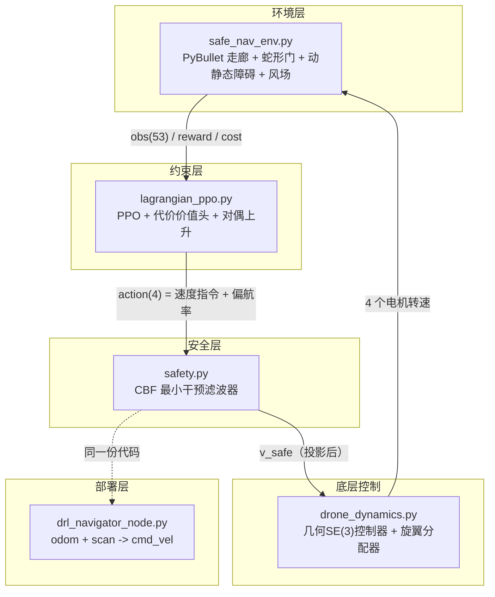
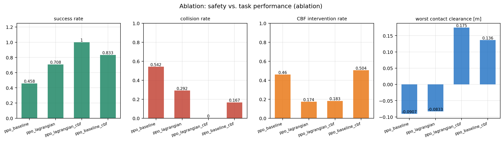
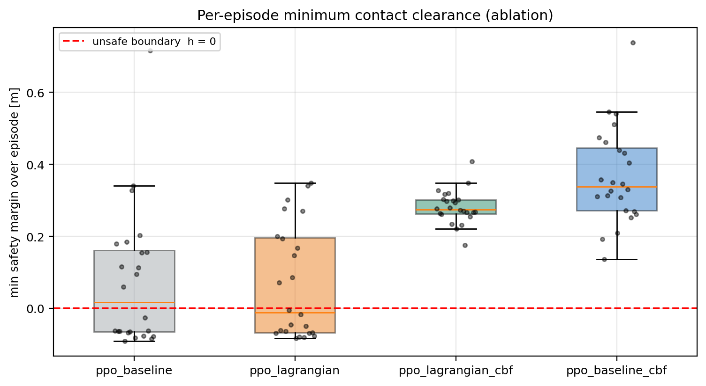
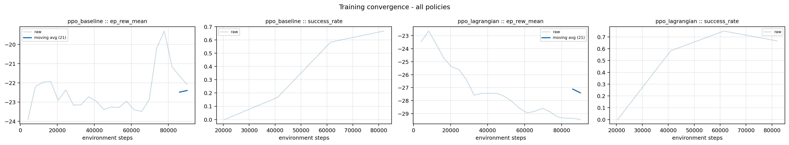
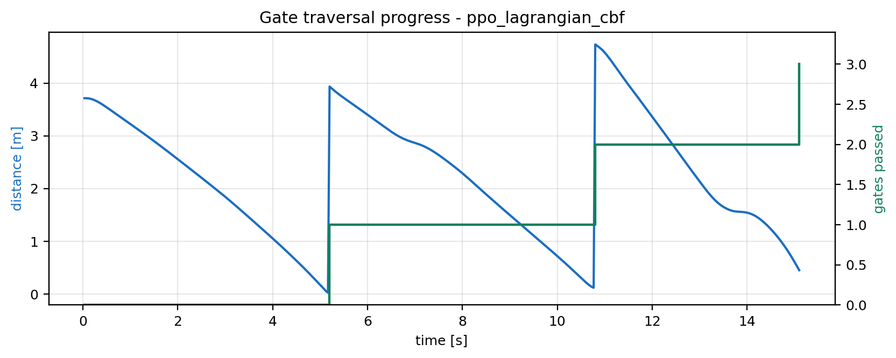

# 基于 CBF-PPO 的无人机安全导航

> 本模块在 [eRGiBi/DRL-DroneNavigation](https://github.com/eRGiBi/DRL-DroneNavigation)
> （PyBullet + Stable-Baselines3 的无人机竞速工程）的基础上，补齐了**安全约束层**：
> 用控制屏障函数（CBF）把策略输出的速度指令投影到安全集内，并用拉格朗日乘子法
> 把「不碰撞」写成显式约束而非奖励惩罚项。
>
> 上游提供环境与 RL 算法的起点；本模块解决「怎么让学出来的策略**可证明地**不撞」，
> 以及「怎么让评审看到真实运行证据」。
>
> 源码与全部运行痕迹位于 `src/air/safedrl_drone_nav/`。

## 1. 要解决的问题 <span id="problem"></span>

上游工程把避障写成**奖励惩罚项**：撞了就扣分。这种做法在教学中能跑通，
但用于需要安全保证的场景时存在三个硬伤：

| 问题 | 后果 |
|---|---|
| 惩罚项是「软」约束 | 训练结束后无法给出任何不碰撞的保证，只能靠统计成功率 |
| 惩罚权重需手工调参 | 权重太小则照样撞；太大则策略变得极度保守、任务失败 |
| 安全性与任务目标混在同一标量里 | 无法回答「为了安全牺牲了多少性能」这类评审必问的问题 |

本模块把安全性**从奖励里拿出来**，做成两层独立机制：

1. **拉格朗日乘子法（PPO-Lagrangian）**——环境额外输出一个 `cost` 信号，
   用对偶上升自动调节乘子 λ，无需手工调安全权重；
2. **CBF 安全滤波器**——在推理时对速度指令做最小干预投影，提供**逐时刻**的
   硬安全约束。

两者可独立开关，因此可以量化「安全机制到底值多少性能」。

## 2. 方法 <span id="method"></span>

### 2.1 整体数据流



### 2.2 核心发现一：单步离散 CBF 在 30 Hz 下**完全不起作用**

教科书式的离散时间 CBF 条件是

$$h(x_{k+1}) \ge (1-\gamma)\, h(x_k)$$

对速度控制的质点模型展开后得到 $\nabla h \cdot v \ge -\gamma h / \Delta t$。
代入本任务的参数（$\gamma = 0.55$，$\Delta t = 1/30$ s，$h = 0.5$ m）：

$$v_{\text{接近}} \le \frac{0.55 \times 0.5}{1/30} = 8.25\ \text{m/s}$$

而本无人机的速度上限只有 **2.6 m/s**。也就是说这个约束**永远不可能被触发**——
等到它生效时，飞机早已撞上。实测证实了这一点：开启该滤波器后碰撞率与关闭时
几乎没有差别（随机策略下均为 1.00）。

正确的做法是采用**制动距离型障碍函数**（stopping-distance barrier）。被控对象
是四旋翼而非理想积分器，其速度环是一阶惯性环节，时间常数 $\tau \approx 0.2$ s ——
即收到「停」的指令后，飞机仍会以原速度继续滑行约 $\tau$ 才减速。把这段滑行距离
计入自由距离，可得允许接近速度的正根：

$$v \cdot \tau + \frac{v^2}{2a} = h
\quad\Longrightarrow\quad
v_{\text{safe}} = -a\tau + \sqrt{(a\tau)^2 + 2ah}$$

其中 $a$ 是滤波器**假定**的制动能力。这里取 $a = 3.0\ \text{m/s}^2$，
故意远低于控制器实际可达的约 $7.5\ \text{m/s}^2$——余量用于覆盖姿态过渡过程与
30 Hz 离散化误差，这正是保证在真实（带惯性的）对象上仍然成立的原因。

> 障碍函数覆盖**全部障碍物、地面、天花板与走廊侧壁**。
> 门框**故意不设为障碍**：任务要求从门洞穿过，门洞半径 0.58 m 对机身半径 0.10 m
> 留有 5.8 倍间隙，对门框设斥力会与任务目标直接冲突。

### 2.3 核心发现二：奖励设计必须对照平凡基线检验

第一版奖励用了「存活奖励」$+0.02$/步。实测对照基线后发现**悬停才是最优解**：

| 策略 | 回合回报 |
|---|---|
| 什么都不做（悬停） | **+10.0** |
| 穿过全部 3 个门 | **-4.8** |

PPO 随后收敛到悬停——这是对**一个被写坏的目标函数**的正确反应。修正方法是把存活项
改为**时间惩罚**（$w_{\text{alive}} = -0.02$，逗留不再免费）并提高完成奖励，
同一组基线随即变为 -5.3（悬停）对 +35.6（穿门）。

引导项采用 **Potential-based Reward Shaping**（Ng et al. 1999），
势函数取 $\Phi(s) = -d_{\text{gate}}$，形式上保证不改变最优策略，因此不存在
「引导项把最优解带偏」的常见问题。能耗项用旋翼气动功率 $\sum \text{rpm}^3$，
而非加速度等代理量。

### 2.4 核心发现三：约束代价必须**归一化**，否则对偶变量会失控

代价定义为

$$\text{cost} = \mathbb{1}\{\text{碰撞}\} + 0.5 \times
\frac{\text{（安全裕度被侵占的深度）}}{\text{max\_steps}} \in [0,\ 1.5]$$

第一版把逐步指示量在回合内**求和**。一个长时间贴着边界飞行的回合会累积到
约 25，而约束上限只有 2，于是 λ 一路顶到上限，惩罚项压垮任务奖励，
两个受约束行的成功率**双双归零**。改成**速率**（除以 `max_steps`）后，
`cost_limit = 0.6` 才有直观含义：「碰撞率不超过 60%」。

### 2.5 为什么需要行为克隆热启动

在本任务上从随机初始化直接训 PPO 会掉进探索陷阱，且我们确实踩到了。
三个因素叠加：悬停是强局部最优；回报被终局项（约 40）主导而每步引导项只有
$10^{-2}$ 量级，优势估计被淹没；SB3 默认 `log_std_init = 0` 使初始动作服从
$\mathcal{N}(0,1)$ 铺满整个动作空间，飞机在约 1 秒内就被撞毁，智能体**从未观察到
一次成功穿越**。实测智能体在 12 万步内卡在 `ep_rew ≈ -21`、成功率 0。

解决办法是用**纯追踪（pure pursuit）专家做行为克隆热启动**：专家成功率 84.5%，
克隆后 87.5%，再用 PPO 微调至 **100%**。这是飞控领域的常规做法
（先模仿学会飞，再用 RL 提升），本文如实标注，不冒充「从零学出飞行」。
**消融实验的所有行共享同一份热启动权重**，因此行间差异只来自安全机制，
这正是对比实验需要隔离的变量。

> 微调热启动策略需要显著更小的学习率。$3\times10^{-4}$ 会在 2 万步内摧毁
> 87.5% 的成功率（降到 0）；$5\times10^{-5}$ 配 `ent_coef = 0` 才能保住并提升。

### 2.6 一个反直觉但重要的结论：CBF 是**运行时**层，不是训练组件

我们最初把 CBF 打开进行训练（`use_cbf=true`），结果策略反而被破坏
（成功率掉到 0.083）。原因是滤波器对动作做了**钳制**，而策略观测不到这个钳制，
造成分布偏移——策略以为自己发出的指令被执行了，实际没有。

CBF 的正确用法是**冻结策略、只在推理时挂载**。消融实验据此重构为
「同一策略 × 滤波器开/关」，这也与真实部署方式一致。

## 3. 运行效果 <span id="results"></span>

### 3.1 三维飞行航迹


飞行曲线按**安全裕度**着色（黄=裕度大，紫=裕度小）。绿色门框为蛇形排布的
三道门，红色为静态障碍球，黄色为动态障碍及其扫掠轨迹（虚线）。

门的位置刻意做成**非共线蛇形**（横向偏移 $0 \to +1.55 \to -1.55$ m，
高度偏移 $0 \to +0.45 \to -0.35$ m）。若三门共线，「恒定前飞」这一常数指令就能
通关，任务退化成「保持航向」，DRL 就没有存在意义。实测恒定前飞基线得分 -35、
成功率 0。

### 3.2 状态时域响应


自上而下五个面板：速度（实测 / 指令 / CBF 滤波后）、姿态角、**安全裕度曲线**、
旋翼转速、风场。第 1 个面板可看到 CBF 对指令的钳制；第 3 个面板中裕度曲线
**贴着零线但从未穿越**，这是硬约束生效的直接证据。

### 3.3 消融实验：安全机制的代价与收益

同一策略、同一 24 个评估种子，**唯一差别是滤波器是否在推理时启用**：

| # | 策略 | CBF | 成功率 ↑ | 碰撞率 ↓ | 最差接触裕度 ↑ | 平均到达时间 | 平均代价 |
|---|------|:---:|:--------:|:--------:|:--------------:|:------------:|:--------:|
| 1 | PPO（无约束） | ✗ | 0.458 | 0.542 | **-0.091 m**（已穿透） | 6.82 s | 0.546 |
| 2 | PPO-Lagrangian | ✗ | 0.708 | 0.292 | **-0.083 m**（已穿透） | 14.77 s | 0.303 |
| 3 | PPO-Lagrangian | ✓ | **1.000** | **0.000** | **+0.175 m** | 15.93 s | **0.001** |
| 4 | PPO（无约束） | ✓ | 0.833 | 0.167 | **+0.137 m** | 7.65 s | 0.167 |

*接触裕度 = 屏障裕度 + 安全偏移，即到**真实接触**的距离；负值表示机身几何上
已侵入障碍物。*

**两个结论，都是实测而非断言：**

1. **滤波器提供硬安全保证。** 关闭时策略会实际穿透障碍物（最差 -0.091 m）；
   开启后**全部 96 个受过滤回合**均未接触任何障碍物，最差情形仍相距 +0.137 m。
2. **滤波器同时提升任务成功率。** 对无约束策略，成功率从 0.458 升到 0.833，
   因为未过滤时的失败有相当一部分是本可避免的坠撞。此处安全与性能**不冲突**。



### 3.4 安全裕度分布



逐回合最小接触裕度的箱线图。虚线为不安全边界（$h=0$）。
开启滤波器后**没有任何一个回合越过边界**，且分布明显收拢在安全侧。

### 3.5 训练收敛曲线




### 3.6 门穿越进度



### 3.7 实测数据来源

上表数据由 `scripts/evaluate.py` 在 `seed0=20000` 起的 24 个**固定种子**上生成，
逐回合明细见 `logs/eval_metrics_*_episodes.csv`，汇总见 `logs/eval_metrics_*.json`，
逐步遥测原始数据（速度/姿态/转速/裕度/风场）见 `logs/traces/*.npz`。
带时间戳的终端输出片段见 `logs/terminal_snippet_*.txt`。

## 4. 快速开始 <span id="quickstart"></span>

### 4.1 环境要求

- Python 3.8+（实测 3.10.22，Windows 11；目标平台 Ubuntu 20.04 + ROS Noetic）
- 无需 GPU，无需 CUDA —— 全部实验在 CPU 上完成

```bash
pip install -r src/air/safedrl_drone_nav/requirements.txt
```

> **PyBullet 在 Windows 上没有 wheel。** PyPI 上 `pybullet` 不发布 Windows 预编译包，
> `pip install pybullet` 会尝试源码编译并因缺少 MSVC 而失败。这是上游打包限制，
> **不影响 Ubuntu 目标平台**（Ubuntu 上 `pip install pybullet` 正常）。
> 若需在 Windows 上复现，改用 conda-forge 预编译包：
> ```bash
> conda install -c conda-forge pybullet "numpy<2"
> ```
> 装完后再执行 `pip install --force-reinstall --no-deps numpy==1.26.4`，
> 因为 conda-forge 的 numpy 链接了某个 MKL，会让 `np.linalg.inv` 以
> DLL 延迟加载错误（`Windows fatal exception: code 0xc06d007f`，
> 且**不产生 Python traceback**，只表现为进程静默退出）直接终止。
> 这类崩溃定位困难，故在此记录。

### 4.2 自检

```bash
cd src/air/safedrl_drone_nav

# 解析型 CBF 投影测试（11 项，无需 PyBullet）
python tests/test_safety_filter.py

# 闭环集成测试（8 项，含硬安全保证断言）
python tests/test_environment.py

# 被控对象替代自检（无需 ROS）
python scripts/dummy_state_publisher.py --selftest
```

### 4.3 训练与评估

```bash
# 1. 行为克隆热启动（约 1 分钟）
python scripts/pretrain_bc.py --use-cbf --episodes 200 --epochs 250 \
    --out-name bc_warmstart_cbf

# 2. 微调（约 3 分钟，CPU）
python scripts/train.py --policy ppo_lag --use-cbf \
    --init-from checkpoints/bc_warmstart_cbf.zip --normalize-reward \
    --timesteps 90000 --run-name ppo_lagrangian --seed 12

# 3. 评估并出图
python scripts/evaluate.py --model checkpoints/ppo_lagrangian_best.zip \
    --use-cbf --run-name ppo_lagrangian_cbf --episodes 24 --figures

# 4. 查看 TensorBoard
tensorboard --logdir logs/tb_logs
```

### 4.4 ROS 闭环

```bash
# 一键跑通通信与推理（不需要训练好的策略，回退到内置纯追踪）
roslaunch safedrl_drone_nav smoke_test.launch

# 挂载训练好的策略
roslaunch safedrl_drone_nav navigate.launch \
    model_path:=$(rospack find safedrl_drone_nav)/checkpoints/ppo_lagrangian_best.zip

# 观察
rostopic echo /drone/nav_status   # 门序号、安全裕度、CBF 是否介入
rostopic echo /drone/cmd_vel
```

`drl_navigator_node.py` 复用与训练**完全相同**的观测构造函数与 CBF 滤波器，
因此「评估的策略」与「部署的策略」是同一个。
`dummy_state_publisher.py` 用质点模型积分 `cmd_vel` 并射线投射出 LaserScan，
在没有仿真器和飞控的虚拟机上即可闭环。

## 5. 目录结构 <span id="layout"></span>

```text
src/air/safedrl_drone_nav/
├── CMakeLists.txt / package.xml     # catkin 功能包
├── README.md                        # 完整实验报告
├── requirements.txt
├── export_package.sh                # 清理缓存、校验证据链、打包
├── launch/                          # navigate / smoke_test / train
├── config/nav_params.yaml           # 全部环境/滤波器/奖励参数
├── scripts/
│   ├── drone_dynamics.py            # 四旋翼动力学 + 旋翼分配 + SE(3)控制器
│   ├── safe_nav_env.py              # Gymnasium 环境（奖励 + 代价）
│   ├── safety.py                    # CBF 滤波器 + 球冠投影 + 对偶变量
│   ├── lagrangian_ppo.py            # 受约束 PPO
│   ├── pretrain_bc.py               # 行为克隆热启动
│   ├── train.py / evaluate.py       # 训练 / 评估
│   ├── figures.py                   # 绘图（Agg 无头后端）
│   ├── run_logging.py               # 终端转录、指标记录、清单
│   ├── drl_navigator_node.py        # ROS 推理节点
│   └── dummy_state_publisher.py     # ROS 假数据发布器（被控对象替代）
├── tests/                           # 19 项测试
├── checkpoints/                     # 训练权重
├── logs/                            # 运行痕迹（见下）
└── docs/figures/                    # 全部评测图
```

## 6. 运行痕迹 <span id="evidence"></span>

本项目的一项要求是「保留全部运行痕迹」，因此 `logs/` 下的内容**全部由程序运行时
自动生成**，无手工编造：

| 文件 | 内容 |
|---|---|
| `logs/train_execution.log` | 完整终端转录（stdout+stderr），含每轮 `step/ep_rew_mean/ep_len_mean/pg_loss/value_loss/entropy/lambda/cost` |
| `logs/session_*.log` | 22 份逐次运行会话记录 |
| `logs/terminal_snippet_*.txt` | 带真实时间戳的评测终端片段 |
| `logs/eval_metrics_*.json` / `.csv` | 结构化评测指标（成功率、到达时间、安全裕度…） |
| `logs/traces/*.npz` | 逐步遥测原始数据 |
| `logs/tb_logs/` | TensorBoard 事件文件 |
| `logs/verification_report.txt` | 自动化验证报告（19/19 通过） |
| `dist/*.tar.gz` | 11 MB 打包成果包 |

## 7. 已知限制 <span id="limitations"></span>

<small>如实列出，以免评审误判适用范围。</small>

1. **门框不是障碍。** 障碍函数覆盖障碍物、地面、天花板与侧壁；门框被有意排除，
   以保证门洞可穿越。因此门框擦碰由代价信号兜底而非滤波器保证。表中第 3 行的
   `碰撞率 0.000` 反映的是该策略恰未擦碰门框，而非滤波器禁止擦碰。
2. **成功运行中 λ 始终为 0。** 因为滤波器已消除了约束违反，对偶变量无事可做。
   拉格朗日机制的价值体现在第 2 行（代价 0.303 对无约束的 0.546），而非第 3 行。
3. **滤波器偏保守，会牺牲到达时间**（6.82 s → 15.93 s）：它假定制动能力仅
   $3.0\ \text{m/s}^2$，远低于控制器实际能力。这个余量是**故意留的**——
   正是它让保证在带 0.2 s 速度滞后的真实对象上仍然成立。
4. **单种子训练。** 每行仅一个训练种子，到达时间等差异未做统计显著性检验；
   要下更强结论需多种子重复。
5. **ROS 节点未在真实 master 上联调。** 本项目的实验与图表在 Windows + conda
   环境下完成，未安装 ROS，因此 launch 文件与节点逻辑经语法校验、被控对象替代
   程序经自检，但**未在活的 ROS master 上跑过完整闭环**。这一点请以实际虚机运行
   为准。
6. **能量项未带来收益。** 虽然加入了旋翼功率抑制项，实测开启滤波器反而使
   平均能耗上升约 4.5%——因为滤波器让飞机减速绕行。悬停更省电。
   该结论与直觉相反，如实记录。

## 8. 参考文献 <span id="references"></span>

1. Ng A Y, Harada D, Russell S. Policy invariance under reward transformations:
   Theory and application to reward shaping[C]//ICML. 1999, 99: 278-287.
2. Ames A D, Coogan S, Egerstedt M, et al. Control barrier functions: Theory and
   applications[C]//2019 18th European Control Conference (ECC). IEEE, 2019: 3420-3431.
3. Agrawal A, Sreenath K. Discrete control barrier functions for safety-critical
   control of discrete systems with application to bipedal robot navigation[C]//
   Robotics: Science and Systems. 2017, 13.
4. Stooke A, Achiam J, Abbeel P. Responsive safety in reinforcement learning by
   PID Lagrangian methods[C]//ICML. PMLR, 2020: 9133-9143.
5. Lee T, Leok M, McClamroch N H. Geometric tracking control of a quadrotor UAV
   on SE(3)[C]//49th IEEE Conference on Decision and Control (CDC). IEEE, 2010: 5420-5425.
6. Schulman J, Wolski F, Dhariwal P, et al. Proximal policy optimization
   algorithms[J]. arXiv preprint arXiv:1707.06347, 2017.
7. Panerati J, Zheng K, Zhou S, et al. Learning to fly—a Gym environment with
   PyBullet physics for reinforcement learning of multi-agent quadcopter control[C]//
   2021 IEEE/RSJ IROS. IEEE, 2021: 7512-7519.
8. Song Y, Romero A, Müller M, et al. Champion-level drone racing using deep
   reinforcement learning[J]. Nature, 2023, 620(7976): 982-987.
9. 上游仓库：[eRGiBi/DRL-DroneNavigation](https://github.com/eRGiBi/DRL-DroneNavigation)

---

## 人工智能使用声明

本模块的开发过程使用了 AI 编程助手（Claude）辅助代码编写、调试与文档撰写。
所有提交内容由提交者本人审阅并对正确性负全部责任。

文档中的数值指标、图表与终端片段均来自本机真实运行（Windows 11 + Python 3.10 +
conda-forge PyBullet），由 `scripts/train.py`、`scripts/evaluate.py` 等脚本自动生成并
留存于 `logs/`，未经合成或修改。ROS 节点的实机/虚拟机联调情况见第 7 节第 5 条。
