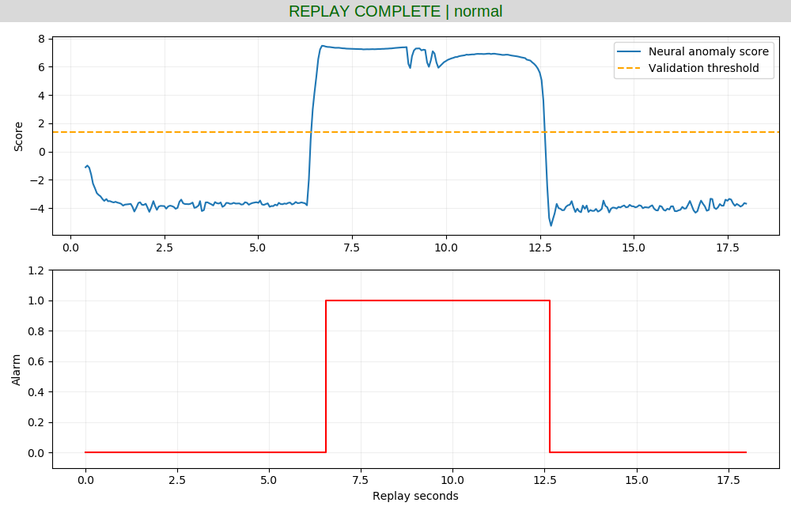
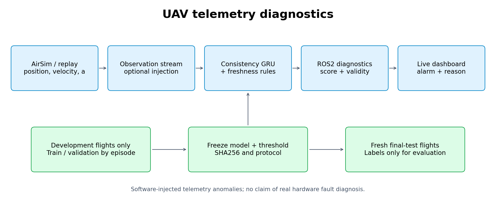
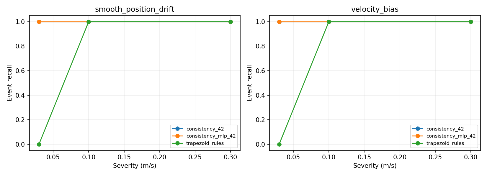

# 无人机遥测异常检测与 ROS2 在线诊断

在 OpenHUTB [AirSim ROS 桥接示例](https://github.com/OpenHUTB/ros2/tree/master/src/air/air_teleop) 和已有[飞行状态预测扩展](https://github.com/OpenHUTB/ros2/pull/121)基础上，建立独立的**遥测数据可靠性**课程项目。输出异常评分、数据有效性与诊断消息，不输出飞控指令，不重复 PPO 导航、视觉避障、航点跟踪或未来轨迹回归。无需安装原预测模块即可运行。

本项目包含真实 AirSim 飞行采集、监督神经网络训练、独立测试、基线/消融、多随机种子、ROS2 封装和真实窗口截图。定位为课程实验，不是实机安全监控系统。



## 1. 方法和边界

当前模型为 16 隐藏单元 GRU，输入过去 8 个采样时刻的跨通道运动学残差：位置差分速度与两端速度均值的差、速度差分加速度与两端加速度均值的差。训练集正常样本确定尺度，进行保留符号的 log1p 变换，再监督学习正常/注入异常分类。模型输出 logit，正常验证分数的 99.5% 分位数作为阈值，连续 3 次越阈值报警。

时间戳冻结与缺包由独立规则处理，不计作神经网络贡献；坏 JSON/非有限数值产生错误诊断。模型预热期间明确标为未就绪。输入来源是 AirSim `kinematics_estimated`，不是独立的真实 GPS/IMU。位置漂移、速度偏置、冻结和丢包是**软件观测层注入**，不能把这些结果解释为真实传感器硬件故障识别。



标签和参考状态仅在训练标签构造、评估支路使用，ROS2 检测节点只读取观测流。实时桥接只读仿真状态，不解锁、不起飞、不发送控制。

采集期间的真实机载相机图像：


## 2. 已验证环境

- Windows 11：已有 Blocks / AirSim 1.8.1。
- VMware Ubuntu 20.04.6：已有 ROS2 Humble、Python 3.8.10、PyTorch 2.4.1+cpu。
- 本机 Humble/Ubuntu 20.04 是既有非标准组合；没有为此重装系统。其他系统尚未独立验证。
- 可视化使用 Tk/matplotlib 的实际 ROS2 订阅窗口，无需本机缺少 Ogre 的 RViz2。

## 环境安装、检查与构建

在 Ubuntu 中先进入 `src/air/telemetry_diagnostics`。已有环境可跳过创建；首次安装需使用与系统 ROS2 匹配的 `/usr/bin/python3`，避免 Conda 的 `python3` 被误用：

```bash
source /opt/ros/humble/setup.bash
/usr/bin/python3 -m venv --system-site-packages ~/uav_prediction_env
source ~/uav_prediction_env/bin/activate
python -m pip install -r requirements.txt
bash main.sh doctor
bash main.sh build
```

`requirements.txt` 一次安装 CPU 版 PyTorch、NumPy、Matplotlib、colcon 构建插件和可选仿真客户端的前置依赖；不需要另装 CUDA。ROS2 的 `rclpy`/消息包和 Tk 来自系统 ROS/Python 安装，不能用 pip 安装 ROS2 代替。若创建 venv 报缺少 ensurepip，先安装系统 `python3-venv`；没有图形窗口时检查 `python3-tk`。

已经由 Conda 创建且无法导入 ROS2 的环境，建议保留原环境，另建一个系统 Python venv（例如 `~/ros2_course_env`），激活后运行同一个 requirements 命令。`main.sh` 优先使用 `UAV_ENV` 指定的目录，其次使用当前已激活的 `VIRTUAL_ENV`，最后才使用 `~/uav_prediction_env`；`ROS_SETUP` 可指定 ROS setup 文件。每个新终端都要激活环境，或使用会加载环境的 `main.sh`。

```bash
source ~/uav_prediction_env/bin/activate
```

构建通过当前 Python 调用 `colcon_core.command.main`，不依赖非标准的 `python -m colcon` 兼容模块。`doctor` 检查 ROS2、神经网络库和构建插件，打印实际解释器并保存 `artifacts/environment.json`；该环境记录已随本 PR 提交。

目录和 ROS 包已统一更名为 `telemetry_diagnostics`。请在新目录重新执行 build；旧路径生成的 `build/`、`install/`、`log/` 不要复制到新目录。回放使用随附模型和数据，**无需先启动或下载仿真器**：

```bash
bash main.sh demo
```

另一个已加载同一环境的桌面终端运行 `python main.py dashboard`。回放约 28 秒，检测节点随后退出。

## 仿真器选择与实际验证范围

新部署推荐使用维护者提供的 [OpenHUTB 模拟器发布页](https://github.com/OpenHUTB/hutb/releases)，选择支持无人机的场景及 AirSim 兼容接口。先使用现有场景和回放验证项目，再按需要下载对应平台版本。

本提交的既有训练数据、曲线和截图来自 Windows Blocks / AirSim 的实际运行，**尚未将这些结果重新标为 OpenHUTB 模拟器实测**。可复用 AirSim RPC 客户端，但具体场景、车辆名、主机地址及端口需按实际配置检查。配置示例随代码保存在 `config/airsim_settings.json`；示例中的 `192.168.239.1` 和 `PredictionDrone` 不应在其他机器盲目照抄。

只有重新采集或实时接入才需要额外安装仿真客户端。先完成核心 requirements，再运行：

```bash
python -m pip install -r requirements_airsim.txt
```

核心 requirements 已安装 `numpy` 与 `msgpack-rpc-python`，满足旧版 AirSim 安装脚本的前置导入要求；回放不导入 AirSim。重新采集程序会控制仿真无人机；回放、推理和只读桥接不下发飞控指令。

## 3. 最快演示

附带固定模型和真实飞行观测样例，无需重新训练：

```bash
python main.py build
bash main.sh demo
```

`main.sh` 默认读取 `/opt/ros/humble/setup.bash` 和 `~/uav_prediction_env`，可通过 `ROS_SETUP`、`UAV_ENV` 环境变量指定其他位置。第二个已加载相同环境的终端执行 `python main.py dashboard` 即可查看实时评分/报警。

也可使用标准 ROS2 启动文件，同时启动节点和窗口：

```bash
source install/setup.bash
ros2 launch telemetry_diagnostics main.launch.py model:="$PWD/models/consistency_42" csv:="$PWD/sample/observations.csv" plot:=true
```

演示仿真时间约 18 秒，加上启动等待约 21 秒，脚本自动退出并清理子进程。看板可保留曲线，关闭时导出图片。`sample/evaluation_only.csv` 不会送给诊断节点。

## 4. 自包含数据与训练复现

`assets/flight_corpus.zip` 是本项目生成的小型真实飞行语料，含原始 CSV/校验元数据，既不依赖个人绝对路径，也不依赖原 PR 是否合并。总计 50 个真实飞行片段：

| 数据 | 用途 |
|---|---|
| 原始 30 段 | 20 训练、5 验证、5 旧原型测试 |
| 新采集 100—109 | 先作为冻结旧模型的诊断实验；暴露泛化问题后，100—105 划入新版训练、106—109 划入新版验证 |
| 新采集 200—209 | 新版模型冻结之后另行采集，作为最终测试，未用于训练或阈值选择 |

训练/验证按完整飞行片段分组，再创建窗口及异常变体。旧测试片段 025—029 不参与新版训练。新版训练 26 个原始片段、验证 9 个片段。最终测试为 10 个变频/混合转弯片段、3610 条状态，零飞行中碰撞；两批新增飞行最终均已确认降落。采集初期因起点未稳定中止过一次，收集器补上稳定等待，原始日志保留。

```bash
python main.py prepare
python main.py test
python main.py train --seed 42 --output models/retrained_consistency_42
python main.py evaluate
python main.py report
```

`prepare` 校验原始 SHA256 并生成开发场景。训练默认 20 轮，由验证 BCE 选择模型。`train` 禁止覆盖已有模型；随附 42/43/44 三个 GRU 和 seed42 MLP 的真实训练结果。可用相同命令指定其他种子和新输出目录复训。默认 `evaluate` 核验 `final_protocol.json` 中冻结权重及阈值的哈希，复现**随附模型**的最终报告，不会自动替换为复训权重。

`train_evaluate.py`、`holdout_evaluate.py` 及根目录旧结果保留作为第一版实验记录；新版使用 `train_consistency.py`、`evaluate_consistency.py`，不要混淆两版成绩。默认演示使用预先指定的 seed42，未依据最终测试挑选误报最低的 seed43。

## 5. 独立测试结果与消融

最终测试对 10 段新飞行分别构造 x/y/z 三轴平滑位置漂移、平滑速度偏置，强度为 0.03/0.1/0.3 m/s，并加入冻结、丢包。位置异常的强度表示最大漂移斜率，速度异常表示最大偏置；使用平滑起止，不含第一版的硬恢复跳变。合计 200 个异常事件及 10 个正常场景。

这些是来自 **10 段真实飞行的异常变体**，不是 200 次独立飞行。每个场景一个事件：异常区间中新出现报警计为检出，正常时段新出现报警计为假阳性；异常发生前已持续的报警不算检出。延迟只对检出事件计算，漏检另报。正常误报率仅使用 10 个唯一正常场景，避免重复统计变体前后缀。

| 方法 | 最终事件检出率 | 正常误报/分钟 |
|---|---:|---:|
| 一致性 GRU seed42 + 时间戳规则（部署） | 100% | 2.669 |
| 一致性 GRU seed43 + 时间戳规则 | 100% | 1.001 |
| 一致性 GRU seed44 + 时间戳规则 | 100% | 3.336 |
| MLP seed42 + 时间戳规则 | 100% | 2.335 |
| 同验证集校准的梯形积分规则 | 70% | 0.000 |
| 仅时间戳规则 | 10% | 0.000 |
| 仅神经网络 | 90% | 2.669 |
| GRU 不要求连续触发 | 100% | 5.337 |

seed42 在最轻微 0.03 强度下，位置漂移平均检出延迟 0.323 秒、速度偏置 0.512 秒。冻结/丢包离线延迟约 0.100 秒；实际 ROS2 丢包另有 0.15 秒接收超时，因此不能照搬离线延迟。

**100% 检出不等于零误报或满分 F1**：各类别 Precision/F1、漏检和延迟见 `results/final/by_type.csv`，总体指标见 `summary.json`，三个种子汇总见 `seed_summary.json`。部署模型各组 Precision 约 0.59—0.63。新版提高了轻微异常敏感度，但物理规则误报更少，MLP 也有竞争力；不宣称 GRU 全面优于基线。新旧版本测试批次不同，不将误报变化当作严格同条件因果比较。





## 6. ROS2 接口、实时接入和验证

| 话题 | 类型 | 用途 |
|---|---|---|
| `/uav/telemetry` | std_msgs/String JSON | 整数纳秒源时间、到达时间与飞行量 |
| `/uav/anomaly_score` | std_msgs/String JSON | 分数、阈值、报警、原因、数据有效性、模型就绪状态 |
| `/diagnostics` | diagnostic_msgs/DiagnosticArray | 标准诊断等级与键值信息 |
| `/uav/replay_status` | std_msgs/String JSON | 回放完成通知 |

软件注入丢包时，发布端实际跳过该记录；接收端定时器判断缺包。冻结保留旧源时间；输入非有限数值/坏 JSON 时输出 ERROR，不让节点崩溃。回放结束通知只用于回放模式。

实时只读接入示例（另开终端启动 `telemetry_diagnostics` 与看板）：

```bash
python main.py live --ros-args -p host:=192.168.239.1 -p vehicle:=PredictionDrone
ros2 run telemetry_diagnostics telemetry_diagnostics --ros-args -p model:="$PWD/models/consistency_42"
```

本机实际验证了实时桥接读取已落地无人机；**最终异常展示采用真实飞行数据回放**，未宣称进行了在线飞行故障注入。安全边界：本模块不控制飞行；只有 `collect_holdout.py` 是明确的仿真飞行采集程序，需先确认使用仿真器且无人机已落地。

已通过 13 项单元/一致性测试、colcon 构建、ROS2 坏 JSON/NaN/断流集成测试、标准 launch 启动与干净退出。新版回放收到 361 条遥测、361 条评分、361 条诊断。从交付 ZIP 在另一目录重新解压后，数据准备、13 项测试、训练入口、构建与回放再次通过，最终 CSV 与原结果逐字节一致（同一台虚拟机，不冒充异机复测）。记录见 `results/release_validation.json`。实际话题记录见 `results/final_replay/`、`results/ros_robustness.json`、`results/live/`。`check_ros.py` 可独立订阅话题记录曲线；实时验证加 `--mode live`。

## 7. 文件与局限

- `main.py` / `main.sh`：统一入口；`launch/`：ROS2 启动。
- `consistency.py`、`train_consistency.py`：时序网络、训练及流式推理。
- `evaluate_consistency.py`：冻结模型最终测试；`report_final.py`：图表与汇总。
- `telemetry_data.py`、`holdout_evaluate.py`：数据准备/可控注入；`collect_holdout.py`：新增真实仿真采集。
- `models/`、`assets/`、`sample/`：模型、原始数据语料和开箱即用演示。
- `ros_diagnostics.py`、`live_source.py`、`dashboard.py`：ROS2 推理、实时桥接、窗口。

仅有单一 Blocks 场景，正常最终观察时长约 3 分钟，误报率估计存在较大不确定性。训练使用人工注入的已知异常，不覆盖真实故障、网络复杂抖动、未知异常及真实飞行噪声。未完成其他人在另一台机器上的复测；此项需在上游合并前完成。保留所有不利结果和第一版失败记录，不能把课程结果用于实机飞控决策。

本项目使用 OpenAI Codex 辅助代码、环境排查、实验和文档整理；指标来自实际运行，截图来自实际窗口，未生成或伪造实验图。作者对提交内容负责。
