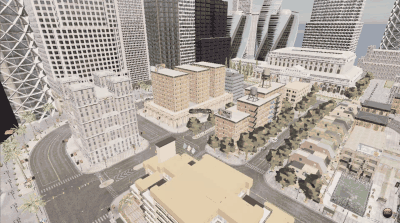

# 无人机键盘控制（uav_keyboard_control）

任务①「无人机仿真 + 键盘控制」的 ROS 侧实现：把终端按键转换为**机体系速度指令**，
发布到 `/uav/cmd_vel`，由 `carlair_ros_bridge` 连仿真器执行。仿真/坐标换算/安全限幅
集中在桥接层，键盘、规划器、神经网络控制器共用同一条指令通道。

## 1. 运行架构

```text
终端按键 ──► uav_keyboard_control ──/uav/cmd_vel──► carlair_ros_bridge ──► CarlaAir/AirSim
            (raw 模式读键)        (geometry_msgs/Twist)   (坐标换算+执行)     (无人机)
```

## 2. 按键映射

机体系（x 前 / y 左 / z 上）：

| 按键 | 动作 | Twist 分量 |
|---|---|---|
| `W` / `S` | 前进 / 后退 | `linear.x = ±horiz_speed` |
| `A` / `D` | 左移 / 右移 | `linear.y = ±horiz_speed` |
| `R` / `F` | 上升 / 下降 | `linear.z = ±vert_speed` |
| `Q` / `E` | 右转 / 左转 | `angular.z = ±yaw_rate` |
| 松开 | 悬停 | 全零 |
| `ESC` | 退出 | — |

`Q`/`E` 的方向遵循 AirSim 机体系 `yaw_rate` 约定（`Q=+yaw_rate` 机头右转）。

## 3. 编译与运行

```shell
# 终端 1：桥接（连仿真 + 执行 + 自动起飞悬停）
source ~/bridge_ws/devel/setup.bash
roslaunch carlair_ros_bridge main.launch

# 终端 2：键盘控制
source ~/bridge_ws/devel/setup.bash
roslaunch uav_keyboard_control main.launch
```

把焦点放在键盘控制终端，按 `W/A/S/D/R/F/Q/E` 操控，松开即悬停，`ESC` 退出。

## 4. 实现要点

### 4.1 终端 raw 模式

Linux 终端默认行缓冲（要按回车），用 `termios`+`tty` 进入 raw 模式即可单键即时响应：

```python
with RawKeyReader() as reader:        # __enter__ 切 raw，__exit__ 恢复
    key = reader.get_key(timeout=0.03)  # select 非阻塞读一个字符
```

`with` 语句保证 `Ctrl-C` 或异常退出时也能恢复终端设置，不会把用户的终端卡在 raw 模式。

### 4.2 按键 → 速度：纯函数

`key_to_cmd(key, horiz, vert, yaw)` 把按键映射为 `(vx, vy, vz, wz)`，
`step_once` 再打包成 `geometry_msgs/Twist`。两者都不依赖 ROS/终端，
可在无 ROS 的机器上单元测试（`tests/test_keyboard_local.py`，35 项）。

### 4.3 松开即悬停

节点以 30 Hz 持续发布：按键按下发对应速度，松开/未知键发全零。桥接层的
`cmd_vel_sub` 有「超过 `cmd_timeout` 无指令自动悬停」的安全保护，这里再叠加一层
显式零速度，双保险防止无人机失控。

## 5. 与视口内置 WASD 的关系

CarlaAir 视口**内置**键盘操控（任务①的「仿真」部分），本模块提供 **ROS 侧**键盘控制
（任务①的「键盘控制」部分）。两者可对比验证：视口 WASD 直接驱动仿真器，
本模块走 `键盘 → /uav/cmd_vel → 桥接 → 仿真器` 的完整 ROS 链路，正是后续
规划器、神经网络控制器的通用入口。

## 6. 效果图

键盘控制演示（录屏转 GIF，`W 前进 / A 左移 / D 右移 / R 上升 / Q 右转` 机动，第三人称视角）：



## 7. 参考

* [carlair_ros_bridge 桥接模块](../air/carlair_ros_bridge.md)
* [AirSim 无人机 API 参考](https://openhutb.github.io/doc/python_api/#airsim.client.MultirotorClient)
