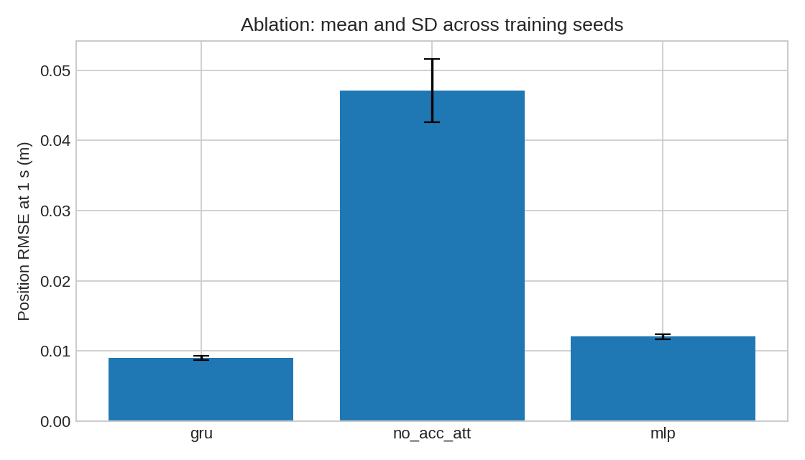

# 基于 GRU 的无人机飞行状态预测与 ROS2 在线误差分析

本项目扩展仓库已有的 [AirSim 无人机 ROS 桥接](drone_ros_teleop.md)：采集模拟飞行的位置、速度、加速度、姿态和角速度，训练 GRU 预测 0.25/0.5/1 秒后的状态，并用 ROS2 发布预测及到期后才计算的误差。主题是飞行状态预测，与避障和 PPO 导航不同。

在 Windows Blocks/AirSim + VMware Ubuntu 20.04.6 / ROS2 Humble 上实测。30 个真实仿真飞行回合、8,430 条状态，按回合划分 20 训练、5 验证、5 测试。部署模型为验证集选出的 `gru_44`。独立测试集 1 秒位置 RMSE 为 **0.009265 米**，恒速和恒加速度基线分别为 0.105059 米、0.042784 米；只适用于本场景和规则小范围轨迹。

复现环境、采集、训练、测试、ROS2 话题和数据定义请参阅 [模块 README](https://github.com/OpenHUTB/ros2/tree/master/src/air/uav_state_prediction)；合并前链接所指的目录应由本次提交创建。本机 Humble/20.04 的 RViz2 缺少 Ogre 1.12，实际可视化采用包内 ROS2 话题绘图窗口，RViz 配置保留在 `rviz/prediction.rviz`。

项目设计、代码和文档使用 OpenAI Codex 辅助；提交者审核后对提交内容负责。
