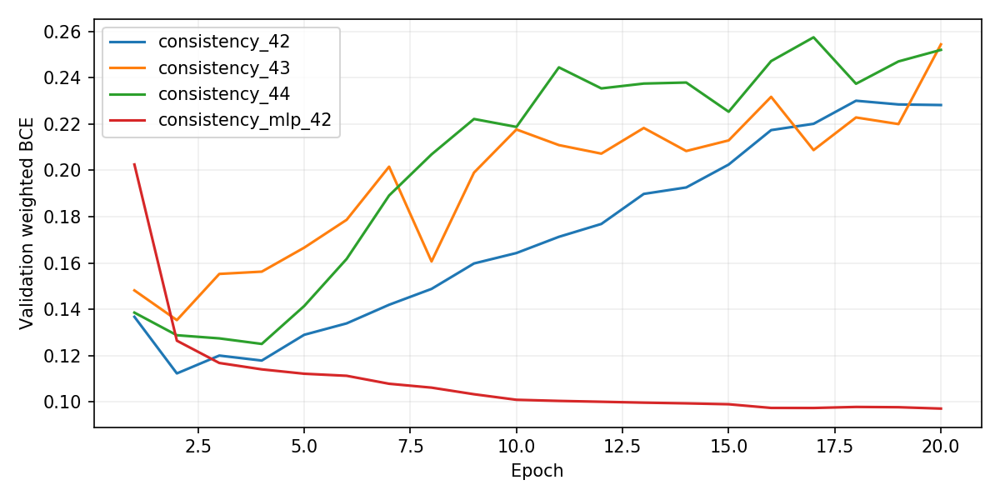
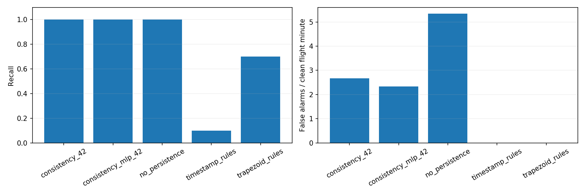
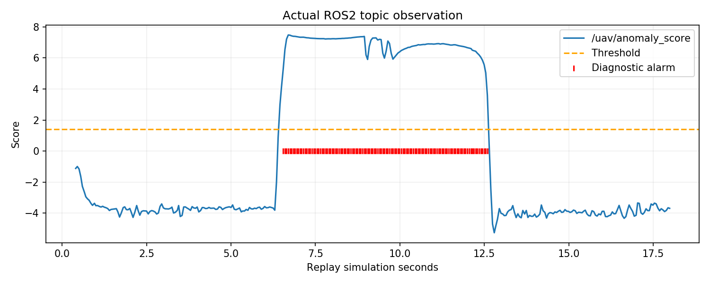

# 无人机遥测异常检测与 ROS2 在线诊断

在现有 [无人机 ROS 桥接](drone_ros_teleop.md) 基础上扩展数据可靠性分析。与避障、PPO 导航、轨迹跟踪及未来状态预测不同，本项目检测位置漂移、速度偏置、时间戳冻结和丢包，输出诊断而非控制指令。


## 完整流程

真实 AirSim 飞行采集 → 按原始片段划分数据 → 观测层异常注入 → 时序一致性 GRU 训练 → 冻结模型和阈值 → 新飞行独立测试 → ROS2 标准诊断及可视化。


源码、完整训练/测试/复现说明位于 [src/air/uav_telemetry_diagnostics](https://github.com/OpenHUTB/ros2/tree/master/src/air/uav_telemetry_diagnostics)。附带约 2.92 MiB 的真实飞行数据压缩包、固定模型和回放样例，模块独立运行，无需安装原预测项目。

## 运行

在源码目录中加载已安装的 ROS2 和 Python 环境：

```bash
source /opt/ros/humble/setup.bash
source ~/uav_prediction_env/bin/activate
python main.py build
bash main.sh demo
```

另一个加载相同环境的终端执行 `python main.py dashboard`。标准启动文件为 `main.launch.py`，使用显式模型/CSV 路径；训练、数据准备和独立测试分别使用 `main.py train`、`main.py prepare`、`main.py evaluate`。

实测环境为 Windows Blocks/AirSim 1.8.1 + VMware Ubuntu 20.04.6 的既有 ROS2 Humble/Python 3.8/PyTorch 2.4.1 CPU 环境。该 Ubuntu/Humble 组合不是标准发行组合，不宣称已验证其他机器。

## 独立测试与局限

原始 30 段飞行用于旧项目；新增 10 段诊断飞行暴露旧模型误报问题，随后按 6/4 划入新版训练/验证；新版冻结后再采集 10 段最终测试飞行。保留初版失败结果与模型冻结协议。

最终 10 段飞行衍生出三轴、多强度的 200 个异常事件，并有 10 个唯一正常场景。三种 GRU 种子均检出全部事件；部署种子正常误报为 **2.669 次/分钟**，总体事件 Precision **0.617**、F1 **0.763**。同验证集校准的梯形积分规则检出率为 70%，正常误报为 0；MLP 同样有竞争力。此结果体现敏感度/误报权衡，不证明 GRU 全面优于规则。






## ROS2 验证

标准 `/diagnostics` 发布 DiagnosticArray；`/uav/anomaly_score` 包含分数、阈值、报警原因、数据有效性和预热状态。实际回放接收 361 条状态、评分及诊断；另已验证实时只读桥接、坏 JSON、非有限数值、超时及子进程退出。13 项单元/一致性测试和 colcon 构建通过。



异常来自软件注入，并非真实 GPS/IMU 故障；200 个异常变体不等于 200 次独立飞行。最终正常飞行观察约 3 分钟，误报率估计有限；单场景结果不能外推实机。实时桥接只读测试是在无人机落地状态完成，异常诊断展示使用实际飞行数据回放。仍需另一位同学在另一台机器复测后由维护者决定合并。

使用 OpenAI Codex 辅助代码、实验和文档；图表、截图与指标均来自实际运行，作者对内容负责。
