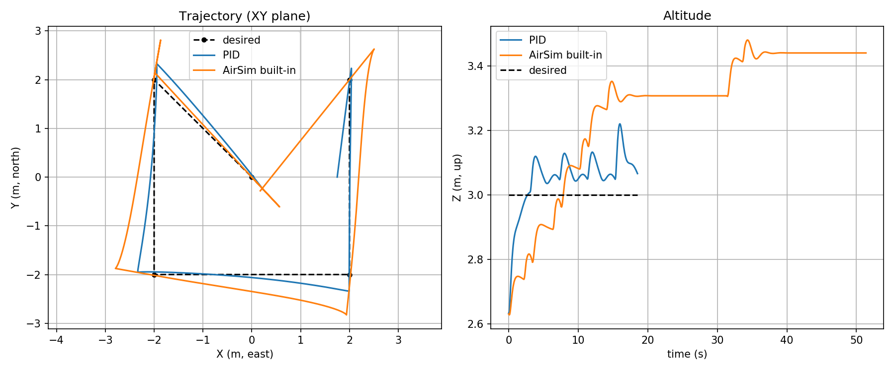
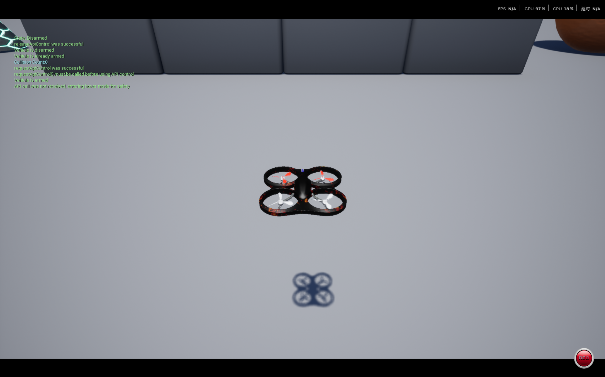
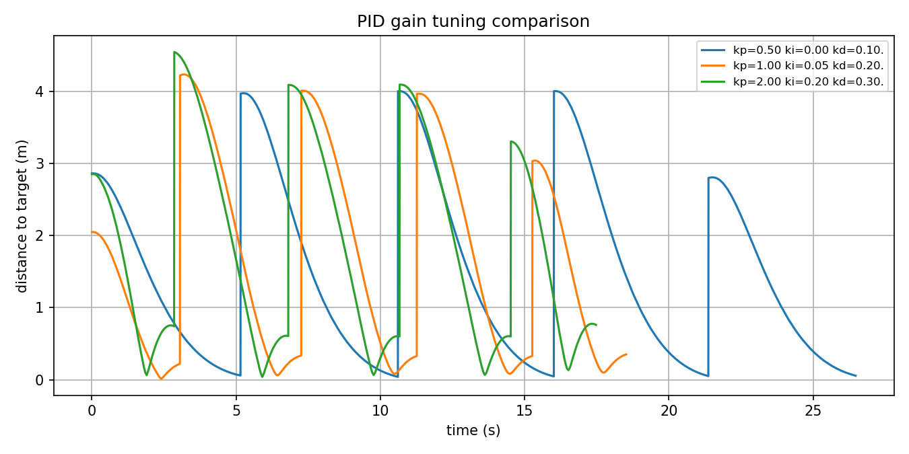
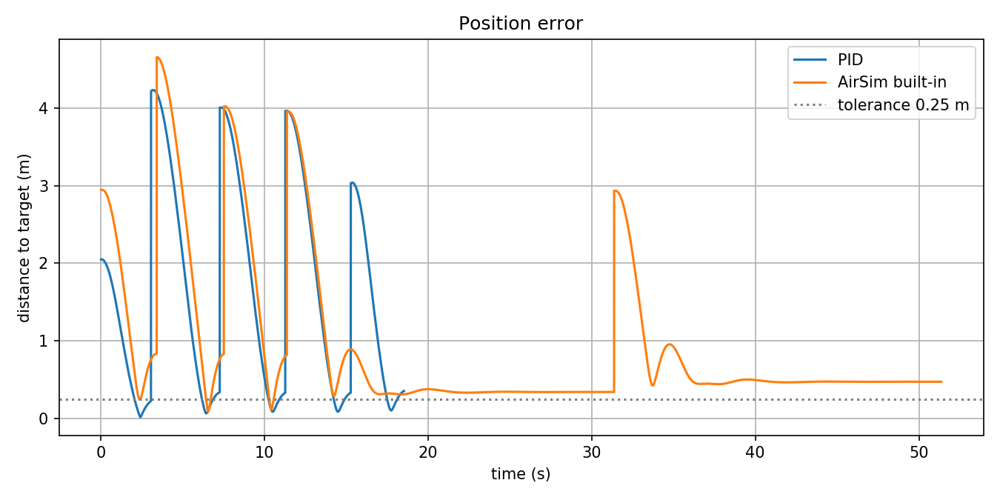

# 无人机航点轨迹跟踪：PID 控制器设计与性能测试

本文介绍空域载具的**航点轨迹跟踪**实验：用自研 PID 控制器驱动 AirSim 中的四旋翼依次飞过给定航点，记录真实轨迹，并与 AirSim 内置位置接口在**同一组航点、同一速度上限、同一到达判据**下对比，给出到达时间、稳态误差、超调量、轨迹均方根误差等量化指标。

实验不需要激光雷达等额外传感器，AirSim 1.8.1 自带场景（Blocks）即可复现；控制算法运行在客户机的 ROS 节点中，与[建立虚拟机和空域载具之间的连接](./setup_and_connect.md)使用的是同一套连接方式。

## 1. 实验目的

1. 掌握“位置误差 → 速度指令”的 PID 闭环结构，理解 Kp、Ki、Kd 各自的作用；
2. 掌握 AirSim 的 NED 坐标系与 ROS 的 ENU 坐标系之间的换算，避免坐标错位导致“飞机往反方向飞”；
3. 学会用**量化指标**评价控制效果，而不是凭观感判断；
4. 通过参数整定实验体会**快速性与平稳性之间的取舍**；
5. 与 AirSim 内置位置接口对比，理解“通用控制器”与“针对任务整定的控制器”的差异。

## 2. 实验环境

| 项目 | 配置 |
| --- | --- |
| 模拟器（宿主机） | AirSim 1.8.1，Blocks 场景（`Blocks.exe`），RPC 服务监听 41451 |
| 控制系统（客户机） | Ubuntu 20.04 + ROS Noetic + `airsim` Python 客户端 |
| 载具 | `Drone1`，`VehicleType: SimpleFlight` |
| 网络 | 宿主机 VMnet8（本实验实测为 `192.168.237.1`），客户机用 `ip a` 查看自己的地址 |

分工与仓库其他 air 实验一致：**模拟器跑在宿主机（需要显卡），ROS 节点跑在客户机**，两者通过 RPC 相连。

## 3. 坐标系与接口约定

AirSim 内部使用 NED（北-东-地），ROS 使用 ENU（东-北-天），两者换算关系为：

```
ENU = (NED.y, NED.x, -NED.z)
```

该变换的逆变换形式相同，因此代码中只用两个函数就能完成全部换算：

```python
def ned_to_enu(vec):
    return (vec.y_val, vec.x_val, -vec.z_val)
def enu_to_ned(x, y, z):
    return airsim.Vector3r(y, x, -z)
```

速度指令使用 `moveByVelocityAsync(vx, vy, vz, ...)`，三个分量的含义是：

| 参数 | 坐标系 | 说明 |
| --- | --- | --- |
| `vx` | 世界系 NED | 向北为正 |
| `vy` | 世界系 NED | 向东为正 |
| `vz` | 世界系 NED | 向下为正（向上飞要取负值） |

> **最容易踩的坑**：`moveByVelocityAsync` 的速度是**世界系**下的（机体系对应的是 `moveByVelocityBodyFrameAsync`）。本实验把偏航角固定为 0（`YawMode(False, 0)`），使“北/东”始终与场景坐标轴一致，速度指令不会因为机头朝向变化而改变含义。

## 4. 控制原理：位置误差到速度指令

控制器是**位置外环 + 速度内环**：外环用 PID 把三维位置误差换算成期望速度，内环由 AirSim 的飞控跟踪该速度指令。

```
v = Kp · e + Ki · ∫e dt + Kd · de/dt
```

其中 `e = 目标位置 − 当前位置`（ENU 坐标），`v` 是期望速度（再换算为 NED 下发给模拟器）。三项的作用：

| 项 | 作用 | 参数过大 | 参数过小 |
| --- | --- | --- | --- |
| 比例 `Kp` | 误差越大、速度越快 | 超调大、来回振荡 | 响应慢、稳态误差大 |
| 积分 `Ki` | 消除恒定偏差（如高度偏移） | 振荡、超调变大 | 稳态偏差消不掉 |
| 微分 `Kd` | 抑制变化趋势、起阻尼作用 | 对噪声敏感、抖动 | 制动不足、超调大 |

工程实现上做了两处**限幅**，它们是让飞行稳定的关键：

```python
class PID(object):
    def update(self, error, dt):
        self.integral += error * dt
        self.integral = max(-self.integral_limit, min(self.integral_limit, self.integral))
        if self.last_error is None:
            derivative = 0.0
        else:
            derivative = (error - self.last_error) / dt
        self.last_error = error
        output = self.kp * error + self.ki * self.integral + self.kd * derivative
        return max(-self.output_limit, min(self.output_limit, output))
```

- **积分限幅**（`integral_limit`）：防止长时间偏差累积成积分饱和；
- **输出限幅**（对应 `max_speed`、`max_vertical_speed`）：限制速度指令大小，避免高速冲刺。

## 5. 程序结构

| 文件 | 作用 |
| --- | --- |
| `scripts/pid_tracker.py` | 主节点：起飞、按航点循环执行 PID 跟踪、记录日志、输出指标 |
| `scripts/compare_builtin.py` | 对照组：改用 AirSim 内置位置接口 `moveToPositionAsync` 飞同样的航点 |
| `scripts/plot_tracking.py` | 读取日志 CSV，绘制轨迹对比图、误差曲线、指标柱状图与增益对比图 |
| `config/params.yaml` | 连接参数、飞行参数、PID 增益、三套航点序列 |
| `launch/main.launch` | 一键启动入口，支持命令行覆盖任务名与 PID 增益 |

## 6. 参数说明

| 参数 | 默认值 | 说明 |
| --- | --- | --- |
| `airsim/ip` | `192.168.237.1` | 宿主机 VMnet8 地址，每台机器不同 |
| `flight/takeoff_altitude` | `3.0` | 起飞后稳定悬停的高度（米） |
| `flight/waypoint_tolerance` | `0.25` | 判定“到达航点”的球半径（米） |
| `flight/control_rate` | `20.0` | PID 控制与采样频率（Hz） |
| `flight/max_speed` | `2.0` | 水平速度上限（米/秒） |
| `flight/max_vertical_speed` | `1.0` | 垂直速度上限（米/秒） |
| `flight/waypoint_timeout` | `20.0` | 单个航点的超时时间（秒） |
| `flight/settle_time` | `1.0` | 到达后继续悬停的时间，用于统计稳态误差（秒） |
| `pid/kp`、`pid/ki`、`pid/kd` | `1.0`、`0.05`、`0.2` | PID 增益（命令行可覆盖） |
| `pid/integral_limit` | `1.0` | 积分限幅 |

## 7. 运行方法

编译并载入工作空间：

```bash
cd ~/catkin_ws
catkin_make
source devel/setup.bash
```

**准备**：宿主机先启动 Blocks 场景，确认窗口里是四旋翼、左上角显示 `Loaded settings from ...`。

三种任务（`roslaunch` 会自动启动 ROS Master，无需单独运行 `roscore`）：

```bash
roslaunch uav_waypoint_tracking main.launch mission:=hover_step
```

```bash
roslaunch uav_waypoint_tracking main.launch mission:=rectangle
```

```bash
roslaunch uav_waypoint_tracking main.launch mission:=spiral
```

参数整定（命令行覆盖增益，日志文件名会自动带上增益，便于对比）：

```bash
roslaunch uav_waypoint_tracking main.launch mission:=rectangle kp:=0.5 ki:=0.0 kd:=0.1
```

对照组（AirSim 内置位置接口，注意要关掉 PID 节点）：

```bash
roslaunch uav_waypoint_tracking main.launch mission:=rectangle run_pid:=false run_builtin:=true
```

出图（读取 `~/uav_waypoint_tracking_logs` 下的日志）：

```bash
rosrun uav_waypoint_tracking plot_tracking.py --mission rectangle --out ~/uav_waypoint_tracking_logs/figs
```

## 8. 运行效果

日志默认写在 `~/uav_waypoint_tracking_logs/`，每一行是一次采样：

```
t, wp, x_ref, y_ref, z_ref, x, y, z, ex, ey, ez, dist, phase
```

指标定义如下，便于复现与对比：

| 指标 | 定义 |
| --- | --- |
| 到达时间 | 从开始飞往该航点起，到三维距离首次小于 0.25 米所经历的时间 |
| 稳态误差 | 判定到达后，继续悬停 1 秒内位置误差的平均值 |
| 超调量 | 沿“起点 → 目标”方向的位移最大超出量占该段总距离的百分比 |
| 轨迹 RMS 误差 | 实际轨迹到期望折线路径的均方根距离，另给出水平与高度分量 |

**单点阶跃（`hover_step`，默认增益）**：

```
航点   到达时间(s)   稳态误差(m)   超调(%)
   1         1.95          0.110      10.7
轨迹 RMS 误差: 总 0.169 m | 水平 0.053 m | 高度 0.161 m
```

**矩形任务（`rectangle`，默认增益 kp=1.0、ki=0.05、kd=0.2）**：

| 航点 | 目标位置 (x, y, z) | 到达时间 (s) | 稳态误差 (m) | 超调 (%) |
| --- | --- | --- | --- | --- |
| 1 | (2.00, 2.00, 3.00) | 2.05 | 0.127 | 10.7 |
| 2 | (2.00, -2.00, 3.00) | 3.15 | 0.205 | 7.9 |
| 3 | (-2.00, -2.00, 3.00) | 3.00 | 0.204 | 8.1 |
| 4 | (-2.00, 2.00, 3.00) | 3.00 | 0.206 | 8.2 |
| 5 | (0.00, 0.00, 3.00) | 2.25 | 0.224 | 11.4 |

轨迹 RMS 误差：总 0.210 m（水平 0.183 m，高度 0.102 m）。

**螺旋任务（`spiral`，默认增益）**：

| 航点 | 到达时间 (s) | 稳态误差 (m) | 超调 (%) |
| --- | --- | --- | --- |
| 1 | 1.70 | 0.100 | 7.2 |
| 2 | 1.90 | 0.099 | 9.4 |
| 3 | 1.90 | 0.107 | 9.9 |
| 4 | 2.00 | 0.124 | 11.7 |
| 5 | 2.05 | 0.136 | 11.7 |
| 6 | 2.15 | 0.136 | 10.7 |
| 7 | 4.30 | 0.159 | 2.8 |

轨迹 RMS 误差：总 0.206 m（水平 0.161 m，高度 0.128 m）。第 7 个航点是从 (1.25, -2.18, 5.50) 返回原点的长距离下降段，用时最长但超调最小——距离越远，减速时间越充足。

轨迹对比与实际飞行画面：





## 9. 参数整定对比

在矩形任务上更换三组增益，其余条件完全不变：

| 增益组合 | 平均到达时间 (s) | 平均稳态误差 (m) | 平均超调 (%) | 轨迹 RMS 误差 (m) |
| --- | --- | --- | --- | --- |
| 弱：kp=0.5, ki=0, kd=0.1 | 4.26 | 0.125 | 0.0 | 0.095 |
| 默认：kp=1.0, ki=0.05, kd=0.2 | 2.69 | 0.193 | 9.3 | 0.210 |
| 强：kp=2.0, ki=0.2, kd=0.3 | 2.46 | 0.456 | 18.1 | 0.363 |



结论：

1. **弱增益**：飞得最慢（平均 4.26 秒），但**超调为 0**、轨迹最贴合期望路径（RMS 仅 0.095 m，水平方向 0.012 m），属于“稳但不快”；
2. **强增益**：飞得最快（2.46 秒），但**超调达到 18%**，稳定段的平均误差反而最大（0.456 m）——飞机冲过目标后需要反复修正；
3. **默认增益**：居中，是“够用但不极致”的折中；
4. 这组数据直观展示了控制工程中的经典取舍：**提高响应速度通常以牺牲平稳性与精度为代价**。实际使用中应按任务选择，例如“航拍取景”可偏向平稳，“快速巡检”可偏向快速。

## 10. 与 AirSim 内置位置接口对比

`compare_builtin.py` 使用 AirSim 内置的 `moveToPositionAsync` 飞同样的航点。两者的**速度上限（2 m/s）、到达判据（0.25 m）、控制与采样频率完全一致**，数据可直接比较：

| 指标 | 自研 PID（默认增益） | AirSim 内置位置接口 |
| --- | --- | --- |
| 按时收敛的航点 | 5 / 5 | 3 / 5 |
| 平均到达时间 (s) | 2.69 | 2.73（仅统计收敛的 3 个航点） |
| 平均稳态误差 (m) | 0.193 | 0.555 |
| 平均超调 (%) | 9.3 | 22.2 |
| 轨迹 RMS 误差 (m) | 0.210 | 0.475 |
| 高度方向 RMS (m) | 0.102 | 0.340 |




从高度子图可以看到关键差异：**内置接口稳定后停在约 3.45 米，与 3.00 米的目标存在约 0.45 米的恒定偏差**。由于到达判据是三维距离小于 0.25 米，仅高度这一项偏差就使第 4、5 个航点在 20 秒超时时间内无法进入容差范围；而自研 PID 含积分项，能把恒定偏差压到 0.1 米以内。

两点说明：

1. 内置接口是**面向通用场景的固定增益控制器**，本实验没有对它做任何调参；自研 PID 则是针对本任务整定过的，这是结果差异的主要原因；
2. 第 4、5 个航点的“超时”记为 `nan`（未收敛），而不是取一个偏小的值——这是有意为之，避免用平均值掩盖未完成的情况。

## 11. 常见问题

| 现象 | 原因与处理 |
| --- | --- |
| `confirmConnection` 超时或 `Connected!` 不出现 | 宿主机 Blocks 未启动、防火墙未放行 41451，或 `params.yaml` 里的 IP 不是宿主机 VMnet8 地址 |
| 程序停在“已连接”之后、飞机不动 | 模拟器被暂停：在 Blocks 窗口按一下 `P` 键恢复（窗口左上角 FPS 数字应持续跳动） |
| 航点频繁超时 | 目标太远或增益过小；可调大 `max_speed`、放宽 `waypoint_tolerance`，或增大 `kp` |
| 到达目标后仍来回摆动 | 增益偏大（参考第 9 节强增益组）；减小 `kp` 或增大 `kd` |
| 高度始终差零点几米 | 尝试增大 `ki` 并适当提高 `integral_limit`，用积分消除恒定偏差 |
| 场景里出现汽车而不是四旋翼 | `settings.json` 中 `SimMode` 不是 `Multirotor`，或 `Vehicles` 里没有 `Drone1` |

## 12. 参考

- AirSim 官方文档：<https://microsoft.github.io/AirSim/>
- AirSim 多旋翼 API 说明：<https://microsoft.github.io/AirSim/apis/>
- 本仓库相关文档：[建立虚拟机和空域载具之间的连接](./setup_and_connect.md)、[基于 ROS 消息解耦的无人机键盘遥控](./drone_ros_teleop.md)
