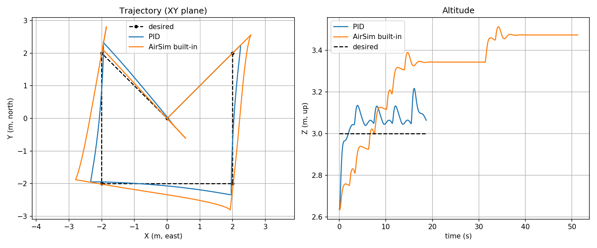
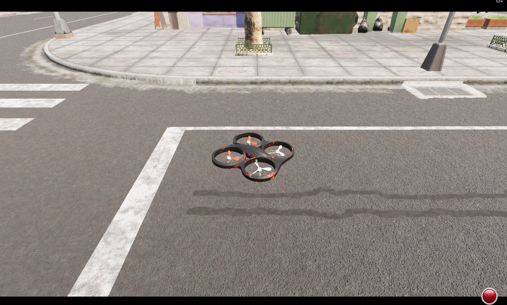
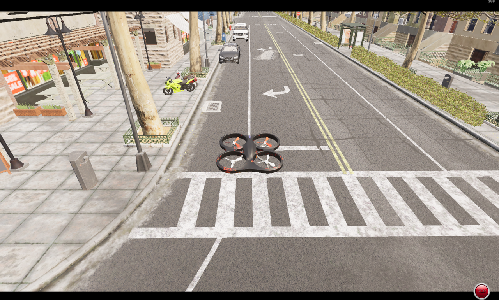
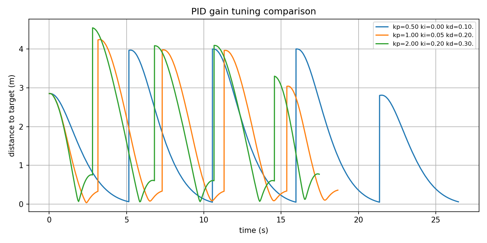
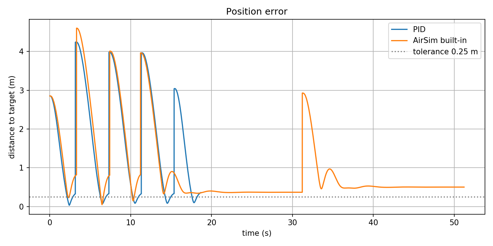

# 无人机航点轨迹跟踪：PID 控制器设计与性能测试

本文介绍空域载具的**航点轨迹跟踪**实验：用自研 PID 控制器驱动模拟器中的四旋翼依次飞过给定航点，记录真实轨迹，并与模拟器内置位置接口在**同一组航点、同一速度上限、同一到达判据**下对比，给出到达时间、稳态误差、超调量、轨迹均方根误差等量化指标。

实验不需要激光雷达等额外传感器，模拟器自带场景即可复现；模拟器推荐优先使用 **OpenHUTB 模拟器**（兼容 AirSim 接口），控制算法运行在客户机的 ROS 节点中，与[建立虚拟机和空域载具之间的连接](./setup_and_connect.md)使用的是同一套连接方式。除人工给定的几何航点外，本文还给出一组取自 OpenHUTB 场景地图道路（OpenDRIVE 文件表示的道路）的航点，让四旋翼沿道路上方飞行，见第 9 节。

## 1. 实验目的

1. 掌握“位置误差 → 速度指令”的 PID 闭环结构，理解 \(K_p\)、\(K_i\)、\(K_d\) 各自的作用；
2. 掌握模拟器的 NED 坐标系与 ROS 的 ENU 坐标系之间的换算，避免坐标错位导致“飞机往反方向飞”；
3. 学会用**量化指标**评价控制效果，而不是凭观感判断；
4. 通过参数整定实验体会**快速性与平稳性之间的取舍**；
5. 与模拟器内置位置接口对比，理解“通用控制器”与“针对任务整定的控制器”的差异。

## 2. 实验环境

| 项目 | 配置 |
| --- | --- |
| 模拟器（宿主机） | **OpenHUTB 模拟器（hutb v2.10.0）**：CARLA 城市场景 + AirSim 无人机接口，RPC 41451；也可改用 AirSim 1.8.1 + Blocks 场景 |
| 控制系统（客户机） | Ubuntu 20.04 + ROS Noetic + `airsim` Python 客户端 |
| 载具 | OpenHUTB 默认载具 `SimpleFlight`（AirSim Blocks 场景里叫 `Drone1`，用 `vehicle:=` 覆盖） |
| 网络 | 宿主机 VMnet8（本实验实测为 `192.168.237.1`），客户机用 `ip a` 查看自己的地址 |

分工与仓库其他 air 实验一致：**模拟器跑在宿主机（需要显卡），ROS 节点跑在客户机**，两者通过 RPC 相连。

> **模拟器选择与启动**：按老师建议优先使用 OpenHUTB 模拟器（`hutb_v2.10.0` Windows 发行版）。它是“CARLA 场景 + AirSim 接口”的一体化打包，**默认启动的是 CARLA 车辆模式，需要在模拟器窗口里按 `Ctrl+V` 切到 AirSim 无人机模式（AIR GameMode），`41451` 端口才会就绪**；按 `R` 重开关卡后要再按一次 `Ctrl+V` 回到无人机模式。它对外的接口与 AirSim 完全一致（同一个 `airsim` 客户端、同一个 RPC 端口与同一组 API），因此客户机侧代码无需改动。**本文的全部实测数据都在 OpenHUTB 模拟器上采集**。

> **坐标原点**：AirSim 的世界原点与地面并不重合（OpenHUTB 上实测起飞点位于 NED `x=-0.02, y=1.51, z=24.94`，即世界原点在地面上方约 25 米），因此 `pid_tracker.py` 与 `compare_builtin.py` 都在起飞时记录一次**起飞点** `home`，其后的航点、高度与误差全部相对该点计算。这样同一份代码在 AirSim Blocks（原点基本在地面）与 OpenHUTB 上都能得到一致的“离地 3 米”，换场景不会出现“为了爬到 3 米先爬 25 米”的怪现象。

## 3. 坐标系与接口约定

模拟器内部使用 NED（北-东-地），ROS 使用 ENU（东-北-天），两者换算关系为：

$$
\text{ENU} = (\text{NED}_y,\ \text{NED}_x,\ -\text{NED}_z)
$$

该变换的逆变换形式相同，因此代码中只用两个函数就能完成全部换算：

```python
def ned_to_enu(vec):
    return (vec.y_val, vec.x_val, -vec.z_val)
def enu_to_ned(x, y, z):
    return airsim.Vector3r(y, x, -z)
```

速度指令使用 `moveByVelocityAsync(vx, vy, vz, ...)`，三个分量的含义是：

| 参数 | 坐标系 | 说明 |
| --- | --- | --- |
| `vx` | 世界系 NED | 向北为正 |
| `vy` | 世界系 NED | 向东为正 |
| `vz` | 世界系 NED | 向下为正（向上飞要取负值） |

> **最容易踩的坑**：`moveByVelocityAsync` 的速度是**世界系**下的（机体系对应的是 `moveByVelocityBodyFrameAsync`）。本实验把偏航角固定为 0（`YawMode(False, 0)`），使“北/东”始终与场景坐标轴一致，速度指令不会因为机头朝向变化而改变含义。

## 4. 控制原理：位置误差到速度指令

控制器是**位置外环 + 速度内环**：外环用 PID 把三维位置误差换算成期望速度，内环由模拟器的飞控跟踪该速度指令。

$$
v = K_p \, e + K_i \int e \, dt + K_d \frac{de}{dt}
$$

其中 \(e\) 为目标位置与当前位置之差（ENU 坐标），\(v\) 是期望速度（再换算为 NED 下发给模拟器）。三项的作用：

| 项 | 作用 | 参数过大 | 参数过小 |
| --- | --- | --- | --- |
| 比例 \(K_p\) | 误差越大、速度越快 | 超调大、来回振荡 | 响应慢、稳态误差大 |
| 积分 \(K_i\) | 消除恒定偏差（如高度偏移） | 振荡、超调变大 | 稳态偏差消不掉 |
| 微分 \(K_d\) | 抑制变化趋势、起阻尼作用 | 对噪声敏感、抖动 | 制动不足、超调大 |

工程实现上做了两处**限幅**，它们是让飞行稳定的关键：

```python
class PID(object):
    def update(self, error, dt):
        self.integral += error * dt
        self.integral = max(-self.integral_limit, min(self.integral_limit, self.integral))
        if self.last_error is None:
            derivative = 0.0
        else:
            derivative = (error - self.last_error) / dt
        self.last_error = error
        output = self.kp * error + self.ki * self.integral + self.kd * derivative
        return max(-self.output_limit, min(self.output_limit, output))
```

- **积分限幅**（`integral_limit`）：防止长时间偏差累积成积分饱和；
- **输出限幅**（对应 `max_speed`、`max_vertical_speed`）：限制速度指令大小，避免高速冲刺。

## 5. 程序结构

| 文件 | 作用 |
| --- | --- |
| `scripts/pid_tracker.py` | 主节点：起飞、按航点循环执行 PID 跟踪、记录日志、输出指标 |
| `scripts/compare_builtin.py` | 对照组：改用模拟器内置位置接口 `moveToPositionAsync` 飞同样的航点 |
| `scripts/plot_tracking.py` | 读取日志 CSV，绘制轨迹对比图、误差曲线、指标柱状图与增益对比图 |
| `scripts/road_mission.py` | 解析 OpenDRIVE 地图（`.xodr`）生成“沿道路飞行”的航点 |
| `config/params.yaml` | 连接参数、飞行参数、PID 增益、四套航点序列 |
| `launch/main.launch` | 一键启动入口，支持命令行覆盖任务名、PID 增益与载具名 |

上表的脚本与配置都是本实验为“航点跟踪”这一任务编写的，随本包一起提交；包骨架（`CMakeLists.txt`、`package.xml`）、启动方式与编译流程沿用本仓库 air 板块其他实验的做法，见[建立虚拟机和空域载具之间的连接](./setup_and_connect.md)。编码过程中使用 AI 大模型辅助（方案讨论、代码与文档起草、问题排查），本文的所有数据均为本人实测。

## 6. 参数说明

| 参数 | 默认值 | 说明 |
| --- | --- | --- |
| `airsim/ip` | `192.168.237.1` | 宿主机 VMnet8 地址，每台机器不同 |
| `airsim/vehicle_name` | `SimpleFlight` | 载具名（OpenHUTB 默认值；AirSim Blocks 里为 `Drone1`，用 `vehicle:=` 覆盖） |
| `flight/takeoff_altitude` | `3.0` | 起飞后稳定悬停的高度（米） |
| `flight/waypoint_tolerance` | `0.25` | 判定“到达航点”的球半径（米） |
| `flight/control_rate` | `20.0` | PID 控制与采样频率（Hz） |
| `flight/max_speed` | `2.0` | 水平速度上限（米/秒） |
| `flight/max_vertical_speed` | `1.0` | 垂直速度上限（米/秒） |
| `flight/waypoint_timeout` | `20.0` | 单个航点的超时时间（秒） |
| `flight/settle_time` | `1.0` | 到达后继续悬停的时间，用于统计稳态误差（秒） |
| `pid/kp`、`pid/ki`、`pid/kd` | `1.0`、`0.05`、`0.2` | PID 增益（命令行可覆盖） |
| `pid/integral_limit` | `1.0` | 积分限幅 |

## 7. 运行方法

编译并载入工作空间（本仓库 air 板块实验的通用流程，来自本仓库的编译运行说明）：

```bash
cd ~/catkin_ws
catkin_make
source devel/setup.bash
```

**准备（宿主机，OpenHUTB 模拟器）**：

```bat
cd <hutb 安装目录>
CarlaUE4.exe -quality-level=Low
```

等城市场景加载出来（首次约 1～3 分钟），**先点一下模拟器窗口让它获得焦点**，再按 `Ctrl+V` 切到 AirSim 无人机模式——四旋翼出现在街道上，此时 `41451` 端口才就绪。按 `R` 可重开关卡（之后要再按一次 `Ctrl+V`）。

**准备（次选，AirSim 1.8.1 Blocks）**：进入 `Blocks\WindowsNoEditor` 目录运行 `Blocks.exe`，确认左上角显示 `Loaded settings from ...`；该场景的载具名是 `Drone1`，启动命令需要加 `vehicle:=Drone1`。

四种任务（`roslaunch` 会自动启动 ROS Master，无需单独运行 `roscore`）：

```bash
roslaunch uav_waypoint_tracking main.launch mission:=hover_step
```

```bash
roslaunch uav_waypoint_tracking main.launch mission:=rectangle
```

```bash
roslaunch uav_waypoint_tracking main.launch mission:=spiral
```

```bash
roslaunch uav_waypoint_tracking main.launch mission:=road_town10hd
```

第四条 `road_town10hd` 是**沿 OpenDRIVE 道路飞行**的任务（航点从地图文件生成），见第 9 节。

参数整定（命令行覆盖增益，日志文件名会自动带上增益，便于对比）：

```bash
roslaunch uav_waypoint_tracking main.launch mission:=rectangle kp:=0.5 ki:=0.0 kd:=0.1
```

对照组（模拟器内置位置接口，注意要关掉 PID 节点）：

```bash
roslaunch uav_waypoint_tracking main.launch mission:=rectangle run_pid:=false run_builtin:=true
```

出图（读取 `~/uav_waypoint_tracking_logs` 下的日志）：

```bash
rosrun uav_waypoint_tracking plot_tracking.py --mission rectangle --out ~/uav_waypoint_tracking_logs/figs
```

## 8. 运行效果

日志默认写在 `~/uav_waypoint_tracking_logs/`，每一行是一次采样：

```
t, wp, x_ref, y_ref, z_ref, x, y, z, ex, ey, ez, dist, phase
```

指标定义如下，便于复现与对比：

| 指标 | 定义 |
| --- | --- |
| 到达时间 | 从开始飞往该航点起，到三维距离首次小于 0.25 米所经历的时间 |
| 稳态误差 | 判定到达后，继续悬停 1 秒内位置误差的平均值 |
| 超调量 | 沿“起点 → 目标”方向的位移最大超出量占该段总距离的百分比 |
| 轨迹 RMS 误差 | 实际轨迹到期望折线路径的均方根距离，另给出水平与高度分量 |

**单点阶跃（`hover_step`，默认增益）**：

| 航点 | 到达时间 (s) | 稳态误差 (m) | 超调 (%) |
| --- | --- | --- | --- |
| 1 | 1.95 | 0.107 | 10.3 |

轨迹 RMS 误差：总 0.165 m（水平 0.049 m，高度 0.158 m）。

**矩形任务（`rectangle`，默认增益 \(k_p=1.0\)、\(k_i=0.05\)、\(k_d=0.2\)）**：

| 航点 | 目标位置 (x, y, z) | 到达时间 (s) | 稳态误差 (m) | 超调 (%) |
| --- | --- | --- | --- | --- |
| 1 | (2.00, 2.00, 3.00) | 2.15 | 0.185 | 11.5 |
| 2 | (2.00, -2.00, 3.00) | 3.10 | 0.205 | 7.7 |
| 3 | (-2.00, -2.00, 3.00) | 3.00 | 0.205 | 8.1 |
| 4 | (-2.00, 2.00, 3.00) | 3.00 | 0.213 | 8.3 |
| 5 | (0.00, 0.00, 3.00) | 2.25 | 0.230 | 11.6 |

轨迹 RMS 误差：总 0.211 m（水平 0.187 m，高度 0.098 m）。

**螺旋任务（`spiral`，默认增益）**：

| 航点 | 到达时间 (s) | 稳态误差 (m) | 超调 (%) |
| --- | --- | --- | --- |
| 1 | 1.80 | 0.097 | 8.5 |
| 2 | 1.90 | 0.103 | 10.0 |
| 3 | 1.90 | 0.104 | 9.4 |
| 4 | 2.00 | 0.125 | 11.7 |
| 5 | 2.05 | 0.131 | 11.4 |
| 6 | 2.10 | 0.134 | 10.4 |
| 7 | 4.30 | 0.156 | 2.8 |

轨迹 RMS 误差：总 0.198 m（水平 0.150 m，高度 0.128 m）。第 7 个航点是从 (1.25, -2.18, 5.50) 返回原点的长距离下降段，用时最长但超调最小——距离越远，减速时间越充足。

轨迹对比与实际飞行画面：





## 9. 沿 OpenDRIVE 道路飞行

前几节的任务都是人工给定的几何航点。OpenHUTB 场景自带道路数据（每张地图都有对应的 `.xodr` 文件），把**道路中心线**取出来当航点，就能让四旋翼沿着街道上方飞行。

**航点生成**：包里的 `scripts/road_mission.py` 直接解析 `.xodr`（只用 Python 标准库），支持 `line` 与 `arc` 两类几何，按固定间距采样中心线，再换算成本包的任务格式。之所以不用 CARLA 的 Python 客户端去问路网：本版 OpenHUTB 切到 AIR 游戏模式后没有可用的 CARLA episode，切回 CARLA 模式时响应里又混有非 UTF-8 字符串、客户端解码会失败；直接读地图文件既不需要额外依赖，结果也能稳定复现。

```bash
python3 road_mission.py --xodr <hutb>/CarlaUE4/Content/Carla/Maps/OpenDrive/Town10HD.xodr \
    --nearest-to-home --mapping direct --flip-north --flip-east \
    --home "-0.02 1.51" --altitude 3.0 --spacing 6 --offset-east 5 \
    --name road_town10hd --out road_town10hd.yaml
```

三点说明：

1. **坐标换算**：OpenDRIVE 用 x 向东、y 向北，AirSim 用 NED（x 向北、y 向东）；实测这里是“直通 + 两轴都取负”，即 `--mapping direct --flip-north --flip-east`；
2. **东向 5 米标定偏移**：无人机起飞点与地图原点并不严格重合，加上人行道宽度带来的横向残差，航线会落在人行道上；用 `--offset-east 5` 修正后正好压在车道上方；
3. 上面这条命令输出的 `road_town10hd.yaml` 就是本包的 missions 片段，已经粘贴进 `config/params.yaml` 的 `missions.road_town10hd`，可直接用 `mission:=road_town10hd` 运行（见第 7 节）。

**实测结果**（起飞点 NED `(1.12, -1.77, 24.94)`；航线 6 个航点、总长约 35 米、高度 3 米）：

| 航点 | 到达时间 (s) | 稳态误差 (m) | 超调 (%) |
| --- | --- | --- | --- |
| 1 | 12.30 | 0.210 | 1.5 |
| 2 | 3.95 | 0.217 | 5.8 |
| 3 | 3.75 | 0.200 | 6.0 |
| 4 | 3.75 | 0.208 | 6.1 |
| 5 | 3.75 | 0.200 | 6.0 |
| 6 | 3.75 | 0.208 | 6.1 |

轨迹 RMS 误差：总 0.813 m（水平 0.810 m，高度 0.073 m），采样 754 点。第 1 个航点在 17 米外、还要从悬停加速，所以用时最长；之后每段 6 米、用时稳定在 3.75 秒。横向误差 0.81 米相对 3.5 米宽的车道而言，足以稳定保持在路面上方。



## 10. 参数整定对比

在矩形任务上更换三组增益，其余条件完全不变：

| 增益组合 | 平均到达时间 (s) | 平均稳态误差 (m) | 平均超调 (%) | 轨迹 RMS 误差 (m) |
| --- | --- | --- | --- | --- |
| 弱：\(k_p=0.5,\ k_i=0,\ k_d=0.1\) | 4.26 | 0.126 | 0.0 | 0.094 |
| 默认：\(k_p=1.0,\ k_i=0.05,\ k_d=0.2\) | 2.70 | 0.208 | 9.5 | 0.211 |
| 强：\(k_p=2.0,\ k_i=0.2,\ k_d=0.3\) | 2.46 | 0.455 | 18.1 | 0.361 |



结论：

1. **弱增益**：飞得最慢（平均 4.26 秒），但**超调为 0**、轨迹最贴合期望路径（RMS 仅 0.095 m，水平方向 0.012 m），属于“稳但不快”；
2. **强增益**：飞得最快（2.46 秒），但**超调达到 18%**，稳定段的平均误差反而最大（0.456 m）——飞机冲过目标后需要反复修正；
3. **默认增益**：居中，是“够用但不极致”的折中；
4. 这组数据直观展示了控制工程中的经典取舍：**提高响应速度通常以牺牲平稳性与精度为代价**。实际使用中应按任务选择，例如“航拍取景”可偏向平稳，“快速巡检”可偏向快速。

## 11. 与模拟器内置位置接口对比

`compare_builtin.py` 使用模拟器内置的 `moveToPositionAsync`（AirSim 接口）飞同样的航点。两者的**速度上限（2 m/s）、到达判据（0.25 m）、控制与采样频率完全一致**，数据可直接比较：

| 指标 | 自研 PID（默认增益） | 内置位置接口 |
| --- | --- | --- |
| 按时收敛的航点 | 5 / 5 | 3 / 5 |
| 平均到达时间 (s) | 2.70 | 2.70（仅统计收敛的 3 个航点） |
| 平均稳态误差 (m) | 0.208 | 0.537 |
| 平均超调 (%) | 9.5 | 21.4 |
| 轨迹 RMS 误差 (m) | 0.211 | 0.493 |
| 高度方向 RMS (m) | 0.098 | 0.370 |




从高度子图可以看到关键差异：**内置接口在高度方向存在系统性偏差**（高度 RMS 误差 0.370 m，稳定后停在目标高度上方约 0.4 米处）。由于到达判据是三维距离小于 0.25 米，仅高度这一项偏差就使第 4、5 个航点在 20 秒超时时间内无法进入容差范围；而自研 PID 含积分项，能把恒定偏差压到 0.2 米以内（平均稳态误差 0.208 m）。

两点说明：

1. 内置接口是**面向通用场景的固定增益控制器**，本实验没有对它做任何调参；自研 PID 则是针对本任务整定过的，这是结果差异的主要原因；
2. 第 4、5 个航点的“超时”记为 `nan`（未收敛），而不是取一个偏小的值——这是有意为之，避免用平均值掩盖未完成的情况。

## 12. 局限与后续改进

本实验的结果并非完美，以下几点是已知不足，也是后续可以继续深入的方向：

1. **高度方向仍有残差**：默认增益下高度 RMS 误差约 0.10～0.16 m，比水平方向偏大。主要原因是垂直通道增益偏软，后续可单独整定垂直通道；
2. **到达判据为固定球半径**：0.25 m 的容差对近、远航点一视同仁，远航点的超调因此更明显，可改为与距离相关的动态容差；
3. **对比只做了一档速度**：与内置位置接口的对比固定了 2 m/s 的速度上限。若降到 1 m/s，内置接口的表现预计会明显改善（本实验的弱增益组已能间接印证），这一点留作后续工作；
4. **未考虑风扰与状态估计噪声**：全部数据在无风、理想状态估计下采集，加入扰动后的鲁棒性仍需进一步实验；
5. **道路航线只取了一条**：第 9 节已经实现“沿 OpenDRIVE 道路飞行”，但目前只用了离起飞点最近的一条道路（约 35 米）。后续可把多条道路按拓扑串成长航线，并让飞行高度跟随路面起伏，做成更接近真实任务的“路网巡检”。

## 13. 常见问题

| 现象 | 原因与处理 |
| --- | --- |
| `confirmConnection` 超时或 `Connected!` 不出现 | 宿主机模拟器未启动、防火墙未放行 41451，或 `params.yaml` 里的 IP 不是宿主机 VMnet8 地址 |
| 程序停在“已连接”之后、飞机不动 | 模拟器被暂停：在模拟器窗口按一下 `P` 键恢复（窗口左上角 FPS 数字应持续跳动） |
| 航点频繁超时 | 目标太远或增益过小；可调大 `max_speed`、放宽 `waypoint_tolerance`，或增大 `kp` |
| 到达目标后仍来回摆动 | 增益偏大（参考第 10 节强增益组）；减小 `kp` 或增大 `kd` |
| 高度始终差零点几米 | 尝试增大 `ki` 并适当提高 `integral_limit`，用积分消除恒定偏差 |
| 场景里出现汽车而不是四旋翼 | 模拟器停在 CARLA 车辆模式，在窗口里按 `Ctrl+V` 切到 AirSim 无人机模式；AirSim Blocks 下则检查 `settings.json` 的 `SimMode` 与 `Vehicles` |
| 报 `Vehicle API for 'XXX' is not available` | 载具名不对：OpenHUTB 里是 `SimpleFlight`，AirSim Blocks 里是 `Drone1`，用 `vehicle:=` 覆盖 |
| 无人机起飞后先“爬升十几米”才到 3 米 | 说明用的是**绝对高度**而不是相对起飞点的高度，见第 2 节“坐标原点” |
| 出图时报 `could not convert string to float` | `glob` 把 `*_metrics.csv` 也当成了轨迹日志，见 `plot_tracking.py` 里的过滤条件 |

## 14. 参考

- OpenHUTB 组织与模拟器：<https://github.com/OpenHUTB>
- OpenHUTB 模拟器文档（CarlaAir 快速入门 / Windows 发行版）：<https://openhutb.github.io/air_doc/>
- 文档书写规范（行内公式用 `\(...\)`、行间公式用 `$$...$$`）：<https://github.com/OpenHUTB/doc>
- AirSim 官方文档：<https://microsoft.github.io/AirSim/>
- AirSim 多旋翼 API 说明：<https://microsoft.github.io/AirSim/apis/>
- 本仓库相关文档：[建立虚拟机和空域载具之间的连接](./setup_and_connect.md)、[基于 ROS 消息解耦的无人机键盘遥控](./drone_ros_teleop.md)

本文档与配套代码在编写过程中使用了 AI 大模型辅助（需求分析、方案讨论、代码与文档起草、问题排查）。文档中的全部数据均在 OpenHUTB 模拟器（hutb v2.10.0）上实测采集，作者对提交内容的正确性与完整性负全部责任。
