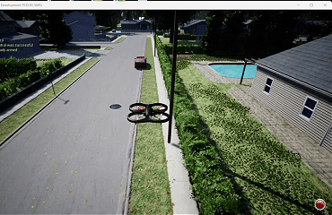

# AirSim SimpleFlight 键盘遥控

本模块通过 VMware Ubuntu 中的 ROS Noetic，控制 Windows AirSim 场景中的 `SimpleFlight` 四旋翼无人机。

## 环境

| 项目 | 要求 |
| --- | --- |
| Windows | Windows 11，AirSim 预编译场景 |
| Ubuntu | Ubuntu 20.04，ROS Noetic |
| VMware | Ubuntu 虚拟机，NAT 网络，磁盘 60GB，内存 4GB |
| 网络 | Ubuntu 使用 Windows 的 VMnet8 IPv4 地址 |
| 无人机 | `SimpleFlight` |

## 文件

```text
src/airsim_simpleflight_keyboard_teleop/
├── main.py
├── main.sh
├── main.bat
├── airsim_settings.json
└── launch/
    └── teleop.launch
```

## 安装

### Windows

1. 修改 `main.bat` 中的 `AIR_SIM_EXE`。
2. 运行 `main.bat`。

```powershell
cmd /c .\main.bat
```

脚本会写入 `Documents\AirSim\settings.json` 并启动 AirSim。

### Ubuntu

1. 安装 ROS Noetic。
2. 从本仓库的 `Releases` 页面下载 `AirSim_ros_offline_src.zip`。
3. 把压缩包放到 Ubuntu 的 `~/Downloads`，然后解压：

```bash
cd ~
unzip -q ~/Downloads/AirSim_ros_offline_src.zip
```

4. 安装依赖。

```bash
sudo apt update
sudo apt install -y \
  python3-pip python3-catkin-tools \
  ros-noetic-mavros-msgs \
  ros-noetic-tf2-sensor-msgs \
  ros-noetic-tf2-geometry-msgs \
  ros-noetic-cv-bridge \
  ros-noetic-image-transport \
  ros-noetic-geographic-msgs \
  libyaml-cpp-dev gcc g++ cmake git rsync wget unzip
```

5. 修复离线源码权限并编译。

```bash
cd ~/AirSim
sudo chown -R "$USER":"$USER" AirLib/deps/eigen3 external/rpclib
chmod -R u+rwX,go+rX AirLib/deps/eigen3 external/rpclib

cd ~/AirSim/ros
source /opt/ros/noetic/setup.bash
catkin_make -DCMAKE_BUILD_TYPE=Release
```

## 运行

Windows 保持 AirSim 运行。

Ubuntu 终端执行：

```bash
cd <repo>/src/airsim_simpleflight_keyboard_teleop
chmod +x main.sh
./main.sh <VMNET8_IP>
```

`main.sh` 会：

1. source AirSim ROS 工作区。
2. 清理旧 ROS 进程。
3. 启动 `teleop.launch`。
4. 等待 `airsim_node` 出现。
5. 运行 `main.py` 键盘控制。

运行效果：



## 键盘

| 键 | 功能 |
| --- | --- |
| `T` | 起飞 |
| `L` | 降落 |
| `W/S` | 前进/后退 |
| `A/D` | 左移/右移 |
| `Q/E` | 左转/右转 |
| `R/F` | 上升/下降 |
| `Space` | 慢速模式 |
| `X` | 急停并悬停 |
| `Ctrl+C` | 退出 |

## 常见错误

| 错误 | 解决 |
| --- | --- |
| Ubuntu 无法解析域名 | `sudo resolvectl dns ens33 223.5.5.5 114.114.114.114` |
| GitHub/GitLab 下载失败 | 使用离线 AirSim 源码包 |
| Eigen 文件 `Permission denied` | 对 `eigen3` 和 `rpclib` 执行 `chown`、`chmod` |
| Windows 的 `ping` 不通 | 检查 TCP 41451，不要只看 ICMP |
| 端口 41451 不通 | 检查防火墙、AirSim 是否启动 |
| 没有 `SimpleFlight` 话题 | 检查 `airsim_node` 是否输出 `DRONE mode` |
| 键盘节点重复 | `pkill -f main.py` 后重新运行 |
| 虚拟机换网后无法上网 | 重启 VMware NAT Service，并重新 `dhclient` |

## 验收

```text
Windows 41451 LISTENING
Ubuntu 端口连接成功
airsim_node 启动成功
main.py 显示 Vehicle: SimpleFlight
T 起飞
W/A/S/D/Q/E/R/F 控制移动
X 悬停
L 降落
```

---

本模块文档和代码使用 AI 辅助生成，作者已核对命令、接口和运行结果，并对提交内容负责。
