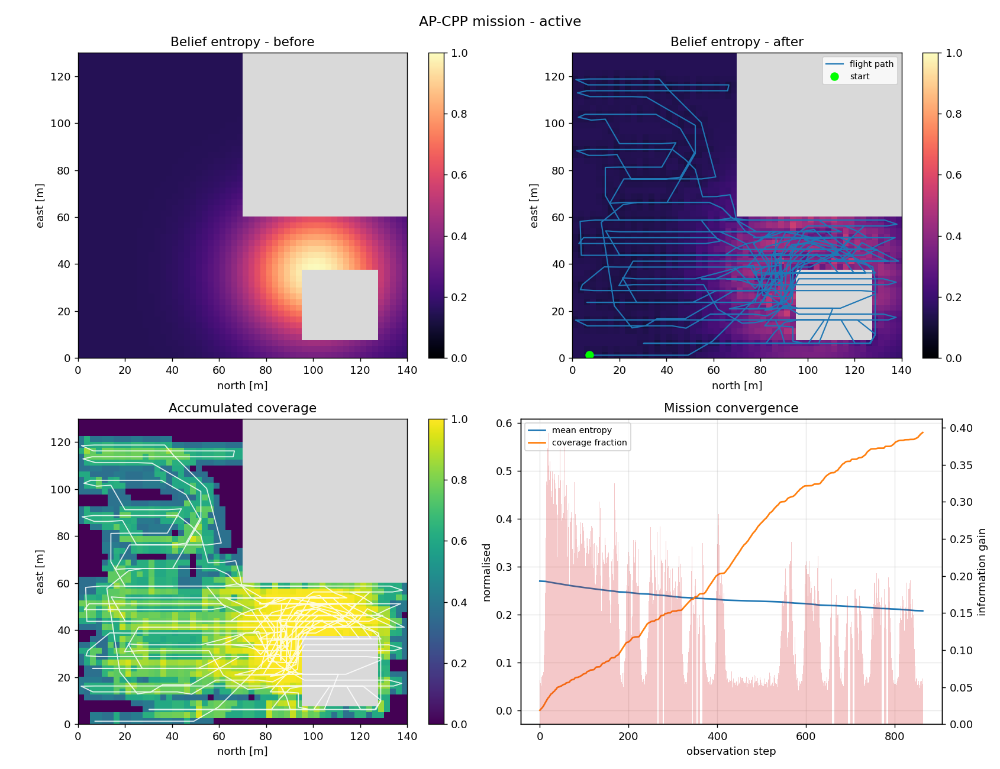

title: AP-CPP 主动感知覆盖路径规划

# AP-CPP：主动感知覆盖路径规划

本模块把 OverFOMO 的自适应覆盖路径规划（Adaptive Coverage Path Planning）扩展为**主动感知**规划：不只是决定**飞多快**，还要决定**该去哪里看**。

- [1. 要解决的问题](#problem)
- [2. 方法](#method)
- [3. 运行效果](#results)
- [4. 快速开始](#quickstart)
- [5. 复现说明与实测数据](#metrics)
- [6. 在 RViz 中运行](#rviz)
- [7. 关于大体积数据文件](#large-files)
- [8. 参考文献](#references)

> 完整工程源码在 [`src/air/ap_cpp_overfomo/`](https://github.com/OpenHUTB/ros2/tree/master/src/air/ap_cpp_overfomo)，
> 包含核心规划源码、ROS 包 `ap_cpp_ros`、演示脚本、测试与实验数据；
> 完整说明见该目录下的 [README](https://github.com/OpenHUTB/ros2/blob/master/src/air/ap_cpp_overfomo/README.md)。
> 本页是面向课程文档的导读，细节以该 README 为准。

---

## 1. 要解决的问题 <span id="problem"></span>

原论文的方法预先算好一条往复式（boustrophedon）航带，开环飞行，并根据图像语义调节地速：识别得越确定就越快，冠层越密或越模糊就越慢。

它回答的是「**飞过这条航带时该飞多快**」，但没有回答「**这条航带是否值得消耗电量**」。一块田里各个位置的信息价值并不相同——上一季的产量图、粗分辨率过飞得到的 NDVI 异常、农户报告的病害地块、上一次飞行留下的空洞，都会把不确定性集中到少数几个区域。一个不能偏离航线的机器人，会把续航花在已经看明白的地方，最后带着「唯一重要那块区域仍然没搞清」的地图返航。

**AP-CPP 补上的就是这一个自由度。**

## 2. 方法 <span id="method"></span>

规划器维护一个对作业区域的显式**信念**（占据栅格 + 逐格信息熵），并用**滚动时域（receding horizon）**对剩余航线反复重规划。每个候选动作的评分同时权衡**航程代价**和**期望信息增益**。

由此得到的规划器是**构造性安全**的：当农田中没有任何已知信息时，一个横向偏离惩罚项会把它牢牢压回原有的往复式航带，与已发表的结果逐点一致；只有当某处存在显著的信息热点时，它才会主动绕行。

| 组成 | 作用 |
|---|---|
| `ap_cpp/grid_model.py` | 占据 + 熵信念栅格 |
| `ap_cpp/sensor.py` | 传感器视场与观测模型 |
| `ap_cpp/utility.py` | 航程代价 / 信息增益效用函数 |
| `ap_cpp/planner.py` | 滚动时域规划器（核心算法） |
| `ap_cpp/control.py` | 地速控制器 |
| `ap_cpp/mission.py` | 任务循环与终止条件 |
| `ap_cpp/geo_bridge.py` | 经纬度 ↔ 局部 NED 坐标转换 |
| `ap_cpp/airsim_driver.py` | AirSim 实飞驱动（可选） |

## 3. 运行效果 <span id="results"></span>

### 3.1 RViz 中的实时规划

规划器可以脱离 AirSim / Unreal 独立运行，直接发布 `nav_msgs/Path` 与 `visualization_msgs/MarkerArray` 供 RViz 显示。下图为 ROS 环境中的实际运行截图（`roslaunch ap_cpp_ros rviz_demo.launch`）：


覆盖航迹绘制为 `nav_msgs/Path`，信念栅格与信息热点绘制为 `visualization_msgs/MarkerArray`；地块几何取自本仓库的 `CPP/002` 定义。运行步骤见[第 6 节](#rviz)。

### 3.2 消融对比

在相同地块与相同先验下，对比「主动感知」与「仅按参考航带飞」两种策略。下图左侧主动感知版本会主动离开航带以消除异常热点，随后重新并回参考航带；右侧基线则始终被约束在已发表的往复式航带上，从不偏离。

<table>
  <tr>
    <th align="center">AP-CPP（主动感知）</th>
    <th align="center">Reference-only 基线</th>
  </tr>
  <tr>
    <td align="center"></td>
    <td align="center"></td>
  </tr>
  <tr>
    <td align="center"><em>主动离开航带以消除异常热点，<br />随后重新并回参考航带。</em></td>
    <td align="center"><em>被约束在已发表的往复式航带上，<br />从不偏离。</em></td>
  </tr>
</table>

消融曲线（信息增益 / 覆盖率随步数变化）：


## 4. 快速开始 <span id="quickstart"></span>

### 4.1 环境要求

规划器与演示脚本只依赖 NumPy 与 Matplotlib，**不需要 AirSim、不需要 TensorFlow、不需要 GDAL**。

本节所有数值与图片在以下环境中实测产生：

| 项目 | 版本 |
|---|---|
| 操作系统 | Windows 11 |
| Python | 3.12.7（Anaconda base） |
| NumPy | 1.26.4 |
| Matplotlib | 3.9.2 |

代码不依赖这两个包的特定版本，较新的版本均可运行。

```sh
cd src/air/ap_cpp_overfomo
python -m pip install -r requirements-core.txt
```

> `src/air/ap_cpp_overfomo/requirements.txt` 是**完整 OverFOMO 仿真流程**（AirSim + 语义分割 + 正射影像）的依赖，
> 对应 **Python 3.6 / 3.7**（TensorFlow 1.15 的最高支持版本），在 Python 3.8 以上装不上。
> 其中的 GDAL 不在 PyPI 上以源码分发，需按自己的 Python 版本单独下载预编译 wheel 安装。
> **只跑本模块的规划器、演示与测试不需要这个文件。**

### 4.2 运行演示（无需仿真器）

```sh
cd src/air/ap_cpp_overfomo

# 自带的合成地块（不依赖仓库数据）
python demos/run_ap_cpp_demo.py

# 使用仓库中的真实地块（Polygon002.geojson + 预生成 TurnWPs.txt 航线）
python demos/run_ap_cpp_demo.py --source geojson --field 002

# 同时运行消融基线，量化主动感知带来的收益
python demos/run_ap_cpp_demo.py --compare
```

每次运行会输出一份 JSON 任务报告与一组四联诊断图（信念熵前后对比、累计覆盖率、地块上的规划航迹、任务收敛过程）。

### 4.3 运行测试

```sh
cd src/air/ap_cpp_overfomo
python -m pytest tests/ -q
# 或者
python -m unittest discover -s tests -v
```

43 个测试全部通过，覆盖栅格化、信念融合、传感器几何、效用函数正向模型、A\* 与航带重采样、速度律一致性、任务不变量以及 WGS84 往返转换。

### 4.4 真实地块的农学先验

演示支持注入任意 `[0, 1]` 风险图层（上一季产量图、NDVI 异常、巡田报告、上次飞行的空洞），通过 `--prior` 与 `--prior-weight` 控制：

```sh
python demos/run_ap_cpp_demo.py --source geojson --field 002 --prior anomaly --prior-weight 0.6
```

## 5. 复现说明与实测数据 <span id="metrics"></span>

本节数值由 `demos/run_ap_cpp_demo.py --compare` 在不依赖仿真器的 Python 环境下生成，与 `src/air/ap_cpp_overfomo/results/` 中提交的图片一一对应。ROS 节点在 `roslaunch` 下运行时另有一组指标，两次运行不可混用。

**合成地块（864 步，默认参数）**

| 指标 | AP-CPP | 参考基线 |
|---|---|---|
| 飞行步数 | 864 | 864 |
| 重规划次数 | 432 | — |
| 飞行距离 | 5183.1 m | — |
| 平均地速 | 2.17 m/s | — |
| 平均信念熵 | 0.2084（初值 1.0000） | — |
| 覆盖率 | 0.5805 | — |
| 累计信息量 | 122.327 | — |

**真实地块（`CPP/002`，`--source geojson`）**

| 指标 | 数值 |
|---|---|
| 飞行距离 | 572.7 m |
| 平均地速 | 2.63 m/s |
| 平均信念熵 | 0.2143（初值 1.0000） |
| 覆盖率 | 0.5605 |
| 累计信息量 | 10.987 |

## 6. 在 RViz 中运行 <span id="rviz"></span>

`src/air/ap_cpp_overfomo/ros/` 是一个 catkin 工作空间，内含一个包 `ap_cpp_ros`。节点无头运行规划器并把结果发布给 RViz，**不需要 AirSim、Unreal，也不需要 TensorFlow / GDAL**，只需要 source 过的 ROS 1 环境和 NumPy。

> **不要跳过这一节直接执行 `roslaunch`，会报错。** `ap_cpp_ros` 是 ROS 1 的 catkin 包，
> 必须先 `catkin_make` 编译并 `source devel/setup.bash`，`roslaunch` 才能找到它；
> 否则会提示找不到包或找不到 launch 文件。

### 6.1 先决条件：安装 ROS 1

本页截图运行在 **Ubuntu 22.04（VMware 虚拟机）+ ROS Noetic（`rosversion 1.16.0`）**，
仓库检出在 `/home/user/catkin_ws/src/OverFOMO`。

**Ubuntu 22.04 上 ROS Noetic 不是原生支持的**——Noetic 只发布到 20.04（Focal），
在 22.04 上执行 `sudo apt install ros-noetic-desktop-full` 找不到候选包。按优先级有几种做法：

1. **使用 20.04，或 `ros:noetic` 容器**（后者基于 20.04）。这是受支持的路径，不需要任何取巧手段，**推荐**。
2. **改用 22.04 + ROS 2 Humble**（Jammy 原生支持）。但本包是 ROS 1 的 catkin 工作空间，需要先移植，不能直接替换。
3. **把 Focal 的 ROS 1 源加到 Jammy 上并做 apt pin。** 实践中可行，但属于不受支持的混装：

   ```sh
   sudo sh -c 'echo "deb http://packages.ros.org/ros/ubuntu focal main" \
     > /etc/apt/sources.list.d/ros1-latest.list'
   sudo apt install curl
   curl -sSL https://raw.githubusercontent.com/ros/rosdistro/master/ros.asc \
     | sudo apt-key add -

   # 压低该源优先级，让 apt 在其它包上优先选 Jammy 自带的版本。
   sudo tee /etc/apt/preferences.d/ros1-pin >/dev/null <<'EOF'
   Package: *
   Pin: release n=focal
   Pin-Priority: 1
   EOF

   sudo apt update
   sudo apt install ros-noetic-desktop-full python3-numpy
   source /opt/ros/noetic/setup.bash
   ```

   pin 不是可选项：不加 pin，Focal 源会让 apt 在 Jammy 机器上考虑无关系统库的 Focal 版本。压到优先级 1 之后，apt 只会到 Focal 取 Jammy 完全没有提供的包名，也就是 `ros-noetic-*` 这一组。

### 6.2 编译并 source 工作空间

在 source 过 ROS 环境的终端中，**从仓库根目录**出发，依次执行：

```sh
# 1. source ROS 1
source /opt/ros/noetic/setup.bash

# 2. 进入本模块的 catkin 工作空间
cd src/air/ap_cpp_overfomo/ros

# 3. 编译
catkin_make

# 4. source 编译产物（每开一个新终端都要做一次）
source devel/setup.bash
```

节点是纯 Python 的，`catkin_make` 只是把脚本装到 catkin 的 bin 路径并注册这个包，不会真正编译代码。但**第 4 步必须执行**，否则 `roslaunch` 会报找不到包。

### 6.3 启动

```sh
roslaunch ap_cpp_ros rviz_demo.launch                              # AP-CPP
roslaunch ap_cpp_ros rviz_demo.launch reference_only:=true         # 消融（仅参考航带）
roslaunch ap_cpp_ros rviz_demo.launch source:=geojson field:=002   # 真实地块
roslaunch ap_cpp_ros rviz_demo.launch rviz:=false                  # 只跑节点，不开 RViz
```

也可以直接运行节点、自行启动 RViz：

```sh
rosrun ap_cpp_ros ap_cpp_rviz_node.py --source geojson --field 002
rviz -d $(rospack find ap_cpp_ros)/config/rviz_demo.rviz
```

发布的话题：

| 话题 | 类型 | 内容 |
|---|---|---|
| `/ap_cpp_rviz/path` | `nav_msgs/Path` | 实际飞行的观测航迹 |
| `/ap_cpp_rviz/markers` | `visualization_msgs/MarkerArray` | 覆盖栅格、障碍物、参考航带、端点、汇总标签 |

> **把仓库搬进虚拟机。** ROS 那台机器只需要仓库本身——`ap_cpp/`、`CPP/` 和 `ros/`。
> 这条路径不会 import `airsim`，不需要装 AirSim。

## 7. 关于大体积数据文件 <span id="large-files"></span>

仓库约定「尽量保存文本文件，大体积数据通过永久网盘链接提供」，因此以下文件**未**纳入版本库，需要时请按下方说明获取并放置：

| 文件 | 大小 | 用途 |
|---|---|---|
| `weights0500.hdf5` | 51 MB | OverFOMO 原始语义分割模型权重，供 `main.py` 配套流程使用 |
| `CPP/00{0..4}/viewpoints_map.jpg` | 共 52 MB | 原始 OverFOMO 流程生成的可视化底图，仅 `plot_vwps_on_field.py` 使用 |
| `gif/demo.gif` | 10 MB | 上游仓库的演示动图（本模块文档未引用） |
| `AP_CPP_Assignment_Submission.zip` | 9 MB | 最终作业提交包（内容与本节目录高度重复） |

> **获取方式**：完整大体积权重与数据集可联系作者获取，或见 Release 附件。

放置方式：`weights0500.hdf5`、`gif/demo.gif` 与 `AP_CPP_Assignment_Submission.zip` 放在 `src/air/ap_cpp_overfomo/` 根目录下（动图放回 `gif/` 子目录）；`viewpoints_map.jpg` 分别放回 `CPP/000/` 至 `CPP/004/`。

**本模块的核心部分（`ap_cpp/` 规划源码、演示、测试与 ROS 包）不依赖上述任何文件，可直接运行**，见第 4 节与第 6 节。

## 8. 参考文献 <span id="references"></span>

关于 OverFOMO 的原始方法与引用格式，见 `src/air/ap_cpp_overfomo/README.md` 的引用一节。

## 人工智能使用声明

本模块的代码与文档编写过程中使用了大型语言模型进行辅助（代码整理、文档撰写与英文翻译）。作者已对提交的全部内容进行复核，并对其正确性负责。

___

- 返回 [首页](./index.md)
- 查看 [空域载具](./air/ros_pkgs.md) 的其他内容
