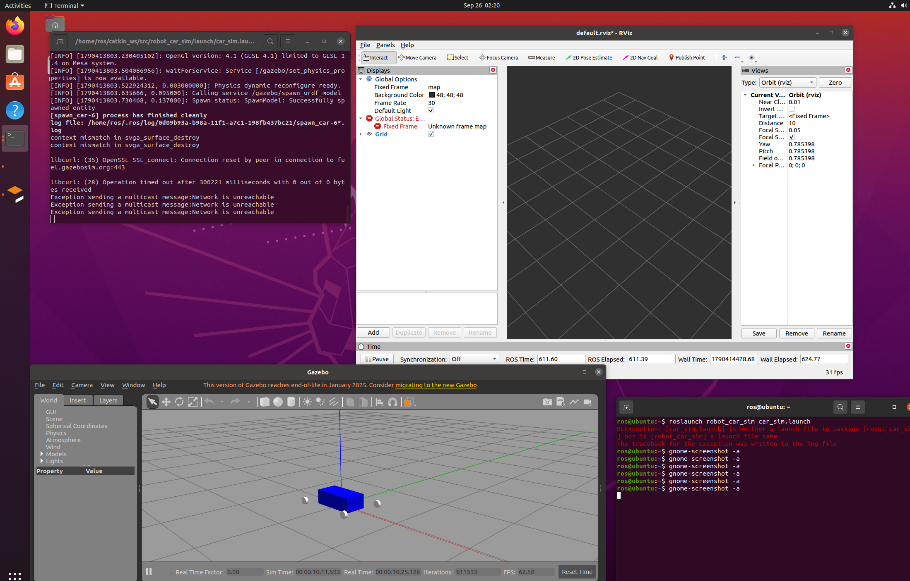

无人车仿真环境搭建实验
 
一、实验目的与环境说明
 
1.1 实验目的
 
1. 熟悉ROS功能包的完整目录结构，掌握Xacro语法，能够使用Xacro描述机器人连杆、关节、几何外形与惯性参数。
2. 理解Gazebo物理仿真器加载机器人模型的流程，区分visual可视化模型、collision碰撞模型、inertial惯性参数三者的不同用途。
3. 掌握RViz可视化工具的基础使用方法，理解robot_state_publisher节点发布TF坐标变换的工作原理。
4. 独立完成四轮无人车模型的建模工作，编写launch文件实现一键启动Gazebo仿真环境、生成小车实体、打开RViz查看模型。
5. 学会在Git仓库中组织代码与实验文档，按照课程规范提交功能包源码、注释与实验报告。
 
1.2 实验环境
 
操作系统：Ubuntu 20.04.6 LTS（VMware虚拟机）
ROS发行版：ROS Noetic
物理仿真器：Gazebo
可视化工具：RViz
模型描述工具：Xacro
功能包名称：robot_car_sim
 
功能包目录结构如下：
robot_car_sim/
├── urdf/car.xacro        # 无人车模型描述文件，包含车身base_link与四个车轮连杆、关节、外观、碰撞、惯性参数
├── launch/car_sim.launch # roslaunch入口文件，一键启动Gazebo、生成小车实体、启动robot_state_publisher与RViz
├── package.xml           # 功能包清单文件，声明gazebo_ros、xacro、robot_state_publisher、roscpp等运行依赖
└── CMakeLists.txt        # CMake编译配置文件，配置资源文件安装规则，将launch、urdf文件夹部署到安装目录
 
二、核心原理解析
 
2.1 机器人模型构造原理
 
本实验采用Xacro宏编写四轮小车模型，整体由车身base_link和四个独立车轮连杆构成。
visual标签用于定义模型外观几何体与颜色，仅用于RViz和Gazebo中的可视化展示，不会参与物理碰撞计算。collision标签定义碰撞几何体，一般与外观模型保持一致，Gazebo依靠该几何体进行碰撞检测。inertial标签用来设置刚体质量与惯性张量，是Gazebo进行物理动力学仿真必不可少的参数，缺少惯性信息仿真无法正常运行。
车轮关节选用continuous连续旋转关节，该关节没有角度限位，可以让车轮自由转动。使用xacro:macro宏封装车轮模型，把车轮的连杆、外观、碰撞、惯性、关节定义封装成模板，只需要修改安装坐标参数，就可以快速实例化左前、右前、左后、右后四个车轮，减少大量重复代码，方便后期修改维护。
 
2.2 仿真启动实现方式
 
launch文件可以一次性批量启动多个ROS节点，免去手动逐个打开终端启动节点的繁琐操作，本次launch文件执行流程如下：
 
1. 启动Gazebo仿真器，加载空白empty世界场景，创建仿真物理环境。
2. 调用xacro命令，读取car.xacro文件，将带宏的Xacro模型转换为标准URDF模型，存入robot_description参数服务器。
3. robot_state_publisher节点读取robot_description中的URDF模型，根据关节角度持续计算并发布各个连杆之间的TF坐标变换。
4. spawn_model节点读取robot_description参数，将小车模型作为实体生成到Gazebo仿真世界中，实体命名为mycar。
5. 启动rviz可视化工具，用户在RViz中添加RobotModel与TF插件，即可查看小车三维模型与各个坐标系。
 
三、实验操作步骤
 
1. 打开ROS工作空间，进入src目录，新建功能包文件夹robot_car_sim，在内部新建launch文件夹与urdf文件夹。
2. 在urdf文件夹下编写car.xacro，定义车身base_link，使用xacro宏定义车轮模板，实例化四个车轮，依次填写visual外观、collision碰撞体、inertial惯性参数、连续旋转关节。
3. 在launch文件夹下编写car_sim.launch，依次配置Gazebo启动、xacro模型转换、robot_state_publisher、spawn_model生成小车、rviz启动。
4. 在功能包根目录编写package.xml，填写包信息，声明所有需要的依赖包；编写CMakeLists.txt，配置资源文件安装规则。
5. 返回工作空间根目录，执行catkin_make编译功能包，source环境变量，执行roslaunch robot_car_sim car_sim.launch启动整套仿真。
6. 观察Gazebo窗口，确认四轮小车模型正常加载，无模型错位、无报错；打开RViz，添加RobotModel和TF插件，查看小车模型与坐标系。
7. 截取Gazebo小车画面、RViz模型画面，保存图片放入docs/chapter1/images目录。
8. 将功能包代码、实验报告、截图一并提交到Git仓库，准备提交PR。
 
四、实验结果
 
执行roslaunch命令后，Gazebo仿真窗口成功打开，空白世界中出现完整四轮无人车模型，车身与四个车轮位置正常，模型没有错位、穿透等问题，控制台无模型解析错误。RViz可以正常加载RobotModel插件，完整显示小车三维模型，TF坐标系树形结构发布正常，各个连杆坐标关系正确。模型的外观、碰撞体、惯性参数配置全部生效，Gazebo物理环境加载正常，阶段一无人车仿真环境搭建任务顺利完成。
Gazebo仿真小车模型
RViz小车可视化

 
五、实验总结
 
本实验完成了ROS Noetic环境下四轮无人车Xacro模型编写与Gazebo仿真环境搭建。通过本次实验，理解了link连杆、joint关节、Xacro宏、robot_state_publisher、spawn_model的概念与作用。学会使用launch文件批量启动多个仿真相关节点，掌握ROS机器人仿真项目的文件组织、代码编写、编译运行与文档整理的完整流程。
本次实验搭建的基础小车模型，为下一阶段无人车运动控制、避障算法开发提供模型基础。实验过程中也认识到，惯性参数、关节坐标系设置错误会直接导致模型在Gazebo中出现异常，建模时必须保证坐标、质量、惯性参数填写准确。