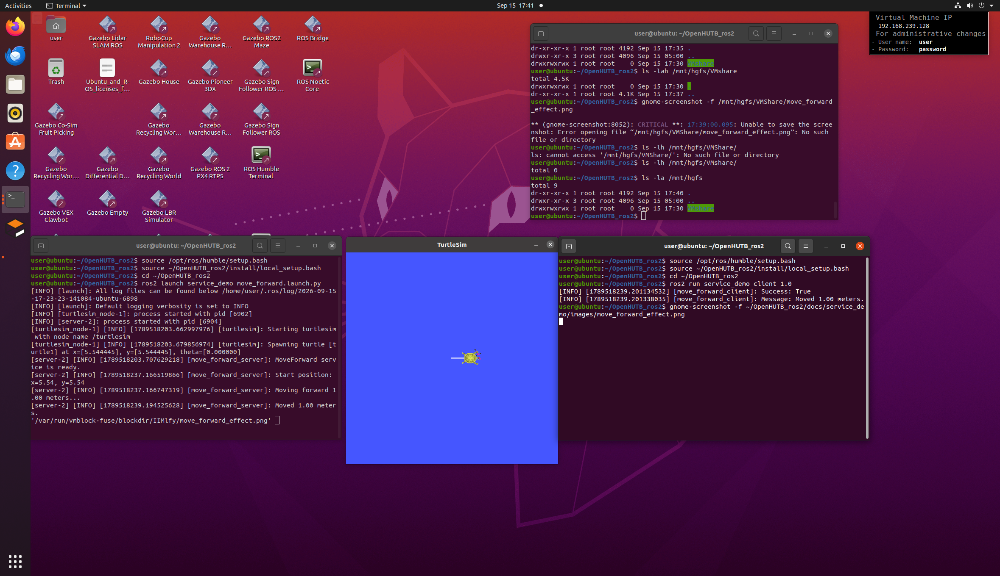

kk# ROS2 Service 控制小海龟移动

## 功能介绍

本示例使用 ROS2 Service 实现对 turtlesim 小海龟的距离控制。

客户端向 `/move_forward` 服务发送需要前进的距离，服务端收到请求后，通过发布 `/turtle1/cmd_vel` 控制小海龟运动，同时订阅 `/turtle1/pose` 获取小海龟当前位置。

当小海龟实际移动距离达到目标距离后，服务端停止运动，并向客户端返回执行结果。

## 系统结构

    Service Client
        |
        | /move_forward
        | distance
        v
    Service Server
        |
        | /turtle1/cmd_vel
        v
    turtlesim
        |
        | /turtle1/pose
        v
    Service Server

## 自定义 Service 接口

接口文件：

`service_interfaces/srv/MoveForward.srv`

    float64 distance
    ---
    bool success
    string message

参数说明：

- `distance`：请求小海龟移动的距离
- `success`：移动是否成功
- `message`：执行结果说明

## 实现特点

本示例不是简单按照固定时间控制小海龟移动，而是结合 `/turtle1/pose` 的位置反馈，根据实际移动距离判断是否达到目标距离。

因此，控制逻辑形成了：

    发送目标距离
          ↓
    Service Server 接收请求
          ↓
    读取小海龟当前位置
          ↓
    发布速度控制指令
          ↓
    持续获取 /turtle1/pose
          ↓
    计算实际移动距离
          ↓
    达到目标距离
          ↓
    停止小海龟
          ↓
    返回 Service 执行结果

这种方式可以作为后续实现闭环控制、机器人运动控制等功能的基础。

## 运行环境

- Ubuntu 20.04.6 LTS
- ROS 2 Humble
- Python 3.8.10
- turtlesim

## 编译

在 ROS 2 工作空间中执行：

    cd ~/ros2_ws

    colcon build --packages-select service_interfaces service_demo

编译完成后：

    source install/local_setup.bash

## 启动示例

启动 turtlesim 和 Service Server：

    ros2 launch service_demo move_forward.launch.py

重新打开一个终端，并加载 ROS 2 环境：

    source /opt/ros/humble/setup.bash
    source ~/ros2_ws/install/local_setup.bash

发送移动请求，例如移动 1.0 个距离单位：

    ros2 run service_demo client 1.0

也可以修改移动距离，例如：

    ros2 run service_demo client 2.0

## 查看 Service 接口

执行：

    ros2 interface show service_interfaces/srv/MoveForward

可以看到：

    float64 distance
    ---
    bool success
    string message

## 运行效果

启动 turtlesim 后，通过 Service Client 发送移动距离，小海龟会按照请求的距离向当前朝向移动。

服务端会根据 `/turtle1/pose` 获取实际位置，并计算实际移动距离。

达到目标距离后，小海龟停止运动，客户端获得执行结果。

## AI 使用声明

本项目开发过程中使用了 OpenAI GPT-5.6 Luna 作为 AI 辅助工具，用于代码结构分析、ROS 2 API 使用建议、问题排查和文档整理。

模型信息：<https://openai.com/index/gpt-5-6/>

最终代码由提交者自行修改、测试和验证。
