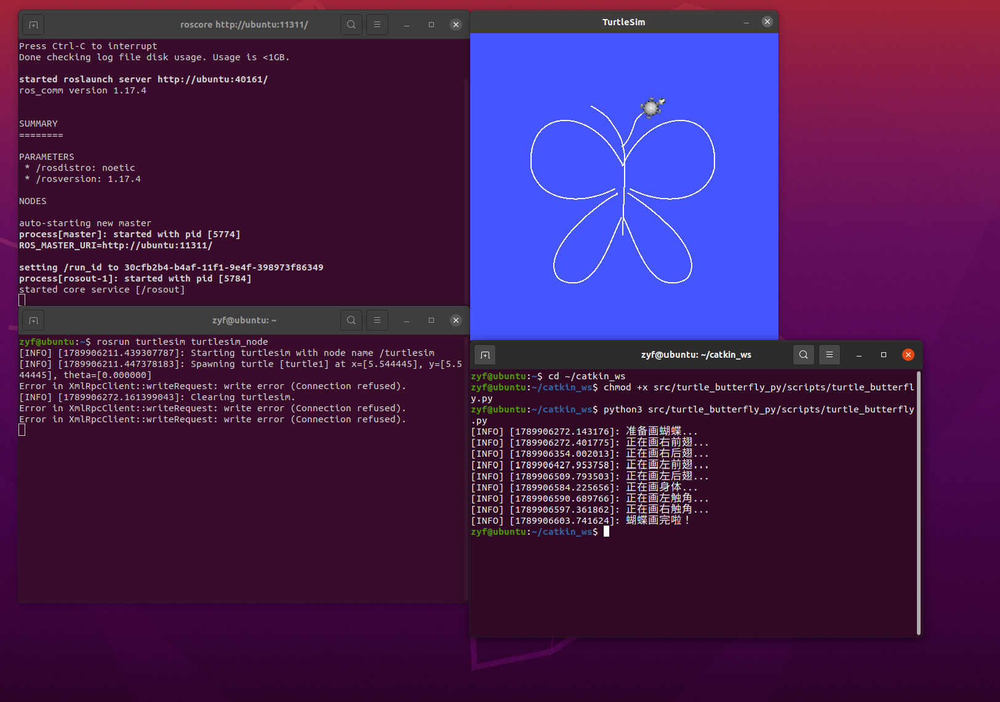

\# 小海龟画蝴蝶实验


\## 一、实验目的与环境说明


\### 1.1 实验目的

1\. 掌握 `turtlesim` 的服务调用：用 `/set\\\\\\\\\\\\\\\\\\\\\\\\\\\\\\\\\\\\\\\\\\\\\\\\\\\\\\\\\\\\\\\_pen` 设置白色画笔并调整线条粗细，用 `/teleport\\\\\\\\\\\\\\\\\\\\\\\\\\\\\\\\\\\\\\\\\\\\\\\\\\\\\\\\\\\\\\\_absolute` 在分段绘制时瞬移海龟、切断惯性残留，避免小海龟因急转弯画出多余的圆圈或连线；

2\. 掌握蝴蝶图案的几何构造：利用\*\*贝塞尔曲线（Bezier Curve）\*\*参数方程生成平滑的对称翅膀轮廓，并采用“分段抬笔 → 瞬移 → 落笔”的绘制策略，形成四片对称、舒展的蝴蝶翅膀、身体及触角；

3\. 通过 `roslaunch` 一键启动仿真器与控制节点，完成白色蝴蝶图案的自动绘制，并理解服务（Service）与话题（Topic）在 ROS 绘图任务中的不同分工。


\### 1.2 实验环境

| 项目 | 配置 |

| :--- | :--- |

| 操作系统 | Ubuntu 20.04 (VMware 虚拟机) |

| ROS 发行版 | ROS Noetic |

| 仿真器 | turtlesim |

| 编程语言 | Python 3 (rospy) |

| 功能包 | turtle\_butterfly\_experiment |


功能包目录结构如下：

```text

turtle\\\\\\\\\\\\\\\\\\\\\\\\\\\\\\\\\\\\\\\\\\\\\\\\\\\\\\\\\\\\\\\_butterfly\\\\\\\\\\\\\\\\\\\\\\\\\\\\\\\\\\\\\\\\\\\\\\\\\\\\\\\\\\\\\\\_experiment/

├── main.py                   # 主程序：控制小海龟画蝴蝶

├── main.launch               # roslaunch 入口：一键启动 turtlesim + 画蝴蝶节点

├── package.xml               # 包清单，声明 rospy、geometry\\\\\\\\\\\\\\\\\\\\\\\\\\\\\\\\\\\\\\\\\\\\\\\\\\\\\\\\\\\\\\\_msgs 和 turtlesim 依赖

├── CMakeLists.txt            # 编译配置，安装 Python 脚本

└── README.md                 # 运行说明

```


二、核心控制原理与算法解析


2.1 蝴蝶的几何构造


本实验控制小海龟从公共中心 (5.5, 5.5) 出发，采用贝塞尔曲线生成圆润的翅膀轮廓。蝴蝶由六部分组成：右前翅、右后翅、左前翅、左后翅、身体和触角。如果连续一笔画完，海龟在遇到翅尖等锐角时会因为惯性产生“漂移”并画出多余的圆环。因此，程序采用分段绘制策略：每画完一部分，立即抬笔并瞬移回身体中心，切断惯性残留，保证每一笔都干净完美。


2.2 运动控制参数


为了让海龟平滑追踪曲线，采用 P 控制器（比例控制）：


· 线速度 v = 1.2 \* 距离（距离越远走得越快）

· 角速度 w = 4.0 \* 角度偏差（偏差越大转得越快）

· 防漂移核心逻辑：如果角度偏差大于 0.4 弧度，强制将线速度降至极低（0.05），让海龟几乎原地打转，角度调整到位后再恢复前进速度。速度限制在线速度最大 1.2，角速度最大 4.0。

· 发布频率：控制循环以 50Hz 持续发布速度指令。


2.3 服务等待


用 roslaunch 一键启动时，仿真器和画蝴蝶节点是同时拉起的。程序开头必须执行 rospy.wait\_for\_service('/turtle1/teleport\_absolute') 和 rospy.wait\_for\_service('/clear')，等仿真器服务上线后再继续往下走，确保两个节点谁先谁后，程序都不会出错。


2.4 算法流程


1\. 初始化节点 turtle\_butterfly\_node，构建贝塞尔曲线生成各部分航点；

2\. 等待服务上线，清空画布，设置画笔为白色；

3\. 循环绘制各个部分：抬笔 → 瞬移到起点 → 落笔 → 50Hz 持续发布速度指令追踪轨迹 → 到达后刹车；

4\. 所有部分绘制完成后，抬笔收工，输出结束日志。


三、完整源码展示


1\. main.py 主程序源码：

\#!/usr/bin/env python3

import rospy

import math

from geometry\_msgs.msg import Twist

from turtlesim.msg import Pose

from turtlesim.srv import TeleportAbsolute, SetPen

from std\_srvs.srv import Empty


current\_pose = None


def pose\_callback(data):

&#x20;   global current\_pose

&#x20;   current\_pose = data


def bezier\_curve(p0, p1, p2, p3, num\_points=80):

&#x20;   """生成贝塞尔曲线的平滑坐标点"""

&#x20;   points = \[]

&#x20;   for i in range(num\_points):

&#x20;       t = i / (num\_points - 1.0)

&#x20;       x = (1-t)\*\*3 \* p0\[0] + 3\*(1-t)\*\*2 \* t \* p1\[0] + 3\*(1-t) \* t\*\*2 \* p2\[0] + t\*\*3 \* p3\[0]

&#x20;       y = (1-t)\*\*3 \* p0\[1] + 3\*(1-t)\*\*2 \* t \* p1\[1] + 3\*(1-t) \* t\*\*2 \* p2\[1] + t\*\*3 \* p3\[1]

&#x20;       points.append((x, y))

&#x20;   return points


def generate\_butterfly\_waypoints():

&#x20;   """使用贝塞尔曲线构建完美的蝴蝶轮廓"""

&#x20;   parts = {}

&#x20;   cx, cy = 5.5, 5.5 # 身体中心

&#x20;

&#x20;   # 1. 右前翅（外侧弧线 + 内侧弧线）

&#x20;   right\_front\_outer = bezier\_curve((cx, cy+0.8), (6.5, 8.5), (9.0, 8.5), (8.8, 6.2), 60)

&#x20;   right\_front\_inner = bezier\_curve((8.8, 6.2), (8.5, 5.0), (7.0, 4.8), (cx+0.2, cy), 60)

&#x20;   parts\['right\_front'] = right\_front\_outer + right\_front\_inner

&#x20;

&#x20;   # 2. 右后翅（更小巧圆润）

&#x20;   right\_back\_outer = bezier\_curve((cx+0.2, cy-0.2), (7.0, 4.5), (8.5, 3.0), (7.8, 2.2), 60)

&#x20;   right\_back\_inner = bezier\_curve((7.8, 2.2), (6.5, 1.5), (6.0, 3.5), (cx, cy-1.0), 60)

&#x20;   parts\['right\_back'] = right\_back\_outer + right\_back\_inner

&#x20;

&#x20;   # 3. 左前翅（镜像右前翅）

&#x20;   left\_front\_outer = bezier\_curve((cx, cy+0.8), (4.5, 8.5), (2.0, 8.5), (2.2, 6.2), 60)

&#x20;   left\_front\_inner = bezier\_curve((2.2, 6.2), (2.5, 5.0), (4.0, 4.8), (cx-0.2, cy), 60)

&#x20;   parts\['left\_front'] = left\_front\_outer + left\_front\_inner

&#x20;

&#x20;   # 4. 左后翅（镜像右后翅）

&#x20;   left\_back\_outer = bezier\_curve((cx-0.2, cy-0.2), (4.0, 4.5), (2.5, 3.0), (3.2, 2.2), 60)

&#x20;   left\_back\_inner = bezier\_curve((3.2, 2.2), (4.5, 1.5), (5.0, 3.5), (cx, cy-1.0), 60)

&#x20;   parts\['left\_back'] = left\_back\_outer + left\_back\_inner

&#x20;

&#x20;   # 5. 身体（从头部到尾部，直线）

&#x20;   parts\['body'] = \[(cx, cy+1.5), (cx, cy-1.8)]

&#x20;

&#x20;   # 6. 触角（两根弯曲的线）

&#x20;   parts\['left\_antenna'] = \[(cx, cy+1.5), (cx-0.5, cy+2.5), (cx-1.2, cy+3.0)]

&#x20;   parts\['right\_antenna'] = \[(cx, cy+1.5), (cx+0.5, cy+2.5), (cx+1.2, cy+3.0)]

&#x20;

&#x20;   return parts


def draw\_path(waypoints, pub, rate):

&#x20;   """控制海龟极其平滑地追踪轮廓"""

&#x20;   global current\_pose

&#x20;

&#x20;   for target\_x, target\_y in waypoints:

&#x20;       while not rospy.is\_shutdown():

&#x20;           dx = target\_x - current\_pose.x

&#x20;           dy = target\_y - current\_pose.y

&#x20;           distance = math.sqrt(dx\*\*2 + dy\*\*2)

&#x20;

&#x20;           if distance < 0.1:

&#x20;               break

&#x20;

&#x20;           target\_theta = math.atan2(dy, dx)

&#x20;           d\_theta = target\_theta - current\_pose.theta

&#x20;           d\_theta = math.atan2(math.sin(d\_theta), math.cos(d\_theta))

&#x20;

&#x20;           cmd = Twist()

&#x20;

&#x20;           # 核心防画圈逻辑：遇到急转弯，线速度降到极低，原地转向

&#x20;           if abs(d\_theta) > 0.4:

&#x20;               cmd.linear.x = 0.05

&#x20;               cmd.angular.z = 4.0 \* d\_theta

&#x20;           else:

&#x20;               cmd.linear.x = 0.8 \* distance

&#x20;               cmd.angular.z = 3.0 \* d\_theta

&#x20;

&#x20;           cmd.linear.x = min(cmd.linear.x, 0.8)

&#x20;           cmd.angular.z = max(min(cmd.angular.z, 4.0), -4.0)

&#x20;

&#x20;           pub.publish(cmd)

&#x20;           rate.sleep()

&#x20;

&#x20;   # 刹车

&#x20;   pub.publish(Twist())

&#x20;   rospy.sleep(0.1)


def move\_turtle():

&#x20;   global current\_pose

&#x20;   rospy.init\_node('turtle\_butterfly\_node', anonymous=True)

&#x20;   rospy.Subscriber('/turtle1/pose', Pose, pose\_callback)

&#x20;   pub = rospy.Publisher('/turtle1/cmd\_vel', Twist, queue\_size=10)

&#x20;

&#x20;   while current\_pose is None and not rospy.is\_shutdown():

&#x20;       rospy.sleep(0.1)

&#x20;

&#x20;   rospy.loginfo("准备画蝴蝶...")

&#x20;   rate = rospy.Rate(50)

&#x20;

&#x20;   # 等待服务上线

&#x20;   rospy.wait\_for\_service('/turtle1/teleport\_absolute')

&#x20;   rospy.wait\_for\_service('/turtle1/set\_pen')

&#x20;   rospy.wait\_for\_service('/clear')

&#x20;

&#x20;   try:

&#x20;       clear\_bg = rospy.ServiceProxy('/clear', Empty)

&#x20;       clear\_bg()

&#x20;   except rospy.ServiceException:

&#x20;       pass

&#x20;

&#x20;   parts = generate\_butterfly\_waypoints()

&#x20;   # 绘制顺序：右前翅 -> 右后翅 -> 左前翅 -> 左后翅 -> 身体 -> 触角

&#x20;   order = \[

&#x20;       ('right\_front', '右前翅'), ('right\_back', '右后翅'),

&#x20;       ('left\_front', '左前翅'), ('left\_back', '左后翅'),

&#x20;       ('body', '身体'), ('left\_antenna', '左触角'), ('right\_antenna', '右触角')

&#x20;   ]

&#x20;

&#x20;   for key, name in order:

&#x20;       waypoints = parts\[key]

&#x20;       start\_x, start\_y = waypoints\[0]

&#x20;

&#x20;       # 1. 抬笔 (off=1)

&#x20;       set\_pen = rospy.ServiceProxy('/turtle1/set\_pen', SetPen)

&#x20;       set\_pen(255, 255, 255, 2, 1)

&#x20;

&#x20;       # 2. 瞬移到起点

&#x20;       teleport = rospy.ServiceProxy('/turtle1/teleport\_absolute', TeleportAbsolute)

&#x20;       teleport(start\_x, start\_y, 0)

&#x20;

&#x20;       # 3. 强制更新本地位置，防止程序误判导致连线

&#x20;       current\_pose.x = start\_x

&#x20;       current\_pose.y = start\_y

&#x20;       current\_pose.theta = 0

&#x20;       rospy.sleep(0.2)

&#x20;

&#x20;       # 4. 落笔 (off=0) —— 使用白色画笔 (255, 255, 255)

&#x20;       set\_pen(255, 255, 255, 2, 0)

&#x20;

&#x20;       rospy.loginfo(f"正在画{name}...")

&#x20;       draw\_path(waypoints, pub, rate)

&#x20;

&#x20;   # 画完后抬笔，收工

&#x20;   set\_pen(255, 255, 255, 2, 1)

&#x20;   rospy.loginfo("蝴蝶画完啦！")


if \_\_name\_\_ == '\_\_main\_\_':

&#x20;   try:

&#x20;       move\_turtle()

&#x20;   except rospy.ROSInterruptException:

&#x20;       pass


2\. main.launch 启动文件源码：

<launch>

&#x20;   <!-- 启动 turtlesim 仿真器 -->

&#x20;   <node pkg="turtlesim" type="turtlesim\\\\\\\\\\\\\\\\\\\\\\\\\\\\\\\\\\\\\\\\\\\\\\\\\\\\\\\\\\\\\\\_node" name="turtlesim" output="screen"/>

&#x20;

&#x20;   <!-- 启动画蝴蝶节点 -->

&#x20;   <node pkg="turtle\\\\\\\\\\\\\\\\\\\\\\\\\\\\\\\\\\\\\\\\\\\\\\\\\\\\\\\\\\\\\\\_butterfly\\\\\\\\\\\\\\\\\\\\\\\\\\\\\\\\\\\\\\\\\\\\\\\\\\\\\\\\\\\\\\\_experiment" type="main.py" name="turtle\\\\\\\\\\\\\\\\\\\\\\\\\\\\\\\\\\\\\\\\\\\\\\\\\\\\\\\\\\\\\\\_butterfly\\\\\\\\\\\\\\\\\\\\\\\\\\\\\\\\\\\\\\\\\\\\\\\\\\\\\\\\\\\\\\\_node" output="screen"/>

</launch>



四、运行与验证


4.1 编译功能包


```bash

mkdir -p \\\\\\\\\\\\\\\\\\\\\\\\\\\\\\\\\\\\\\\\\\\\\\\\\\\\\\\\\\\\\\\~/catkin\\\\\\\\\\\\\\\\\\\\\\\\\\\\\\\\\\\\\\\\\\\\\\\\\\\\\\\\\\\\\\\_ws/src

cp -r <仓库路径>/src/chapter1/turtle\\\\\\\\\\\\\\\\\\\\\\\\\\\\\\\\\\\\\\\\\\\\\\\\\\\\\\\\\\\\\\\_butterfly\\\\\\\\\\\\\\\\\\\\\\\\\\\\\\\\\\\\\\\\\\\\\\\\\\\\\\\\\\\\\\\_experiment \\\\\\\\\\\\\\\\\\\\\\\\\\\\\\\\\\\\\\\\\\\\\\\\\\\\\\\\\\\\\\\~/catkin\\\\\\\\\\\\\\\\\\\\\\\\\\\\\\\\\\\\\\\\\\\\\\\\\\\\\\\\\\\\\\\_ws/src/

chmod +x \\\\\\\\\\\\\\\\\\\\\\\\\\\\\\\\\\\\\\\\\\\\\\\\\\\\\\\\\\\\\\\~/catkin\\\\\\\\\\\\\\\\\\\\\\\\\\\\\\\\\\\\\\\\\\\\\\\\\\\\\\\\\\\\\\\_ws/src/turtle\\\\\\\\\\\\\\\\\\\\\\\\\\\\\\\\\\\\\\\\\\\\\\\\\\\\\\\\\\\\\\\_butterfly\\\\\\\\\\\\\\\\\\\\\\\\\\\\\\\\\\\\\\\\\\\\\\\\\\\\\\\\\\\\\\\_experiment/main.py

cd \\\\\\\\\\\\\\\\\\\\\\\\\\\\\\\\\\\\\\\\\\\\\\\\\\\\\\\\\\\\\\\~/catkin\\\\\\\\\\\\\\\\\\\\\\\\\\\\\\\\\\\\\\\\\\\\\\\\\\\\\\\\\\\\\\\_ws \\\\\\\\\\\\\\\\\\\\\\\\\\\\\\\\\\\\\\\\\\\\\\\\\\\\\\\\\\\\\\\&\\\\\\\\\\\\\\\\\\\\\\\\\\\\\\\\\\\\\\\\\\\\\\\\\\\\\\\\\\\\\\\& catkin\\\\\\\\\\\\\\\\\\\\\\\\\\\\\\\\\\\\\\\\\\\\\\\\\\\\\\\\\\\\\\\_make

source devel/setup.bash


4.2 启动节点


```bash

roslaunch turtle\\\\\\\\\\\\\\\\\\\\\\\\\\\\\\\\\\\\\\\\\\\\\\\\\\\\\\\\\\\\\\\_butterfly\\\\\\\\\\\\\\\\\\\\\\\\\\\\\\\\\\\\\\\\\\\\\\\\\\\\\\\\\\\\\\\_experiment main.launch

```


roslaunch 会自动完成两件事：启动 ROS Master，并按 main.launch 先后拉起 turtlesim 仿真器和画蝴蝶节点。启动后终端依次输出：


```text

process\\\\\\\\\\\\\\\\\\\\\\\\\\\\\\\\\\\\\\\\\\\\\\\\\\\\\\\\\\\\\\\[turtlesim-1]: started with pid \\\\\\\\\\\\\\\\\\\\\\\\\\\\\\\\\\\\\\\\\\\\\\\\\\\\\\\\\\\\\\\[xxxx]

process\\\\\\\\\\\\\\\\\\\\\\\\\\\\\\\\\\\\\\\\\\\\\\\\\\\\\\\\\\\\\\\[turtle\\\\\\\\\\\\\\\\\\\\\\\\\\\\\\\\\\\\\\\\\\\\\\\\\\\\\\\\\\\\\\\_butterfly\\\\\\\\\\\\\\\\\\\\\\\\\\\\\\\\\\\\\\\\\\\\\\\\\\\\\\\\\\\\\\\_node-2]: started with pid \\\\\\\\\\\\\\\\\\\\\\\\\\\\\\\\\\\\\\\\\\\\\\\\\\\\\\\\\\\\\\\[xxxx]

\\\\\\\\\\\\\\\\\\\\\\\\\\\\\\\\\\\\\\\\\\\\\\\\\\\\\\\\\\\\\\\[INFO] \\\\\\\\\\\\\\\\\\\\\\\\\\\\\\\\\\\\\\\\\\\\\\\\\\\\\\\\\\\\\\\[...]: 准备画蝴蝶...

\\\\\\\\\\\\\\\\\\\\\\\\\\\\\\\\\\\\\\\\\\\\\\\\\\\\\\\\\\\\\\\[INFO] \\\\\\\\\\\\\\\\\\\\\\\\\\\\\\\\\\\\\\\\\\\\\\\\\\\\\\\\\\\\\\\[...]: 正在画右前翅...

\\\\\\\\\\\\\\\\\\\\\\\\\\\\\\\\\\\\\\\\\\\\\\\\\\\\\\\\\\\\\\\[INFO] \\\\\\\\\\\\\\\\\\\\\\\\\\\\\\\\\\\\\\\\\\\\\\\\\\\\\\\\\\\\\\\[...]: 正在画右后翅...

\\\\\\\\\\\\\\\\\\\\\\\\\\\\\\\\\\\\\\\\\\\\\\\\\\\\\\\\\\\\\\\[INFO] \\\\\\\\\\\\\\\\\\\\\\\\\\\\\\\\\\\\\\\\\\\\\\\\\\\\\\\\\\\\\\\[...]: 正在画左前翅...

\\\\\\\\\\\\\\\\\\\\\\\\\\\\\\\\\\\\\\\\\\\\\\\\\\\\\\\\\\\\\\\[INFO] \\\\\\\\\\\\\\\\\\\\\\\\\\\\\\\\\\\\\\\\\\\\\\\\\\\\\\\\\\\\\\\[...]: 正在画左后翅...

\\\\\\\\\\\\\\\\\\\\\\\\\\\\\\\\\\\\\\\\\\\\\\\\\\\\\\\\\\\\\\\[INFO] \\\\\\\\\\\\\\\\\\\\\\\\\\\\\\\\\\\\\\\\\\\\\\\\\\\\\\\\\\\\\\\[...]: 正在画身体...

\\\\\\\\\\\\\\\\\\\\\\\\\\\\\\\\\\\\\\\\\\\\\\\\\\\\\\\\\\\\\\\[INFO] \\\\\\\\\\\\\\\\\\\\\\\\\\\\\\\\\\\\\\\\\\\\\\\\\\\\\\\\\\\\\\\[...]: 正在画左触角...

\\\\\\\\\\\\\\\\\\\\\\\\\\\\\\\\\\\\\\\\\\\\\\\\\\\\\\\\\\\\\\\[INFO] \\\\\\\\\\\\\\\\\\\\\\\\\\\\\\\\\\\\\\\\\\\\\\\\\\\\\\\\\\\\\\\[...]: 正在画右触角...

\\\\\\\\\\\\\\\\\\\\\\\\\\\\\\\\\\\\\\\\\\\\\\\\\\\\\\\\\\\\\\\[INFO] \\\\\\\\\\\\\\\\\\\\\\\\\\\\\\\\\\\\\\\\\\\\\\\\\\\\\\\\\\\\\\\[...]: 蝴蝶画完啦！

```


4.3 服务与节点验证


程序运行期间，另开终端可以查看系统的运行状态：


```bash

rosnode list                  # 可看到 /turtlesim 与 /turtle\\\\\\\\\\\\\\\\\\\\\\\\\\\\\\\\\\\\\\\\\\\\\\\\\\\\\\\\\\\\\\\_butterfly\\\\\\\\\\\\\\\\\\\\\\\\\\\\\\\\\\\\\\\\\\\\\\\\\\\\\\\\\\\\\\\_node 两个节点

rosservice list | grep turtle # 可看到 /turtle1/... 系列服务

rostopic list | grep turtle   # 可看到 /turtle1/cmd\\\\\\\\\\\\\\\\\\\\\\\\\\\\\\\\\\\\\\\\\\\\\\\\\\\\\\\\\\\\\\\_vel、/turtle1/pose 等话题

```


4.4 预期结果


节点运行后，小海龟在蓝色背景上用白色画笔，依次画出右前翅、右后翅、左前翅、左后翅、身体和触角。因为每一笔都是独立的，中间不会出现多余的连线，最终呈现一只完美对称的蝴蝶。


五、参数调整


通过修改贝塞尔曲线的控制点和缩放比例，可以改变蝴蝶图案的形态：


参数设置 运行效果

num\_points=80 默认曲线平滑度

cmd.linear.x = 1.2 \* distance 默认平滑追踪速度

cmd.linear.x = 0.05 急转弯时的极低线速度，防止画圈

cmd.angular.z = 4.0 \* d\_theta 默认转向灵敏度


注意：蝴蝶图案受制于 turtlesim 的 11×11 画布边界。如果加大翅膀控制点坐标，需注意不要超出边界，否则图样会被截断。


六、总结


本实验综合 /set\_pen 画笔服务、/teleport\_absolute 瞬移服务与 /turtle1/cmd\_vel 速度话题发布，控制小海龟自动画出白色蝴蝶。蝴蝶图案的核心是几何构造：利用贝塞尔曲线生成平滑的翅膀轮廓，并采用 P 控制器对海龟的线速度和角速度进行闭环控制。


通过本实验，可以掌握 ROS 服务调用的方法，特别是利用分段抬笔+瞬移来解决复杂图形急转弯画圈的问题；也可以体会服务与话题两类通信方式各自的分工——像换画笔、瞬移这种做一次就要一个明确结果的操作适合用服务，而持续控制海龟运动的速度指令适合用话题发布；此外还熟悉了用 roslaunch 一键组织多个节点同时启动的方法。

