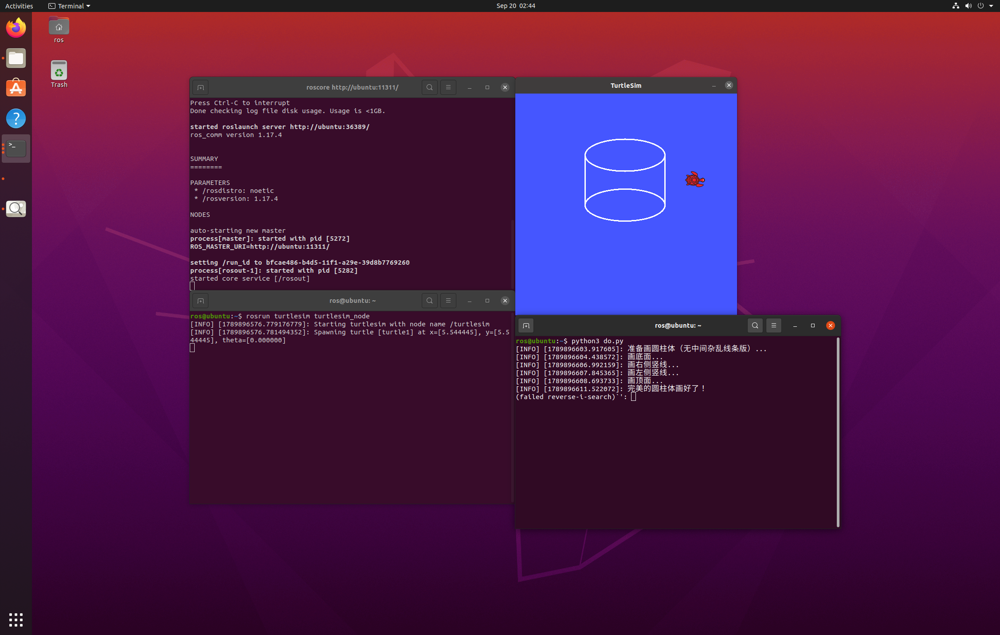

小海龟画圆柱体实验
 
一、实验目的与环境说明
 
1.1 实验目的
 
1. 掌握 turtlesim 的服务调用：使用 /set_pen 控制画笔状态，使用 /teleport_absolute 实现海龟瞬移；

2. 掌握圆柱体几何构造：通过瞬移服务绘制底面椭圆、顶面椭圆，再绘制两条竖直连接线，构建立体圆柱体视觉效果；

3. 理解服务通信的使用方式，利用连续瞬移完成图形绘制，避免多余拖影线条。
 
1.2 实验环境
 
操作系统：Ubuntu 20.04（VMware 虚拟机）
ROS 发行版：ROS Noetic
仿真器：turtlesim
编程语言：Python 3（rospy）
功能包：turtle_sim_experiment
 
功能包目录结构如下：
turtle_sim_experiment/
├── turtle_cylinder.py  # 主程序：控制小海龟绘制圆柱体
├── main.launch         # roslaunch 入口：一键启动 turtlesim + 画圆柱节点
├── package.xml         # 包清单，声明 rospy、geometry_msgs 和 turtlesim 依赖
└── CMakeLists.txt      # 编译配置，安装 Python 脚本
 
二、核心控制原理与算法解析
 
2.1 圆柱体几何构造
 
本实验使用瞬移服务完成全部绘图，不使用速度话题。图形由底面椭圆、顶面椭圆、左右两条竖直连接线组成。
绘制前先关闭画笔，瞬移到目标位置，再开启画笔绘制；每一段图形绘制完成后关闭画笔再瞬移，防止瞬移过程产生多余线条。
底面椭圆以 (center_x, center_y) 为中心；顶面椭圆整体向上偏移高度 height；左右两条竖线分别连接底面和顶面椭圆的左右端点。
 
2.2 绘图实现方式
 
程序循环计算椭圆上各个点坐标，循环调用 /teleport_absolute 依次瞬移到每一个点位，配合短暂延时，形成连续的椭圆轨迹。
竖线同样使用循环，逐步向上瞬移，完成竖直边绘制。
使用封装的 pen_on()、pen_off() 函数统一控制画笔开启与关闭，简化代码逻辑。
 
2.3 服务等待
 
程序启动后调用 rospy.wait_for_service，等待 /turtle1/teleport_absolute、/turtle1/set_pen 服务就绪，避免仿真器还未启动就调用服务导致程序报错。
 
2.4 算法流程
 
1. 初始化ROS节点，等待绘图相关服务就绪；

2. 定义画笔开关函数，关闭画笔，瞬移到底面椭圆起点；

3. 开启画笔，循环瞬移绘制底面椭圆；

4. 关闭画笔瞬移到右侧端点，开启画笔，循环瞬移绘制右侧竖线；

5. 关闭画笔瞬移到左侧端点，开启画笔，循环瞬移绘制左侧竖线；

6. 关闭画笔瞬移到顶面椭圆起点，开启画笔，循环瞬移绘制顶面椭圆；

7. 绘制完成，关闭画笔，将海龟移动到画面侧边，输出完成日志。
 
三、完整源码展示
 
源码存放于 src/chap1/turtle_sim_experiment/turtle_cylinder.py
 
#!/usr/bin/env python3
import rospy
import math
from turtlesim.srv import TeleportAbsolute, SetPen
 
def draw_cylinder_v2():
rospy.init_node('draw_cylinder_v2_node', anonymous=True)
 
rospy.wait_for_service('/turtle1/teleport_absolute')
rospy.wait_for_service('/turtle1/set_pen')
 
teleport_abs = rospy.ServiceProxy('/turtle1/teleport_absolute', TeleportAbsolute)
set_pen = rospy.ServiceProxy('/turtle1/set_pen', SetPen)
 
def pen_on():
set_pen(255, 255, 255, 3, 0)
 
def pen_off():
set_pen(0, 0, 0, 3, 1)
 
rospy.loginfo("准备画圆柱体（无中间杂乱线条版）...")
 
center_x = 5.5
center_y = 5.5
a = 2.0
b = 0.8
height = 2.5
steps = 80
 
pen_off()
teleport_abs(center_x + a, center_y, 0.0)
rospy.sleep(0.5)
 
底面椭圆
 
rospy.loginfo("画底面...")
pen_on()
for i in range(steps + 1):
theta = 2 * math.pi * i / steps
target_x = center_x + a * math.cos(theta)
target_y = center_y + b * math.sin(theta)
teleport_abs(target_x, target_y, 0.0)
rospy.sleep(0.015)
 
右侧竖线
 
rospy.loginfo("画右侧竖线...")
pen_off()
teleport_abs(center_x + a, center_y, 0.0)
rospy.sleep(0.2)
 
pen_on()
for h in range(1, 20):
teleport_abs(center_x + a, center_y + (height * h / 19), 0.0)
rospy.sleep(0.02)
 
左侧竖线
 
rospy.loginfo("画左侧竖线...")
pen_off()
teleport_abs(center_x - a, center_y, 0.0)
rospy.sleep(0.2)
 
pen_on()
for h in range(1, 20):
teleport_abs(center_x - a, center_y + (height * h / 19), 0.0)
rospy.sleep(0.02)
 
顶面椭圆
 
rospy.loginfo("画顶面...")
pen_off()
teleport_abs(center_x + a, center_y + height, 0.0)
rospy.sleep(0.2)
 
pen_on()
for i in range(steps + 1):
theta = 2 * math.pi * i / steps
target_x = center_x + a * math.cos(theta)
target_y = center_y + height + b * math.sin(theta)
teleport_abs(target_x, target_y, 0.0)
rospy.sleep(0.015)
 
rospy.loginfo("完美的圆柱体画好了！")
pen_off()
teleport_abs(center_x + a + 1.5, center_y + height/2, 0.0)
 
if name == 'main':
draw_cylinder_v2()
 
四、运行与验证
 
4.1 编译功能包
 
cd ~/catkin_ws
catkin_make
source devel/setup.bash
 
4.2 启动节点
 
roslaunch turtle_sim_experiment main.launch
 
roslaunch自动启动turtlesim仿真器和绘制节点，终端输出日志：
process[turtlesim-1]: started with pid [xxxx]
process[draw_cylinder_v2_node-2]: started with pid [xxxx]
[INFO] [...]: 准备画圆柱体（无中间杂乱线条版）...
[INFO] [...]: 画底面...
[INFO] [...]: 画右侧竖线...
[INFO] [...]: 画左侧竖线...
[INFO] [...]: 画顶面...
[INFO] [...]: 完美的圆柱体画好了！
 
4.3 服务与节点验证
 
新开终端执行命令查看运行状态
rosnode list
rosservice list | grep turtle1
rostopic list | grep turtle1
 
可以看到draw_cylinder_v2_node节点，以及turtle1相关话题与服务。
 
4.4 预期结果
 
turtlesim窗口中，依次绘制底面椭圆、右侧竖线、左侧竖线、顶面椭圆，形成完整斜圆柱体。
椭圆长轴、圆柱体高度不能设置过大，否则海龟瞬移会超出画布边界，造成图形残缺。

五、参数调整
 
a=2.0，b=0.8，height=2.5，steps=80，为程序默认参数，绘制标准圆柱体。
增大a可以让椭圆变得更宽；增大b可以让椭圆变得更圆；增大height可以加高圆柱体；增大steps可以让椭圆线条更加平滑。
 
注意：椭圆长宽、圆柱体高度不能过大，防止海龟瞬移超出画布边界，造成图形残缺。
 
六、总结
 
本实验全部使用ROS服务通信完成绘图，调用/set_pen控制画笔状态，调用/teleport_absolute完成海龟点位瞬移。
通过分段绘制底面椭圆、两条竖边、顶面椭圆，拼接出圆柱体图形。
实验体会服务通信的特点：适合完成瞬移、修改画笔这类一次性的操作，通过循环多次调用服务实现连续图形绘制。
同时掌握等待服务就绪的写法，避免仿真器未启动导致程序异常。