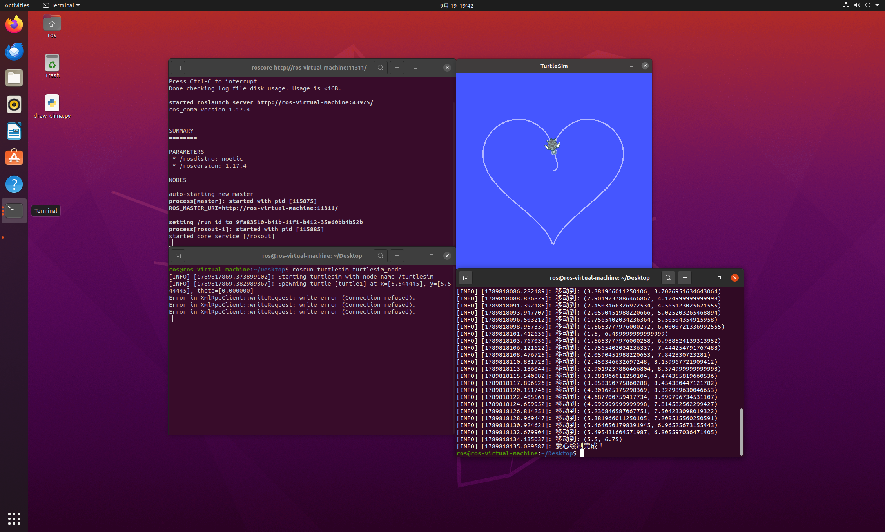

# 小海龟画爱心实验

## 一、实验目的与环境说明

### 1.1 实验目的
1. 掌握 ROS 话题通信机制。节点作为发布者发布 `/turtle1/cmd_vel` 话题，发送 `geometry_msgs/Twist` 消息控制海龟运动；同时作为订阅者订阅 `/turtle1/pose` 话题，接收海龟的位姿消息。
2. 掌握利用参数方程生成轨迹点的方法。利用爱心参数方程生成一系列密集的坐标点，控制小海龟依次跟踪这些点，从而绘制出爱心图案。
3. 通过 turtlesim 仿真器，体会闭环反馈控制中距离与角度误差的计算与修正。

### 1.2 实验环境
| 配置项 | 版本/说明 |
| :--- | :--- |
| 操作系统 | Ubuntu 20.04 (VMware虚拟机) |
| ROS 版本 | ROS Noetic |
| 仿真器 | turtlesim |
| 编程语言 | Python 3.8 |
| 功能包 | turtle_heart |

**功能包目录结构如下：**
```text
turtle_heart/
├── package.xml             # 包清单
├── CMakeLists.txt          # 构建文件
├── scripts/
│   └── main.py             # 主程序：控制小海龟绘制爱心
└── README.md               # 运行环境和步骤说明
```

二、核心控制原理与算法解析

2.1 话题通信机制

turtlesim 仿真器启动后，小海龟会自动订阅 /turtle1/cmd_vel 话题。我们编写的节点脚本作为发布者向该话题发送 Twist 消息控制海龟运动，同时通过 /turtle1/pose 话题接收自身位姿（包含 x, y 坐标和 theta 朝向角）。本节点订阅该话题，实时读取当前位置。

Twist 消息中本实验用到的两个分量：

· linear.x：线速度，控制海龟前进的快慢（单位：m/s）
· angular.z：角速度，控制海龟转动的快慢（单位：rad/s）

Pose 消息中用到三个分量：

· x, y：海龟在平面上的坐标（单位：m）
· theta：海龟的朝向角（单位：rad）

2.2 爱心参数方程与轨迹跟踪

与画正方形走直线和转固定角度不同，爱心是一个复杂的曲线。本实验采用心形参数方程生成轨迹点：
x = 16 * sin^3(t)
y = 13 * cos(t) - 5 * cos(2t) - 2 * cos(3t) - cos(4t)

其中 t 的取值范围是 [0, 2π]。代码中均匀采样 60 个点。为了适配 turtlesim 的 11.08×11.08 画布边界，对计算出的坐标进行了缩放（乘 0.25）和偏移（加 5.5），确保爱心能居中显示且不撞墙。

闭环跟踪控制：
对于每个目标点 (x_target, y_target)，计算当前点 (x_cur, y_cur) 的距离：
d = sqrt((x_target - x_cur)^2 + (y_target - y_cur)^2)
当 d < 0.15 时，认为到达目标点，发布 0 速度停止海龟，然后转向下一个点。

角度控制：
计算目标点相对于当前点的期望角度 theta_target = atan2(y_target - y_cur, x_target - x_cur)。
通过将角速度 angular.z 设为 4.0 * (theta_target - theta_cur)，使得海龟平滑地转向目标点。

2.3 动作间隙的稳定处理

由于小海龟具有物理惯性，每次到达一个目标点后，需要发布一次零速度指令，并 rospy.sleep(0.05) 短暂停歇，让海龟的动能消耗完毕，消除运动惯性带来的位置偏差，然后再向下一目标点移动。

2.4 算法流程

1. 初始化节点，创建发布者发布 /turtle1/cmd_vel，创建订阅者订阅 /turtle1/pose，设置控制频率为 10Hz。
2. 等待第一帧位姿数据，确保连接建立。
3. 根据爱心参数方程，计算并存储 61 个目标坐标点。
4. 遍历目标点列表：
   · 计算当前位置与目标点的距离 d。
   · 如果 d < 0.15，停止并等待 0.05s，切换到下一个目标点。
   · 计算角度差，将角度归一化到 [-π, π]，发布线速度与角速度指令。
5. 循环结束后，发布停止指令，绘制完成。

三、完整源码展示

3.1 主程序 scripts/main.py

```python
#!/usr/bin/env python3
import rospy
from geometry_msgs.msg import Twist
from turtlesim.msg import Pose
import math
import time

current_pose = None

def pose_callback(msg):
    global current_pose
    current_pose = msg

class TurtleDrawer:
    def __init__(self):
        rospy.init_node('draw_heart', anonymous=True)
        self.pub = rospy.Publisher('/turtle1/cmd_vel', Twist, queue_size=10)
        rospy.Subscriber('/turtle1/pose', Pose, pose_callback)
        self.rate = rospy.Rate(10) # 10Hz
        time.sleep(2)

    def move_to(self, target_x, target_y):
        """让海龟平滑移动到目标点"""
        global current_pose
        while not rospy.is_shutdown():
            if current_pose is None:
                continue
            
            dx = target_x - current_pose.x
            dy = target_y - current_pose.y
            distance = math.sqrt(dx**2 + dy**2)

            # 距离小于 0.15 就算到达
            if distance < 0.15:
                self.stop()
                break

            target_theta = math.atan2(dy, dx)
            angle_diff = target_theta - current_pose.theta
            
            # 角度归一化到 [-pi, pi]
            while angle_diff > math.pi: angle_diff -= 2 * math.pi
            while angle_diff < -math.pi: angle_diff += 2 * math.pi

            move_cmd = Twist()
            # 降低线速度，防止冲过头
            move_cmd.linear.x = min(1.0, 0.8 * distance)
            # 提高转向灵敏度
            move_cmd.angular.z = 4.0 * angle_diff 

            self.pub.publish(move_cmd)
            self.rate.sleep()

    def stop(self):
        """停止海龟"""
        move_cmd = Twist()
        move_cmd.linear.x = 0.0
        move_cmd.angular.z = 0.0
        self.pub.publish(move_cmd)
        time.sleep(0.05)

    def draw_heart(self):
        rospy.loginfo("开始绘制爱心...")
        
        points = []
        for i in range(61):
            t = i * (2 * math.pi / 60)
            
            # 爱心参数方程
            x = 16 * math.sin(t)**3
            y = 13 * math.cos(t) - 5 * math.cos(2*t) - 2 * math.cos(3*t) - math.cos(4*t)
            
            # 缩放和平移，以适应 turtlesim 边界
            scaled_x = max(0.5, min(10.5, x * 0.25 + 5.5))
            scaled_y = max(0.5, min(10.5, y * 0.25 + 5.5))
            
            points.append((scaled_x, scaled_y))

        for point in points:
            rospy.loginfo(f"移动到: {point}")
            self.move_to(point[0], point[1])
            time.sleep(0.05)

        rospy.loginfo("爱心绘制完成！")

if __name__ == '__main__':
    try:
        drawer = TurtleDrawer()
        drawer.draw_heart()
    except rospy.ROSInterruptException:
        pass
```

3.2 构建文件 CMakeLists.txt

```cmake
cmake_minimum_required(VERSION 3.0.2)
project(turtle_heart)

find_package(catkin REQUIRED COMPONENTS
  rospy
  geometry_msgs
  turtlesim
)

catkin_package()

catkin_install_python(PROGRAMS
  scripts/main.py
  DESTINATION ${CATKIN_PACKAGE_BIN_DESTINATION}
)
```

3.3 包清单 package.xml

```xml
<?xml version="1.0"?>
<package format="2">
  <name>turtle_heart</name>
  <version>0.0.0</version>
  <description>The turtle_heart package</description>
  <maintainer email="liming@todo.todo">liming</maintainer>
  <license>TODO</license>

  <buildtool_depend>catkin</buildtool_depend>
  <build_depend>rospy</build_depend>
  <build_depend>geometry_msgs</build_depend>
  <build_depend>turtlesim</build_depend>

  <exec_depend>rospy</exec_depend>
  <exec_depend>geometry_msgs</exec_depend>
  <exec_depend>turtlesim</exec_depend>
</package>
```

四、运行与验证

4.1 编译功能包

在工作空间根目录下运行：

```bash
cd ~/catkin_ws
catkin_make
source devel/setup.bash
```

4.2 启动节点

需要打开三个终端，分别运行：

1. 终端 1 (ROS 核心)：

```bash
roscore
```

2. 终端 2 (仿真器)：

```bash
rosrun turtlesim turtlesim_node
```

3. 终端 3 (运行画爱心脚本)：

```bash
rosrun turtle_heart main.py
```

4.3 话题订阅与验证

在节点运行时，另开终端依次执行：

```bash
rostopic list
rostopic info /turtle1/cmd_vel
rostopic echo /turtle1/pose
```

预期可以看到 Twist 线速度 linear.x 在 0.0-1.0 之间不断变化，角速度 angular.z 频繁调整，表明程序正在实时计算并发布速度指令。

4.4 预期结果

节点启动后，在 turtle_win 窗口中可以看到小海龟先移动至起始点，然后平滑地画出一个完整的爱心图案。最后海龟停在爱心上



五、总结

本实验通过发布 /turtle1/cmd_vel 话题实现了对 turtlesim 小海龟的速度控制，并通过订阅 /turtle1/pose 位姿话题实现了闭环反馈。相较于走直线的几何图形，画爱心需要处理复杂的参数方程轨迹点。通过计算距离与角度差，结合速度比例控制，成功完成了爱心图案的绘制。实验深化了对 ROS 话题通信机制和闭环控制算法的理解。

```