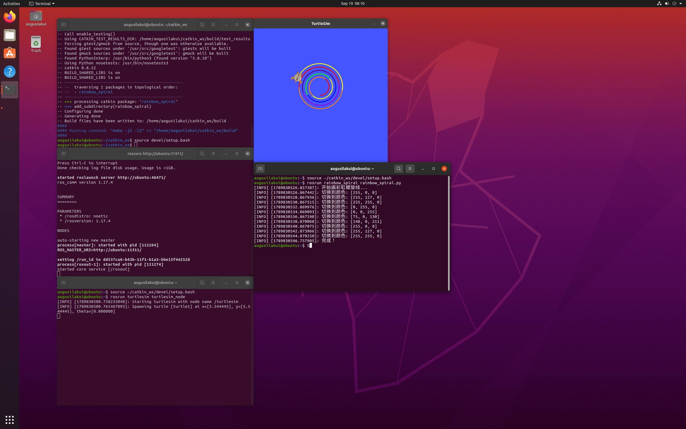

# 小海龟画彩虹螺旋实验

## 一、实验目的与环境说明

### 1.1 实验目的

- 掌握 ROS 话题通信机制：节点作为发布者向 `/turtle1/cmd_vel` 话题发布 `geometry_msgs/Twist` 速度消息，同时作为订阅者接收 `/turtle1/pose` 话题的 `turtlesim/Pose` 位姿消息；
- 利用实时位姿反馈实现闭环控制——通过角速度恒定、线速度递增的方式绘制阿基米德螺旋线；
- 通过 turtlesim 仿真器，让小海龟绘制彩色螺旋轨迹，并掌握 `rosservice` 调用改变画笔颜色的方法。

### 1.2 实验环境

| 项目 | 配置 |
|------|------|
| 操作系统 | Ubuntu 20.04（VMware 虚拟机） |
| ROS 发行版 | ROS Noetic |
| 仿真器 | turtlesim |
| 编程语言 | Python 3（rospy） |
| 功能包 | turtle_motion |


功能包目录结构如下：
```text
turtle_rainbow_spiral/
├── package.xml           # 包清单，声明依赖 rospy、geometry_msgs 和 turtlesim
├── CMakeLists.txt        # 编译配置，把脚本安装到 bin 目录
├── main.launch
└── scripts/
    └── rainbow_spiral.py # 主程序：控制小海龟画彩虹螺旋的节点
```

## 二、核心控制原理与算法解析

### 2.1 话题通信机制

turtlesim 仿真器启动后，小海龟会一直订阅名为 `/turtle1/cmd_vel` 的话题。我们编写的节点 `turtle_rainbow_spiral_node` 作为发布者，向该话题发布 Twist 消息控制海龟运动；与此同时，海龟通过 `/turtle1/pose` 话题持续广播自己的位姿（`turtlesim.msg.Pose`，包含坐标 x、y 和朝向角 theta），本节点订阅该话题，实时读取位姿作为反馈。

`Twist` 消息中本实验用到两个分量：

- `linear.x`：线速度，控制海龟前进的快慢（单位 m/s）；
- `angular.z`：角速度，控制海龟转头的快慢（单位 rad/s），取正值绕 z 轴逆时针旋转，即左转。

Pose 消息中用到三个分量：

- `x`、`y`：海龟在平面上的坐标（单位 m）；
- `theta`：海龟的朝向角（单位 rad，取值范围 [−π, π]）。

**注意**：turtlesim 内置 0.5 秒看门狗——只要超过 0.5 秒没有收到新的 cmd_vel 消息，它就会自动把海龟速度清零（强制刹车）。所以控制循环必须高频持续发布：本实验用 `rospy.Rate(50)` 以 50 Hz 的频率采样位姿并重发当前指令，直到动作到位。

### 2.2 螺旋线生成原理

本实验绘制的是**阿基米德螺旋线**（等速螺线），其极坐标方程为：
`a + b·θ`

其中：

 - `r` 为极径（到原点的距离）
 - `θ` 为极角（旋转角度）
 - `a` 为初始半径
 - `b` 为螺旋线间距系数

在 ROS 中实现时，通过以下方式模拟：

- **角速度恒定**：`angular.z = 2.0 rad/s`，保证海龟匀速旋转；
- **线速度递增**：`linear.x` 从 0.5 m/s 开始，每周期增加 0.05 m/s，使半径逐渐增大；
- **闭环反馈**：实时计算当前位置与中心点的欧氏距离，当达到最大半径时停止。

### 2.3 彩虹颜色实现

通过调用 turtlesim 的 `/turtle1/set_pen` 服务动态改变画笔颜色：
```python
rospy.wait_for_service('/turtle1/set_pen')
set_pen = rospy.ServiceProxy('/turtle1/set_pen', SetPen)
set_pen(r, g, b, width, off)  # r,g,b: 0-255, width: 画笔宽度, off: 0=画线 1=抬笔
```

颜色变化策略：
每完成一圈（θ 增加 2π），切换一次颜色；
使用 HSV 色彩空间均匀采样，转换为 RGB；
共使用 7 种颜色（红、橙、黄、绿、青、蓝、紫）循环。

### 2.4 算法流程

1. 初始化节点 `turtle_rainbow_spiral_node`，创建指向 `/turtle1/cmd_vel` 的发布者、订阅 `/turtle1/pose` 的订阅者，以及 `rospy.Rate(50)` 频率控制对象；

2. 等待第一帧位姿消息，记录初始位置作为螺旋中心；

3. 调用 `/turtle1/set_pen` 服务设置初始画笔颜色（红色）和宽度（3）；

4. 进入主循环：
    - 计算当前位置与中心的欧氏距离 `r`；
    - 若 `r >= max_radius`（最大半径 4.0 m），退出循环；
    - 根据当前角度 `θ` 计算应使用的颜色索引；
    - 若颜色索引变化，调用 `set_pen` 切换颜色；
    - 发布速度指令：`linear.x = 0.5 + 0.05 * t`，`angular.z = 2.0`；
    - 50 Hz 频率休眠；

5. 循环结束后发布零速度停车，抬笔，打印完成日志。

### 3.1 主程序 `scripts/rainbow_spiral_draw.py`

> 最新源码同步保存在本书仓库 `src/chap1/rainbow_spiral_draw.py`，可直接查看与下载。

```python
#!/usr/bin/env python3
# -*- coding: utf-8 -*-
"""
小海龟彩虹螺旋线（开环控制版）
效果：画出彩色螺旋，颜色自动变化
"""

import rospy
from geometry_msgs.msg import Twist
from turtlesim.srv import SetPen

def draw_rainbow_spiral():
    rospy.init_node('rainbow_spiral', anonymous=True)
    
    # 等待画笔服务
    rospy.wait_for_service('/turtle1/set_pen')
    set_pen = rospy.ServiceProxy('/turtle1/set_pen', SetPen)
    
    # 发布速度指令
    pub = rospy.Publisher('/turtle1/cmd_vel', Twist, queue_size=10)
    rate = rospy.Rate(10)  # 10Hz
    
    # 彩虹颜色列表 [R, G, B]
    colors = [
        [255, 0, 0],    # 红
        [255, 127, 0],  # 橙
        [255, 255, 0],  # 黄
        [0, 255, 0],    # 绿
        [0, 0, 255],    # 蓝
        [75, 0, 130],   # 靛
        [148, 0, 211]   # 紫
    ]
    
    color_index = 0
    step_count = 0
    
    rospy.loginfo("开始画彩虹螺旋线...")
    
    while not rospy.is_shutdown():
        twist = Twist()
        
        # 螺旋核心：线速度递增，角速度固定
        twist.linear.x = 1.0 + step_count * 0.01  # 逐渐加速
        twist.angular.z = 1.5  # 固定转向速度
        
        # 每20步换一种颜色
        if step_count % 20 == 0:
            color = colors[color_index % len(colors)]
            set_pen(color[0], color[1], color[2], 3, 0)  # 设置画笔
            color_index += 1
            rospy.loginfo(f"切换到颜色: {color}")
        
        pub.publish(twist)
        step_count += 1
        
        # 200步后停止
        if step_count >= 200:
            twist.linear.x = 0
            twist.angular.z = 0
            pub.publish(twist)
            rospy.loginfo("完成！")
            break
            
        rate.sleep()

if __name__ == '__main__':
    try:
        draw_rainbow_spiral()
    except rospy.ROSInterruptException:
        pass
```

## 四、运行与验证

### 4.1 编译功能包

```bash
mkdir -p ~/catkin_ws/src
cp -r <仓库路径>/src/chap1/turtle_rainbow_spiral ~/catkin_ws/src/
chmod +x ~/catkin_ws/src/turtle_rainbow_spiral/scripts/rainbow_spiral.py
cd ~/catkin_ws && catkin_make
source devel/setup.bash
```

### 4.2 启动节点

```bash
roslaunch turtle_rainbow_spiral main.launch
```

roslaunch 会自动完成两件事：启动 ROS Master（无需单独运行 roscore），并按 main.launch 先后拉起 turtlesim 仿真器和彩虹螺旋节点。启动后终端依次输出：

```text
process[turtlesim-1]: started with pid [xxxx]
process[turtle_rainbow_spiral_node-2]: started with pid [xxxx]
[INFO] [...]: 等待 /turtle1/pose 消息 ...
[INFO] [...]: 初始位置记录为螺旋中心
[INFO] [...]: 开始绘制彩虹螺旋，最大半径 4.0 m
```

### 4.3 服务与节点验证

程序运行期间，另开终端可以查看系统的运行状态：

```bash
rosnode list                     # 可看到 /turtlesim 与 /turtle_rainbow_spiral_node 两个节点
rosservice list | grep turtle1   # 可看到 /turtle1/set_pen、/turtle1/teleport_absolute 等服务
rostopic list | grep turtle1     # 可看到 /turtle1/cmd_vel、/turtle1/pose 等话题
```

### 4.4 预期结果
节点运行后，小海龟从初始位置出发，以 50 Hz 频率发布速度指令，线速度随时间递增（linear.x = 0.5 + 0.05 * t），角速度保持恒定（angular.z = 2.0），画出半径逐渐增大的螺旋线。螺旋线颜色按角度 θ 循环切换红、橙、黄、绿、青、蓝、紫 7 种颜色，形成彩虹效果。当螺旋半径达到 4.0 m 时，节点自动停车、抬笔，终端输出：

```text
[INFO] [...]: 螺旋半径达到 4.0 m，绘制完成
[INFO] [...]: 彩虹螺旋绘制结束
```

最终窗口中呈现从中心向外扩散的彩虹螺旋图案：

由于 turtlesim 的采样周期和位姿更新频率限制，螺旋线边缘可能存在轻微锯齿，属于正常现象。

## 五、参数调整

通过修改最大半径、线速度系数、角速度和颜色切换频率，可以改变螺旋图案的形态：

| 参数设置 | 运行效果 |
|----------|----------|
| `max_radius = 4.0`，`linear.x = 0.5 + 0.05 * t`，`angular.z = 2.0` | 标准彩虹螺旋，半径 4.0 m |
| `max_radius = 2.0`，`linear.x = 0.3 + 0.03 * t`，`angular.z = 3.0` | 小半径紧密螺旋，圈数更多 |
| `max_radius = 5.0`，`linear.x = 0.8 + 0.08 * t`，`angular.z = 1.5` | 大半径稀疏螺旋，圈数更少 |
| `max_radius = 3.0`，`linear.x = 0.5 + 0.05 * t`，`angular.z = -2.0` | 顺时针螺旋，方向相反 |

> **注意**：最大半径不宜超过 5.0 m——turtlesim 画布为 11×11，中心到边界距离约 5.5 m，若螺旋半径过大，小海龟会超出画布边界，导致图案被截断。

## 六、总结

本实验综合 `/turtle1/set_pen` 画笔服务、`/turtle1/pose` 位姿订阅与 `/turtle1/cmd_vel` 速度话题发布，控制小海龟自动画出半径渐增的彩虹螺旋。螺旋图案的核心是**速度控制**：线速度随时间线性递增使半径逐渐扩大，角速度恒定保证曲率一致，颜色按角度循环切换形成彩虹效果。

通过本实验，可以掌握 ROS 话题发布与订阅的方法，比如用 `/turtle1/cmd_vel` 持续控制海龟运动、用 `/turtle1/pose` 实时获取位置反馈；也可以体会**话题与服务两类通信方式的分工**——像换画笔这种做一次就要一个明确结果的操作适合用服务，而持续控制运动的速度指令和实时位置反馈适合用话题；此外还熟悉了用 `rospy.Rate` 精确控制循环频率、用 `roslaunch` 一键组织多个节点同时启动的方法。

## 七、大模型使用申明

本实验报告在撰写过程中使用了 Kimi（Moonshot AI）辅助完成。
所有代码均经本人验证可正常运行，实验结果真实有效。