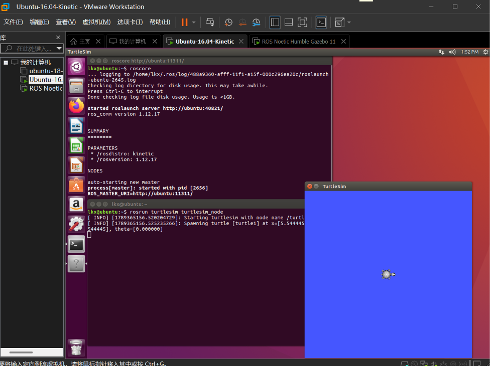
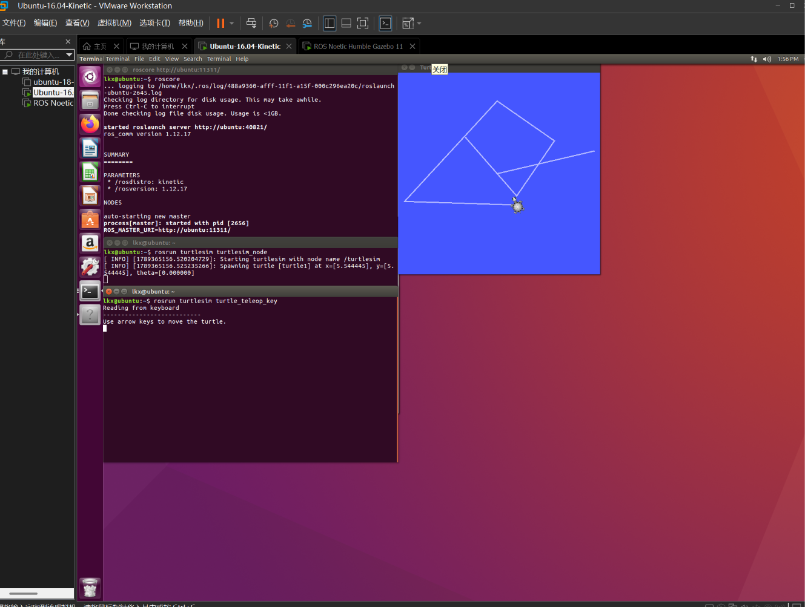
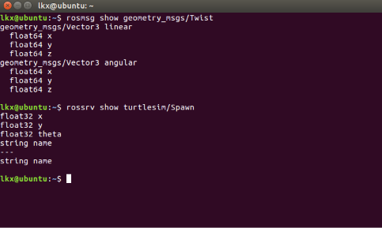
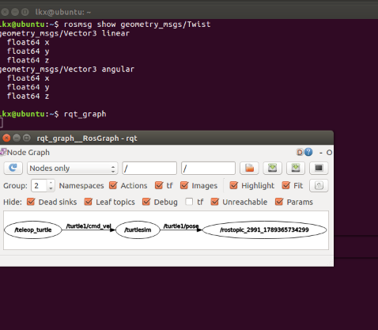

# 小海龟画花瓣实验（服务调用与 ROS 命令实践）

本实验是第一章小海龟系列实验的扩展。前面的画正方形、画圆、绘制 OpenHUTB 实验都是通过一个控制节点向 `/turtle1/cmd_vel` 发布速度指令完成的，本实验补充它们没有覆盖的内容：先用键盘遥控和命令行工具熟悉小海龟的操作与调试，再通过 `/spawn` 服务生成**第二只海龟**，综合 `/spawn`、`/set_pen`、`/teleport_absolute` 服务与话题发布，让两只海龟中的 turtle2 自动画出 6 个两两相扣的彩色花瓣。实验在 Ubuntu 20.04 + ROS Noetic 环境下完成，全部命令也在 Ubuntu 16.04 + Kinetic 上验证通过（仅功能包前缀不同）。

## 一、实验目的

1. 掌握 turtlesim 的服务调用：用 `/spawn` 生成第二只海龟、用 `/set_pen` 设置画笔、用 `/teleport_absolute` 变换海龟位置；
2. 通过小海龟练习 rosnode、rostopic、rosservice、rosparam、rosmsg 等常用命令，学会用命令行查看和调试一个运行中的 ROS 系统；
3. 综合服务与话题两类通信方式，控制多只海龟协作画出花瓣图案，理解花瓣的几何构造方法。

## 二、实验环境

| 项目 | 配置 |
| ---- | ---- |
| 操作系统 | Ubuntu 20.04 LTS（VMware 虚拟机） |
| ROS 发行版 | ROS Noetic（兼容 Ubuntu 16.04 + Kinetic） |
| 仿真器 | turtlesim |
| 键盘控制包 | ros-noetic-teleop-twist-keyboard |
| 编程语言 | Python 3（Noetic），代码兼容 Python 2.7（Kinetic） |

开始前先用 lsb_release 和 rosversion 确认系统版本和 ROS 版本，确保环境无误：


## 三、准备：启动仿真器并键盘遥控

开三个终端，分别执行：

```bash
roscore                                # 终端 1：启动 Master
rosrun turtlesim turtlesim_node        # 终端 2：启动小海龟仿真窗口
rosrun turtlesim turtle_teleop_key     # 终端 3：启动键盘控制节点
```

其中键盘控制包需要先安装：`sudo apt install ros-noetic-teleop-twist-keyboard`（16.04 把 noetic 换成 kinetic）。注意鼠标焦点必须放在 turtle_teleop_key 所在的终端上按键才有效，`i/j/k/l/,` 等按键分别控制前进、转向和停止。




用方向键遥控海龟画出的轨迹：



再开一个终端可以实时查看小海龟的位姿（x、y 坐标和 theta 朝向角）：

```bash
rostopic echo /turtle1/pose
```


## 四、用命令行调试小海龟系统

这部分练习 ROS 的命令行工具，它们是调试任何 ROS 系统的通用手段。

### 1. 节点：rosnode

```bash
rosnode list              # 列出所有运行中的节点
rosnode info /turtlesim   # 查看某个节点的详细信息
```

列表里有三个节点：/rosout 是 roscore 自带的日志节点，/teleop_turtle 是键盘控制，/turtlesim 是仿真器。rosnode info /turtlesim 可以看到它订阅了 /turtle1/cmd_vel（接收速度指令），发布了 /turtle1/pose（对外广播位姿），和上一节的控制过程正好对得上；输出最后还列出了它提供的 /clear、/spawn 等服务，下面马上会用到。


### 2. 话题：rostopic

```bash
rostopic list                   # 列出所有话题
rostopic info /turtle1/cmd_vel  # 查看消息类型、发布者和订阅者
rostopic type /turtle1/cmd_vel  # 只查看消息类型
```

rostopic info /turtle1/cmd_vel 显示这条话题的类型是 geometry_msgs/Twist，发布者是 /teleop_turtle，订阅者是 /turtlesim。发布者和订阅者只通过话题名联系，互相不需要知道对方是谁，这就是 ROS 的发布/订阅通信模型。也可以不经过 teleop 节点，直接用 rostopic pub 向话题发消息控制海龟（速度分量的含义与画正方形实验中相同）。

### 3. 服务：rosservice

```bash
rosservice list                # 列出所有服务
rosservice type /spawn         # 查看服务类型：turtlesim/Spawn
rosservice call /spawn 2.0 2.0 0.0 'turtle2'   # 在 (2,2) 处再生成一只海龟
```

和话题的"广播"不同，服务是请求-应答式的：发出调用后会等仿真器返回结果，这里返回的是新海龟的名字 name: "turtle2"，右侧仿真窗口里也能看到 turtle1 和 turtle2 两只海龟。生成第二只海龟正是后面画花瓣实验的基础。


画笔服务 set_pen 的参数依次是 r、g、b、线宽、是否抬笔：

```bash
rosservice call /clear                          # 清空轨迹
rosservice call /reset                          # 重置仿真器
rosservice call /turtle1/set_pen 255 0 0 3 0   # 换成线宽 3 的红色画笔
```


### 4. 参数：rosparam

```bash
rosparam list    # 列出参数服务器上的所有参数
```

参数列表里能看到两组背景色参数：一组在根命名空间下（/background_r、/background_g、/background_b），另一组挂在 /turtlesim/ 的私有命名空间下，改哪一组都可以。把背景改成墨绿色：

```bash
rosparam set /background_r 25
rosparam set /background_g 86
rosparam set /background_b 25
rosservice call /clear    # 改完参数要调用 /clear 让仿真器重绘才生效
```

参数服务器相当于一个全局的配置表，所有节点都能读写，适合放背景色、速度上限这类配置项。


### 5. 消息结构：rosmsg 和 rossrv

```bash
rosmsg show geometry_msgs/Twist   # 查看话题消息的结构
rossrv show turtlesim/Spawn       # 查看服务的数据结构
```

可以看到 Twist 由 linear 和 angular 两个 Vector3 组成；下面的 rossrv 输出则是 Spawn 服务的数据结构（x、y、theta 是请求参数，string name 是返回值），与前面 rosservice call /spawn 的输入输出一一对应。



### 6. rqt_graph 查看节点关系

```bash
rqt_graph
```

图里 teleop_turtle 经 /turtle1/cmd_vel 指向 turtlesim 的箭头，这样就把前面几条命令查到的关系画成了一张图，让人很直观地了解它们之间的关系。



## 五、小海龟自动画花瓣模块

### 5.1 花瓣的几何构造

前面画正方形、画圆实验都只用一只海龟、一支画笔。花瓣图案的关键在几何设计：让 turtle2 画 6 个半径相同的圆，**每个圆的圆心均匀分布在公共中心 (5.5, 5.5) 四周，且圆心到公共中心的距离正好等于圆的半径**。这样每个圆都经过公共中心，相邻的圆两两相交，6 个圆叠在一起就是一圈互相扣住的花瓣。每个花瓣换一种画笔颜色，图案更直观。

画每个圆之前，先用 `/turtle2/teleport_absolute` 把海龟瞬移到该圆的起点（公共中心外 2r 处、朝向取圆的切线方向），瞬移前先抬笔避免画出直线——这是 set_pen 的 off 参数的另一个用途。

### 5.2 目录结构

```text
src/chap1/turtle_sim_experiment/
├── main.py           # 入口脚本：生成第二只海龟并控制其画花瓣
├── main.launch       # roslaunch 入口：一键启动 turtlesim + 画花瓣节点
├── package.xml       # catkin 包清单
├── CMakeLists.txt    # catkin 编译配置
└── README.md         # 运行环境与步骤说明
```

### 5.3 实现思路

main.launch 同时拉起 turtlesim_node 和画花瓣节点：

```xml
<launch>
  <node pkg="turtlesim" type="turtlesim_node" name="turtlesim" output="screen"/>
  <node pkg="turtle_sim_experiment" type="main.py" name="turtle_circle_drawer" output="screen"/>
</launch>
```

main.py 的流程是：先等 /spawn 服务上线，在公共中心 (5.5, 5.5) 处生成 turtle2；然后以 50 Hz 的频率向 /turtle2/cmd_vel 发布 linear.x = 1.5、angular.z = 1.0 的速度指令（圆的半径 r = v/ω = 1.5 米，画一个整圆用时 T = 2π/ω ≈ 6.28 秒）；每画完一个花瓣就换一种画笔颜色，瞬移到下一个花瓣的起点再画。核心代码如下：

```python
# 等待 turtlesim 的 spawn 服务上线，避免节点比仿真器先启动导致调用失败
rospy.wait_for_service('/spawn')
spawn = rospy.ServiceProxy('/spawn', Spawn)
spawn(CENTER_X, CENTER_Y, 0.0, 'turtle2')   # 在公共中心生成第二只海龟

# 以 50 Hz 持续发布速度指令（远高于 0.5 秒看门狗的阈值）
pub = rospy.Publisher('/turtle2/cmd_vel', Twist, queue_size=10)
rate = rospy.Rate(50)
twist = Twist()
twist.linear.x = 1.5
twist.angular.z = 1.0

for i in range(petals):
    # 第 i 个花瓣：起点在公共中心外 2r 处，朝向取圆的切线方向
    theta = 2.0 * math.pi * i / petals
    start_x = CENTER_X + 2.0 * radius * math.cos(theta)
    start_y = CENTER_Y + 2.0 * radius * math.sin(theta)
    heading = theta + math.pi / 2.0

    set_pen(r, g, b, 3, 1)                  # 先抬笔，瞬移过程不画线
    teleport(start_x, start_y, heading)     # 瞬移到该花瓣的起点
    set_pen(r, g, b, 3, 0)                  # 落笔开画

    end_time = rospy.Time.now() + rospy.Duration(circle_period)
    while rospy.Time.now() < end_time and not rospy.is_shutdown():
        pub.publish(twist)
        rate.sleep()
```

完整代码见 src/chap1/turtle_sim_experiment/main.py，写法上兼容 Python 2 和 Python 3。

### 5.4 运行方法

```bash
# 方式一：roslaunch 一键启动（推荐）
mkdir -p ~/catkin_ws/src
cp -r <仓库路径>/src/chap1/turtle_sim_experiment ~/catkin_ws/src/
chmod +x ~/catkin_ws/src/turtle_sim_experiment/main.py
cd ~/catkin_ws && catkin_make
source devel/setup.bash
roslaunch turtle_sim_experiment main.launch   # roslaunch 会自动启动 Master，不用单独开 roscore

# 方式二：手动开三个终端（roscore、turtlesim_node），最后直接运行 python3 main.py（16.04 下为 python main.py）
```

运行效果：


## 六、遇到的问题及解决方法

1. 键盘按了海龟不动：原因是鼠标焦点不在 turtle_teleop_key 所在的终端上，点一下那个终端再按方向键就正常了；
2. rostopic pub 发一条指令海龟只动 0.5 秒：turtlesim 的看门狗把速度清零了，需要加 -r 参数循环发布；
3. 克隆 GitHub 仓库报 SSL certificate problems：开了加速器的缘故，关掉加速器再克隆就正常了；
4. 虚拟机画面卡顿：关闭 3D 加速、安装 open-vm-tools 后有明显改善。

## 七、实验总结

本实验补充了前面小海龟系列实验没有覆盖的内容：键盘遥控与命令行调试（rosnode、rostopic、rosservice、rosparam、rosmsg、rqt_graph），多海龟的生成与控制（/spawn、/set_pen、/teleport_absolute 服务的综合使用），以及花瓣图案的几何构造——通过让 6 个圆心均匀分布、半径等于圆心距的圆依次绘制，得到两两相扣的花瓣。

实验中体会最深的有两点：一是服务与话题的分工——速度这类持续控制走话题，生成海龟、换笔、瞬移这类"做一件事、要一个结果"的操作走服务；二是参数修改后必须触发重绘（/clear）才生效，这类细节只有实际操作过才能注意到。

## 参考资料

1. [ROS Wiki：turtlesim 及命令行工具教程](http://wiki.ros.org/turtlesim)

## 声明

本报告使用GLM辅助代码调试、语言润色。所有实验操作、数据、图表、分析和结论均由本人独立完成并核验。本人对提交内容负全部责任。
