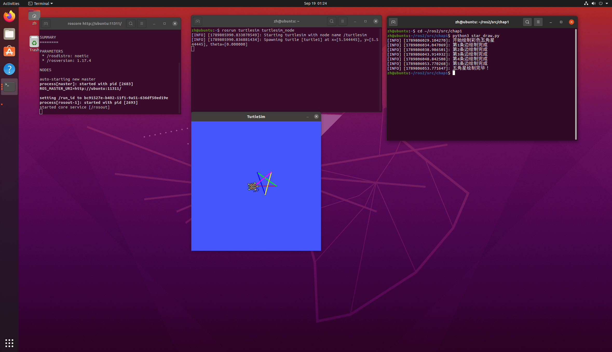

# 小海龟绘制彩色五角星实验报告
## 一、实验目的
1. 熟悉ROS Noetic环境，掌握ROS话题通信机制，使用发布器向`/turtle1/cmd_vel`话题发布速度指令，控制海龟运动。
2. 掌握ROS服务调用，使用`/turtle1/set_pen`服务动态修改画笔RGB颜色，实现彩色绘图。
3. 理解时序控制逻辑，通过定时方式控制海龟直行距离与旋转角度，完成五角星轨迹绘制。
4. 学会使用`rosnode`、`rostopic`、`rosservice`工具查看节点、话题、服务，验证ROS通信。

## 1.2 实验环境
|项目|配置|
| ---- | ---- |
|操作系统|Ubuntu 20.04（VMware虚拟机）|
|ROS发行版|ROS Noetic|
|仿真器|turtlesim|
|编程语言|Python 3（rospy）|
|功能包|turtle_motion|

功能包目录结构：
```text
turtle_motion/
├── package.xml        # 包清单，声明 rospy、geometry_msgs 和 turtlesim 依赖
├── CMakeLists.txt     # 编译配置，安装 Python 脚本
└── scripts/
    └── star_draw.py   # 主程序：控制小海龟绘制彩色五角星
```

## 二、核心控制原理与算法解析
### 2.1 ROS话题通信与服务调用
turtlesim仿真器启动后，海龟订阅`/turtle1/cmd_vel`话题，该话题消息类型为Twist，包含线速度linear与角速度angular。自定义节点作为发布者，向该话题发送速度指令，控制海龟前进、转向。
本实验额外调用`turtlesim`内置服务`/turtle1/set_pen`，服务参数：`r,g,b,width,off`。r/g/b为0~255的RGB颜色值，width设置画笔粗细，off=0开启画笔。在绘制每一条边前调用该服务切换颜色，实现五角星五条边色彩不同。

### 2.2 五角星几何原理
五角星外角为144°，程序循环执行5次：设置画笔颜色 → 直线前进 → 原地逆时针旋转144°。循环结束即可闭合五角星图形。
本程序采用**定时控制策略**：根据 `时间 = 距离 / 速度` 计算直行持续时间；根据 `时间 = 角度 / 角速度` 计算旋转持续时间，到达设定时间就停止运动。

### 2.3 算法流程
1. 初始化绘图节点`draw_star_node`
2. 等待`/turtle1/set_pen`画笔服务就绪
3. 创建速度消息发布器，设置发布频率50Hz
4. 循环5次：
    - 调用SetPen设置本条边RGB颜色
    - 发布线速度，海龟直行，计时结束后停止前进
    - 短暂延时稳定海龟
    - 发布角速度，海龟原地旋转144°，计时结束停止旋转
    - 短暂延时
5. 循环结束，打印绘制完成信息

## 三、完整源码展示
### 3.1 主程序 scripts/star_draw.py
```python
#!/usr/bin/env python3
# -*- coding: utf-8 -*-
# 小海龟绘制彩色五角星 ROS Noetic
import math
import rospy
from geometry_msgs.msg import Twist
from turtlesim.srv import SetPen
# 5种颜色，5条边
COLORS = [(255,0,0),(0,255,0),(0,0,255),(255,255,0),(255,0,255)]
def main():
    rospy.init_node('draw_star_node')
    # 等待画笔服务
    rospy.wait_for_service('/turtle1/set_pen')
    set_pen = rospy.ServiceProxy('/turtle1/set_pen', SetPen)
    # 速度发布器
    pub = rospy.Publisher('/turtle1/cmd_vel', Twist, queue_size=10)
    rate = rospy.Rate(50)
    twist = Twist()
    # 参数
    line_len = 2.0
    turn_angle_rad = 144 * math.pi / 180
    lin_speed = 1.0
    ang_speed = 1.0
    rospy.loginfo("开始绘制彩色五角星")
    for i in range(5):
        # 设置当前边颜色
        r,g,b = COLORS[i]
        set_pen(r,g,b,3,0)
        # 前进画边
        twist.linear.x = lin_speed
        twist.angular.z = 0.0
        end_time = rospy.Time.now() + rospy.Duration(line_len / lin_speed)
        while rospy.Time.now() < end_time and not rospy.is_shutdown():
            pub.publish(twist)
            rate.sleep()
        # 停下
        twist.linear.x = 0.0
        pub.publish(twist)
        rospy.sleep(0.2)
        # 转弯144度
        twist.angular.z = ang_speed
        end_time = rospy.Time.now() + rospy.Duration(turn_angle_rad / ang_speed)
        while rospy.Time.now() < end_time and not rospy.is_shutdown():
            pub.publish(twist)
            rate.sleep()
        # 停止转弯
        twist.angular.z = 0.0
        pub.publish(twist)
        rospy.sleep(0.2)
        rospy.loginfo(f"第{i+1}条边绘制完成")
    rospy.loginfo("五角星绘制完毕！")
if __name__ == '__main__':
    main()
```

### 3.2 构建文件 CMakeLists.txt
```cmake
cmake_minimum_required(VERSION 3.0.2)
project(turtle_motion)
find_package(catkin REQUIRED COMPONENTS
  rospy
  geometry_msgs
  turtlesim
)
catkin_package()
catkin_install_python(PROGRAMS
  scripts/star_draw.py
  DESTINATION ${CATKIN_PACKAGE_BIN_DESTINATION}
)
```

### 3.3 包清单 package.xml
```xml
<?xml version="1.0"?>
<!-- turtle_motion 功能包：小海龟自主绘制彩色五角星轨迹 -->
<package format="2">
  <name>turtle_motion</name>
  <version>0.0.0</version>
  <description>turtle_motion: 小海龟自主绘制彩色五角星轨迹功能包</description>
  <maintainer email="your_email@example.com">your_name</maintainer>
  <license>TODO</license>
  <buildtool_depend>catkin</buildtool_depend>
  <build_depend>rospy</build_depend>
  <build_depend>geometry_msgs</build_depend>
  <build_depend>turtlesim</build_depend>
  <exec_depend>rospy</exec_depend>
  <exec_depend>geometry_msgs</exec_depend>
  <exec_depend>turtlesim</exec_depend>
  <export>
  </export>
</package>
```

## 四、运行与验证
### 4.1 编译功能包
将`turtle_motion`功能包放入Catkin工作空间的src目录，终端依次执行：
```bash
chmod +x ~/catkin_ws/src/turtle_motion/scripts/star_draw.py
cd ~/catkin_ws
catkin_make
source devel/setup.bash
```

### 4.2 启动节点
打开**三个独立终端**
终端1：启动ROS核心
```bash
roscore
```
终端2：启动海龟仿真器
```bash
rosrun turtlesim turtlesim_node
```
终端3：运行五角星绘制程序
```bash
source ~/catkin_ws/devel/setup.bash
rosrun turtle_motion star_draw.py
```
程序启动后，海龟将依次绘制5条不同颜色的线条，形成彩色五角星。

 
### 4.3 话题和节点验证
保持程序运行状态，新开终端执行以下命令验证ROS通信。
1. 查看当前运行节点
```bash
rosnode list
```
预期输出：
```
/draw_star_node
/rosout
/turtlesim
```
`draw_star_node`为本实验自定义绘图节点，`turtlesim`是海龟仿真节点。

2. 查看全部话题
```bash
rostopic list
```
可看到核心话题：`/turtle1/cmd_vel`、`/turtle1/pose`。

3. 实时打印速度话题消息
```bash
rostopic echo /turtle1/cmd_vel
```
程序运行时交替输出两种消息：

直行状态：
```yaml
linear:
  x: 1.0
  y: 0.0
  z: 0.0
angular:
  x: 0.0
  y: 0.0
  z: 0.0
---
```

转弯状态：
```yaml
linear:
  x: 0.0
  y: 0.0
  z: 0.0
angular:
  x: 0.0
  y: 0.0
  z: 1.0
---
```
> 说明：直行时只有x方向线速度；转弯时只有z方向角速度。

4. 查看可用服务
```bash
rosservice list
```
能看到`/turtle1/set_pen`画笔服务。
```bash
rosservice info /turtle1/set_pen
```
程序在绘制每条边前调用该服务修改画笔RGB颜色。

## 五、参数调整
修改`star_draw.py`内参数，可调整图形效果：

|参数|作用|
| ---- | ---- |
|`line_len = 2.0`|五角星每条边的长度，数值越大图形越大|
|`lin_speed = 1.0`|海龟前进速度|
|`ang_speed = 1.0`|海龟旋转角速度|
|`COLORS`数组|修改五条边的RGB颜色|

> 注意：line_len不能设置过大，海龟碰到窗口边界会卡住，影响绘图。

## 六、实验总结
本次实验结合ROS话题通信与ROS服务调用，控制turtlesim小海龟绘制彩色五角星。

1. 通过`/turtle1/cmd_vel`话题发布Twist速度消息，实现海龟前进与原地旋转。
2. 调用`/turtle1/set_pen`服务动态修改画笔RGB色彩，实现每条边不同颜色，是本实验的特色。
3. 采用定时控制策略，循环5次完成五角星轨迹绘制。
4. 使用`rosnode`、`rostopic`、`rosservice`工具，验证节点、话题、服务通信正常。

实验发现定时方案会积累微小误差，图形末端存在轻微闭合偏差，后续可以使用pose订阅的闭环方式优化。
