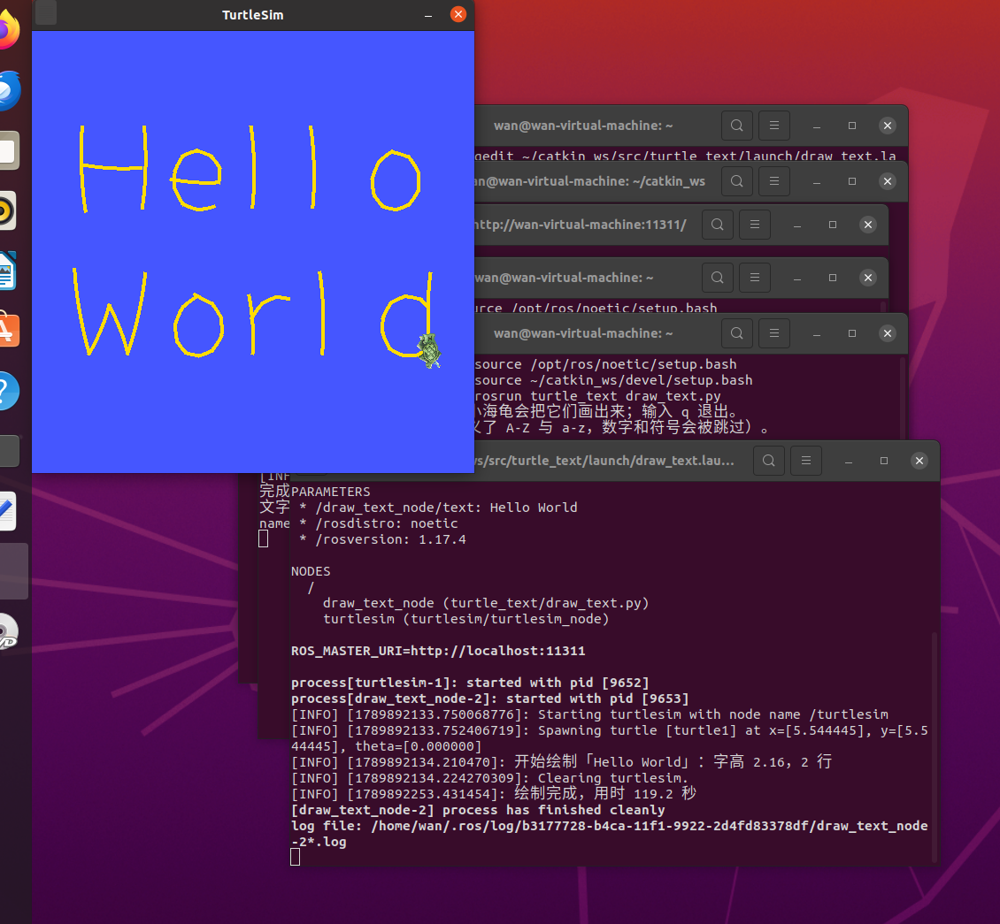

# 小海龟绘制任意文字

## 一、实验目的

本实验在 [小海龟自动绘制 OpenHUTB](turtle_hutb.md) 的基础上，把"绘制固定字形"扩展为"绘制任意文字"：

1. 在终端输入任意英文单词或短句，小海龟自动把它们绘制在画布上；
2. 掌握字形表的设计方法：把每个字母拆解为若干笔画，每一笔是一串按顺序经过的目标坐标；
3. 掌握简单的文字排版：根据内容长度自动计算字号，一行放不下时按单词折行；
4. 综合运用话题通信、服务调用与闭环控制完成绘制任务。

与实验 3 的区别在于：实验 3 的字样是写死在程序里的，本实验的**绘制内容由使用者输入决定**，程序需要自己完成"输入 → 排版 → 生成路径 → 绘制"的完整流程。

## 二、实验环境

| 项目 | 配置 |
| --- | --- |
| 操作系统 | Ubuntu 20.04（VMware 虚拟机） |
| ROS 发行版 | ROS Noetic |
| 仿真器 | turtlesim |
| 编程语言 | Python 3（rospy） |
| 功能包 | turtle_text |

功能包目录结构如下：

```text
turtle_text/
├── CMakeLists.txt         # 编译配置，安装 Python 脚本与 launch 文件
├── package.xml            # 包清单，声明 rospy、geometry_msgs、turtlesim、std_srvs 依赖
├── launch/
│   └── draw_text.launch   # roslaunch 入口：一键启动 turtlesim 与绘制节点
└── scripts/
   └── draw_text.py       # 主程序：字形表、排版算法与闭环控制
```

## 三、实现原理

### 3.1 使用的接口

| 接口 | 类型 | 用途 |
| --- | --- | --- |
| `/turtle1/pose` | 话题（订阅） | 获取小海龟的实时位置与朝向 |
| `/turtle1/cmd_vel` | 话题（发布） | 发布速度指令，控制前进与转向 |
| `/turtle1/set_pen` | 服务 | 抬起／落下画笔，设置颜色与线宽 |
| `/clear` | 服务 | 绘制前清空画布 |

### 3.2 字形表：把字母拆成笔画

每个字母由若干笔画组成，每一笔是一串按顺序经过的点。所有字母共用同一把尺子：基线在 y = 2，大写字母高 7 个单位，小写的 x 高（a、c、e、o 的高度）约 4.9 个单位，上升部（b、h、l）到 y = 9，下降部（g、p、q、y）落到 y = 0.2。

```python
RAW_LOWER_LETTERS = {
   "h": [[(3.0, 9.0), (3.0, 2.0)],
         [(3.0, 5.9), (3.9, 6.7), (5.2, 6.9), (6.2, 6.2), (6.5, 5.0), (6.5, 2.0)]],
   "t": [[(4.4, 8.2), (4.4, 3.0), (5.1, 2.1), (6.2, 2.1)],
         [(2.6, 6.3), (6.2, 6.3)]],
   ...
}
```

大写字形另有一张表。绘制时程序按目标字高**统一缩放**，并且**不用每个字母自己的外框**去归一化，否则小写字母的基线就会参差不齐。

### 3.3 排版：字号自适应与自动折行

画布固定为 11 x 11 且不能缩放，所以字号必须由内容长度决定。程序先按一行排，分别算出宽度允许的最大字高和高度允许的最大字高，取较小者：

```python
scale_w = avail_w / max_units
scale_h = avail_h / (1.0 + DESCENDER_RATIO + (count - 1) * (1.0 + LINE_RATIO))
return min(scale_w, scale_h, MAX_SCALE)
```

如果一行算出来的字高小于 1.6（字太小看不清），就改为按单词折成 2 到 3 行，取字高最大的那种方案。最后每一行水平居中、整块内容垂直居中，字距与行距都按字高的比例计算。

### 3.4 闭环控制：让海龟走直线

程序以约 10 毫秒为周期读取 `/turtle1/pose`，算出当前位置到目标点的方向误差。方向偏差较大时先原地转向，对准之后才前进，距离越近速度越低：

```python
err = self.wrap(math.atan2(dy, dx) - self.pose.theta)
cmd.angular.z = max(-w_max, min(w_max, 3.5 * err))
if abs(err) < 0.15:  # 对准方向后才前进
    cmd.linear.x = max(0.25, min(v_max, 2.0 * dist))
```

`if abs(err) < 0.15` 这一句很关键：它是"先对准再直走"的门坎。早期版本让海龟边走边拐，速度快但每一笔的起笔都会带出弧线，画出的小写字母会变形。收紧到约 8.6 度之后线条才够直。

### 3.5 抬笔与落笔

turtlesim 没有真正的抬笔动作，靠 `/turtle1/set_pen` 服务的 `off` 参数实现：笔画之间把 `off` 设为 1，移动到下一笔起点时不留痕迹；开始画之前再设为 0。另外线宽也随字号变化，大字用粗线、小字用细线：

```python
def set_pen(self, down, scale=2.0):
    width = int(max(2, round(PEN_RATIO * scale)))
    self.set_pen_srv(255, 220, 0, width, 0 if down else 1)
    time.sleep(0.05)
```

## 四、编译

```bash
mkdir -p ~/catkin_ws/src
cp -r <仓库路径>/src/chap1/turtle_text ~/catkin_ws/src/
cd ~/catkin_ws && catkin_make
source devel/setup.bash
```

编译成功后可用 `rospack find turtle_text` 确认包已被识别。

## 五、运行

### 5.1 一键启动并指定文字

```bash
roslaunch turtle_text draw_text.launch text:="Hello World"
```

`roslaunch` 会自动完成三件事：启动 ROS Master（无需单独运行 `roscore`）、拉起 turtlesim 仿真器、启动绘制节点，并把 `text` 参数传给节点。绘制完成后节点自动退出，小海龟窗口保留，便于查看结果；在终端按 `Ctrl+C` 结束本次 launch。

### 5.2 交互模式：手动输入任意文字

需要三个终端，都先 `source devel/setup.bash`：

```bash
# 终端 1
roscore
```

```bash
# 终端 2
rosrun turtlesim turtlesim_node
```

```bash
# 终端 3
rosrun turtle_text draw_text.py
```

终端 3 出现 `文字>` 提示符后输入内容并回车，例如 `hello`、`hutb`、`Hello World`，输入 `q` 退出。同一个单词可以反复输入，程序每次都会先清空画布再重新绘制。

## 六、实验结果

以 `Hello World` 为例，节点运行后终端依次输出：

```text
[INFO] [1789892134.210470]: 开始绘制「Hello World」：字高 2.16，2 行
[INFO] [1789892134.224270309]: Clearing turtlesim.
[INFO] [1789892253.431454]: 绘制完成，用时 119.2 秒
```

画布上出现上下两排文字：程序判断一行放不下，自动折成两行，字号由宽度决定。以下是实际绘制效果：



由于 turtlesim 的采样周期与转向误差，个别笔画的起止点可能有零点几个单位的偏差，属于正常现象。

## 七、参数调整

在 `scripts/draw_text.py` 顶部集中定义了几个可调参数：

| 参数 | 默认值 | 作用与效果 |
| --- | --- | --- |
| `SPEED` | 1.0 | 速度系数。调到 1.3 左右可明显缩短绘制时间，代价是转角变圆 |
| `PEN_RATIO` | 1.8 | 线宽 = 字高 × 该系数（像素），最小 2 像素 |
| `MARGIN` | 1.0 | 画布四周留白 |
| `GAP_RATIO` | 0.35 | 字距，单位是字高 |
| `LINE_RATIO` | 0.7 | 行距，单位是字高 |
| `MAX_LINES` | 3 | 最多折成几行 |
| `MAX_SCALE` | 3.0 | 字高上限，避免两个字母就占满整屏 |

不同输入在默认参数下的实测结果：

| 输入 | 字高 | 行数 | 用时 |
| --- | --- | --- | --- |
| `g` | 3.00 | 1 | 约 18 秒 |
| `hello` | 2.43 | 1 | 约 57 秒 |
| `Hello World` | 2.16 | 2 | 约 119 秒 |

可以看到，字号越大、笔画越多，用时越长。想演示快一点，把 `SPEED` 调到 1.3 再跑一次，对比用时的变化，就能直观体会到速度与精度的取舍。

## 八、常见问题

| 现象 | 原因与处理 |
| --- | --- |
| `Unable to register with master node ... master may not be running` | 用 `rosrun` 方式时需要先运行 `roscore`；用 `roslaunch` 则不需要 |
| `Package 'turtle_text' not found` 或 `rosrun` 找不到节点 | 没有加载工作空间环境，执行 `source ~/catkin_ws/devel/setup.bash` |
| 修改了 `draw_text.py` 但效果没变 | 重新运行节点即可（devel 空间里脚本直接指向源文件，不用重新 `catkin_make`），但要先停掉正在运行的旧节点 |
| 输入的字符没有被画出来 | 字形表目前只定义了 A-Z 与 a-z，数字和符号会被自动跳过并提示 |
| 线条弯曲、字母变形 | 检查 `goto` 中的 `if abs(err) < 0.15` 是否被改大；该值越大线条越不直 |
| 绘制太慢 | 适当调大 `SPEED`，或在 `draw_text.py` 中把 `time.sleep` 的周期调小 |
| 画完之后小海龟窗口自动关闭 | launch 文件中绘制节点带了 `required="true"`，删掉该属性即可保留窗口 |
| 切换输入内容后画布没有清空 | `/clear` 服务调用失败，检查 turtlesim 是否正常运行 |

## 九、总结

本实验把"绘制固定图形"推进到"绘制任意文字"，核心是三件事：**用统一的坐标尺度描述字形**、**按画布约束自动排版**、**用闭环控制把每一段路径走直**。实验中用到的 `/turtle1/pose` 订阅、`/turtle1/cmd_vel` 发布、`/turtle1/set_pen` 与 `/clear` 服务调用，正是 ROS 中最基础的两类通信方式：需要持续控制量时用话题，需要一次性明确结果的操作（换笔、清屏）用服务。

在此基础上还可以继续扩展：为数字和符号补充字形，实现画坐标轴、画公式；或者把笔画之间的"抬笔走过去"换成 `/turtle1/teleport_absolute` 瞬移，对比两者在速度与真实感上的差别。
