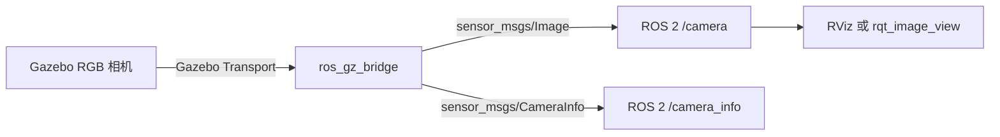

# ROS 2 Humble 仿真相机：启动与实时图像查看

本文介绍在 Ubuntu 22.04 与 ROS 2 Humble 中启动 Gazebo 仿真相机、检查 ROS 2 图像话题并查看实时画面的完整流程。本文不涉及录包，录包与回放见后续章节。

## 1. 系统组成



仿真相机生成 RGB 图像，`ros_gz_bridge` 将图像和相机标定信息转换为 ROS 2 消息。

## 2. 环境要求与安装

需要 Ubuntu 22.04 桌面版、ROS 2 Humble 和可访问的 ROS 软件源。加载环境并确认发行版：

```bash
source /opt/ros/humble/setup.bash
echo "$ROS_DISTRO"
```

应输出 `humble`。安装仿真示例包（依赖会自动拉取 Gazebo Fortress、`ros_gz` 桥接、RViz2 和 `rqt-image-view`，无需逐个安装）：

```bash
sudo apt update
sudo apt install -y ros-humble-ros-gz-sim-demos
```

验证安装：

```bash
ros2 pkg prefix ros_gz_sim_demos   # 应输出 /opt/ros/humble
ign gazebo --version               # 应输出 Gazebo Sim, version 6.x（Fortress）
```

若找不到 Humble，请先参考 [ROS 2 Humble 安装文档](https://docs.ros.org/en/humble/Installation/Ubuntu-Install-Debs.html)。

> **实测踩坑：依赖 `comerr-dev` 版本不匹配**
>
> 安装时若报 `comerr-dev : 依赖: libcom-err2 (= 1.46.5-2ubuntu1.1) 但是 1.46.5-2ubuntu1.2 正要被安装`，原因是 `/etc/apt/sources.list` 缺少 `jammy-updates` 源（系统里的 `libcom-err2 1.2` 来自该源）。补上后重试即可：
>
> ```bash
> echo "deb https://mirrors.tuna.tsinghua.edu.cn/ubuntu jammy-updates main restricted universe multiverse" | sudo tee -a /etc/apt/sources.list
> sudo apt update
> ```

## 3. 启动仿真并检查话题

终端 A：

```bash
source /opt/ros/humble/setup.bash
ros2 launch ros_gz_sim_demos camera.launch.py
```

该启动文件加载 `camera_sensor.sdf`、启动桥接节点并默认打开 RViz。终端 B 检查相机话题：

```bash
source /opt/ros/humble/setup.bash
ros2 topic list -t
ros2 topic info /camera
ros2 topic hz /camera
```

应能看到 `/camera [sensor_msgs/msg/Image]` 和 `/camera_info [sensor_msgs/msg/CameraInfo]`，并观察到图像话题持续发布（实测约 27 Hz）。

> **注意：** Humble 的 `ros2 topic hz` 不支持 `--qos-reliability` 参数（会报 `unrecognized arguments`）。其内部默认使用 `sensor_data` QoS 订阅，与相机发布端的 best_effort 自动兼容，直接运行即可。

## 4. 查看实时画面

启动文件默认打开 RViz，其中已订阅 `/camera` 的 Image 显示项。也可运行图像查看器，并在窗口的 topic 下拉框选择 `/camera`：

```bash
source /opt/ros/humble/setup.bash
ros2 run rqt_image_view rqt_image_view
```

> **Wayland 会话说明（实测 Ubuntu 22.04 GNOME Wayland）：** 直接运行即可。Gazebo 和 RViz 的 Qt 界面会自动通过 XWayland 显示（日志中 `Ignoring XDG_SESSION_TYPE=wayland` 与 `libEGL warning: egl: failed to create dri2 screen` 为无害警告，不影响画面）。仅当窗口无法弹出或黑屏时，再尝试在启动前设置 `export QT_QPA_PLATFORM=xcb`。

查看官方启动文件可了解仿真、桥接和 RViz 的组合方式：

```bash
sed -n '1,220p' "$(ros2 pkg prefix --share ros_gz_sim_demos)/launch/camera.launch.py"
```

**仿真启动后效果：**

- Gazebo 窗口：左上角为世界视图（网格地面、红色方块、绿色小球、交通锥），右上角 Image display 插件实时显示 `/camera` 画面。


- RViz2 窗口自动打开，Camera 与 Image 两个显示面板均订阅 `/camera`，Status 显示 Ok，右下角帧率约 31 fps。


## 5. 实测结果

以下数据在 Ubuntu 22.04.5 LTS（GNOME Wayland 会话）与 ROS 2 Humble 环境下实测得到：

| 项目 | 实测结果 |
| --- | --- |
| Ubuntu / ROS 2 版本 | Ubuntu 22.04.5 LTS / ROS 2 Humble |
| Gazebo 版本 | Gazebo Fortress 6.18.0 |
| `/camera` 消息类型 | `sensor_msgs/msg/Image`（320×240，frame_id `camera/link/camera`） |
| `/camera_info` 消息类型 | `sensor_msgs/msg/CameraInfo` |
| `/camera` 发布频率 | 约 27.4 Hz |
| 是否看到实时图像 | 是（Gazebo Image display 与 RViz2 均正常显示） |

## 参考资料

- [ROS Index：Humble 的 ros_gz_sim_demos](https://index.ros.org/p/ros_gz_sim_demos/)
- [ros_gz Humble 相机示例](https://github.com/gazebosim/ros_gz/blob/humble/ros_gz_sim_demos/README.md)
- [相机 launch 文件](https://github.com/gazebosim/ros_gz/blob/humble/ros_gz_sim_demos/launch/camera.launch.py)
