# ROS Noetic + Gazebo 11 阿克曼（Ackermann）四轮小车仿真

> 本文是我在 Ubuntu 20.04 上从零完成阿克曼四轮小车 Gazebo 仿真的完整实践记录：自己搭建 URDF/xacro 模型与功能包，使用 ros_control 完成速度 / 转向控制，并在 Rviz 中调通**摄像头、激光雷达、IMU** 三个传感器的数据可视化。文中完整记录了从环境安装到三个传感器全部验证通过的过程，以及中间踩过的所有坑和解决办法。

## 实践环境

| 项目 | 版本 / 说明 |
| --- | --- |
| 操作系统 | Ubuntu 20.04（虚拟机） |
| ROS 发行版 | ROS Noetic（`rosversion -d` 为 noetic，客户端版本 1.17.4） |
| 物理仿真 | Gazebo 11.15.3（Noetic 自带，**不要装 Gazebo9**） |
| 可视化 | Rviz 1.14.26 |
| 渲染 | 虚拟机 llvmpipe 软渲染（Stereo NOT supported 属正常现象） |
| 工作空间 | `~/catkin_ws` |
| 功能包 | `smartcar_description`、`smartcar_control` |

工程在工作空间 `src/` 下分为两个功能包：`smartcar_description` 负责模型、URDF/xacro、Gazebo 传感器插件、launch 与 Rviz 配置；`smartcar_control` 负责 ros_control 控制器配置与键盘控制节点。

最终效果：蓝色阿克曼小车在 Gazebo 中落地，键盘可控制前进、后退、转向；激光雷达扫描点在 Rviz 中与障碍物一一对应，摄像头能拍到车头前方的方块，IMU 以约 100Hz 输出姿态与加速度。

---

## 目录

1. [Gazebo11 安装与 ROS 桥接验证](#1-gazebo11-ros)
2. [工程搭建与编译](#2)
3. [xacro 旧语法兼容修复（Noetic 必踩）](#3-xacro-noetic)
4. [启动仿真与 ros_control 控制器](#4-ros_control)
5. [键盘控制小车](#5)
6. [Rviz 模型显示与前轮 TF 断裂修复](#6-rviz-tf)
7. [激光雷达"自扫"故障排查与修复（重点）](#7)
8. [Rviz 激光点云可视化](#8-rviz)
9. [摄像头可视化](#9)
10. [IMU 验证](#10-imu)
11. [Gazebo 使用技巧](#11-gazebo)
12. [完整启动顺序速查](#12)
13. [踩坑清单汇总](#13)

---

## 1. Gazebo11 安装与 ROS 桥接验证

安装 ROS Noetic 桌面完整版时已经自带 Gazebo11，确认版本：

```bash
gazebo --version
# 应显示 Gazebo multi-robot simulator, version 11.x.x
```

单独启动一次 Gazebo，确认能打开空世界：

```bash
gazebo
```

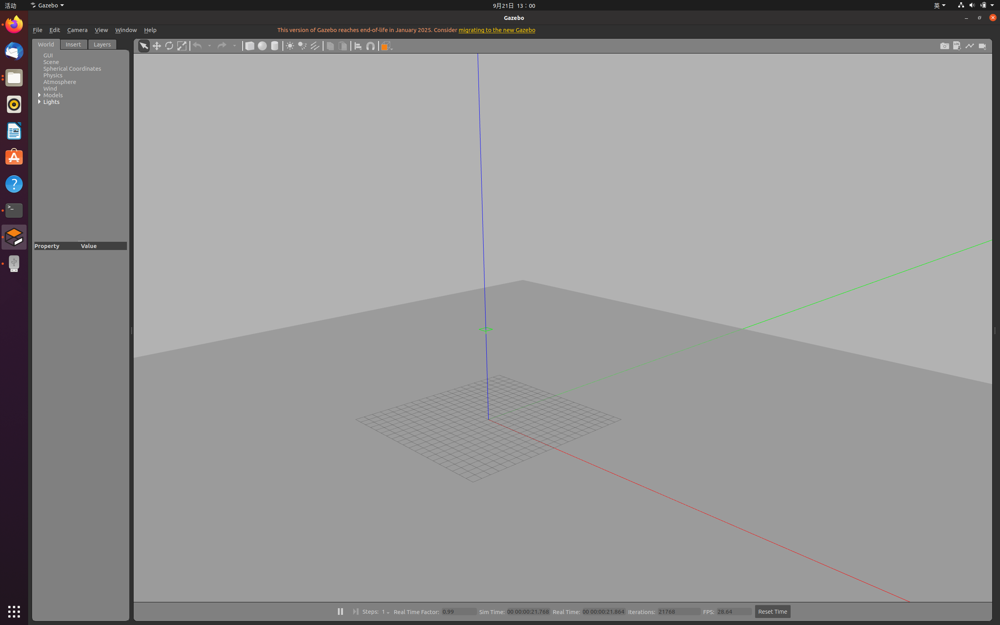

仅有 Gazebo 还不够，ROS 与 Gazebo 通信需要桥接插件。安装：

```bash
sudo apt update
sudo apt install ros-noetic-gazebo-ros-pkgs ros-noetic-gazebo-ros-control
```

**不要用裸 `gazebo` 命令启动后再 `rosrun`**：Gazebo 是单例的，先启动的不带 ROS 插件的实例会被复用，导致 ROS 话题注册不上。标准方式是用 launch 启动：

```bash
# roscore 会被自动拉起
roslaunch gazebo_ros empty_world.launch
```

启动时终端应能看到 `Loading gazebo_ros_api_plugin` 和 `gazebo_ros_paths_plugin`。新开终端验证话题：

```bash
rostopic list
```

出现 `/gazebo/model_states`、`/gazebo/link_states`、`/clock`、`/gazebo/set_model_state` 等一堆话题，说明 ROS ↔ Gazebo 通信打通：

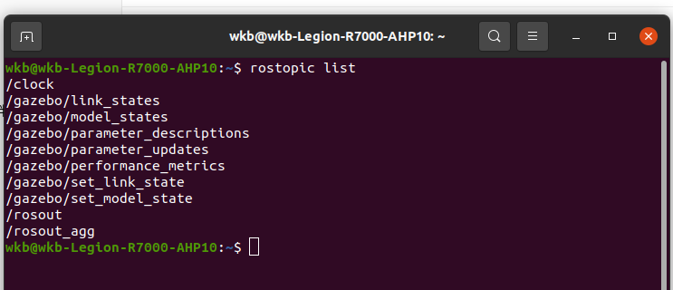

> 如果先误启动了裸 Gazebo，执行 `killall gzserver gzclient` 杀干净，再用 launch 启动。

---

## 2. 工程搭建与编译

### 2.1 功能包结构

在工作空间 `src/` 下建立两个功能包，目录结构如下：

```text
~/catkin_ws/src/
├── smartcar_description/   # URDF/xacro 模型、Gazebo 传感器插件、launch、Rviz 配置
└── smartcar_control/       # ros_control 控制器 yaml、键盘控制节点
```

```bash
cd ~/catkin_ws/src
mkdir -p smartcar_description smartcar_control
```

### 2.2 补齐 package.xml 与 CMakeLists.txt

`smartcar_description` 包需要 catkin 包描述文件，我编写了一个最小可用版本。

`smartcar_description/package.xml`：

```xml
<?xml version="1.0"?>
<package format="2">
  <name>smartcar_description</name>
  <version>0.0.0</version>
  <description>The smartcar_description package</description>
  <maintainer email="wkb@todo.todo">wkb</maintainer>
  <license>TODO</license>

  <buildtool_depend>catkin</buildtool_depend>

  <exec_depend>urdf</exec_depend>
  <exec_depend>xacro</exec_depend>
  <exec_depend>joint_state_publisher</exec_depend>
  <exec_depend>robot_state_publisher</exec_depend>
  <exec_depend>rviz</exec_depend>
</package>
```

`smartcar_description/CMakeLists.txt` 最小版本：

```cmake
cmake_minimum_required(VERSION 3.0.2)
project(smartcar_description)

find_package(catkin REQUIRED)

catkin_package()
```

### 2.3 编译

```bash
cd ~/catkin_ws
catkin_make
source devel/setup.bash
```

看到 `[100%] Built target smartcar_control_gazebo` 即编译成功：

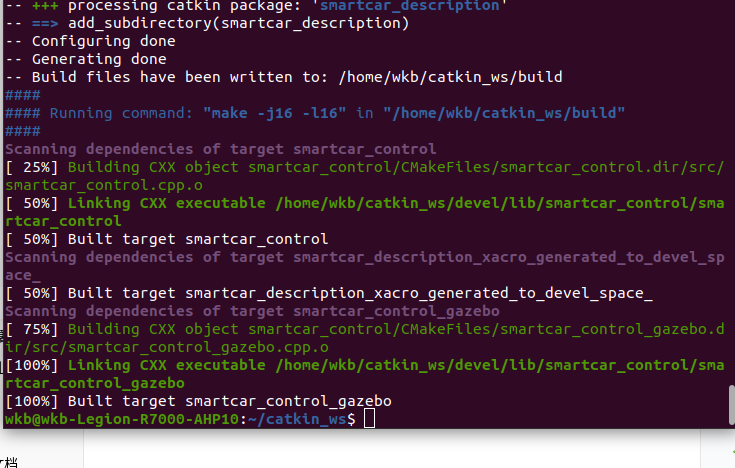

建议把 source 写进 `~/.bashrc`，之后每个新终端自动生效：

```bash
echo "source ~/catkin_ws/devel/setup.bash" >> ~/.bashrc
```

---

## 3. xacro 旧语法兼容修复（Noetic 必踩）

工程中的 URDF/xacro 基于较早的 ROS 语法编写，而 Noetic 的 xacro 要求所有 xacro 标签必须带 **`xacro:` 命名空间前缀**，否则启动时报类似错误：

```
No link elements found. Check the URDF
xacro: undefined macro ...
```

模型无法加载，spawn_model 节点直接死亡。

需要修改 `urdf/xacro/` 下的文件：

1. `<include filename="..."/>` 改为 `<xacro:include filename="..."/>`；
2. 宏调用如 `<cylinder_inertial_matrix .../>` 改为 `<xacro:cylinder_inertial_matrix .../>`（本工程共有 9 处）；
3. 宏定义 `<macro name="...">` 改为 `<xacro:macro name="...">`；
4. 属性定义 `<property ...>` 改为 `<xacro:property ...>`。

入口文件 `smartcar.xacro` 最终为如下 7 行结构：

```xml
<?xml version="1.0"?>
<robot name="smartcar" xmlns:xacro="http://www.ros.org/wiki/xacro">

  <xacro:include filename="$(find smartcar_description)/urdf/xacro/smartcar_body.xacro" />
  <xacro:include filename="$(find smartcar_description)/urdf/xacro/smartcar_sim.xacro" />

  <xacro:smartcar_body />
  <xacro:smartcar_sim />

</robot>
```

> 排查技巧：可以用 `xacro xxx.xacro > /tmp/out.urdf` 手动展开，xacro 的语法错误会直接在终端报出具体行号；另外注意 `smartcar_body.xacro` 里不要残留旧的 `<include ...smartcar_sim.xacro>` 重复包含。

---

## 4. 启动仿真与 ros_control 控制器

### 4.1 启动

```bash
source ~/catkin_ws/devel/setup.bash
roslaunch smartcar_description smartcar_gazebo.launch
```

这个 launch 会依次完成：启动 Gazebo 空世界、把 xacro 展开后的 URDF 载入 `/robot_description`、加载控制器配置 `smartcar_joint.yaml`、spawn 模型、启动 robot_state_publisher。

成功的两个关键标志：

1. 日志出现：

```text
Spawn status: SpawnModel: Successfully spawned entity
```

2. 五个控制器全部 `Loaded` 并 `Started`：

```text
Loaded controllers: joint_state_controller, rear_right_velocity_controller,
rear_left_velocity_controller, right_bridge_position_controller,
left_bridge_position_controller
Started controllers: ...（同上五个）
```

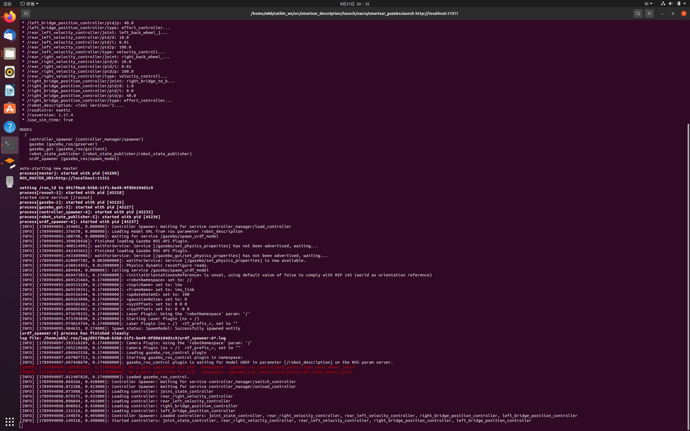

Gazebo 中出现蓝色阿克曼小车：

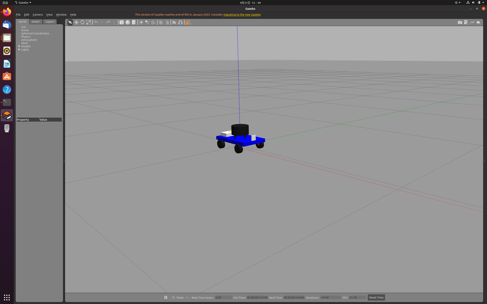

### 4.2 可以忽略的报错

日志里可能有两行红色 ERROR：

```text
[ERROR] No p gain specified for pid.
Namespace: /gazebo_ros_control/pid_gains/right_back_wheel_joint
Namespace: /gazebo_ros_control/pid_gains/left_back_wheel_joint
```

这是控制器 yaml 中速度环没有配置 PID gain 的老提示，轮子用的是速度接口，**不影响运动控制，实测小车可以正常跑，忽略即可**。

---

## 5. 键盘控制小车

新开一个终端：

```bash
source ~/catkin_ws/devel/setup.bash
roslaunch smartcar_control smartcar_gazebo_controller.launch
```

节点启动后持续打印四个轮速 / 转角，静止时全为 0：

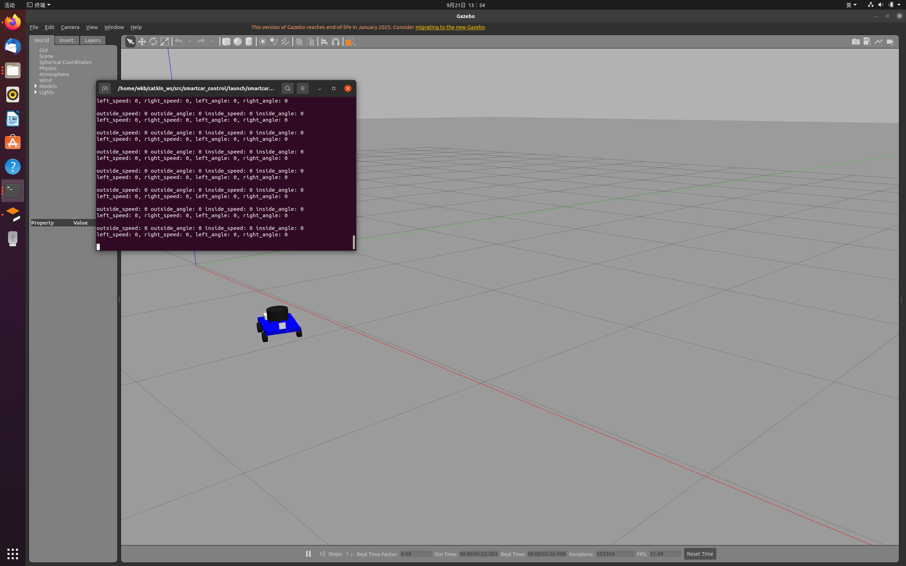

**用鼠标点一下该终端窗口**（键盘事件必须被终端接收），并切换到英文输入法，按键如下：

| 按键 | 动作 |
| --- | --- |
| `w` / `s` | 前进 / 后退（可连续点按加速） |
| `e` / `q` | 前进时左转 / 右转 |
| `z` / `c` | 后退时左转 / 右转 |
| `空格` | 立即停车 |
| `Ctrl+C` | 退出控制节点 |

典型操作：连按几下 `w` 直线起步 → 按 `e`/`q` 转向绕开障碍物 → 空格停车。

---

## 6. Rviz 模型显示与前轮 TF 断裂修复

### 6.1 打开 Rviz

```bash
rviz -d $(rospack find smartcar_description)/config/smartcar.rviz
```

Rviz 配置文件中 Fixed Frame 为 `base_link`，默认只带了 Grid、RobotModel、TF 三个显示项。

### 6.2 RobotModel 报错：两个前轮自转关节没有状态

刚打开时 RobotModel 可能是红色 Error。原因是模型里有 6 个非 fixed 关节：

- 左右后轮 `left/right_back_wheel_joint`（continuous，接了 VelocityJointInterface 的 transmission）；
- 左右桥转向关节 `left/right_bridge...`（revolute，接了 EffortJointInterface 的 transmission）；
- **两个前轮自转关节 `left/right_front_wheel_to_bridge`（continuous，没有接 transmission）**。

Gazebo 的 `joint_state_controller` 只发布带 transmission 的 4 个关节，两个前轮关节永远没有状态，TF 树在这两处断裂，Rviz 无法拼出完整模型。

运行官方的 joint_state_publisher 可以临时补全：

```bash
sudo apt install ros-noetic-joint-state-publisher   # 如未安装
rosrun joint_state_publisher joint_state_publisher
```

运行后 RobotModel 变绿、四轮完整：

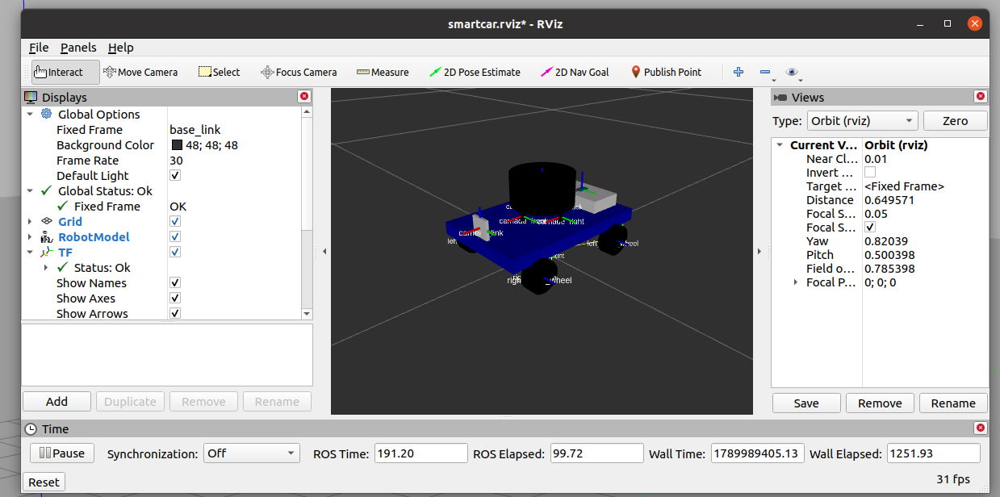

### 6.3 但会刷 TF_REPEATED_DATA 警告

官方 JSP 会把**所有**可动关节（包括 Gazebo 已经在发布的 4 个主动关节）再发一遍，robot_state_publisher 收到重复时间戳的数据后疯狂刷屏：

```text
TF_REPEATED_DATA ignoring data with redundant timestamp for frame
left_back_wheel (parent base_link) ... according to authority unknown_publisher
```

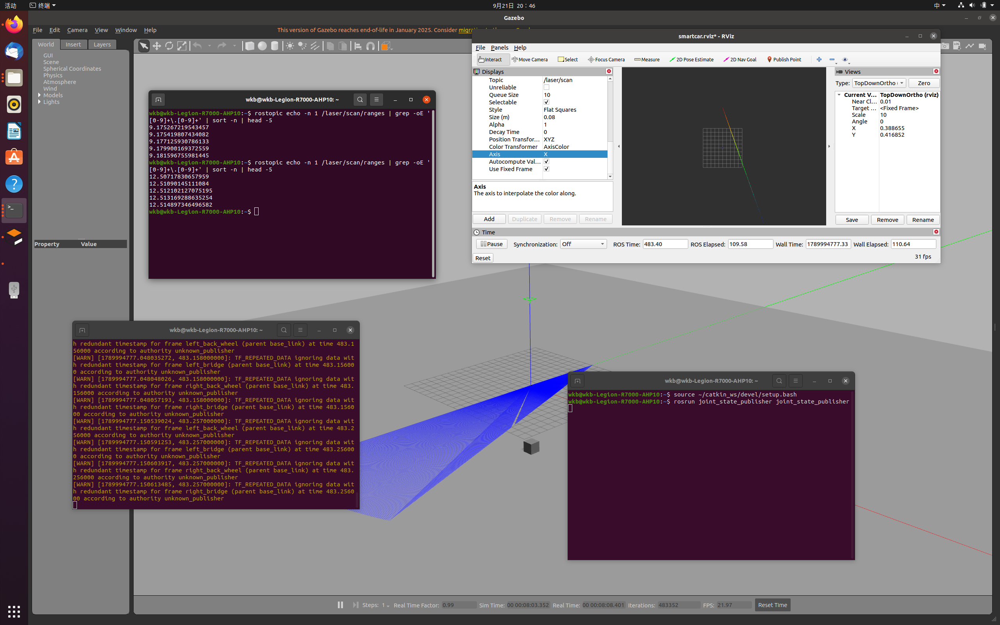

### 6.4 正确做法：只发布两个前轮的专用节点

在 `smartcar_control/scripts/` 下新建 `front_wheel_jsp.py`，只以 50Hz 发布两个前轮关节的 0 值：

```python
#!/usr/bin/env python3
import rospy
from sensor_msgs.msg import JointState

rospy.init_node('front_wheel_jsp')
pub = rospy.Publisher('/joint_states', JointState, queue_size=10)

m = JointState()
m.name = ['right_front_wheel_to_bridge', 'left_front_wheel_to_bridge']
m.position = [0.0, 0.0]
m.velocity = [0.0, 0.0]

r = rospy.Rate(50)
while not rospy.is_shutdown():
    m.header.stamp = rospy.Time.now()
    pub.publish(m)
    r.sleep()
```

赋可执行权限并运行（Python 脚本无需 catkin_make）：

```bash
chmod +x ~/catkin_ws/src/smartcar_control/scripts/front_wheel_jsp.py
rosrun smartcar_control front_wheel_jsp.py
```

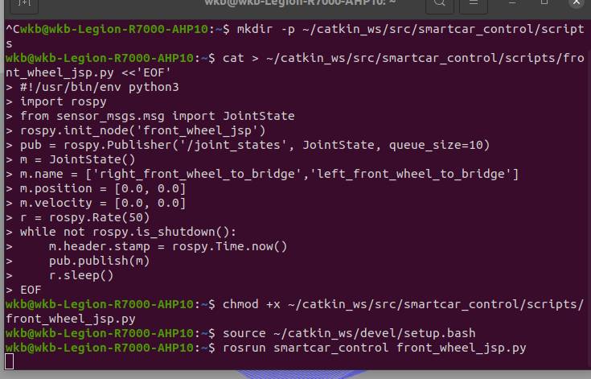

这个节点只补两个前轮、不碰 Gazebo 负责的 4 个主动关节，刷屏警告消失，RobotModel 四轮完整。**以后用它替代官方 joint_state_publisher。**

---

## 7. 激光雷达"自扫"故障排查与修复

这是整个工程最隐蔽的一个坑，现象是激光数据看似正常发布，但所有距离值都等于最小量程。

### 7.1 现象

在 Rviz 中 `Add → By topic → /laser/scan → LaserScan` 后，点云是一团**紧贴车身的红色点团**，而不是周围环境：

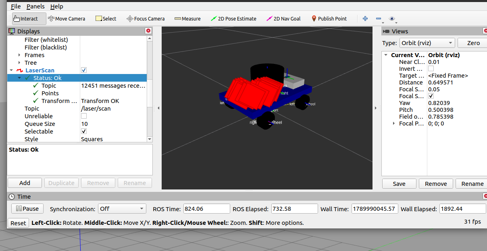

话题频率正常（约 40Hz，配置为 40Hz）：

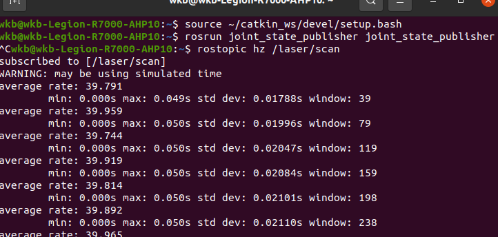

但查看最近的 20 个有效回波，全部是 `0.10000000149011612`，恰好等于雷达配置的 `range_min = 0.10m`：

```bash
rostopic echo -n 1 /laser/scan/ranges | grep -oE '[0-9]+\.[0-9]+' | sort -n | head -20
```

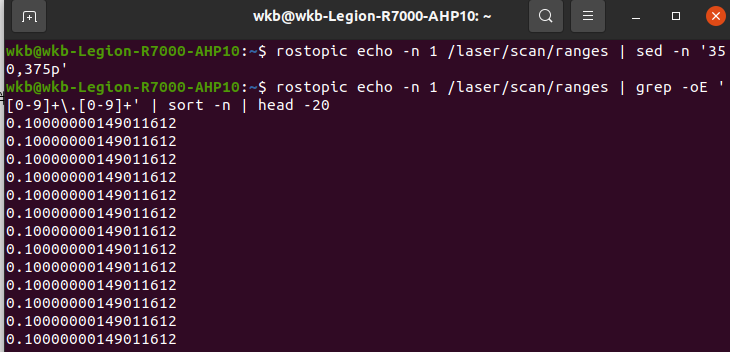

720 束激光中有 600 多束都打在了 0.1m 处：

```bash
rostopic echo -n 1 /laser/scan/ranges | grep -oE '[0-9]+\.[0-9]+' | wc -l
# 655
```

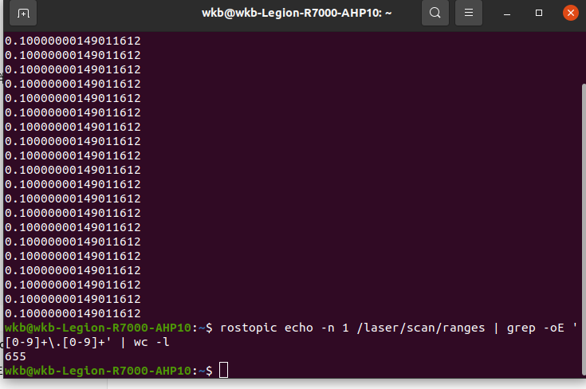

### 7.2 根因：激光打到了自己的外壳

`laser_link` 上除了 visual（黑色圆柱外壳）和 inertial 之外，**还自带了一个半径 0.05m、高 0.05m 的圆柱 collision**。而 ray 传感器的原点就在这个圆柱的中心，于是每一束水平射线刚发出来就打在了自己外壳的内壁上，距离被钳位到最小量程 0.1m——相当于雷达一直在"扫描自己"。

### 7.3 修复：删除 laser_link 的 collision（保留 visual 和 inertial）

先备份，再用 sed 只删除 `laser_link` 链接块内的 collision：

```bash
cd ~/catkin_ws/src/smartcar_description/urdf/xacro
cp smartcar_body.xacro smartcar_body.xacro.bak

sed -i '/<link name="laser_link">/,/<\/link>/ { /<collision>/,/<\/collision>/d }' smartcar_body.xacro
```

验证该链接块内 collision 数量为 **0**：

```bash
grep -A15 'name="laser_link"' smartcar_body.xacro | grep -c collision
# 0
```

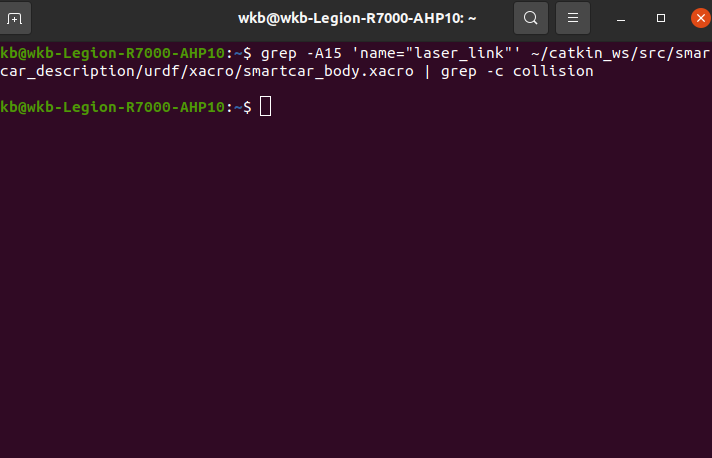

### 7.4 确认运行时加载的是新模型（URDF 只在启动时读取）

URDF 只在 roslaunch 启动时读取一次，**改完文件不彻底重启就不会生效**。重启后可以从参数服务器核对运行时模型：

```bash
# 整个模型的 collision 总数（修复前 15，修复后应为 14）
rosparam get /robot_description | sed 's/\\n/\n/g' | grep -c "<collision>"
# 14

# 精确查看 laser_link 块，应只有 visual 和 inertial，没有 collision
rosparam get /robot_description | sed 's/\\n/\n/g' | awk '/<link name="laser_link">/,/<\/link>/'
```

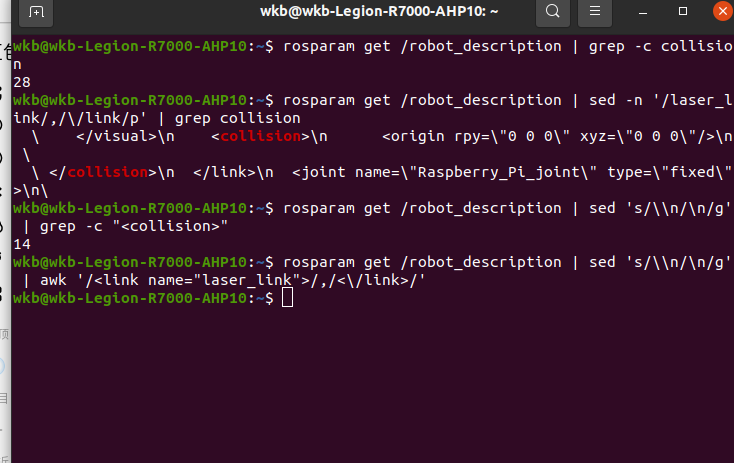

> 注意：`rosparam get /robot_description` 输出的是带字面 `\n` 的单行 YAML，直接管道给 sed/awk 的行范围会吞掉全文，**必须先 `sed 's/\\n/\n/g'` 还原成多行**。

如果怀疑旧进程残留，彻底杀干净再重启：

```bash
killall gzserver gzclient
ps aux | grep -E "gzserver|gzclient" | grep -v grep   # 应无输出
```

### 7.5 打开 Gazebo 射线可视化做直观验证

把传感器配置里的 `<visualize>` 改成 true，可以在 Gazebo 中直接看到每一束射线：

```bash
sed -i 's|<visualize>false</visualize>|<visualize>true</visualize>|g' smartcar_sim.xacro
grep -n visualize smartcar_sim.xacro
# 摄像头、激光两处均变为 <visualize>true</visualize>
```

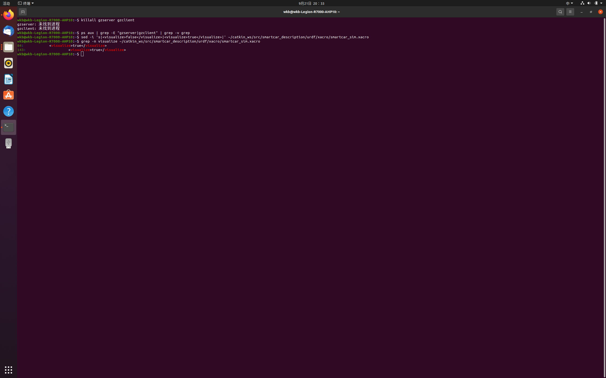

重启仿真后：

- **空旷世界**：蓝色射线呈完整的前向 180° 扇形射向远方，最近回波约 **9.17m**（少量水平射线在远处与地面交汇，属正常现象）：

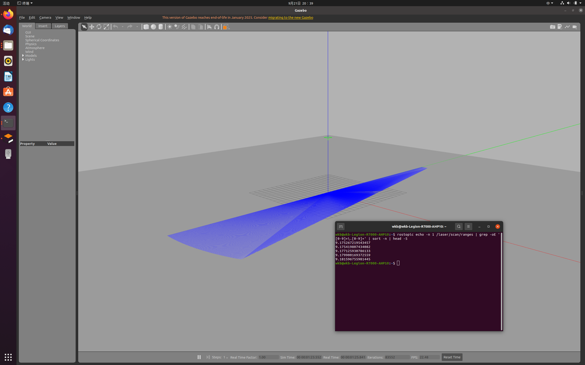

- **放入方块后**：射线在方块位置被切断，方块后方出现楔形盲区阴影，回波距离随方块位置变化（图中约 12.5m）：

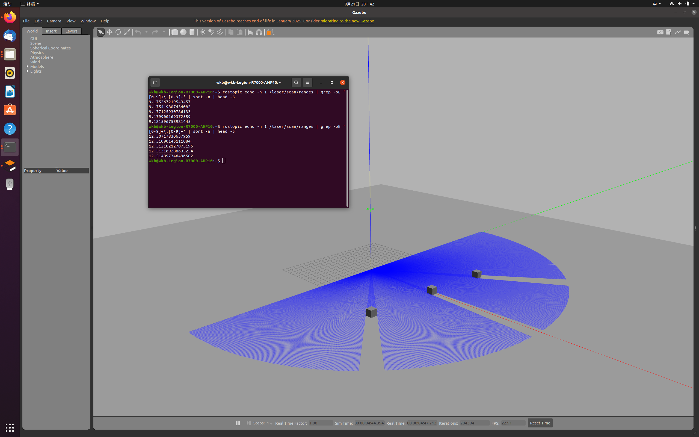

至此激光自扫故障彻底解决。

> 收尾时若不想在 Gazebo 中一直看到射线扇形，把 `<visualize>` 改回 false 再重启即可，不影响话题数据：
>
> ```bash
> sed -i 's|<visualize>true</visualize>|<visualize>false</visualize>|g' smartcar_sim.xacro
> ```

---

## 8. Rviz 激光点云可视化

### 8.1 添加 LaserScan 并设置参数

`Add → By topic → /laser/scan → LaserScan → OK`，推荐参数：

| 参数 | 推荐值 | 说明 |
| --- | --- | --- |
| Style | Flat Squares | 平面方块点 |
| Size (m) | 0.03（近景）/ 0.2~0.5（远景俯瞰） | 点大小，远景要调大否则只有一个像素 |
| Color Transformer | AxisColor，Axis 选 X | 按距离彩虹渐变：近处洋红、远处青蓝 |
| Position Transformer | XYZ | |
| Use Fixed Frame | 勾选 | |

> **Noetic 的 Rviz 没有 RangeColor 选项**，按距离着色用 AxisColor 即可；`Use rainbow` 复选框只在 IntensityColor 模式下才有。

### 8.2 正交俯视图参数

右侧 Views 面板 Type 选 `TopDownOrtho`（正交俯视），设置以下数值，**每改一个都要按回车确认**：

- `X` = 0，`Y` = 0（视图中心对准车，车在世界原点）；
- `Angle` = 0；
- `Scale` = 视野覆盖的米数（看全车周围设 8~10，看远处障碍设 20~25）。

Angle=0 时车头红轴 X 朝向屏幕右方，激光的前向 180° 扇形在右半侧展开，扫描弧在画面中呈竖直走向。

### 8.3 点云与障碍物一一对应

在 Gazebo 中把一个方块放到车头正前方 2m（精确方法见 [11.2 节](#112)）：

- Gazebo 中射线在方块处被切断、后方留下楔形阴影；
- Rviz 俯视图中，3 点钟方向（正前方）的扫描弧向车身凸出到 2m 位置，凸出点后面出现缺口。

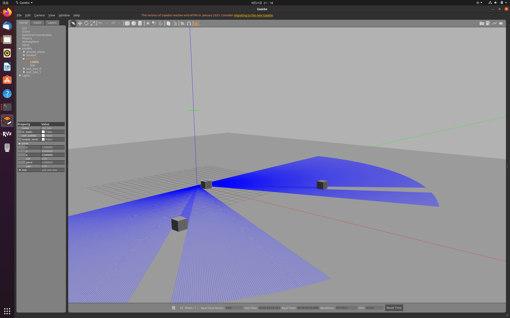

多个方块时，激光扫到方块相邻的正面和侧面，点云会拼出方块角部的 L 形 / F 形轮廓——这正是激光雷达识别障碍物形状的原理：

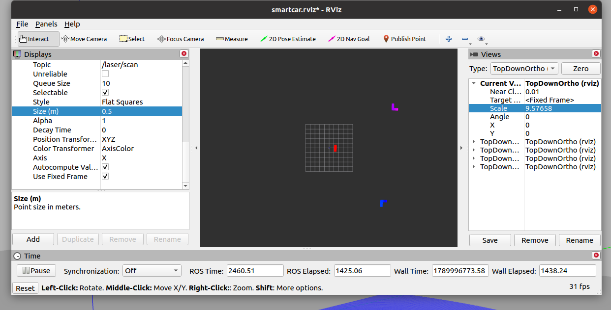

在 Gazebo 中拖动方块，Rviz 中对应的凸出点会同步移动。调好显示后按 `Ctrl+S`（`File → Save Config`）保存配置，下次打开无需重新添加。

> 视角找不到内容时：把 Type 切回 `Orbit` 后点 `Zero` 复位，再用滚轮缩放；俯视图参数输入后必须回车才生效。

---

## 9. 摄像头可视化

模型中摄像头话题为 `/camera/image_raw`（800×800，R8G8B8，约 30Hz，frame 为 `camera_link`）。

最简单的查看方式：

```bash
rqt_image_view /camera/image_raw
```

在下拉框选择 `/camera/image_raw`，即可看到车头视角画面。下图中正前方 2m 的方块占画面主体，左下角为另一个方块，下方灰色区域为地面：

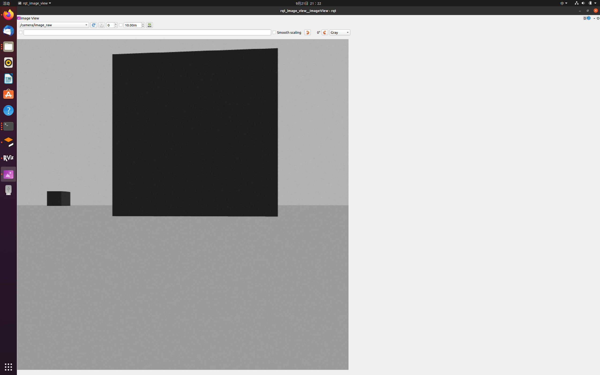

也可以在 Rviz 中 `Add → By topic → /camera/image_raw → Camera`，把图像面板和点云放在同一个界面里。

验证话题频率：

```bash
rostopic hz /camera/image_raw
# 平均约 30Hz
```

> 虚拟机 llvmpipe 软渲染下偶尔黑屏 / 帧率低是渲染性能问题，只要 `rostopic hz` 有稳定数据即说明摄像头插件正常。

---

## 10. IMU 验证

IMU 话题为 `/imu`（配置 100Hz，frame 为 `imu_link`）。

查看频率（虚拟机实时率约 0.9~1.0，实测约 98Hz）：

```bash
rostopic hz /imu
```

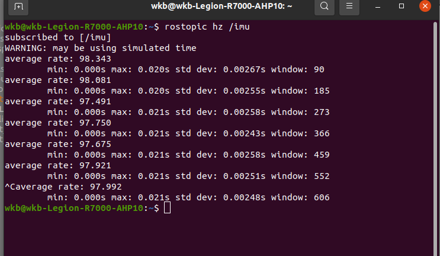

查看一帧数据：

```bash
rostopic echo /imu -n 1
```

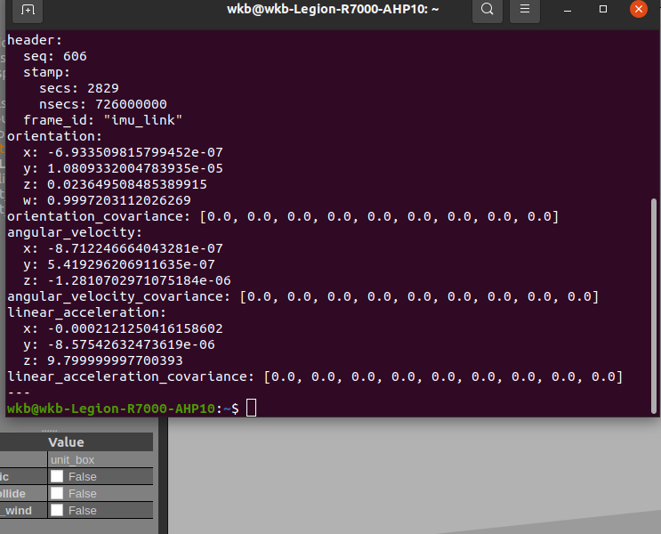

静止状态下的正确表现：

- `angular_velocity`（角速度）三个分量均为 1e-6 量级，近似 0；
- `linear_acceleration` 的 **z ≈ 9.8**（重力加速度），x、y 近似 0；
- `orientation` 的 w ≈ 0.9997（车身水平）。

也可以在 Gazebo 菜单 `Window → Topic Visualization` 中勾选类型为 `gazebo.msgs.IMU` 的 `/imu` 话题，查看实时仪表窗口。

---

## 11. Gazebo 使用技巧

### 11.1 在线模型库刷不出来怎么办

Gazebo 左侧 `Insert` 面板的在线模型库（models.gazebosim.org / fuel 模型源）在国内网络下经常加载失败，只剩 Ground Plane 和 Sun：

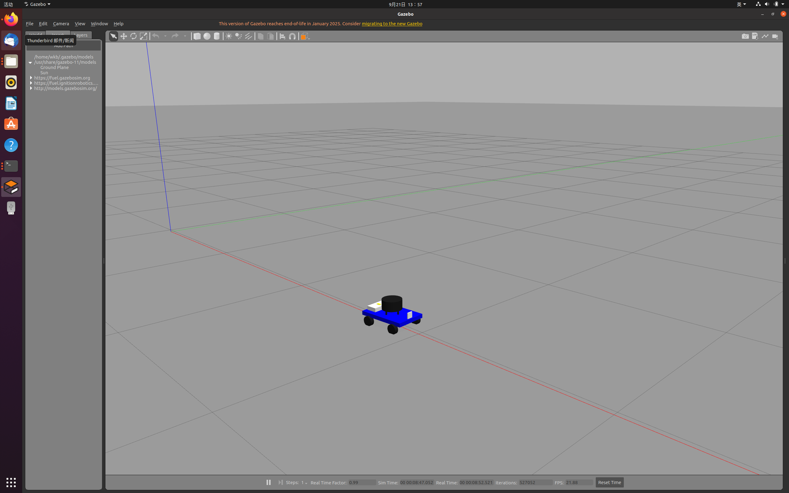

不影响做实验，有三种替代方案：

1. **内置几何体（推荐，离线立即可用，激光同样能扫到）**：点顶部工具栏的立方体 / 球 / 圆柱图标，在地面上点击放置，模型名为 `unit_box`、`unit_box_0`……边长约 1m；
2. **Building Editor 画墙**：菜单 `Edit → Building Editor`，用 Wall 工具画墙，`File → Save As` 保存后退出。注意建筑不会自动保存进 world，重启 Gazebo 会消失；
3. **离线模型库（Gitee 镜像）**：

```bash
mkdir -p ~/.gazebo/models && cd ~/.gazebo/models
git clone https://gitee.com/dva7777/gazebo_models.git
cp -r gazebo_models/* ./
```

重启 Gazebo 后 Insert 面板就能看到离线模型。

### 11.2 精确移动模型（输入坐标）

鼠标拖动很难对准位置，推荐直接改位姿：

1. 左侧 `World` 标签 → 展开 `Models` → 点击模型名（如 `unit_box`）；
2. 左下方 Property 面板里点 `pose` 左边的小三角展开；
3. 填写 `x`、`y`、`z`（每改一个按回车）。

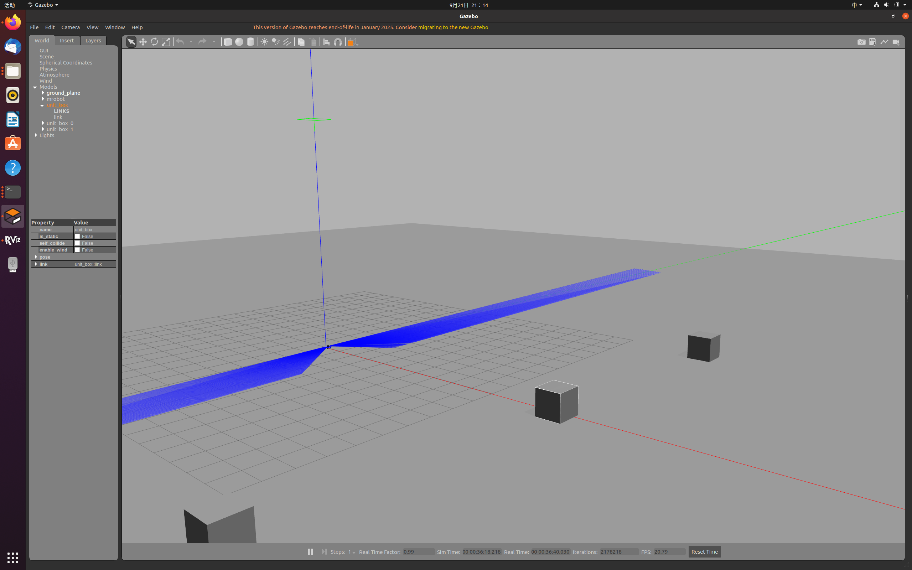

车在世界原点、车头朝 X 正方向。边长 1m 的方块要贴地放在车头正前方 2m，填 `x=2, y=0, z=0.5`（z 是方块中心高度）。

鼠标拖动方式：顶部工具栏选 Translate（十字箭头图标，快捷键 `Ctrl+T`）→ 点击模型出现红 / 绿 / 蓝三轴 → 按住某条轴拖动即沿该轴平移。

删除模型：选中后按 `Delete` 键。

### 11.3 常用显示开关

- `Ctrl+G`：显示 / 隐藏 collision 碰撞体；
- `Ctrl+W`：线框模式；
- `Ctrl+T`：透明模式。

---

## 12. 完整启动顺序速查

每次做实验按以下顺序开终端（每个终端先确保 `source ~/catkin_ws/devel/setup.bash`）：

```bash
# 终端 1：启动 Gazebo + ros_control 控制器 + 加载模型
roslaunch smartcar_description smartcar_gazebo.launch

# 终端 2：补全两个前轮的关节状态（替代官方 joint_state_publisher）
rosrun smartcar_control front_wheel_jsp.py

# 终端 3：Rviz（模型 + 激光点云）
rviz -d $(rospack find smartcar_description)/config/smartcar.rviz

# 终端 4：键盘控制（需要开车时）
roslaunch smartcar_control smartcar_gazebo_controller.launch

# 终端 5：摄像头画面（需要时）
rqt_image_view /camera/image_raw
```

传感器话题一览：

| 传感器 | 话题 | 类型 | 频率 |
| --- | --- | --- | --- |
| 激光雷达 | `/laser/scan` | sensor_msgs/LaserScan | ~40Hz，720 束，前向 180°，量程 0.1~30m |
| 摄像头 | `/camera/image_raw` | sensor_msgs/Image | ~30Hz，800×800 |
| 摄像头标定 | `/camera/camera_info` | sensor_msgs/CameraInfo | ~30Hz |
| IMU | `/imu` | sensor_msgs/Imu | ~100Hz |

---

## 13. 踩坑清单汇总

| # | 现象 | 原因 | 解决办法 |
| --- | --- | --- | --- |
| 1 | `rostopic list` 只有 `/rosout` | 裸 `gazebo` 启动的实例没加载 ROS 插件，且被单例复用 | `killall gzserver gzclient`，改用 `roslaunch gazebo_ros empty_world.launch` |
| 2 | Gazebo 版本不对 | 误装 gazebo9 | Noetic 必须配套 Gazebo11，不要混装 |
| 3 | `No link elements found`、spawn 失败 | 旧 xacro 标签缺 `xacro:` 前缀 | include / macro / 宏调用全部加 `xacro:` 前缀 |
| 4 | 整个模型链接数为 0 | body 文件残留旧 include、入口 xacro 编写时混入空行 / 折行 | 重写 7 行入口 xacro；长文件用 heredoc 创建 |
| 5 | RobotModel 红色 Error | 两个前轮自转关节无 transmission、无状态发布 | 运行 `front_wheel_jsp.py` 只补两个前轮 |
| 6 | 终端狂刷 TF_REPEATED_DATA | 官方 JSP 重复发布 Gazebo 已负责的 4 个主动关节 | 弃用 JSP，改用只发前轮的专用节点 |
| 7 | 激光点云紧贴车身、回波全是 0.1m | laser_link 自带圆柱 collision，射线自扫外壳 | 删除 laser_link 块内的 collision，保留 visual/inertial |
| 8 | 改了 xacro 但故障依旧 | URDF 仅启动时读取，旧 gzserver 残留 | `killall gzserver gzclient` 后重新 roslaunch |
| 9 | `rosparam get robot_description` 管道 sed 后内容不对 | 输出是带字面 `\n` 的单行 YAML | 先 `sed 's/\\n/\n/g'` 还原再处理 |
| 10 | Rviz 找不到 RangeColor | Noetic 本就没有该选项 | 用 AxisColor（Axis 选 X） |
| 11 | 俯视图只有一小块网格 / 看不到点 | TopDownOrtho 的 X/Y/Scale 没对准、没回车 | X=0、Y=0、Scale=8~25，每个值输入后回车 |
| 12 | 点在远处只有一个像素 | Size 太小、视角太远 | Size 调到 0.2~0.5，或切 Orbit 后 Zero 复位 |
| 13 | 键盘控制没反应 | 终端没获得焦点 / 中文输入法 | 点一下终端窗口，切英文输入法 |
| 14 | Insert 面板刷不出在线模型 | 国内网络访问不了模型源 | 用内置几何体、Building Editor 或 Gitee 离线模型库 |
| 15 | `No p gain specified for pid` 两行 ERROR | 控制器 yaml 速度环未配 gain | 不影响运动，忽略 |
| 16 | 提示 `Stereo NOT supported`、OpenGL llvmpipe | 虚拟机软渲染 | 正常现象，不影响功能 |

---

至此，阿克曼小车的 Gazebo 仿真、ros_control 键盘控制以及摄像头 / 激光雷达 / IMU 三个传感器的仿真与 Rviz 可视化全部跑通。
