# 阿克曼四轮小车运动控制

本章实现一辆阿克曼（Ackermann）结构四轮小车的运动控制：使用 xacro 完成整车建模，通过 ros_control 加载后轮速度控制器与前轮转向控制器，编写键盘遥控节点完成阿克曼转角与轮速解算，并为小车配置激光雷达、摄像头和 IMU，在仿真环境中验证控制效果与传感器数据。本章完整工程代码位于仓库 `src/chap7` 目录，包含 `smartcar_description`（模型与配置）和 `smartcar_control`（控制节点）两个功能包。

## 1. 环境配置与工程结构

### 1.1 运行环境

| 项目 | 版本 |
| --- | --- |
| 操作系统 | Ubuntu 20.04（虚拟机） |
| ROS 版本 | Noetic Ninjemys |
| 仿真环境 | Gazebo 11 |
| 可视化工具 | Rviz 1.14 |
| 工作空间 | `~/catkin_ws` |

### 1.2 工程结构

两个功能包的目录结构如下：

```
src/chap7/
├── smartcar_description/          # 小车模型、控制器配置与启动文件
│   ├── config/
│   │   ├── smartcar_joint.yaml    # 五个 ros_control 控制器配置
│   │   └── smartcar.rviz          # Rviz 显示配置（含 LaserScan）
│   ├── launch/xacro/
│   │   └── smartcar_gazebo.launch # 总启动文件
│   └── urdf/xacro/
│       ├── smartcar.xacro         # xacro 入口
│       ├── smartcar_body.xacro    # 车体模型
│       └── smartcar_sim.xacro     # 传感器与控制插件
└── smartcar_control/              # 运动控制节点
    ├── launch/
    │   └── smartcar_gazebo_controller.launch
    ├── scripts/
    │   └── front_wheel_jsp.py     # 前轮关节状态补全节点
    └── src/
        └── smartcar_control_gazebo.cpp  # 键盘遥控与阿克曼解算
```

整车模型共包含 16 个 link、15 个 joint。其中 6 个为运动关节：

| 关节名称 | 类型 | 作用 | 控制接口 |
| --- | --- | --- | --- |
| `left_back_wheel_joint` / `right_back_wheel_joint` | continuous | 后轮驱动 | VelocityJointInterface |
| `left_bridge_to_bridge` / `right_bridge_to_bridge` | revolute | 前轮转向 | EffortJointInterface |
| `left_front_wheel_to_bridge` / `right_front_wheel_to_bridge` | continuous | 前轮自转 | 无（由补全节点发布） |

## 2. 小车模型构建

### 2.1 xacro 模型组织

车体模型使用 xacro 宏描述，入口文件 `smartcar.xacro` 通过 `xacro:include` 分别引入车体宏与仿真插件宏，再实例化两个宏：

```xml
<?xml version="1.0"?>
<robot name="smartcar" xmlns:xacro="http://www.ros.org/wiki/xacro">
  <xacro:include filename="$(find smartcar_description)/urdf/xacro/smartcar_body.xacro"/>
  <xacro:include filename="$(find smartcar_description)/urdf/xacro/smartcar_sim.xacro"/>
  <xacro:smartcar_body/>
  <xacro:smartcar_sim/>
</robot>
```

`smartcar_body.xacro` 中定义了底盘、前后桥、四个车轮、上层支架以及激光雷达、摄像头、IMU 的安装结构，并以宏的形式封装了圆柱体惯性矩阵，例如：

```xml
<xacro:macro name="cylinder_inertial_matrix" params="m r h">
  <inertial>
    <mass value="${m}" />
    <inertia
      ixx="${m*(3*r*r+h*h)/12}" ixy="0" ixz="0"
      iyy="${m*(3*r*r+h*h)/12}" iyz="0"
      izz="${m*r*r/2}" />
  </inertial>
</xacro:macro>
```

### 2.2 xacro 旧语法修复

早期工程的 xacro 文件采用旧语法，在 Noetic 下无法正常解析，需要统一修复：

1. 文件包含标签由 `<include filename="..."/>` 改为 `<xacro:include filename="..."/>`；
2. 所有宏调用必须带 `xacro:` 前缀，例如 9 处圆柱体惯性矩阵调用由：

```xml
<cylinder_inertial_matrix m="0.1" r="0.025" h="0.05"/>
```

改为：

```xml
<xacro:cylinder_inertial_matrix m="0.1" r="0.025" h="0.05"/>
```

3. 入口文件中的宏调用同样需要前缀，即 `<xacro:smartcar_body/>` 与 `<xacro:smartcar_sim/>`。

## 3. 编译与启动

### 3.1 创建工作空间并编译

将两个功能包放入工作空间的 `src` 目录后，在工作空间根目录执行编译：

```bash
mkdir -p ~/catkin_ws/src
cd ~/catkin_ws/src
# 将 smartcar_description、smartcar_control 置于 src/chap7 下
cd ~/catkin_ws
catkin_make
source devel/setup.bash
```

编译成功后输出如下：

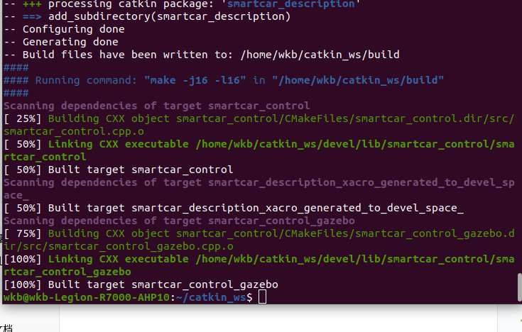

### 3.2 启动仿真环境

使用总启动文件启动 Gazebo、加载模型参数、加载控制器并将小车模型放入仿真环境：

```bash
roslaunch smartcar_description smartcar_gazebo.launch
```

启动文件中首先包含 Gazebo 的空世界模板，然后加载 xacro 模型与控制器配置：

```xml
<include file="$(find gazebo_ros)/launch/empty_world.launch">
    <arg name="paused" value="$(arg paused)"/>
    <arg name="use_sim_time" value="$(arg use_sim_time)"/>
    <arg name="gui" value="$(arg gui)"/>
</include>

<param name="robot_description"
       command="$(find xacro)/xacro --inorder '$(find smartcar_description)/urdf/xacro/smartcar.xacro'" />
<rosparam file="$(find smartcar_description)/config/smartcar_joint.yaml" command="load"/>

<node name="robot_state_publisher" pkg="robot_state_publisher" type="robot_state_publisher"/>
<node name="urdf_spawner" pkg="gazebo_ros" type="spawn_model"
      args="-urdf -model mrobot -param robot_description" output="screen"/>
```

启动过程中终端输出 Gazebo ROS 接口插件加载完成的提示：

```
Finished loading Gazebo ROS API Plugin.
```

此时 ROS 与 Gazebo 的通信已经打通，新开终端执行 `rostopic list`，可以看到 `/gazebo/model_states`、`/gazebo/set_model_state` 等 Gazebo 接口话题：

```bash
rostopic list
```

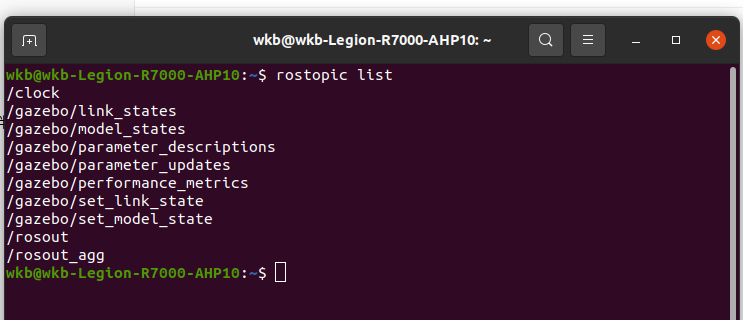

随后模型生成节点输出成功信息：

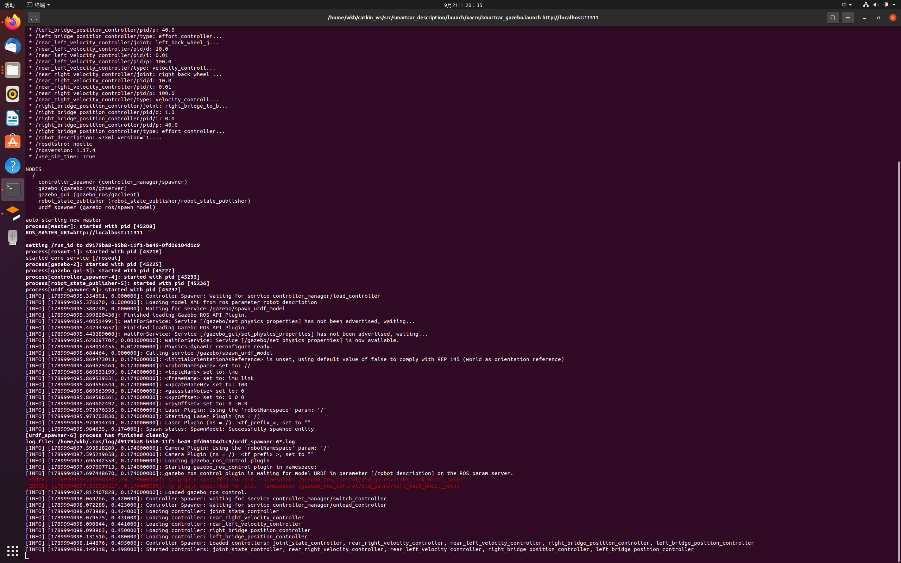

Gazebo 窗口中出现一辆阿克曼四轮小车，车头沿 x 轴正方向：

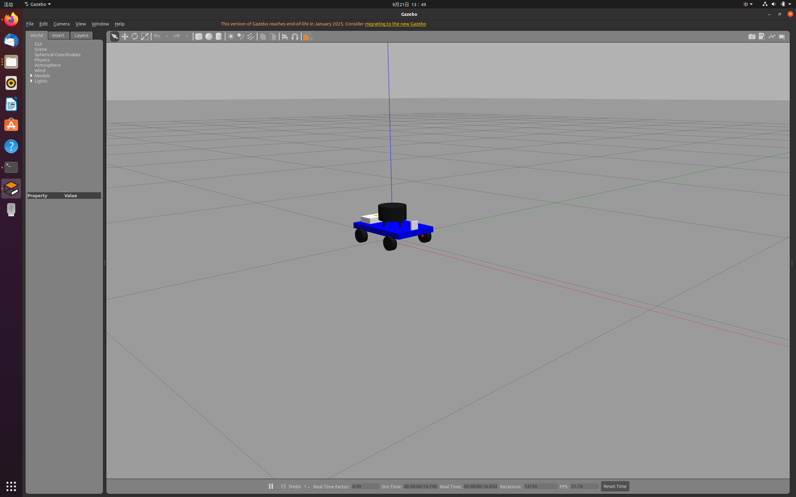

### 3.3 控制器加载

启动文件中的 `controller_spawner` 节点一次性加载五个控制器：

```xml
<node name="controller_spawner" pkg="controller_manager" type="spawner" output="screen"
      args="joint_state_controller
            rear_right_velocity_controller
            rear_left_velocity_controller
            right_bridge_position_controller
            left_bridge_position_controller"/>
```

终端依次输出五个控制器的 Loaded 与 Started 信息，即表示控制器全部就绪：

```
Loaded **joint_state_controller**
Started ...
Loaded **rear_right_velocity_controller**
Loaded **rear_left_velocity_controller**
Loaded **right_bridge_position_controller**
Loaded **left_bridge_position_controller**
```

启动日志中可能出现两行红色的 `No p gain specified for pid` 提示，这是 Gazebo 中 PID 增益未单独配置时的常规提示，不影响控制器正常运行。

五个控制器全部 Started 后，对应的指令话题即已注册，可执行 `rostopic list` 查看到 `/rear_left_velocity_controller/command`、`/rear_right_velocity_controller/command`、`/left_bridge_position_controller/command`、`/right_bridge_position_controller/command` 等话题。

## 4. 前轮 TF 树补全

两个前轮的自转关节没有配置 transmission，Gazebo 不会发布这两个关节的状态。若直接使用官方 `joint_state_publisher`，它又会与 Gazebo 争抢四个主动关节的发布权，导致终端持续刷出 `TF_REPEATED_DATA ignoring data with redundant timestamp for frame ...` 警告，Rviz 中 RobotModel 的 Status 报错。

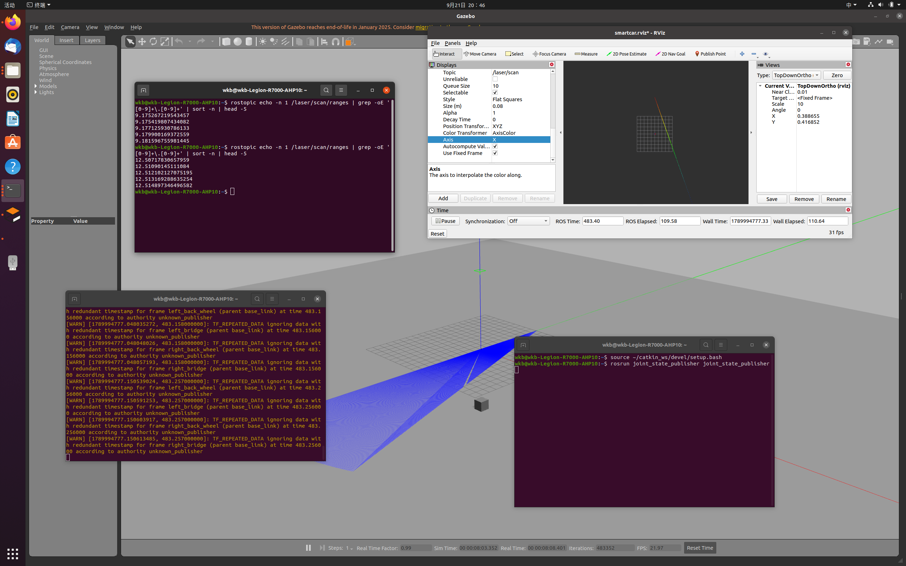

解决方法是编写一个专用节点 `front_wheel_jsp.py`，只发布两个前轮自转关节的零值，以 50Hz 补齐 TF 树：

```python
#!/usr/bin/env python3
import rospy
from sensor_msgs.msg import JointState

rospy.init_node('front_wheel_jsp')
pub = rospy.Publisher('/joint_states', JointState, queue_size=10)
rate = rospy.Rate(50)

msg = JointState()
msg.name = ['right_front_wheel_to_bridge', 'left_front_wheel_to_bridge']
msg.position = [0.0, 0.0]
msg.velocity = [0.0, 0.0]

while not rospy.is_shutdown():
    msg.header.stamp = rospy.Time.now()
    pub.publish(msg)
    rate.sleep()
```

运行该节点：

```bash
rosrun smartcar_control front_wheel_jsp.py
```

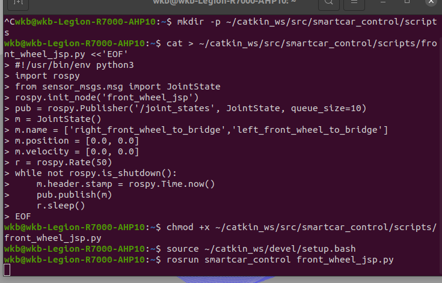

该节点运行后无多余输出属于正常现象，此时整车 TF 树完整。

## 5. Rviz 模型可视化

新开一个终端启动 Rviz，并加载随工程提供的配置文件：

```bash
rviz -d $(rospack find smartcar_description)/config/smartcar.rviz
```

将 Fixed Frame 设置为 `base_link`，添加 RobotModel 并选择话题 `/robot_description`。TF 树完整后，Rviz 中显示完整的四轮小车模型，Global Status 与 RobotModel 均为绿色正常状态：

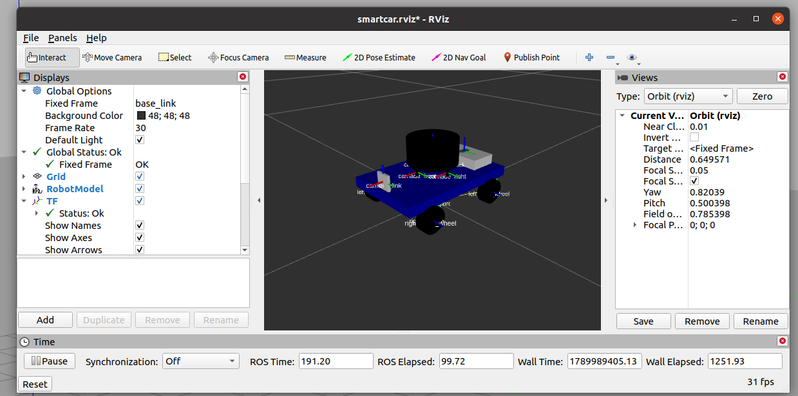

配置文件中已预置 LaserScan 显示项（Color Transformer 选择 AxisColor，Size 为 0.05 m，话题为 `/laser/scan`）。若 Rviz 中未出现该显示项，通常是功能包复制时旧目录未被完全覆盖，可点击 `Add` 手动添加 `LaserScan` 并指定话题。

## 6. 键盘遥控与阿克曼运动解算

### 6.1 控制器配置

五个控制器在 `smartcar_joint.yaml` 中配置。后轮采用速度控制器，两个转向桥采用位置控制器：

```yaml
joint_state_controller:
  type: "joint_state_controller/JointStateController"
  publish_rate: 50

rear_right_velocity_controller:
  type: "velocity_controllers/JointVelocityController"
  joint: right_back_wheel_joint
  pid: {p: 100.0, i: 0.01, d: 10.0}
rear_left_velocity_controller:
  type: "velocity_controllers/JointVelocityController"
  joint: left_back_wheel_joint
  pid: {p: 100.0, i: 0.01, d: 10.0}
right_bridge_position_controller:
  type: "effort_controllers/JointPositionController"
  joint: right_bridge_to_bridge
  pid: {p: 40.0, i: 0.0, d: 1.0}
left_bridge_position_controller:
  type: "effort_controllers/JointPositionController"
  joint: left_bridge_to_bridge
  pid: {p: 40.0, i: 0.0, d: 1.0}
```

### 6.2 阿克曼运动解算

阿克曼结构的特点是转向时内外前轮转角不同、内外侧车轮线速度不同，使所有车轮处于纯滚动状态。设转向桥输入角（虚拟中心转角）为 `angle`，车速为 `speed`，轮距（左右轮间距）为 `width = 0.16 m`，前后桥轴距为 `wheelbase = 0.1885 m`。

内外前轮转角分别为：

```
outer_angle = atan(wheelbase * tan(angle) / (wheelbase + 0.5 * width  * tan(angle)))
inner_angle = atan(wheelbase * tan(angle) / (wheelbase - 0.5 * width  * tan(angle)))
```

内外侧后轮线速度分别为：

```
outside_speed = speed * (1 + 0.5 * width * tan(angle) / wheelbase)
inside_speed  = speed * (1 - 0.5 * width * tan(angle) / wheelbase)
```

直行时 `angle = 0`，内外转角均为 0，两侧轮速相等；转向时内轮转角大于外轮转角、内侧轮速小于外侧轮速，与真实阿克曼底盘一致。

### 6.3 键盘遥控节点

键盘遥控节点 `smartcar_control_gazebo.cpp` 读取键盘输入，按上述公式实时解算四个控制器的目标值。节点通过四个话题发布控制指令：

| 发布话题 | 消息类型 | 作用 |
| --- | --- | --- |
| `/rear_right_velocity_controller/command` | std_msgs/Float64 | 右后轮目标转速 |
| `/rear_left_velocity_controller/command` | std_msgs/Float64 | 左后轮目标转速 |
| `/right_bridge_position_controller/command` | std_msgs/Float64 | 右前轮转向角 |
| `/left_bridge_position_controller/command` | std_msgs/Float64 | 左前轮转向角 |

启动键盘遥控节点：

```bash
roslaunch smartcar_control smartcar_gazebo_controller.launch
```

节点启动后循环打印四个控制量以及阿克曼内外侧解算结果，待机状态下均为 0：

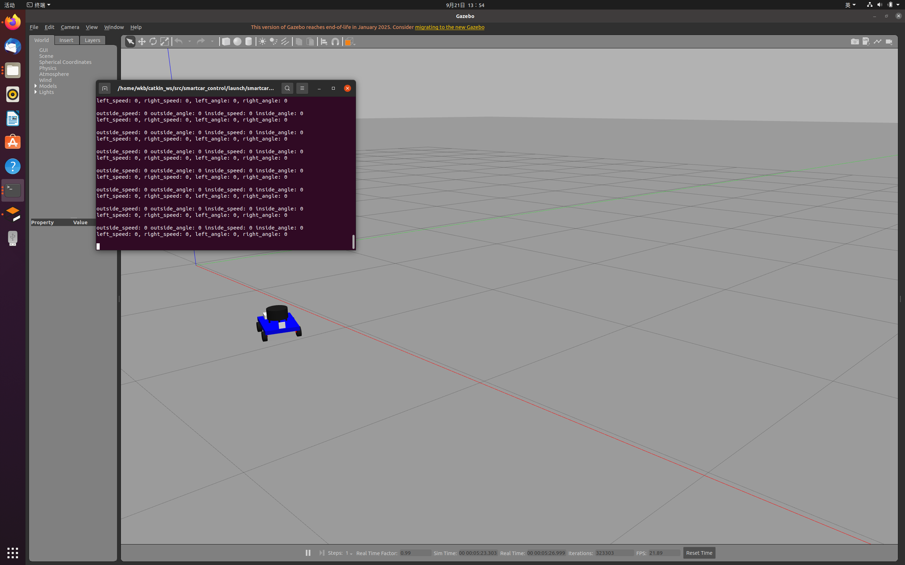

按键功能如下（终端窗口需获取焦点，并切换为英文输入法）：

| 按键 | 功能 |
| --- | --- |
| `w` | 加速前进 |
| `s` | 减速 / 后退 |
| `e` | 前进时向左转 |
| `q` | 前进时向右转 |
| `z` | 后退时向右转 |
| `c` | 后退时向左转 |
| `x` | 转向回正 |
| 空格键 | 紧急停车 |
| `Ctrl + C` | 退出节点 |

## 7. 激光雷达

### 7.1 雷达配置

激光雷达安装在车头顶部 `laser_link`，在 `smartcar_sim.xacro` 中以 ray 传感器配置，并加载 Gazebo 激光插件：

```xml
<sensor type="ray" name="head_hokuyo_sensor">
  <visualize>true</visualize>
  <ray>
    <scan>
      <horizontal>
        <samples>720</samples>
        <min_angle>-1.570796</min_angle>
        <max_angle>1.570796</max_angle>
      </horizontal>
    </scan>
    <range>
      <min>0.10</min>
      <max>30.0</max>
      <resolution>0.01</resolution>
    </range>
    <noise>
      <type>gaussian</type>
      <stddev>0.01</stddev>
    </noise>
  </ray>
  <plugin name="gazebo_ros_laser" filename="libgazebo_ros_laser.so">
    <topicName>/laser/scan</topicName>
    <frameName>laser_link</frameName>
  </plugin>
</sensor>
```

雷达每帧 720 束，扫描范围为车头前方 180°（±π/2），量程 0.10～30.0 m，更新频率 40 Hz，测量噪声标准差 0.01 m。

### 7.2 激光自扫故障排查

模型初次运行时，Rviz 中 LaserScan 以红色方块成片叠加在车体周围，说明雷达扫描到了自身结构：

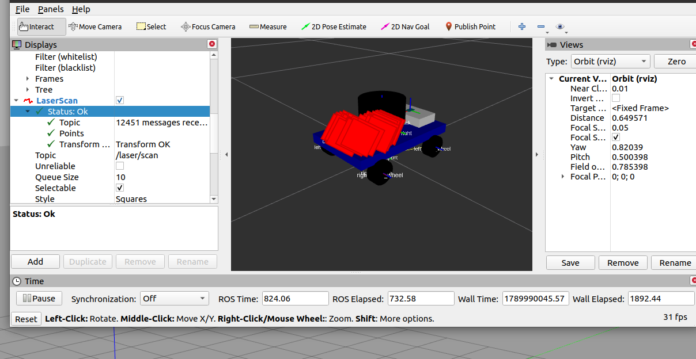

查看数据，每帧最近回波均为雷达量程下限 0.1 m：

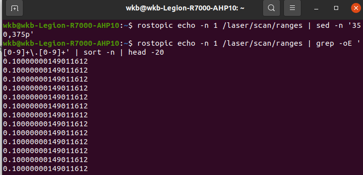

进一步统计每帧含数值的回波数量，共 655 条有数值回波，其余 65 束为无回波的 `inf`；滚动输出还可见大量回波为量程下限 0.1 m，说明射线成片命中了自身结构：

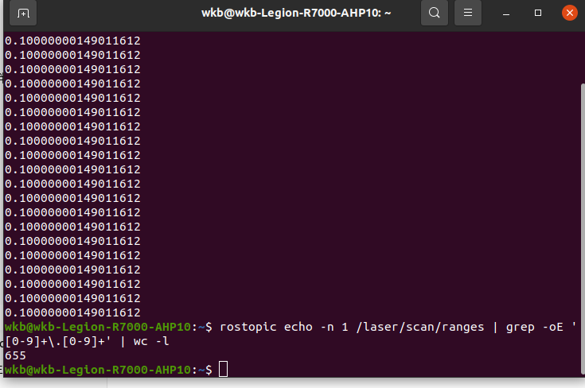

排查发现 `laser_link` 自身配置了碰撞体，雷达射线与该碰撞体相交。删除 `laser_link` 中的 `<collision>` 块（保留 visual 与惯性参数）：

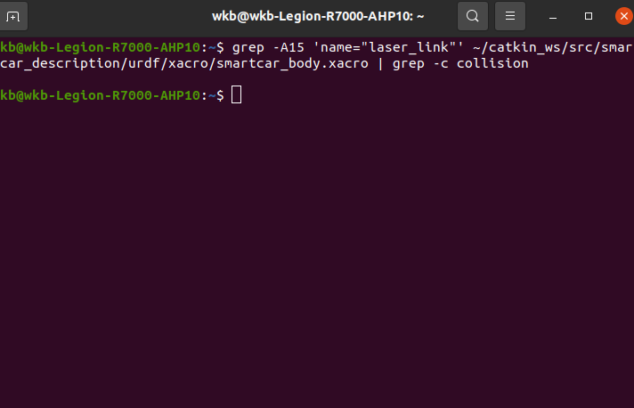

修改后重新加载参数统计，整车 collision 数量为 14，laser_link 块中仅保留 visual：

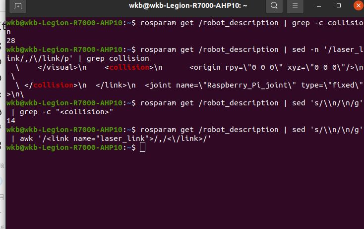

同时将传感器的 `<visualize>` 由 `false` 改为 `true`（模型中共有 2 处），便于在 Gazebo 中观察射线。修改 xacro 后必须彻底关闭 Gazebo 再重新启动：

```bash
killall gzserver gzclient
roslaunch smartcar_description smartcar_gazebo.launch
```

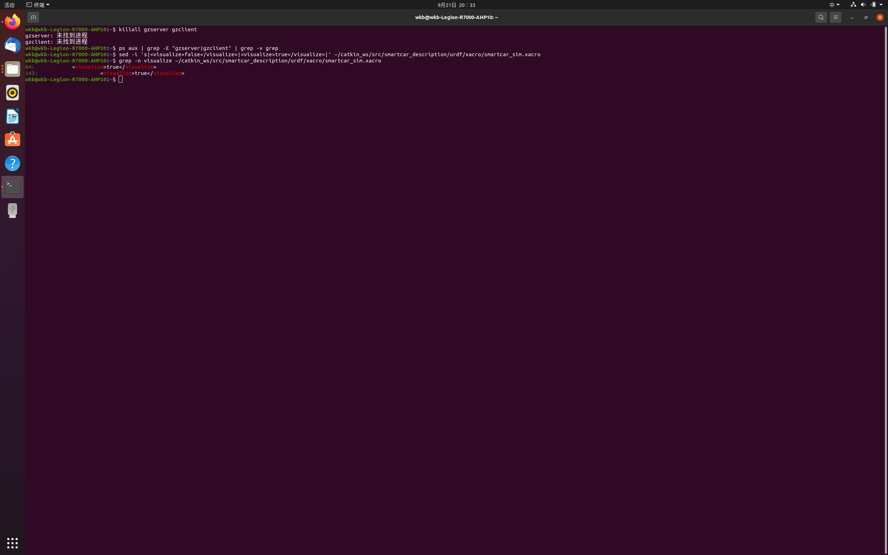

### 7.3 点云与频率验证

重启后 Gazebo 中射线呈前向扇形正常展开，不再扫描到车体，空旷环境中最近回波距离明显增大：

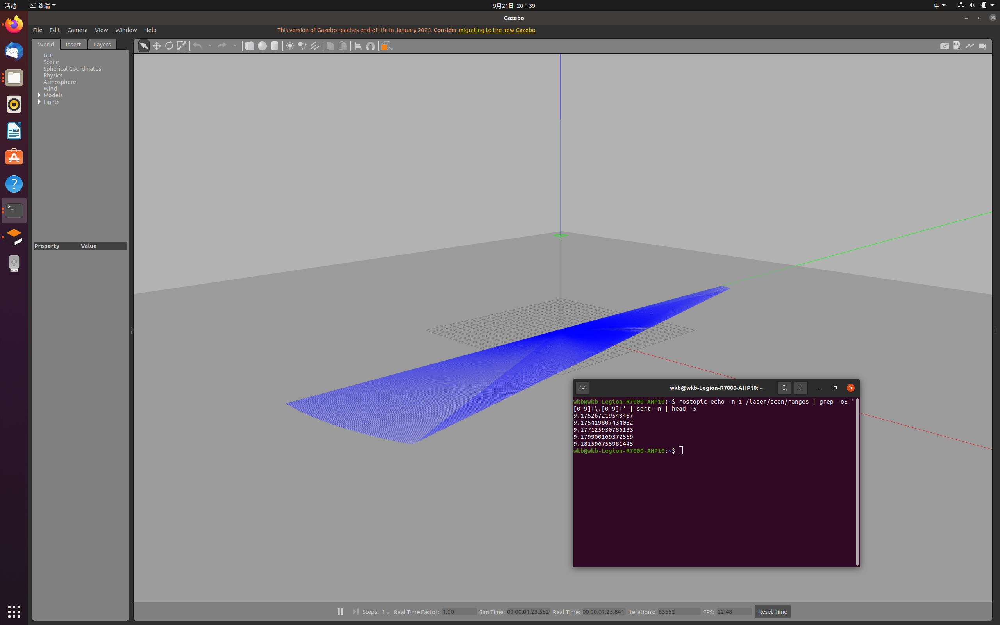

查看激光话题发布频率，稳定在 40 Hz 左右（实测约 39.8 Hz）：

```bash
rostopic hz /laser/scan
```

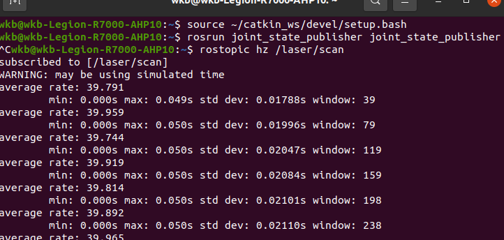

## 8. 摄像头与 IMU

### 8.1 摄像头

摄像头安装在车头 `camera_link`，分辨率 800×800，更新频率 30 Hz，发布 `/camera/image_raw` 与 `/camera/camera_info` 话题。使用 rqt 图像查看工具观察画面：

```bash
rqt_image_view /camera/image_raw
```

将方块放在车头前方时，画面中可以清晰看到障碍物：

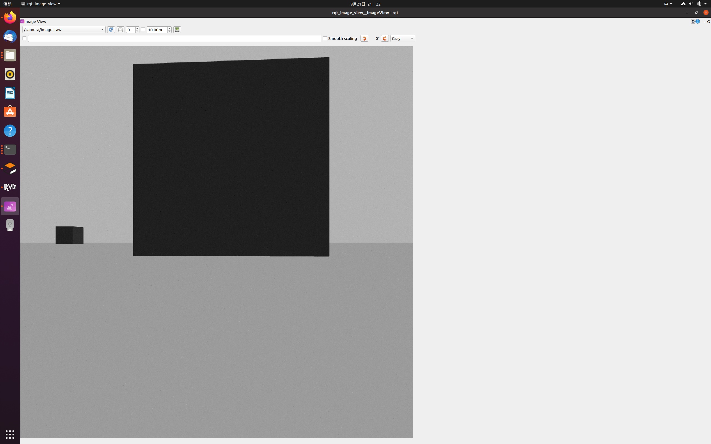

### 8.2 IMU

IMU 安装在车体上层 `imu_link`，更新频率 100 Hz，发布 `/imu` 话题。查看发布频率，实测约 98 Hz：

```bash
rostopic hz /imu
```

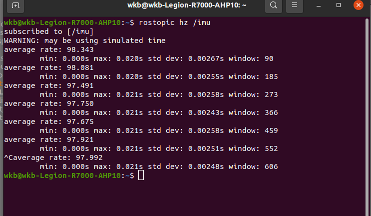

静止状态下查看 IMU 数据，角速度各分量接近 0，线加速度以 z 轴重力分量为主（约 9.8 m/s²），姿态四元数接近单位四元数：

```bash
rostopic echo /imu
```

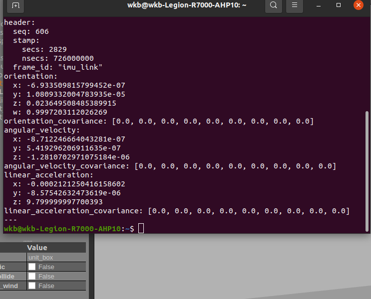

## 9. 障碍物检测验证

为验证激光雷达对障碍物的检测效果，在 Gazebo 中放置标准方块并观察射线与点云。

### 9.1 放置方块

点击 Gazebo 顶部工具栏的 Box 图标，在地面上单击即可放置一个边长 1 m 的方块。在左侧 World 选项卡中展开 Models，选中方块后展开 Pose，按实际位置填写 x、y、z：方块边长 1 m、贴地放置时 z 应填 0.5。每个数值输入后按回车确认：

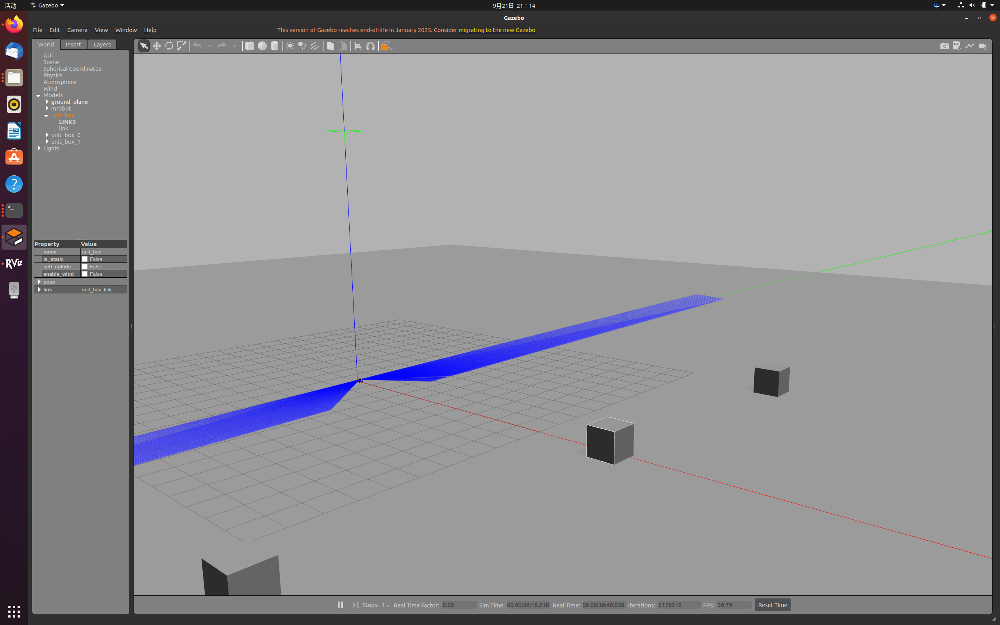

将方块放到车头正前方约 2 m 处，即 x=2、y=0、z=0.5：

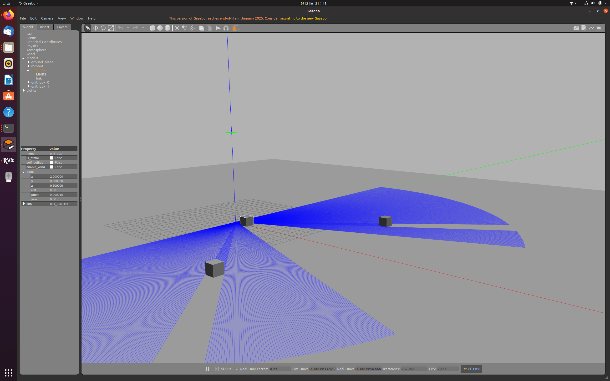

### 9.2 观察检测结果

Gazebo 中激光射线在方块后方形成明显的楔形阴影区域：

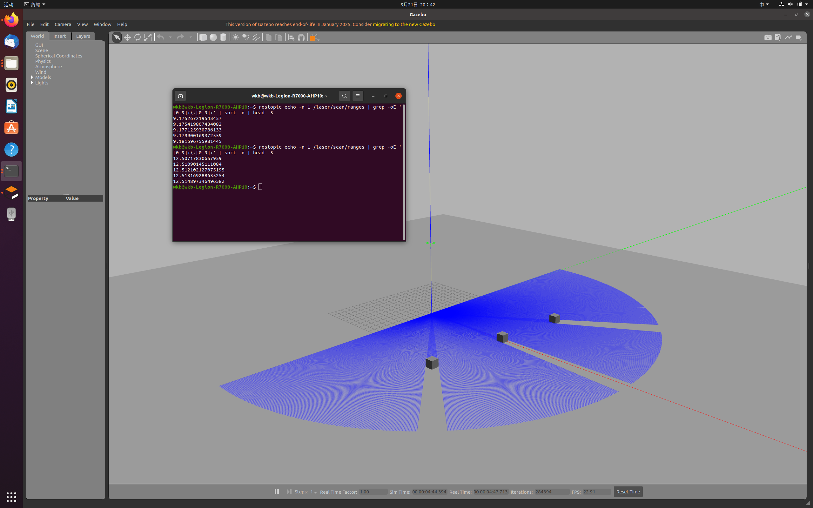

在 Rviz 中将视图切换为 TopDownOrtho 俯视模式，点云与场景中的方块一一对应：车头正前方与侧前方方块的相邻两面在点云中呈现黄色的 L 形与 Γ（反 L）形轮廓，远处方块的侧面呈现蓝色与紫色竖直点线：

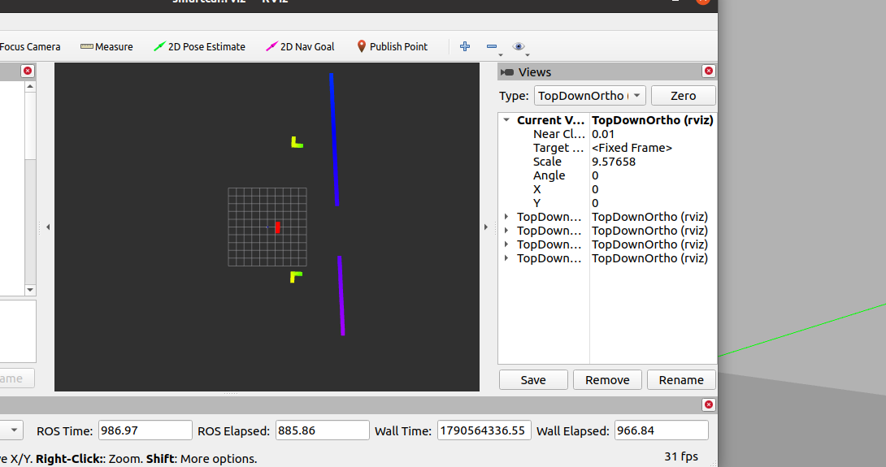

点云轮廓与真实障碍物的位置、形状完全吻合，表明小车的运动控制与激光雷达数据链路均工作正常。

## 10. 常见问题

**Q1：启动后 Gazebo 中看不到射线或传感器没有数据？**

确认是通过 `roslaunch` 启动，而不是先手动运行 `gazebo`。手动启动的无插件实例会被 Gazebo 单例机制复用，导致 ROS 插件无法注册。先执行 `killall gzserver gzclient` 关闭所有实例，再使用启动文件。

**Q2：修改 xacro 文件后效果没有变化？**

Gazebo 不会热加载模型，必须先 `killall gzserver gzclient`，再重新执行 roslaunch。

**Q3：终端持续刷 `TF_REPEATED_DATA` 警告？**

官方 joint_state_publisher 与 Gazebo 同时发布主动关节状态。关闭该节点，改用工程提供的 `front_wheel_jsp.py` 只补全两个前轮关节。

**Q4：Insert 选项卡中的在线模型库无法加载？**

在线模型库在国内网络环境下经常无法访问，属于网络问题。本章使用 Gazebo 内置几何体（Box 等）即可完成验证，不影响实验。

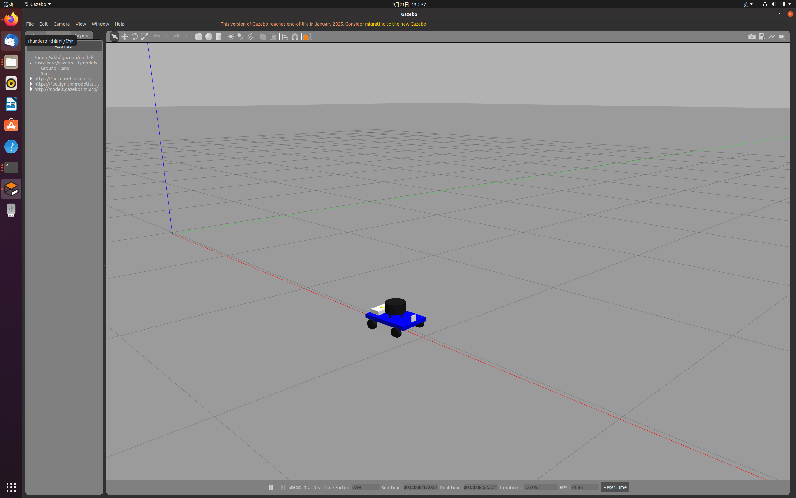

**Q5：Rviz 中 LaserScan 显示项没有自动出现？**

功能包复制到已存在的同名目录时可能发生目录嵌套，导致加载的仍是旧配置。删除旧目录后重新复制，或在 Rviz 中手动 `Add` → `LaserScan`，话题选择 `/laser/scan`。

**Q6：键盘节点按键后小车没有反应？**

检查运行键盘节点的终端窗口是否获取鼠标焦点，并确认系统处于英文输入法状态；待机时终端持续打印全 0 数据属于正常现象。

---

本章完成了阿克曼四轮小车从 xacro 建模、xacro 旧语法修复、ros_control 控制器配置、阿克曼运动解算与键盘遥控，到激光雷达自扫故障排查和三传感器数据验证的完整流程，全部实验结果均在 Ubuntu 20.04 + ROS Noetic 环境下复现通过，工程代码位于仓库 `src/chap7` 目录。
