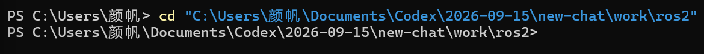
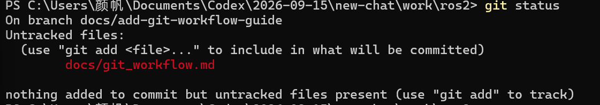
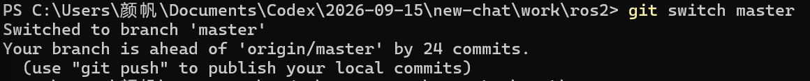
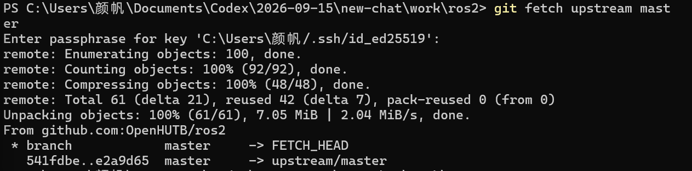
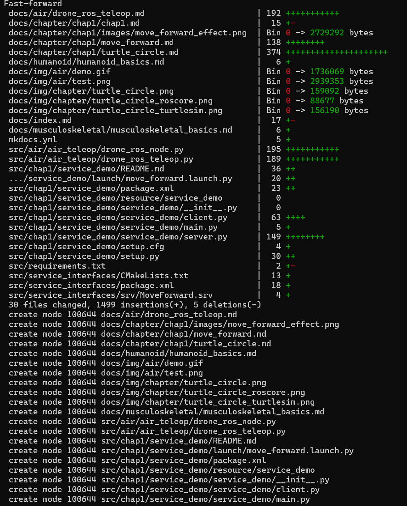
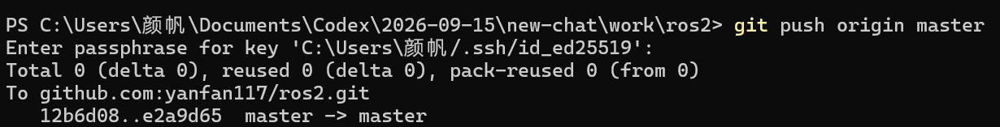
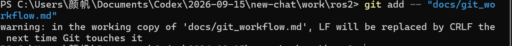
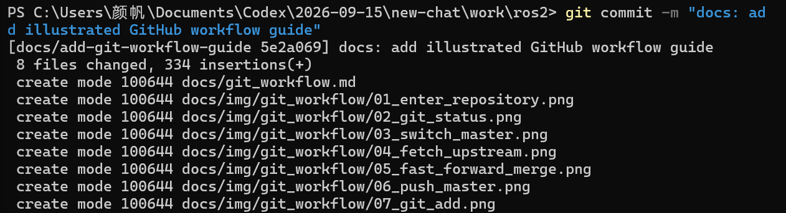
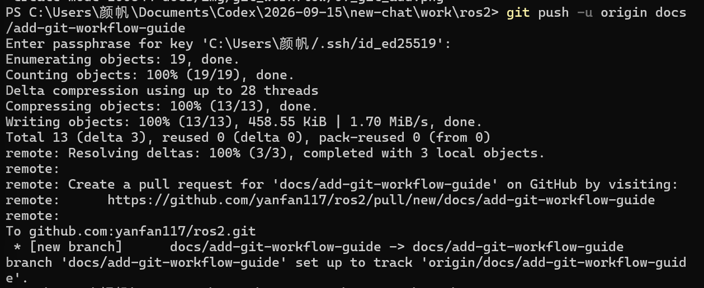
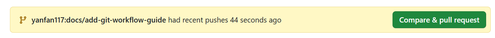

# GitHub 协作与提交工作流

本文介绍如何在 Fork 仓库中同步原项目、创建分支、修改文件、提交 commit、推送到 GitHub，以及创建和更新 Pull Request。

## 1. 远程仓库说明

本地仓库通常配置两个远程地址：

| 名称 | 仓库 | 用途 |
| ---- | ---- | ---- |
| `origin` | 自己 Fork 的仓库 | 推送自己的分支和提交 |
| `upstream` | 原项目仓库 | 获取原项目的最新代码 |

可以使用以下命令检查：

```powershell
git remote -v
```

使用 SSH 时，输出应类似：

```text
origin    git@github.com:yanfan117/ros2.git
upstream  git@github.com:OpenHUTB/ros2.git
```

## 2. SSH 连接配置

### 2.1 测试 GitHub SSH 连接

```powershell
ssh -T git@github.com
```

连接成功时会显示：

```text
Hi <username>! You've successfully authenticated, but GitHub does not provide shell access.
```

### 2.2 Windows 中指定 OpenSSH

如果 Git for Windows 无法识别中文用户目录，可以让 Git 使用 Windows 自带的 OpenSSH：

```powershell
git config --global core.sshCommand "C:/Windows/System32/OpenSSH/ssh.exe"
```

该配置只需执行一次。

## 3. 开始任务前同步原项目

进入本地仓库：

```powershell
cd "C:\Users\<username>\path\to\ros2"
```

注意：`<username>` 表示 Windows 用户名，应替换为自己电脑上的实际名称。

执行成功后，PowerShell 提示符会切换到仓库目录，后续 Git 命令都应在该目录中执行。



检查是否存在未提交的修改：

```powershell
git status
```

`Untracked files` 表示新文件已经出现在工作区，但还没有被 Git 跟踪。下图中的 `docs/git_workflow.md` 就是一个待添加的新文件。



切换到主分支：

```powershell
git switch master
```

`Switched to branch 'master'` 表示切换成功。如果提示本地 `master` 领先 `origin/master` 若干个提交，说明这些提交尚未推送到自己的 Fork，不是错误。



从原项目获取最新提交：

```powershell
git fetch upstream master
```

使用带密码的 SSH 私钥时，Git 会先请求输入 passphrase。输入正确后，终端会下载对象并更新 `upstream/master`，但此时还没有修改本地文件。



将本地 `master` 快进到原项目最新版本：

```powershell
git merge --ff-only upstream/master
```

`Fast-forward` 表示 Git 只是将本地分支指针移动到更新的提交，没有产生额外合并提交。后面的文件列表是这次同步包含的新增和修改内容。



如果需要同时更新自己 GitHub 上的 Fork，执行：

```powershell
git push origin master
```

出现 `master -> master` 且没有报错，表示本地主分支已成功推送到自己的 GitHub Fork。



`--ff-only` 只允许快进合并，可以避免在 `master` 上产生不必要的合并提交。

## 4. 为新任务创建分支

不要直接在 `master` 上修改文件。每个任务应使用独立分支：

```powershell
git switch -c docs/my-new-change
```

常用分支命名方式：

| 修改类型 | 示例 |
| ---- | ---- |
| 文档 | `docs/add-install-guide` |
| 新功能 | `feature/add-circle-node` |
| 错误修复 | `fix/broken-link` |
| 截图或资源 | `docs/update-screenshots` |

分支名建议使用英文小写字母和连字符。

## 5. 修改并检查文件

使用编辑器完成修改后，查看工作区状态：

```powershell
git status
```

查看已跟踪文件的具体改动：

```powershell
git diff
```

新文件会在 `git status` 中显示为 `Untracked files`。

## 6. 将文件加入待提交区

只添加指定文件：

```powershell
git add -- "docs/example.md"
```

执行 `git add` 后，文件会进入待提交区。Windows 上可能出现 `LF will be replaced by CRLF` 换行符提示，这通常不是错误，不会阻止后续 commit。



添加当前任务的所有改动：

```powershell
git add -A
```

检查即将提交的内容：

```powershell
git status
git diff --staged
```

`git diff --staged` 显示的内容就是下一次 commit 会包含的内容。

## 7. 创建 commit

```powershell
git commit -m "docs: add installation guide"
```

提交成功后，Git 会显示当前分支、commit 缩写编号、提交信息，以及变更的文件和行数。下图中的 `5e2a069` 是这次 commit 的短编号，`8 files changed` 表示文档和 7 张图片已经被记录。



常见的提交信息格式：

```text
docs: add turtle circle experiment
docs: update installation instructions
fix: correct broken document link
feat: add turtle circle node
```

提交完成后可以检查最新 commit：

```powershell
git log -1 --oneline
```

## 8. 推送分支到 GitHub

第一次推送新分支：

```powershell
git push -u origin docs/my-new-change
```

首次推送时，Git 会压缩并上传本地对象。出现 `[new branch]` 和 `set up to track` 表示远程分支已成功创建，且本地分支已与它建立跟踪关系。GitHub 还会在终端中给出创建 Pull Request 的地址。



`-u` 会建立本地分支和远程分支的跟踪关系。以后继续更新该分支时，只需要执行：

```powershell
git push
```

## 9. 创建 Pull Request

分支推送成功后，在 GitHub 中创建 Pull Request，并确认：

GitHub 仓库页面会识别刚刚推送的新分支，并显示黄色提示条。点击 **Compare & pull request** 即可进入 PR 创建页面。



- Base repository：原项目仓库；
- Base branch：`master`；
- Head repository：自己的 Fork；
- Compare branch：本次任务分支。

创建 PR 后，维护者会进行审核。

## 10. 根据审核意见继续修改

切换回 PR 对应的分支：

```powershell
git switch docs/my-new-change
```

修改文件后执行：

```powershell
git status
git diff
git add -A
git commit -m "docs: address review comments"
git push
```

推送新 commit 后，原 Pull Request 会自动更新，不需要重新创建 PR。

## 11. `--force-with-lease` 的使用场景

正常的新提交不需要强制推送。只有在以下情况中，才可能需要重写远程分支：

- 执行了 `git rebase`；
- 执行了 `git commit --amend`；
- 重新整理了已经推送的提交历史。

此时应使用：

```powershell
git push --force-with-lease
```

不要使用裸 `--force`，因为 `--force-with-lease` 会检查远程分支是否被别人更新，更为安全。

## 12. 常用检查命令

```powershell
# 查看当前状态
git status

# 查看当前分支
git branch --show-current

# 查看所有本地分支
git branch

# 查看远程地址
git remote -v

# 查看最近五次提交
git log -5 --oneline

# 查看尚未加入待提交区的改动
git diff

# 查看已加入待提交区的改动
git diff --staged
```

## 13. 完整操作模板

以下命令适合每次开始新任务时使用：

```powershell
cd "C:\Users\<username>\path\to\ros2"

git status

git switch master
git fetch upstream master
git merge --ff-only upstream/master
git push origin master

git switch -c docs/my-new-change

# 在编辑器中修改文件

git status
git diff

git add -A
git diff --staged

git commit -m "docs: describe my change"
git push -u origin docs/my-new-change
```

## 14. 工作流总结

```text
同步 upstream/master
        ↓
更新本地 master
        ↓
同步 origin/master
        ↓
创建独立任务分支
        ↓
修改并检查文件
        ↓
git add
        ↓
git commit
        ↓
git push
        ↓
创建或更新 Pull Request
```
