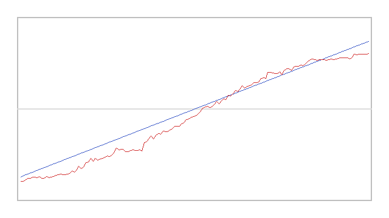
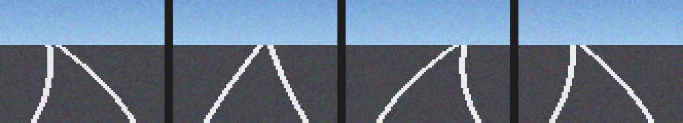

# 自动驾驶代理

本文介绍 CARLA ROS Bridge 中的**自动驾驶代理**（AD Agent）：它订阅路径点与地图信息，
用**规则式**局部规划让车辆沿路径行驶，属于 `carla_ros_bridge` 的既有功能。

## 参考

* [Carla 自动驾驶代理](https://openhutb.github.io/doc/carla_ad_agent/)

## 拓展：自行实现「端到端神经网络图像驾驶」

本文的自动驾驶代理是**规则式**的：先由地图算出路径，再按几何规则跟踪路径。
下面是在该功能基础上**自主实现**的一套「相机图像 → 控制指令」的**端到端神经网络**驾驶，
代码位于
[`src/ground/carla_end_to_end_nn`](https://github.com/OpenHUTB/ros2/tree/master/src/ground/carla_end_to_end_nn)，
详细介绍（计算原理、源码解析、性能评价）见
[CARLA 端到端神经网络（图像 → 控制）](./carla_end_to_end_nn.md)。

### 与本文示例的区别

| 对比项 | 本文示例（自动驾驶代理） | 本拓展模块 |
|---|---|---|
| 技术路线 | `carla_ros_bridge` + 规则式局部规划 | CARLA Python API 直连 + 端到端 CNN |
| 是否依赖 ros-bridge | 必须编译并运行 ros-bridge | **不需要**，仅需 `carla` Python 客户端 |
| 输入 | 路径点 + 地图 | **相机图像**（原始像素） |
| 决策方式 | 规则式（查地图算路径，几何跟踪） | **神经网络**（图像直接 → 转向） |
| 模块分层 | 感知 / 规划 / 控制分层明确 | **无分层**，图像直接变成控制量 |
| 是否可训练 | 否（规则固定） | **是**：行为克隆采集专家数据后训练 CNN |
| 框架依赖 | — | 默认**纯 numpy**（无需 TensorFlow/PyTorch） |
| 无 CARLA / 无图形界面时 | 无法运行 | `--headless --demo` 离线自证并导出曲线 |

### 复用本文的配置步骤

CARLA 服务端的启动、宿主机 IP 与端口 2000 的查看、虚拟机网络设置等步骤
**与已有示例完全一致，此处不再重复**，请参考
[设置并连接到 Carla 模拟器](../set_up_and_connect_to_carla.md) 的
「启动 Carla 服务器」与「使用 Carla 客户端启动 Ego Vehicle」小节；
连接失败的排查见同一篇的「常见问题」小节。

!!! warning "不要从头到尾照做已有示例"
    已有示例中的「设置 Carla ROS Bridge」「使用 rviz 进行可视化」等小节属于
    **ros-bridge 路线**（需要 catkin 编译 ros-bridge）。本拓展模块**不依赖 ros-bridge**，
    这些步骤可以跳过。

### 本拓展新增的内容

1. **端到端神经网络**：单个 CNN 直接把 $60\times80\times3$ 的相机图像映射为转向角，
   中间不含人工的感知/规划环节。
2. **行为克隆数据采集**：由专家控制器（沿车道前视的纯跟踪律）实际驾驶并记录
   (图像, 转向) 对，保证**图像与标签有因果关系**。
3. **纯 numpy 反向传播**：含卷积、ReLU、最大池化、全局平均池化与 tanh 输出层的
   完整手写反向传播，无需 TensorFlow/PyTorch。
4. **梯度正确性保障**：最大池化反向按 argmax 回传，并有有限差分梯度校验与回归测试。
5. **离线取证模式**：`--headless --demo` 用合成道路图像训练并导出损失曲线、
   预测对比曲线与样本图，无 CARLA、无 GPU、无 TensorFlow 也能自证。
6. **ROS 话题接口**：发布图像、转向指令与控制量，便于外部可视化与记录。

### 运行本拓展模块

除本文所需环境外，只需补装 CARLA 0.9.16 的 Python 客户端
（端到端 CNN 为纯 numpy 实现，无需 TensorFlow/PyTorch）：

```shell
pip3 install <CARLA>/PythonAPI/carla/dist/carla-0.9.16-cp310-cp310-manylinux_2_31_x86_64.whl
```

离线取证（**不需要 CARLA**，先用合成图像确认链路可用，约 3~4 分钟）：

```shell
python3 src/ground/carla_end_to_end_nn/main.py --headless --demo --save_dir ~/shots
```

行为克隆采集 → 训练 → 端到端驾驶（`--host` 的填法与本文一致：填宿主机 IP）：

```shell
python3 src/ground/carla_end_to_end_nn/main.py --mode collect --host 172.21.108.47 --frames 300
python3 src/ground/carla_end_to_end_nn/main.py --mode train --data_dir dataset --epochs 60
python3 src/ground/carla_end_to_end_nn/main.py --mode test --host 172.21.108.47 --sim_time 20
```

使用 launch 启动（ROS 2 / ROS 1）：

```shell
# ROS 2
ros2 launch carla_end_to_end_nn main.launch.py host:=172.21.108.47
# ROS 1
roslaunch carla_end_to_end_nn main.launch host:=172.21.108.47 mode:=test
```

### 实测结果

本机离线取证模式实测（`--epochs 60 --samples 150`，无需 CARLA）：

| 指标 | 数值 |
|---|---|
| MAE | 0.09364 |
| 转向方向一致率 | 98.0% |
| 预测/标签相关系数 | +0.992 |
| 零输出基线 MAE | 0.40268（网络优于基线 4.3 倍） |





完整的调优过程（含 maxpool 梯度缺陷与 tanh 缺失的排查）见
[CARLA 端到端神经网络（图像 → 控制）](./carla_end_to_end_nn.md) 第 6 节。
