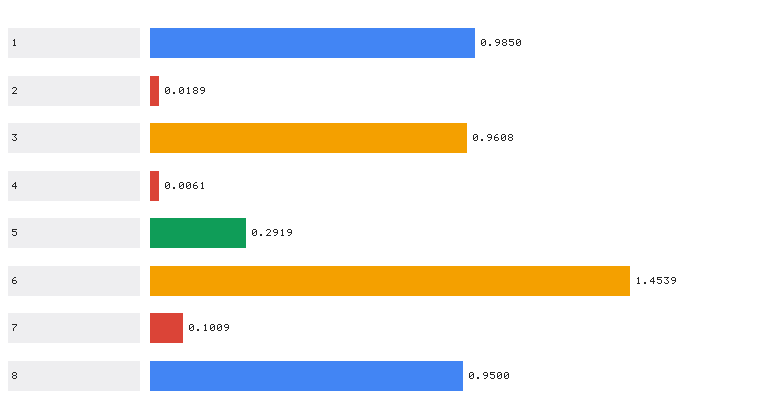

# 自动驾驶演示

## 随机路线
```shell
roslaunch carla_ad_demo carla_ad_demo.launch host:=172.21.108.47 timeout:=60000 town:='Carla/Maps/Town10HD_Opt' spawn_point:=-25,-134,0.5,0,0,-90
```


## 场景执行

```shell
roslaunch carla_ad_demo carla_ad_demo_with_scenario.launch host:=172.21.108.47 timeout:=60000 town:='Carla/Maps/Town10HD_Opt'
```

报错：
```log
RLException: Invalid <arg> tag: environment variable 'SCENARIO_RUNNER_PATH' is not set. 

Arg xml is <arg name="scenario_runner_path" default="$(env SCENARIO_RUNNER_PATH)"/>
The traceback for the exception was written to the log file
```

原因：必须指定`SCENARIO_RUNNER_PATH`，指向 scenario runner 的路径。

## 拓展：四份作业的统一调度入口与量化性能评价

本文的自动驾驶演示通过 `roslaunch` 拉起 `carla_ad_demo` 做**单次**演示（随机路线或场景执行），
只输出运行日志、没有量化指标。下面是在该演示思路基础上**自主实现**的一套
「四份作业统一调度 + 真实测量的性能评价」，
代码位于
[`src/ground/carla_benchmark_suite`](https://github.com/OpenHUTB/ros2/tree/master/src/ground/carla_benchmark_suite)，
详细介绍（指标定义、源码解析、完整实测数据）见
[CARLA 作业综合整合与性能评价](./carla_benchmark_suite.md)。

### 与本文示例的区别

| 对比项 | 本文示例（自动驾驶演示） | 本拓展模块 |
|---|---|---|
| 技术路线 | `roslaunch carla_ad_demo` | CARLA Python API 直连 + 统一调度入口 |
| 是否依赖 ros-bridge | 必须编译并运行 ros-bridge | **不需要**，仅需 `carla` Python 客户端 |
| 是否依赖 scenario runner | **需要**，且必须设 `SCENARIO_RUNNER_PATH`（正是本文记录的报错原因） | **不需要** |
| 功能范围 | 单次演示（随机路线 / 场景执行） | **统一调度 4 个子作业** + 量化性能评价 |
| 性能指标 | 无（只有运行日志） | **真实测量**的精度 / 时延 / 平滑度 / 覆盖率指标表与对比图 |
| 指标可复现性 | — | `--benchmark` 离线可复现，**无需 CARLA 服务端** |
| 无 CARLA / 无图形界面时 | 无法运行 | `--list` 与 `--benchmark` 均可离线运行 |

### 复用本文的配置步骤

CARLA 服务端的启动、宿主机 IP 与端口 2000 的查看等步骤
**与已有示例完全一致，此处不再重复**，请参考
[设置并连接到 Carla 模拟器](../set_up_and_connect_to_carla.md) 的
「启动 Carla 服务器」与「使用 Carla 客户端启动 Ego Vehicle」小节；
连接失败的排查见同一篇的「常见问题」小节。

!!! warning "不要从头到尾照做已有示例"
    本文的演示需要 **scenario runner** 并设置 `SCENARIO_RUNNER_PATH`。
    本拓展模块**不需要 scenario runner，也不需要 ros-bridge**，
    本文的编译与环境变量步骤可以跳过。

### 本拓展新增的内容

1. **统一调度入口**：一个命令拉起四份作业中的任意一个
   （`control` / `perception` / `navigation` / `end_to_end`），
   用 `--` 分隔透传子作业参数，子作业新增参数时无需改动本模块。
2. **真实测量的性能评价**：`--benchmark` 会**实际训练并回放**各模块，
   量测感知准确率、控制 MSE、横向误差 RMSE、建图覆盖率、导航误差、
   端到端 MAE 与方向一致率、转向平滑度 AoS、推理时延等指标。
3. **离线可复现**：全部评测不连接 CARLA 服务端即可完成，
   适合在无 GPU 的虚拟机或 CI 中复现。
4. **指标可视化**：导出指标 JSON 与对比图；对比图按组内最大值归一化条长，
   并用点阵标注真实数值，解决"小数值指标在图上看不见"的问题。
5. **ROS 指标话题**：把评测指标发布到 `/carla/benchmark/metrics`，便于记录到 rosbag。
6. **副本一致性回归测试**：`nn_models.py` 在各功能包内各有一份副本，
   该测试在副本出现分歧时失败并列出差异文件，防止"修了一个包、忘了另一个包"。

### 运行本拓展模块

除本文所需环境外，只需补装 CARLA 0.9.16 的 Python 客户端
（各模块神经网络均为纯 numpy 实现，无需 TensorFlow/PyTorch）：

```shell
pip3 install <CARLA>/PythonAPI/carla/dist/carla-0.9.16-cp310-cp310-manylinux_2_31_x86_64.whl
```

在线下查看模块总览并运行基准评测（**不需要 CARLA 服务端**）：

```shell
python3 src/ground/carla_benchmark_suite/main.py --list
python3 src/ground/carla_benchmark_suite/main.py --benchmark --save_dir ~/shots --out ~/shots/report.json
```

调度具体子作业（`--host` 的填法与本文一致：填宿主机 IP）：

```shell
# 作业二：离线取证
python3 src/ground/carla_benchmark_suite/main.py --target perception -- --headless --demo
# 作业三：在线建图 + NN 导航
python3 src/ground/carla_benchmark_suite/main.py --target navigation -- --mode run --host 172.21.108.47 --goal "20,8"
# 作业四：训练端到端 CNN
python3 src/ground/carla_benchmark_suite/main.py --target end_to_end -- --mode train --epochs 60
```

使用 launch 启动（ROS 2 / ROS 1）：

```shell
# ROS 2：发布评测指标 / 调度子模块
ros2 launch carla_benchmark_suite main.launch.py
ros2 launch carla_benchmark_suite main.launch.py target:=navigation host:=172.21.108.47
# ROS 1
roslaunch carla_benchmark_suite main.launch benchmark:=true
roslaunch carla_benchmark_suite main.launch target:=perception host:=172.21.108.47
```

### 实测结果

本机实测（`--benchmark --epochs 60 --samples 60`，**无需 CARLA 服务端**）：

| 模块 | 指标 | 数值 |
|---|---|---|
| 作业二 感知 | 感知 NN 准确率 | 0.9850 |
| 作业二 控制 | 控制 NN MSE | 0.01893 |
| 作业二 跟踪 | 横向误差 RMSE | 0.9608 m |
| 作业三 建图 | 建图覆盖率 | 0.2919（占据格 1387） |
| 作业三 导航 | 规划 NN MSE | 0.00610 |
| 作业三 导航 | 导航最近距离 | 1.4539 m（阈值 1.5 m，已到达） |
| 作业四 端到端 | MAE / 方向一致率 | 0.10093 / 0.9500 |
| 作业四 端到端 | 零输出基线 MAE | 0.40678（网络优于基线 4.0 倍） |



完整的指标定义、横向对比与评价过程记录见
[CARLA 作业综合整合与性能评价](./carla_benchmark_suite.md) 第 6 节。

## 参考

* [Carla 自动驾驶演示](https://openhutb.github.io/doc/carla_ad_demo/)