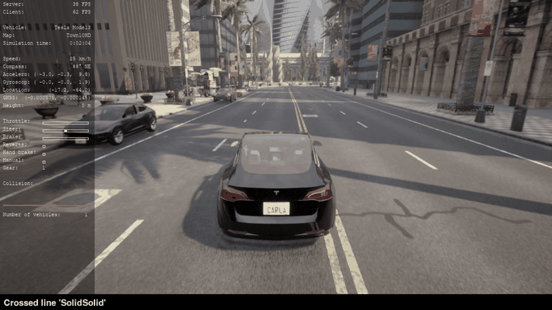
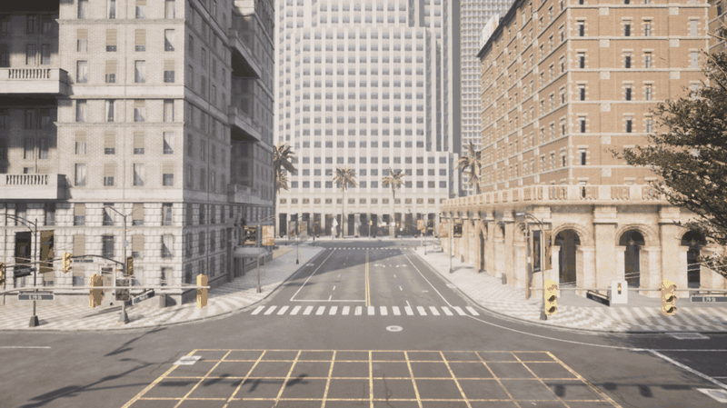
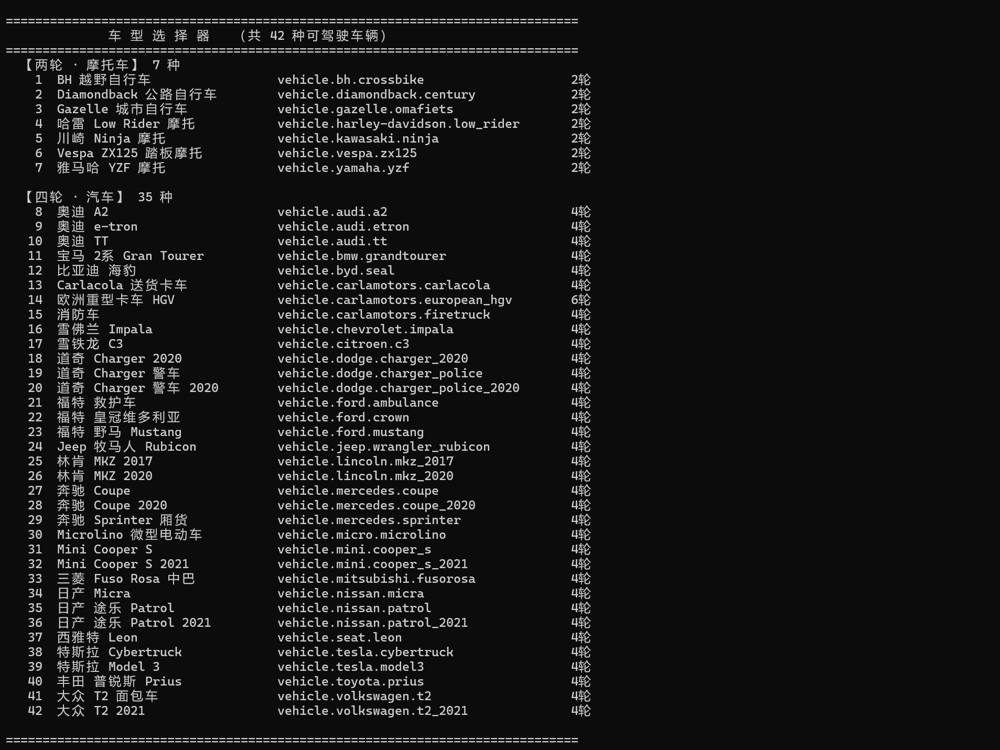

# 仿真车选车与键盘遥控器

`car_keyboard_teleop` 是面向 OpenHUTB / AirSim **地面车辆模拟器**的选车与键盘驾驶工具：先在终端从模拟器实时读取全部可驾驶车型，输入编号或关键词选定一辆（还可设置「备选车池」），随后自动打开第三人称驾驶窗口用键盘开车。代码位于 `src/ground/car_keyboard_teleop/`，模块入口为 `main.py`。

完整运行流程（启动模拟器 → 连接 → 选车 → 键盘驾驶）如下图所示：



## 实现步骤

整个模块分为「启动模拟器、连接、选车、开车」四步，对应两张脚本：

```
main.py（选车器，终端）                         car_manual_control.py（驾驶窗口，pygame）
┌───────────────────────────┐                  ┌───────────────────────────┐
│ 1. 检测/启动模拟器(2000端口) │                  │ 4. spawn 选定蓝图，挂载相机等传感器 │
│ 2. carla.Client 连接并拉取   │  --vehicle /     │    按键 → VehicleControl         │
│    全部车辆蓝图，编号展示    │  --vehicle-pool  │    每帧 apply_control 下发        │
│ 3. 交互选车（编号/关键词）   │ ───────────────► │    Backspace 在备选车池中轮换      │
└───────────────────────────┘   子进程启动       └───────────────────────────┘
```

### 第一步：启动模拟器

地面车辆模拟器（CarlaUE4）启动后会在本机监听 CARLA RPC 端口 `2000`，首次加载城市地图需要 1–3 分钟，出现城市画面即表示就绪：



`main.py` 启动时会先探测 `2000` 端口：端口未开放时，按 `--simulator` 参数 → `CARLA_ROOT` 环境变量 → 脚本上级目录的顺序自动查找并启动模拟器；找不到安装位置则提示先手动启动。

### 第二步：连接并读取车型

端口就绪后，脚本通过 `carla.Client(host, port)` 建立连接，调用 `get_world().get_blueprint_library().filter("vehicle.*")` 实时枚举全部车辆蓝图，读取每种车的 `number_of_wheels`、`base_type` 属性，按两轮 / 四轮、汽车 / 厢货 / 卡车分组并编号展示。车型列表会缓存到系统临时目录，模拟器不在线时可使用「离线缓存」车单。

### 第三步：选车
终端菜单支持三种选车方式：输入**编号**直接选择；输入**关键词**（英文片段或中文名，如 seal、mustang、海豹）搜索；直接回车沿用上次选择。选定后还可加入若干「备选车」。选车菜单输出示例如下：

`	ext
==============================================================================
              车 型 选 择 器   （共 42 种可驾驶车辆）
              实时读取（地图 Carla/Maps/Town10HD）
==============================================================================
  【两轮 · 摩托车】 7 种
    1  BH 越野自行车                 vehicle.bh.crossbike                    2轮
    4  哈雷 Low Rider 摩托           vehicle.harley-davidson.low_rider       2轮
    5  川崎 Ninja 摩托               vehicle.kawasaki.ninja                  2轮
  【四轮 · 汽车】 35 种
   12  比亚迪 海豹                   vehicle.byd.seal                        4轮
   23  福特 野马 Mustang             vehicle.ford.mustang                     4轮
   38  特斯拉 Cybertruck             vehicle.tesla.cybertruck                4轮
  输入 编号 选车 ｜ 输入 关键词 搜索 ｜ 回车 = 上次 ｜ 0 = 退出
  >> _
`

### 第四步：键盘驾驶

选车完成后，`main.py` 以子进程方式启动 `car_manual_control.py`，把车型通过 `--vehicle`（或备选车池 `--vehicle-pool`）传入。驾驶窗口在模拟器中生成所选车辆、挂载第三人称相机与碰撞/车道/雷达等传感器，进入 pygame 主循环：



## 通信原理

遥控器与模拟器之间采用 **客户端-服务器** 模式通信：

* **服务端**：地面车辆模拟器内置的 CARLA RPC 服务，默认监听 `127.0.0.1:2000`（与空域 AirSim 的 `41451` 端口不同，二者不要混淆）；
* **选车阶段**：`main.py` 通过 `carla.Client` 握手后读取蓝图库，只做查询不生成车辆；
* **驾驶阶段**：`car_manual_control.py` 连接同一服务端，`world.try_spawn_actor()` 生成所选蓝图，并为车辆挂载相机、碰撞、车道偏离、GNSS、IMU、雷达等传感器；
* **指令下发**：pygame 事件循环把按键映射为 `carla.VehicleControl(throttle, steer, brake, hand_brake, ...)`，每个渲染帧调用 `vehicle.apply_control()` 下发给模拟器；
* **备选车轮换**：按 `Backspace` 时，脚本销毁当前车辆并按 `--vehicle-pool` 列表中的下一个蓝图重新生成；未提供车池时只在原位重置，车型不变；
* **松键即停**：每帧根据当前按键状态重新计算 `VehicleControl`，松开油门/方向按键后对应输入立即归零。

驾驶窗口需要图形界面（pygame + SDL），与纯终端的[无人机键盘遥控器](../air/drone_teleop.md)使用场景不同：无人机是终端速度遥控，地面车辆是带第三人称相机的实时驾驶。

## 按键映射表

**按键前先用鼠标点一下驾驶窗口使其获得焦点，并切换到英文输入法，否则 `WASD` 会被命令行窗口或中文输入法截获。**

### 驾驶基本操作

| 按键 | 功能 |
| :---: | --- |
| `W` / `↑` | 油门 |
| `S` / `↓` | 刹车 |
| `A` / `D` | 左转 / 右转 |
| `Q` | 切换前进挡 / 倒挡（倒车前先按它） |
| `Space` | 手刹（急停） |
| `P` | 开 / 关自动驾驶 |
| `M` | 切换手动变速箱 |
| `,` / `.` | 手动挡状态下升档 / 降档 |
| `Ctrl+W` | 定速巡航 60 km/h 开关 |

### 车灯与灯光

| 按键 | 功能 |
| :---: | --- |
| `L` | 切换下一组灯（近光 / 远光 / 位置灯） |
| `Shift+L` | 切换远光灯 |
| `Z` / `X` | 右转向灯 / 左转向灯 |
| `I` | 车内顶灯 |

### 视角、画面与录制

| 按键 | 功能 |
| :---: | --- |
| `Tab` | 切换摄像机位置（第三人称 / 车头 / 车顶等） |
| `` ` `` 或 `N` | 切换到下一个传感器视角 |
| `1` ~ `9` | 直接切到第 1~9 号传感器 |
| `G` | 雷达点云可视化开关 |
| `C` / `Shift+C` | 正向 / 反向切换天气 |
| `F1` / `H` | 显示或隐藏 HUD 数据面板 / 帮助 |
| `R` | 开始 / 停止录制图像到磁盘 |
| `Ctrl+R` | 开始 / 停止录制仿真轨迹 |
| `Ctrl+P` | 回放上次录制的仿真 |

### 车辆与退出

| 按键 | 功能 |
| :---: | --- |
| `Backspace` | 在 `--vehicle-pool` 备选车池中轮换；无车池时原位重置 |
| `O` / `T` | 开关所有车门 / 显示车辆遥测数据 |
| `V` / `B` | 选择 / 加载地图图层（`Shift+B` 卸载） |
| `ESC` | 退出驾驶窗口（模拟器继续运行） |

## 启动命令

**前置条件：** 地面车辆模拟器已启动并出现城市画面（RPC 端口 `2000` 可连通），Python 已安装与模拟器同版本的 `hutb` 客户端 wheel 与 `pygame`。

```shell
# 拉取仓库并进入仓库根目录
git clone https://github.com/OpenHUTB/ros2.git
cd ros2

# 安装运行依赖
pip install -r src/requirements.txt
# hutb 提供 carla 模块，版本必须与模拟器一致（PyPI 版本较旧，请装模拟器自带 wheel）
pip install <模拟器安装目录>/PythonAPI/carla/dist/hutb-2.9.16-cp3xx-*-win_amd64.whl

# 启动选车与键盘驾驶（模块入口 main.py）
python src/ground/car_keyboard_teleop/main.py
```

不进菜单、直接点名选车：

```shell
python src/ground/car_keyboard_teleop/main.py -v 海豹
python src/ground/car_keyboard_teleop/main.py -v mustang --pool cybertruck,model3
```

连接非本机的模拟器，或指定分辨率与可执行文件路径：

```shell
python src/ground/car_keyboard_teleop/main.py --host 172.21.108.47 --port 2000 --res 1600x900
python src/ground/car_keyboard_teleop/main.py --simulator "D:\Carla\CarlaUE4\Binaries\Win64\CarlaUE4-Win64-Shipping.exe"
```

| 参数 | 默认值 | 说明 |
| --- | --- | --- |
| `--host` | `127.0.0.1` | 模拟器地址 |
| `--port` | `2000` | CARLA RPC 端口 |
| `--res` | `1280x720` | 驾驶窗口分辨率 |
| `-v, --vehicle` | 空 | 完整蓝图 id、英文片段或中文车名 |
| `--pool` | 空 | 备选车池，逗号分隔，`Backspace` 轮换 |
| `--simulator` | 空 | 模拟器可执行文件路径，缺省取 `CARLA_ROOT` 或自动查找 |
| `--timeout` | `15` | 连接超时秒数 |
| `--list` | 关 | 只打印车型清单，不启动驾驶窗口 |
| `--refresh` | 关 | 忽略缓存，强制重新拉取车型 |
| `--no-autostart` | 关 | 模拟器没开时不自动启动 |
| `--dry-run` | 关 | 只选车、打印启动命令，不打开驾驶窗口 |

## 常见问题

* **提示连接失败 / 端口 2000 连不上**：模拟器尚未启动或仍在加载（首次 1–3 分钟），等城市画面出现后重试；防火墙弹窗时允许模拟器主程序访问专用网络。
* **按 `W/A/S/D` 没反应**：先用鼠标点击驾驶窗口让它获得焦点；按 `Shift` 切换到英文输入法。
* **报版本不匹配错误**：`hutb`（`carla` 模块）版本必须与模拟器一致，卸载后安装模拟器 `PythonAPI/carla/dist/` 下对应 Python 版本的 wheel。
* **找不到模拟器、无法自动启动**：设置 `CARLA_ROOT` 环境变量指向模拟器安装目录，或使用 `--simulator` 指定完整路径，也可以先手动启动模拟器再运行 `main.py`。
* **终端中文显示乱码**：Windows 命令行执行 `chcp 65001` 切换到 UTF-8 代码页。

## 参考

* [手动控制（CARLA ROS Bridge）](../set_up_and_connect_to_carla.md)
* [无人机终端键盘遥控器](../air/drone_teleop.md)
* [预编译模拟器使用说明](https://openhutb.github.io/air_doc/use_precompiled/)

## 声明

本页面及对应代码的部分内容由大模型辅助生成（代码仓库化路径重构、文档结构整理等），代码均已连接真实模拟器完成运行验证，提交者对全部提交内容负全部责任。