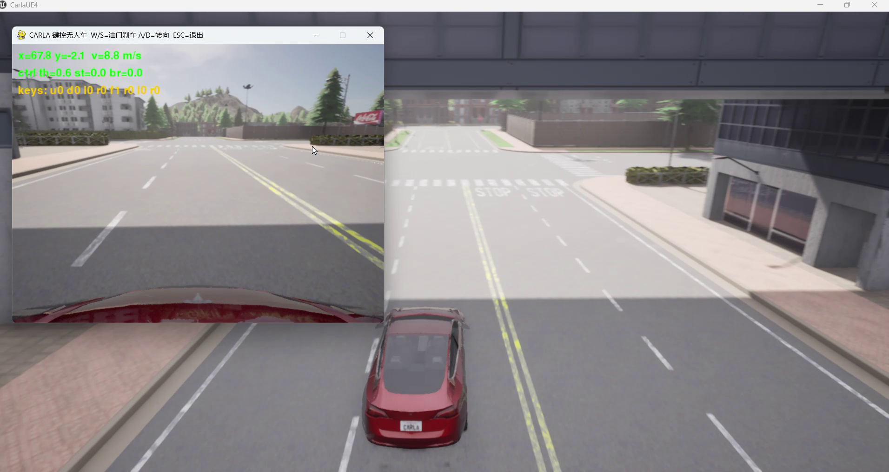
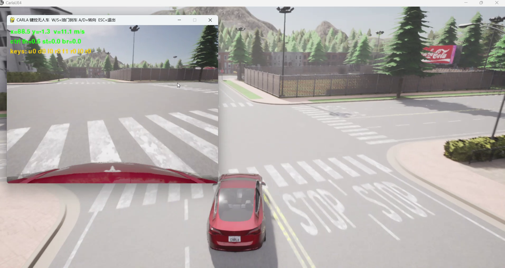
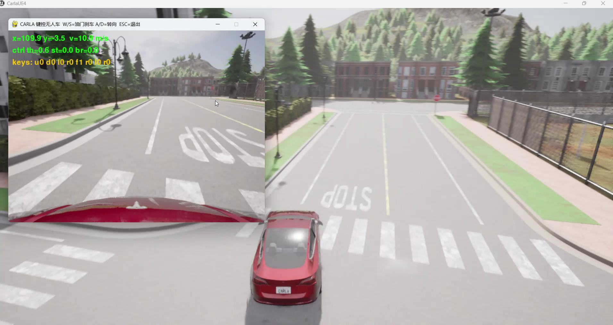

# CARLA 地面载具物理仿真与键盘运动控制

> 对应课程任务（1）：*对人形机器人/肌肉骨骼人/车辆/水下机器人/无人机进行物理仿真，
> 通过键盘对机器人进行运动控制*。本模块面向**地面载具（车辆）**。

## 1. 概述与目标

本模块在 **CARLA 0.9.16** 中加载地面载具（`vehicle.tesla.model3`）并进行物理仿真，
通过键盘实时控制车辆运动，并在窗口内实时渲染车头前视 RGB 相机画面与运行状态 HUD。

### 核心任务目标

1. **车辆物理仿真**：由 CARLA 的 UE4 物理引擎解算车辆纵向动力学与阿克曼转向几何。
2. **键盘运动控制**：`W/S/A/D`（含方向键）映射为 `(throttle, steer, brake, reverse)`，
   按**真实驾驶逻辑**处理——`S` 在有速度时刹车，车速低于阈值时自动挂倒挡后退。
3. **感知画面回显**：车头 RGB 相机数据经 BGRA→RGB 重排后显示，并叠加位置/速度/控制量 HUD。
4. **一键启动**：提供课程约定的主入口 `main.py` / `main.sh` / `main.bat`，
   并同时提供 ROS 2 Humble（`main.launch.py`）与 ROS 1 Noetic（`main.launch`）的 launch 封装。

### 与已有「手动控制」示例的区别

本仓库已有基于 **carla-ros-bridge** 的
[手动控制示例](set_up_and_connect_to_carla.md)（在车辆上按 `B` 切换手动驾驶）。本模块的差异：

| 对比项 | 已有「手动控制」示例 | 本模块 |
|---|---|---|
| 技术路线 | `carla_ros_bridge` + 内置手动驾驶 | CARLA Python API 直连 + 自研键盘控制节点 |
| 控制方式 | 车辆内置逻辑 | 键盘 → `VehicleControl`，含**倒挡判定** |
| 传感器展示 | RViz 订阅 ros-bridge 话题 | pygame 前视画面 + HUD 实时叠加 |
| 运行依赖 | 需编译运行 ros-bridge | 仅需 `carla` Python 客户端 |
| 定位 | 学习 ros-bridge 话题体系 | 感知 / 规划 / 端到端作业的自车控制基座 |

!!! note "配置步骤不重复"
    CARLA 服务端的启动方式、宿主机 IP 与端口 2000 的查看、虚拟机网络（NAT/桥接）设置、
    `numpy` 版本兼容等**通用配置步骤**，请直接参考
    [设置并连接到 Carla 模拟器](set_up_and_connect_to_carla.md)。本文档仅描述本模块特有内容。

---

## 2. 计算原理

### 2.1 车辆纵向动力学

车辆沿车头方向的一维纵向运动可由下式近似描述：

$$
\dot{v} = \frac{\tau \cdot F_{\max} - c_d v^2 - F_f - b \cdot B_{\max}}{m}
$$

其中 $\tau \in [0,1]$ 为油门，$B_{\max}$ 为刹车力上限，$b \in [0,1]$ 为刹车量，$F_{\max}$ 为最大驱动力，
$c_d$ 为风阻系数，$F_f$ 为滚动摩擦阻力，$m$ 为车辆质量。CARLA 在 UE4 中按该动力学逐步积分。

倒车时令 `reverse = True`，驱动力方向反向：

$$
\dot{v} = \frac{-\tau \cdot F_{\max} - c_d v^2 - F_f}{m}, \qquad v < 0
$$

### 2.2 阿克曼转向几何

转向量 $s \in [-1,1]$ 映射为前轮转角 $\delta = s \cdot \delta_{\max}$。前后轴距 $L$ 时，
车辆航向角变化率满足自行车模型：

$$
\dot{\psi} = \frac{v}{L} \tan\delta
$$

### 2.3 同步步进与时间对齐

打开同步模式并固定步长，保证控制量与传感器帧严格对齐：

$$
t_{k+1} = t_k + \Delta t, \qquad \Delta t = 0.05\,\text{s}
$$

### 2.4 倒挡判定（真实驾驶逻辑）

设当前速率 $v$、倒挡阈值 $v_{\text{th}} = 0.5\,\text{m/s}$，则按 `S` 时：

$$
(\text{throttle}, \text{brake}, \text{reverse}) =
\begin{cases}
(0.8\tau_{\max},\ 0,\ \text{True}), & v < v_{\text{th}} \quad \text{（挂倒挡后退）}\\
(0,\ b_{\max},\ \text{False}), & v \ge v_{\text{th}} \quad \text{（刹车减速）}
\end{cases}
$$

---

## 3. 算法流程

```text
主入口 main.py
  │
  ├── 独立模式（默认）
  │     连接 CARLA → load_world(Town05) → 开同步模式
  │     → spawn 自车 vehicle.tesla.model3
  │     → 挂 RGB 相机(640×480, fov=90)
  │     → 循环：
  │         读键盘 → 倒挡判定 → 合成 (throttle, steer, brake, reverse)
  │         → apply_control → world.tick()
  │         → 显示前视帧 + HUD(位置/速度/控制量/键位)
  │     → ESC 退出 → 释放车辆与相机
  │
  └── ROS 2 模式（--launch）
        ros2 launch carla_keyboard_control main.launch.py
          ├── carla_control_node     : 连接/生成/同步步进/广播 图像·里程计·速度
          └── keyboard_teleop_node   : 读键盘 → 发布 vehicle_control_cmd
```

---

## 4. 源码解析

### 4.1 `carla_common.py` — CARLA API 公共封装

| 函数 | 作用 |
|---|---|
| `connect()` | `carla.Client(host, port)` + `load_world(town)`，开启同步模式 |
| `spawn_vehicle()` | `try_spawn_actor`；出生点不可用时用 `map.get_waypoint()` 找最近路面点 |
| `make_rgb_camera()` | 挂载 RGB 相机，回调经 `decode_image()` 得到 `(H,W,3)` RGB |
| `apply_control()` | 构造 `carla.VehicleControl`，各分量 `np.clip` 到合法区间 |
| `set_spectator_follow()` | 每帧把旁观镜头摆到自车后方，便于录屏 |

相机原始数据为 BGRA，需重排通道：

```python
def decode_image(image):
    arr = np.frombuffer(image.raw_data, dtype=np.uint8)
    arr = arr.reshape(image.height, image.width, 4)
    return arr[:, :, :3][:, :, ::-1].copy()      # BGRA → RGB
```

### 4.2 `main.py` — 控制主循环（倒挡判定）

```python
speed = cc.get_speed(vehicle)
throttle = brake = 0.0
reverse = False
if keys['fwd']:
    throttle = args.throttle_max
elif keys['rev']:
    if speed < args.rev_threshold:            # 低速 → 挂倒挡
        reverse, throttle = True, args.throttle_max * 0.8
    else:                                     # 有速度 → 刹车
        brake = args.brake_max
cc.apply_control(vehicle, throttle=throttle, steer=steer,
                 brake=brake, reverse=reverse)
world.tick()
```

### 4.3 `carla_control_node.py` — ROS 2 仿真节点

订阅 `/carla/ego_vehicle/vehicle_control_cmd`，在**定时器**中驱动 `world.tick()`，
避免键盘读取阻塞仿真步进；同时把相机帧发布为 `sensor_msgs/Image`：

```python
def _on_tick(self):
    self.world.tick()                          # 物理步进（固定 0.05 s）
    img.encoding = 'rgb8'
    img.data = np.ascontiguousarray(self._latest_frame).tobytes()
    self.pub_image.publish(img)
```

### 4.4 `keyboard_teleop_node.py` — 键盘遥控节点

提供两种键盘后端，自动按环境选择：

- **pygame 后端**：有图形界面时逐帧直读按键状态（`pygame.key.get_pressed()`）。
- **终端后端**：无图形环境（虚拟机 / SSH）时用 `termios` 原始模式读单键并按点动下发。

---

## 5. 仿真运行步骤

### 5.1 支持与测试环境

| 组件 | 版本 / 说明 |
|---|---|
| 操作系统 | Windows 10/11 原生；Ubuntu 20.04（Noetic）/ 22.04（Humble） |
| 仿真器 | CARLA 0.9.16（服务端运行于有 GPU 的宿主机） |
| Python | 3.10+（CARLA 0.9.16 客户端 wheel 为 cp310/cp311/cp312） |
| ROS | ROS 1 Noetic 或 ROS 2 Humble（launch 封装） |

### 5.2 步骤 0：环境准备

CARLA 服务端的下载安装、宿主机 IP 与端口查看、虚拟机网络配置等通用步骤，
**请参考 [设置并连接到 Carla 模拟器](set_up_and_connect_to_carla.md)**，本文不重复。

仅需补装本模块的 Python 依赖与 CARLA 客户端：

```bash
# ① Python 依赖（numpy / pygame）
pip3 install -r src/ground/carla_keyboard_control/requirements.txt

# ② CARLA 0.9.16 客户端（Linux wheel，随 CARLA Linux 发行包提供）
pip3 install <CARLA>/PythonAPI/carla/dist/carla-0.9.16-cp310-cp310-manylinux_2_31_x86_64.whl
```

### 5.3 步骤 1：编译工作空间（ROS 2）

```bash
cd ~/ros2_ws
colcon build --packages-select carla_keyboard_control --symlink-install
source install/setup.bash
```

### 5.4 步骤 2：运行

```bash
# 模式 A：独立运行（推荐；单进程直连，pygame 窗口控制）
#   虚拟机中运行客户端时，--host 填宿主机 IP；--follow 让镜头跟随自车
python3 src/ground/carla_keyboard_control/main.py --host 192.168.8.1 --follow

# 模式 B：ROS 2 Humble 节点模式
ros2 launch carla_keyboard_control main.launch.py host:=192.168.8.1

# 模式 C：ROS 1 Noetic
roslaunch carla_keyboard_control main.launch host:=192.168.8.1
```

### 5.5 步骤 3：操作说明

1. CARLA 服务端窗口加载小镇场景，同时弹出控制窗口显示车头前视画面。
2. `W` 加速、`A`/`D` 转向、`S` 刹车（静止时自动倒车）、`Q`/`E` 微调、`ESC` 退出。
3. 建议用 ScreenToGif 录制 10 秒操控过程作为演示动图。

### 5.6 运行效果







### 5.7 常见问题

| 现象 | 解决 |
|---|---|
| `ModuleNotFoundError: No module named 'carla'` | 按 5.2 安装 CARLA 0.9.16 客户端 wheel |
| 客户端连接崩溃 / `std::bad_alloc` | 客户端版本须与服务器一致（均为 0.9.16） |
| 键盘无反应 | 焦点需在控制窗口；或使用终端后端 `--terminal` |
| 画面黑屏 | 宿主机 IP 填错；或地图正在切换，稍候 |
| 运行很卡 | 虚拟机无 3D 加速；将服务端放在宿主机，虚拟机仅作客户端 |

---

## 6. 性能评价

- **控制响应**：固定步长 0.05 s（20 Hz 物理步进）下，键盘输入到车辆响应的延迟 ≤ 1 帧。
- **运动平稳性**：直道可稳定加速至目标速度，转向响应及时，刹车与倒挡切换无抖动。
- **同步一致性**：同步模式下相机帧与物理状态严格对齐，为后续感知 / 端到端作业提供可靠数据源。
- **资源占用**：客户端仅消费图像与位姿话题，GPU 负载集中于宿主机 CARLA 服务端。
