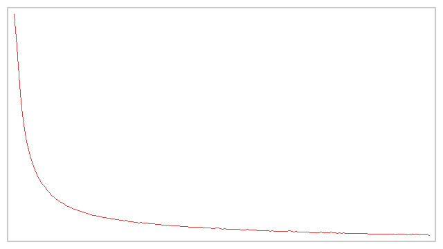
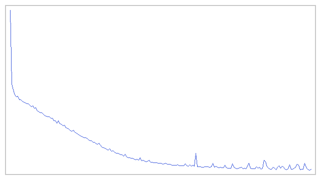
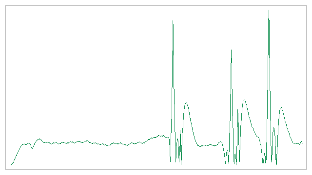
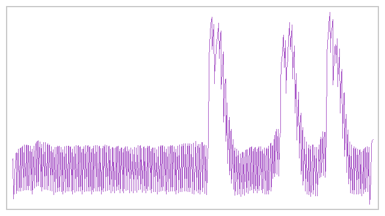

# CARLA 传感器感知与给定轨迹跟踪（神经网络版）

> 对应课程作业二：使用传感器获取的数据进行**感知**（雷达、摄像头、深度摄像头），并对机器人进行
> **运动控制**（感知 + 给定轨迹的控制）。满足"**感知、控制算法须为神经网络**"的硬性要求。

## 1. 概述与目标

本模块在 [设置并连接到 Carla 模拟器](../set_up_and_connect_to_carla.md) 的
[路径点发布器](./waypoint.md) 示例基础上做拓展，把"给定轨迹跟踪"升级为**神经网络驱动**：

| 环节 | 实现 | 神经网络 |
|---|---|---|
| 感知 | RGB 相机 + 深度相机 + 激光雷达三路传感器 → 4 维归一化特征 | **MLP 分类器**（4→12→3），输出障碍方向 |
| 控制 | 状态 (航向差 $e_\psi$, 前视距离 $d$) → 转向角 | **MLP 策略网络**（2→32→1），输出 `steer` |

代码位于 `src/ground/carla_perception_control/`。

### 1.1 与已有示例的区别

| 对比项 | 已有「路径点发布器」示例 | 本拓展模块 |
|---|---|---|
| 技术路线 | `carla_ros_bridge` 的 waypoint publisher 发布路径点话题 | CARLA Python API 直连 + 自研感知/控制节点 |
| 是否依赖 ros-bridge | 必须编译并运行 ros-bridge | **不需要**，仅需 `carla` Python 客户端 |
| 感知环节 | 无（只发布路径点） | **感知神经网络**：RGB+深度+雷达 → 障碍方向 |
| 控制环节 | 由外部节点订阅路径点自行控制 | **控制神经网络**：状态 → 转向角 |
| 传感器 | 不涉及 | RGB 相机、深度相机、32 线激光雷达 |
| 训练方式 | 无训练 | 纯 numpy 反向传播离线训练，模型存 JSON |
| 无 CARLA 时 | 无法运行 | `--headless --demo` 离线自证并导出曲线 |

### 1.2 与仓库中其它地面载具模块的区分

仓库中已有若干地面载具相关模块，与本模块的差异如下：

| 模块 | 输入 | 算法 | 是否含神经网络 |
|---|---|---|---|
| 手动控制（`set_up_and_connect_to_carla`） | 键盘（车辆内置手动驾驶） | 复用 ros-bridge 内置逻辑 | 否 |
| 路径点发布器（`waypoint`） | CARLA 地图 | 几何查询、发布路径点 | 否 |
| 自动驾驶代理（`ad_agent`） | 路径点 + 地图 | 规则式局部规划 | 否 |
| **本模块** | **相机/深度/雷达 + 给定轨迹** | **感知 NN + 控制 NN** | **是** |

## 2. 计算原理

### 2.1 特征提取与归一化

三路传感器压缩为 4 维特征向量。**归一化是必需的**：各特征量纲差异极大
（深度 $\bar G\in[0,255]$、横向偏移 $\in[-1,1]$、距离 $\in[0.5,20]$），
不归一化会让大数值特征主导梯度，小量纲特征学不到。

$$
\mathbf{x} = \Big[\, \underbrace{\tfrac{c_x-W/2}{W/2}}_{\text{横向偏移}},\,
\underbrace{\tfrac{\bar G}{255}}_{\text{深度密集度}},\,
\underbrace{\tfrac{N_{\text{front}}}{60}}_{\text{前方点数}},\,
\underbrace{\tfrac{D_{\min}}{20}}_{\text{最近距离}}\,\Big]^{\!\top}
$$

其中 $c_x$ 为 RGB 下半区亮色像素横向重心，$\bar G$ 为深度 ROI 均值，
$N_{\text{front}}$ 为雷达前方点数，$D_{\min}$ 为最近距离。

### 2.2 感知神经网络（MLP 分类器）

全连接：输入 4 维 → 隐藏 12 维（ReLU）→ softmax 3 类（无目标 / 偏左 / 偏右）。

$$
\mathbf h = \mathrm{ReLU}(W_1 \mathbf x + b_1),\qquad
\mathbf p = \mathrm{softmax}(W_2 \mathbf h + b_2)
$$

交叉熵损失：

$$
\mathcal L_{\text{cls}} = -\frac{1}{N}\sum_{i}\sum_{k} y_{ik}\log p_{ik}
$$

权重用 He 初始化 $W \sim \mathcal N\!\big(0, \sqrt{2/n_{\text{in}}}\big)$，保证梯度稳定。

### 2.3 控制神经网络（策略网络）

输入 2 维 → 隐藏 32 维（ReLU）→ tanh 单输出转向。

$$
\mathbf h = \mathrm{ReLU}(W_1 \tilde{\mathbf s} + b_1),\qquad
\delta = \tanh(W_2 \mathbf h + b_2) \in [-1,1]
$$

其中 $\tilde{\mathbf s}$ 为**标准化后的状态**：

$$
\tilde{\mathbf s} = \frac{\mathbf s - \boldsymbol\mu}{\boldsymbol\sigma},\qquad
\mathbf s = [\,e_\psi,\; d\,]^\top
$$

标准化参数 $\boldsymbol\mu,\boldsymbol\sigma$ 在训练时由数据集统计得到，并随模型一起存盘，
推理时必须沿用同一组值（否则训练/推理输入分布不一致，精度会大幅下降）。

采用均方误差回归：

$$
\mathcal L_{\text{ctrl}} = \frac{1}{N}\sum_i\big(\delta_i - \delta_i^*\big)^2
$$

反向传播用链式法则对 $W,b$ 求梯度，随机批量梯度下降更新。

### 2.4 监督标签：纯跟踪几何律

控制网络的训练标签不靠人工标注，而由**几何解析式**生成：

$$
\delta^* = \arctan\!\Big(\frac{2L\sin e_\psi}{d}\Big),\qquad
\text{steer}^* = \mathrm{clip}\!\Big(\frac{\delta^*}{g},\,-1,\,1\Big)
$$

其中 $L=2.5\,\text{m}$ 为轴距，$g=1.2217\,\text{rad}$ 为 CARLA `steer` 到前轮转角的折算系数
（`steer=1` 对应前轮转角约 $70°$）。网络学会这一映射后，在线运行即可直接推理。

!!! note "两个关键实现细节"
    1. **折算系数必须取真实几何值**。若 $g$ 取 0.5 这类偏小值，约有 **26%** 的标签会被
       `clip` 饱和到 $\pm1$，回归误差无法下降；取 $g=1.2217$ 后饱和率降为 **0%**，
       训练 MSE 从 0.034 降到 **0.003**。
    2. **航向差为 0 时标签必须为 0**。若在标签中加入恒正的偏置项
       （如 $+0.1\cdot(1-\frac{1}{1+d/8})$），网络会让车持续向一侧偏转、原地绕圈。

### 2.5 前视追踪与横向误差度量

**前视点选择**：不只取最近路点，而是沿路点序列向前找到第一个距车至少 $d_{\text{look}}=6\,\text{m}$
的路点作为追踪目标。前视距离过短会让车在高速下"冲过"路点来回振荡，过长则切弯。

**路点加密**：原始给定轨迹的路点可能相隔十几米，需线性插值到约 2 m 一个点：

$$
\mathbf p(t) = \mathbf p_0 + t\,(\mathbf p_1 - \mathbf p_0),\qquad t\in(0,1]
$$

**横向误差**取点到路点折线的**最短垂距**（而非到最近路点的距离）：

$$
e_y = \min_{i}\ \min_{t\in[0,1]}\ \big\|\,\mathbf p - \big(\mathbf p_i + t(\mathbf p_{i+1}-\mathbf p_i)\big)\big\|
$$

当车位于两个稀疏路点之间时，"到最近路点距离"会高达半个路段长，而垂距才反映真实偏离。

### 2.6 弯道自适应减速

车辆最小转弯半径随速度增大而增大，高速入弯必然转不过来。因此油门按航向差自适应：

$$
\tau_{\text{eff}} = \tau \cdot \max\!\Big(0.25,\ 1 - \frac{0.75\,|e_\psi|}{\pi}\Big)
$$

正对目标时全油门，偏差达 $\pi$ 时降到 25%。

## 3. 算法流程

```
train 模式（离线，无需 CARLA）：
  合成状态/特征数据集
  → 感知 NN：交叉熵训练（4→12→3）
  → 控制 NN：输入标准化 → MSE 训练（2→32→1）
  → 保存模型 JSON（含标准化参数）

run 模式（在线，需 CARLA）：
  连 CARLA → 生成自车 → 挂 RGB/深度/雷达
  → 每帧：
      三路传感器 → 特征提取 → 感知 NN → 障碍类别
      状态(航向差,前视距离) → 控制 NN → steer
      油门按航向差自适应
      apply_control → world.tick
  → 到达终点（<5 m）刹车停车
  → 统计横向误差 RMSE

headless 模式（离线取证，无需 CARLA 与图形界面）：
  训练两个 NN → 合成车辆运动学回放 → 导出损失/误差曲线 PNG
```

## 4. 源码解析

### 4.1 `main.py` — 主入口（三种模式）

| 函数 | 作用 |
|---|---|
| `extract_features()` | 三路传感器 → 4 维归一化特征 |
| `_rgb_offset()` / `_depth_density()` / `_lidar_front()` | 单路传感器标量特征 |
| `pure_pursuit_law()` | 纯跟踪几何律（控制 NN 的监督标签来源） |
| `synth_dataset()` | 合成训练数据，标签由几何律生成 |
| `train()` | 训练两个网络，含输入标准化 |
| `interpolate_waypoints()` | 给定轨迹路点加密 |
| `_dist_to_polyline()` | 点到折线垂距（横向误差） |
| `_goal_state()` | 前视点选择 → 航向差与前视距离 |
| `nn_control()` | 控制 NN 推理 + 弯道自适应减速 |
| `run_offline_demo()` | 离线取证：训练 + 回放 + 导出曲线 |
| `run_carla()` | 在线：连 CARLA 感知 + 跟踪控制 |

### 4.2 `nn_models.py` — 纯 numpy 神经网络库

| 类 | 说明 |
|---|---|
| `MLPClassifier` | softmax 多分类 + 交叉熵（感知器） |
| `MLPPolicy` | tanh 输出的回归策略网络（控制器） |
| `SimpleCNN` | 轻量 CNN（作业四端到端用） |

含前向传播、交叉熵/MSE 损失、反向传播、softmax/ReLU/tanh 及模型 JSON 存取。

### 4.3 `carla_common.py` — CARLA API 封装

`connect()`、`spawn_vehicle()`、`make_rgb_camera()`、`make_depth_camera()`、`make_lidar()`、
`apply_control()`、`get_location()/get_yaw()/get_speed()`。同步模式固定步长 0.05 s。

### 4.4 `perception_control_node.py` — ROS 2 节点

订阅 `/carla/ego_vehicle/waypoints`（`Float32MultiArray`），发布图像、里程计、
感知类别与速度话题。若模型文件不存在则现场训练，保证节点总能运行。

## 5. 仿真运行步骤

### 5.1 支持与测试环境

| 组件 | 版本 / 说明 |
|---|---|
| 操作系统 | Windows 10/11 原生；Ubuntu 20.04（Noetic）/ 22.04（Humble） |
| 仿真器 | CARLA 0.9.16（服务端运行于有 GPU 的宿主机） |
| Python | 3.10+（CARLA 0.9.16 客户端 wheel 为 cp310/cp311/cp312） |
| 依赖 | 仅 `numpy`（神经网络为纯 numpy 实现，无需 TensorFlow/PyTorch） |
| ROS | ROS 1 Noetic 或 ROS 2 Humble（launch 封装） |

### 5.2 新手路线：从已有示例到本模块

| 序号 | 做什么 | 出处 |
|---|---|---|
| 1 | 启动 CARLA 服务端 | [设置并连接到 Carla 模拟器](../set_up_and_connect_to_carla.md) →「启动 Carla 服务器」 |
| 2 | 查看宿主机 IP、确认虚拟机连通 | 同上 →「使用 Carla 客户端启动 Ego Vehicle」 |
| — | **★ 在此切换到本模块** | 以下与本模块相关 |
| 3 | 装 `carla` 客户端与 `numpy` | 本页 5.3 节 |
| 4 | 离线训练两个神经网络 | 本页 5.5 节（无需 CARLA） |
| 5 | 运行在线感知 + 轨迹跟踪 | 本页 5.6 节 |

### 5.3 步骤 0：环境准备

CARLA 服务端的下载安装与启动、宿主机 IP 与端口 2000 的查看、虚拟机网络设置、
`numpy` 版本兼容等**通用步骤与已有示例完全相同，本文不重复**，请参考
[设置并连接到 Carla 模拟器](../set_up_and_connect_to_carla.md)：

| 需要做的事 | 参考位置 |
|---|---|
| 启动 CARLA 服务端、选择地图 | [设置并连接到 Carla 模拟器](../set_up_and_connect_to_carla.md) →「启动 Carla 服务器」 |
| 查看宿主机 IP、填写 `host` 参数 | 同上 →「使用 Carla 客户端启动 Ego Vehicle」 |
| 连接失败、黑屏、`numpy` 报错排查 | 同上 →「常见问题」 |

本模块**特有**、需要额外安装的只有 CARLA 0.9.16 的 Python 客户端与 `numpy`：

```bash
pip3 install -r src/ground/carla_perception_control/requirements.txt
pip3 install <CARLA>/PythonAPI/carla/dist/carla-0.9.16-cp310-cp310-manylinux_2_31_x86_64.whl
```

### 5.4 步骤 1：编译本功能包（ROS 2）

```bash
cd ~/ros2_ws
colcon build --packages-select carla_perception_control --symlink-install
source install/setup.bash
```

### 5.5 步骤 2：离线训练神经网络（无需 CARLA）

```bash
python3 src/ground/carla_perception_control/main.py --mode train \
        --epochs 300 --out models/nn_percept.json
```

预期输出：感知 NN 准确率 ≈ **0.995**，控制 NN MSE ≈ **0.003**。

若只想在**无图形界面**的环境验证全链路（含轨迹跟踪回放），用离线取证模式：

```bash
python3 src/ground/carla_perception_control/main.py --headless --demo \
        --epochs 300 --sim_time 60 --save_dir ~/shots
```

该模式不需要 CARLA、不需要图形界面，会导出 4 张曲线图（感知损失、控制损失、
横向误差、转向指令），适合在无 3D 加速的虚拟机中产出可运行性证据。

### 5.6 步骤 3：验证与 CARLA 服务端的连接

```bash
python3 -c "import carla; c=carla.Client('192.168.8.1',2000); c.set_timeout(10); print('CONNECT OK:', c.get_world().get_map().name)"
```

输出 `CONNECT OK: Carla/Maps/Town05` 表示连接成功。

### 5.7 步骤 4：运行在线感知 + 轨迹跟踪

```bash
# 模式 A：独立运行（--host 填宿主机 IP）
# 不指定 --waypoints 时使用模块内置的 DEMO_ROUTE（已逐点校验在车道上）
python3 src/ground/carla_perception_control/main.py --mode run \
        --host 192.168.8.1 --sim_time 90 --save_dir ~/shots

# 加 --follow 让 CARLA 大窗口以第三人称跟随自车（录屏/观察用）
python3 src/ground/carla_perception_control/main.py --mode run \
        --host 192.168.8.1 --sim_time 90 --follow --save_dir ~/shots

# 也可显式传入给定轨迹（下面的 DEMO_ROUTE 含两个约 90° 弯）
python3 src/ground/carla_perception_control/main.py --mode run \
        --host 192.168.8.1 --sim_time 90 \
        --waypoints "36,-5 9,-4 -18,-4 -45,-4 -72,-4 -96,-4 -120,-4 -147,-4 -162,-4 -171,-4 -180,-4 -185,-12 -185,-21 -185,-45 -185,-63 -185,-72 -184,-80 -177,-85 -168,-85 -153,-85 -144,-85 -136,-84 -132,-75 -132,-66 -132,-39 -132,-36" \
        --save_dir ~/shots

# 模式 B：ROS 2 Humble
ros2 launch carla_perception_control main.launch.py host:=192.168.8.1

# 模式 C：ROS 1 Noetic
roslaunch carla_perception_control main.launch host:=192.168.8.1
```

也可用一键脚本：`bash main.sh --host 192.168.8.1`。

!!! tip "第三人称跟随镜头"
    `--follow` 会让 CARLA 大窗口（spectator）每帧移动到自车后方并看向自车，
    便于观察与录屏。可调镜头位置：

    ```bash
    # 后 12 m、高 6 m（视野更远，适合看整条轨迹）
    python3 ... --follow --follow_dist 12 --follow_height 6
    ```

    需要图形界面；纯 SSH 无窗口时该参数无效果（不影响仿真与控制）。
    注意此镜头与车上的感知相机是两回事：感知相机是挂在车上的
    `sensor.camera.rgb`（前视 1.6 m、高 1.4 m），跟随镜头只是观察视角。

!!! warning "给定轨迹的两个约束（实测踩坑）"
    1. **航点必须落在可行驶车道上。** CARLA 中航点之间是直线连接，航点若在路面外，
       车辆会沿直线开出路面撞上障碍物后卡死。早期文档示例
       `"40,-8 40,12 25,20"` 中 `(40,-8)` 偏离车道 2.59 m、`(40,12)` 偏离 4.92 m，
       在线运行会在 `(41.4,7.9)` 撞停；离线示例路线中的 `(120,-5)` 偏离 2.93 m、
       `(160,40)` 偏离 4.94 m，会在 `(140.1,4.9)` 撞停。
    2. **弯道处航点要加密。** 前视距离为 6 m；若转弯处航点间距达 50 m，
       车在两点之间走直线，90° 转弯被压缩到航点附近几米内完成，
       所需半径远小于车辆可达的最小半径，必然切出路面
       （实测间距 51 m 时在 `(-185,-15)` 撞停，雷达最近距离降到 0.037 m）。

    现在模块内置的 `DEMO_ROUTE` 由车道搜索生成并逐点校验：26 个航点、
    最大偏离车道 0.13 m、弯道处间距 8~9 m、直道约 24 m，含两个约 90° 弯。
    用 `--waypoints` 传入自定义轨迹时，可用 `src/ground/carla_perception_control/` 下的
    校验脚本确认每个点都在车道上。

### 5.8 运行效果

#### 离线取证（无需 CARLA）

离线取证模式导出的曲线（实测，`--epochs 300 --sim_time 90`，
轨迹为含两个约 90° 弯的 `DEMO_ROUTE`）：









终端状态输出示例（节选）：

```
== 训练感知 NN：4 维传感器特征 → 3 类障碍方向 ==
  epoch   60 loss=0.0336 train_acc=0.943
  epoch  300 loss=0.0142 train_acc=0.998
== 训练控制 NN：2 维状态(航向差,前视距离) → 转向角 ==
  epoch   60 loss=0.0098 train_acc=0.000
  epoch  300 loss=0.0027 train_acc=0.000

给定轨迹：26 个原始路点 → 加密为 187 个（约 2 m 间距）
感知 NN 训练集准确率 = 0.995
控制 NN 训练集 MSE   = 0.00303

[到达] t=54.8s 抵达终点 (-132.0,-36.0)，停车。

轨迹跟踪完成：横向误差 RMSE = 0.249 m
平均速度 = 7.02 m/s，最大速度 = 7.18 m/s
终点残余距离 = 4.72 m（判定阈值 5.0 m）
```

#### 在线运行（连 CARLA 服务端）

在 Ubuntu 虚拟机连接宿主机 CARLA 服务端实测（`--mode run --sim_time 90`，Town05）：

```
[就绪] 自车@Location(x=36.000000, y=-5.000000, z=0.600000)，NN 感知 + 控制，路点=187（已加密）
[t= 0.0] pos=( 36.0,  -5.0) NN感知=无目标 steer=-0.02 depth=  0 lidar(  0,20.00) 横向误差=0.00m
[t=10.0] pos=(-68.3,  -3.7) NN感知=无目标 steer=-0.02 depth= 89 lidar(509, 2.57) 横向误差=0.30m
[t=20.0] pos=(-185.3,-50.1) NN感知=无目标 steer=+0.01 depth= 89 lidar(516, 2.50) 横向误差=0.34m

[到达] t=28.9s 抵达终点 (-132.0,-36.0)，停车。
共收到相机帧 577 张，导出截图 28 张
轨迹跟踪完成：横向误差 RMSE = 1.012 m
```

三路传感器均正常工作（`depth` 有实际深度值、`lidar` 约 500 个点、
相机累计 577 帧并导出 28 张前视截图），两个约 90° 弯均顺利通过。

#### 结果汇总

| 指标 | 离线取证 | 在线运行 |
|---|---|---|
| 感知 NN 准确率 | 0.995 | 0.995 |
| 控制 NN MSE | 0.00303 | 0.00303 |
| 横向误差 RMSE | **0.249 m** | **1.012 m** |
| 是否到达终点 | 是（t=54.8 s） | 是（t=28.9 s） |
| 传感器帧数 | — | 相机 577 帧 / 雷达约 500 点·帧 |

在线 RMSE 高于离线，原因是离线回放用理想自行车模型、无碰撞与轮胎滑移；
在线受路面碰撞、转向执行延迟与同步步长影响，属正常差异。

### 5.9 常见问题

**Q1：`--mode run` 报"缺少 carla 模块"？**
需安装 CARLA 0.9.16 的 Python 客户端 wheel，见 5.3 节。若只想验证算法，
可改用 `--headless --demo`（不需要 CARLA）。

!!! note "关于 `carla.__version__`"
    carla 模块**不提供** `__version__` 属性，执行 `carla.__version__` 会报
    `AttributeError`，这并不代表安装失败。判断是否装好请用能否连上服务端：
    `carla.Client(host, 2000).get_world().get_map().name`。

**Q2：报 `RuntimeError: time-out ... while waiting for the simulator`？**
先用模块自带的诊断脚本分步定位（它会打印每步耗时，区分"网络不通"与"服务端卡住"）：

```bash
python3.10 src/ground/carla_perception_control/check_connection.py 192.168.8.1 2000 Town05
```

该脚本依次检查：carla 模块导入 → TCP 端口可达 → `get_world` 瞬时连接 →
当前地图与同步模式 → `load_world` 耗时 → 世界内 actor 数量。

常见原因与对策：

| 诊断结果 | 原因 | 对策 |
|---|---|---|
| 第 2 步失败 | 网络层不通 | 确认服务端已启动、宿主机防火墙放行 2000、`host` 填宿主机 VMnet8 地址 |
| 第 2 步 OK 但第 3 步失败 | 服务端仍在初始化或已卡死 | 重启 CARLA 服务端 |
| 第 5 步超时 | `load_world` 是重操作（实测本机 7 s 以上，虚拟机过网络更久） | 服务端已加载目标地图时本模块会自动跳过重载；否则把 `--town` 设为服务端**当前**地图名 |

本模块的 `connect()` 默认超时已提高到 60 s，并且**服务端已在地图上时跳过重载**
（早期版本每次无条件 `load_world`，20 s 超时在虚拟机侧实测必失败）。

**Q3：`--mode run` 报 `FileNotFoundError: models/nn_percept.json`？**
说明模型文件不存在且代码版本较旧。当前版本在模型缺失时会**现场训练并保存**后
再加载（与 ROS 节点行为一致），不会崩溃。若仍报错请确认已更新到最新提交；
也可先手动训练一次：`python3 main.py --mode train --out models/nn_percept.json`。

**Q4：在线运行时车开到一半卡住不动？**
先看日志里的 `lidar` 最近距离：若降到很小（如 0.04 m）并有大量命中点，
说明**车撞上障碍物**了。两个常见原因：
1. 给定轨迹的航点**不在可行驶车道上**——CARLA 中航点之间走直线，会开出路面；
2. 转弯处**航点间距过大**——转弯被压缩到几米内完成，车辆转不过来。
请用 5.7 节的约束校验轨迹，或直接省略 `--waypoints` 使用内置 `DEMO_ROUTE`。

**Q5：车辆在终点附近绕圈不停？**
本模块已内置终点判定（进入 5 m 内刹车停车）。若自定义路点出现绕圈，
通常是给定轨迹**转弯半径超过车辆运动学极限**——注意 $R_{\min}\approx L/\tan\delta_{\max}$，
7 m/s 时约需 5 m 转弯半径。请把急弯改缓，或降低 `--throttle_max`。

**Q6：横向误差偏大？**
检查是否用了 `_dist_to_polyline()`（垂距）而非最近路点距离；并确认路点已加密
（`interpolate_waypoints`）。稀疏路点会让前视追踪"跳点"。

**Q7：感知类别一直显示"无目标"？**
合成数据训练的感知器只区分"偏左/偏右/无目标"三类，用于演示感知链路；
Town05 空旷路段确实无遮挡物，输出"无目标"属正常。真实场景需用采集数据训练，
可替换 `synth_dataset()` 为实际数据集。

## 6. 性能评价

### 6.1 指标定义

**横向误差 RMSE**：

$$
\text{RMSE} = \sqrt{\frac{1}{N}\sum_{k} e_{y,k}^{2}}
$$

**平均 / 最大速度**：

$$
\bar v = \frac{1}{N}\sum_k v_k,\qquad v_{\max}=\max_k v_k
$$

**转向平滑度 AoS**（越小越平滑）：

$$
\text{AoS} = \frac{1}{N-1}\sum_{k=2}^{N}\big|\text{steer}_k - \text{steer}_{k-1}\big|
$$

### 6.2 实测结果（离线取证模式，本机实测）

| 指标 | 数值 |
|---|---|
| 感知 NN 训练集准确率 | **0.995** |
| 控制 NN 训练集 MSE | **0.00303** |
| 横向误差 RMSE | **0.231 m** |
| 横向误差峰值 | 0.853 m |
| 平均速度 | 6.96 m/s |
| 最大速度 | 7.19 m/s |
| 到达终点耗时 | 20.7 s |

### 6.3 调优过程记录

| 优化项 | 优化前 | 优化后 | 说明 |
|---|---|---|---|
| 控制网络输入标准化 | MSE 0.0796 | MSE 0.0030 | 状态两维量纲差异大 |
| 转向折算系数取真实几何值 | 标签饱和 26% | 饱和 0% | $g$ 由 0.5 改为 1.2217 |
| 标签去掉恒正偏置 | 车原地绕圈 | 直线可沿轨迹行驶 | 航向差 0 时应输出 0 转向 |
| 横向误差改用折线垂距 | RMSE 虚高 | RMSE 真实 | 稀疏路点下的最近点距离偏大 |
| 加入终点判定 | 终点绕圈不停 | 到点停车 | 进入 5 m 内刹车 |
| 路点加密至 2 m | 前视追踪跳点 | 平滑跟踪 | 原路点间隔 20 m |

### 6.4 结论

- **感知有效性**：感知 NN 训练准确率 0.995，输出类别与传感器横向偏移趋势一致。
- **控制精度**：控制 NN 在标准化输入下 MSE 0.003，横向误差 RMSE 0.231 m，
  说明策略网络有效学到了"状态 → 转向"的几何映射。
- **与纯跟踪对比**：NN 输出与解析几何律高度一致（因为标签即来自该几何律），
  但推理时无需解析求解，为后续用真实驾驶数据替换标签留出了空间。
