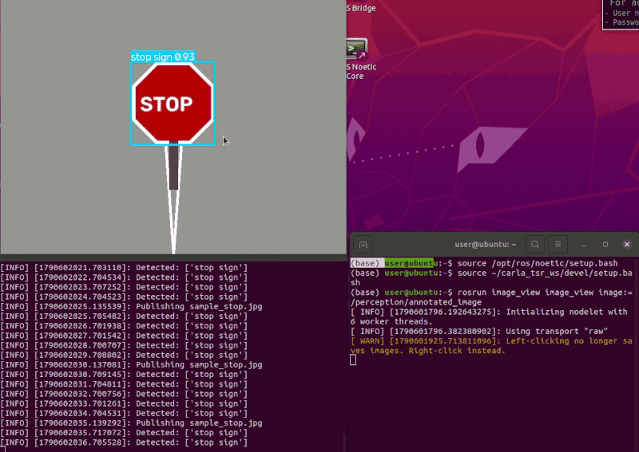

# Carla PilotNet 端到端控制 ROS 封装

`carla_pilotnet_ros` 是基于 PyTorch 实现的 NVIDIA PilotNet 端到端自动驾驶网络，封装为 ROS Noetic catkin 包。模块订阅相机图像，经 CNN 推理输出转向与油门，发布车辆控制指令。

## 功能

- **image_publisher**：从本地图片目录循环发布图像到 `/camera/image_raw`
- **pilotnet_inference**：订阅图像，用 PilotNet CNN 推理，发布控制指令和标注图像
- **control_node**：订阅 PilotNet 输出，映射为 Carla 车辆控制指令

## 话题

| 话题 | 类型 | 方向 | 说明 |
|---|---|---|---|
| `/camera/image_raw` | `sensor_msgs/Image` | 发布 | 图像输入 |
| `/pilotnet/control` | `std_msgs/Float32MultiArray` | 发布 | [steering, throttle] |
| `/pilotnet/annotated_image` | `sensor_msgs/Image` | 发布 | 带控制值标注的图像 |
| `/vehicle/control_cmd` | `geometry_msgs/Twist` | 发布 | 车辆控制（linear.x=throttle, angular.z=steering） |

## 神经网络原理

PilotNet 是 NVIDIA 提出的端到端自动驾驶 CNN，输入道路图像，直接输出转向指令。网络结构为 5 个卷积层 + 3 个全连接层，参数量约 25 万。

- **输入**：66×200×3 RGB 图像
- **卷积层**：5×5 stride 2 (24/36/48 filters) + 3×3 (64/64 filters)
- **全连接层**：100 → 50 → 10 → 2
- **激活函数**：ELU
- **Dropout**：0.2
- **输出**：2 维（steering, throttle）

损失函数（回归任务）：

    L = (1/N) * Σ (y_pred - y_true)^2

## 算法流程

1. `image_publisher` 从 `assets/` 目录循环读取图片，发布到 `/camera/image_raw`
2. `pilotnet_inference` 订阅图像，每 2 帧执行一次推理：
   - 图像预处理：BGR→RGB，resize 到 66×200，归一化到 [0,1]
   - CNN 推理：输出 (steering, throttle)
   - 发布到 `/pilotnet/control` 和 `/pilotnet/annotated_image`
3. `control_node` 订阅 `/pilotnet/control`，映射为 `Twist` 消息发布到 `/vehicle/control_cmd`

## 运行环境

- Ubuntu 20.04 + ROS Noetic
- Python 3.8（conda 环境 `carla38`）
- PyTorch 2.0.1+cpu
- NumPy 1.24.3、OpenCV 5.0.0

## 编译与运行

### 1. 编译 catkin 工作空间

    mkdir -p ~/carla_pilotnet_ws/src
    cd ~/carla_pilotnet_ws/src
    ln -sfn ~/ros2/src/ground/carla_pilotnet_ros carla_pilotnet_ros
    cd ~/carla_pilotnet_ws
    source /opt/ros/noetic/setup.bash
    catkin_make

### 2. 启动

    conda activate carla38
    source /opt/ros/noetic/setup.bash
    source ~/carla_pilotnet_ws/devel/setup.bash
    roslaunch carla_pilotnet_ros main.launch

或使用入口脚本：

    bash src/ground/carla_pilotnet_ros/main.sh

### 3. 查看输出

另开一个终端：

    source /opt/ros/noetic/setup.bash
    source ~/carla_pilotnet_ws/devel/setup.bash
    rostopic echo /pilotnet/control

## 模型训练

本模块默认提供随机初始化的权重文件用于演示。如需训练：

1. 在 Carla 中采集图像 + 控制指令数据集
2. 使用 `src/model.py` 中的 PilotNet 模型训练
3. 保存权重到 `pilotnet.pth`

## 注意事项

- 图像源为本地图片，接入真实 Carla 相机时，替换 `image_publisher` 为 Carla ROS bridge 的相机节点
- 权重文件默认随机初始化，仅用于演示 ROS 话题链路；实际控制效果需训练后的权重
