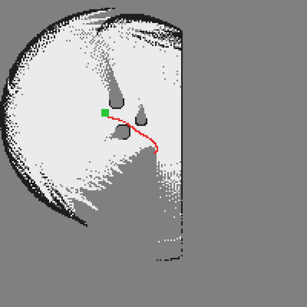
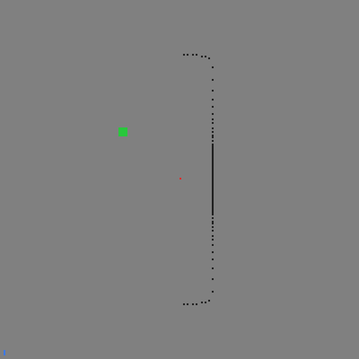
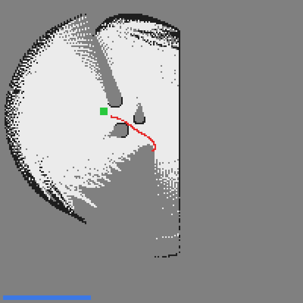

# 点云地图创建

本文介绍 CARLA ROS Bridge 中的**点云地图创建**：通过 PCL 记录器把激光雷达扫到的
三维点云累积保存下来，供离线查看与分析，属于 `carla_ros_bridge` 的既有功能。

## 参考

* [PCL 记录器](https://openhutb.github.io/doc/ros_documentation/)

## 拓展：自行实现「占用栅格建图 + 神经网络规划导航」

本文的点云地图创建只负责**保存**点云，既不做概率化的地图表达，也不含导航功能。
下面是在该功能基础上**自主实现**的一套「激光雷达建图 + 神经网络规划导航」闭环，
代码位于
[`src/ground/carla_mapping_navigation`](https://github.com/OpenHUTB/ros2/tree/master/src/ground/carla_mapping_navigation)，
详细介绍（计算原理、源码解析、性能评价）见
[CARLA 激光雷达建图与神经网络规划导航](./carla_mapping_navigation.md)。

### 与本文示例的区别

| 对比项 | 本文示例（点云地图创建） | 本拓展模块 |
|---|---|---|
| 技术路线 | `carla_ros_bridge` 的 PCL 记录器 | CARLA Python API 直连 + 自研建图/规划节点 |
| 是否依赖 ros-bridge | 必须编译并运行 ros-bridge | **不需要**，仅需 `carla` Python 客户端 |
| 地图形式 | 3D 点云（`.pcd` 文件，离线查看） | 2D 占用栅格（`nav_msgs/OccupancyGrid`，RViz 实时显示） |
| 建图时机 | 先录后看（离线） | **边动边建图**（SLAM 理念，行驶中实时更新） |
| 概率更新 | 无（纯点云累积） | **贝叶斯对数几率更新**，区分占据 / 空闲 / 未知 |
| 导航规划 | **无**（只有建图） | **规划神经网络**输出油门与转向，驶向目标并避障 |
| 规划算法性质 | — | **神经网络**（纯 numpy 反向传播，可训练） |
| 无 CARLA / 无图形界面时 | 无法运行 | `--headless --demo` 离线自证并导出地图与曲线 |

### 复用本文的配置步骤

CARLA 服务端的启动、宿主机 IP 与端口 2000 的查看、虚拟机网络设置等步骤
**与已有示例完全一致，此处不再重复**，请参考
[设置并连接到 Carla 模拟器](../set_up_and_connect_to_carla.md) 的
「启动 Carla 服务器」与「使用 Carla 客户端启动 Ego Vehicle」小节；
连接失败的排查见同一篇的「常见问题」小节。

!!! warning "不要从头到尾照做已有示例"
    已有示例中的「设置 Carla ROS Bridge」「使用 rviz 进行可视化」等小节属于
    **ros-bridge 路线**（需要 catkin 编译 ros-bridge）。本拓展模块**不依赖 ros-bridge**，
    这些步骤可以跳过。

### 本拓展新增的内容

1. **占用栅格建图**：把三维点云投影到 2D 占用栅格，用**对数几率**表达占据概率，
   命中标记占据、射线沿途标记空闲，输出可直接用于通行的地图。
2. **SLAM 边动边建图**：车辆行驶过程中实时更新地图，并导出渐进建图快照
   （实测已知区域从 0.2% 单调增长到 27.7%）。
3. **规划神经网络**：状态（目标方位 + 障碍左右分布 + 最近距离）→ (油门, 转向)，
   MLP 策略网络（5→64→2）。
4. **避障解析标签**：训练标签由"朝目标 + 避障"规则生成，两侧障碍项符号相反且对称，
   保证无障碍时转向归零，无需人工标注。
5. **RViz 实时可视化**：发布 `nav_msgs/OccupancyGrid`，附带现成 rviz 配置。
6. **离线取证模式**：`--headless --demo` 无需 CARLA、无需图形界面即可跑通全链路。

### 运行本拓展模块

除本文所需环境外，只需补装 CARLA 0.9.16 的 Python 客户端
（神经网络为纯 numpy 实现，无需 TensorFlow/PyTorch）：

```shell
pip3 install <CARLA>/PythonAPI/carla/dist/carla-0.9.16-cp310-cp310-manylinux_2_31_x86_64.whl
```

离线训练规划神经网络（**不需要 CARLA**）：

```shell
python3 src/ground/carla_mapping_navigation/main.py --mode train --epochs 300
```

在线建图 + NN 导航（`--host` 的填法与本文一致：填宿主机 IP）：

```shell
python3 src/ground/carla_mapping_navigation/main.py --mode run \
        --host 172.21.108.47 --goal "20,8" --sim_time 40
```

使用 launch 启动（ROS 2 / ROS 1）：

```shell
# ROS 2
ros2 launch carla_mapping_navigation main.launch.py host:=172.21.108.47 goal:="20,8"
# ROS 1
roslaunch carla_mapping_navigation main.launch host:=172.21.108.47 goal:="20,8"
```

在 RViz 中查看占用栅格地图：

```shell
ros2 run rviz2 rviz2 -d $(ros2 pkg prefix carla_mapping_navigation)/share/carla_mapping_navigation/config/mapping.rviz
```

### 实测结果

本机离线取证模式实测（`--epochs 300 --sim_time 60`，无需 CARLA）：

| 指标 | 数值 |
|---|---|
| 规划 NN 训练 MSE | 0.00596 |
| 占据格数 / 空闲格数 | 1380 / 9786 |
| 已知区域比例 | 29.1% |
| 导航最近距离 | 1.458 m（阈值 1.5 m） |



渐进建图过程（体现"边动边建图"，已知区域 0.2% → 19.7% → 25.3%）：





完整的调优过程与性能评价见
[CARLA 激光雷达建图与神经网络规划导航](./carla_mapping_navigation.md) 第 6 节。
