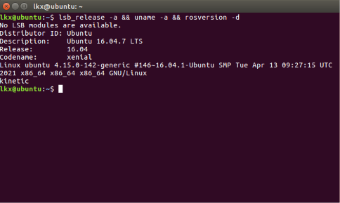
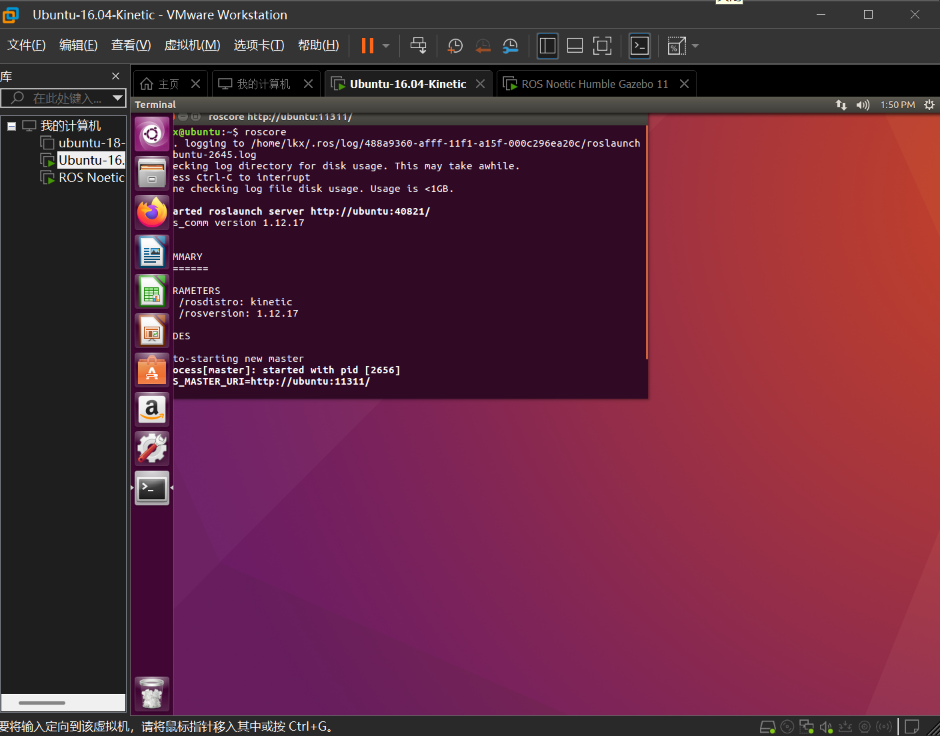
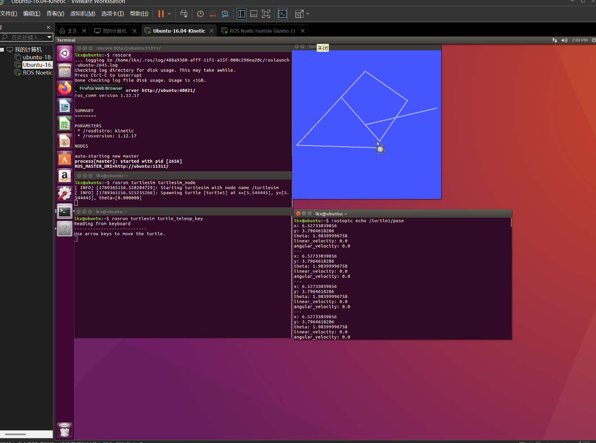
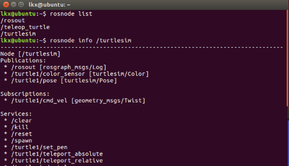
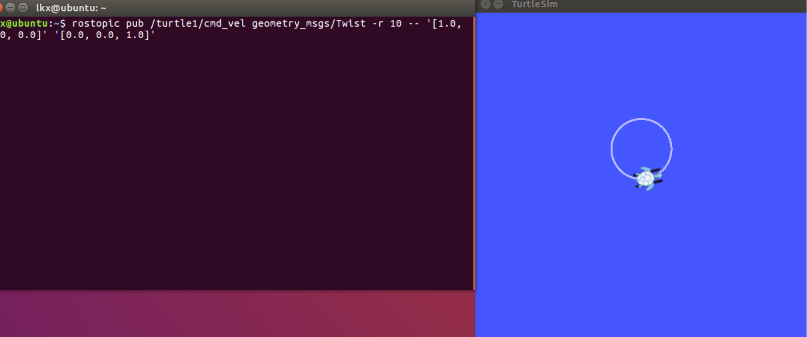
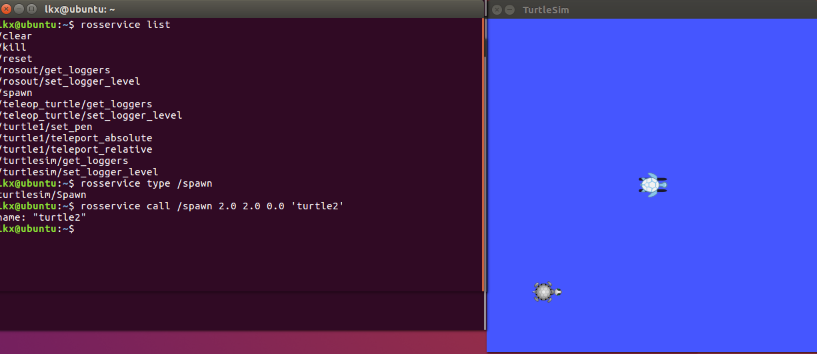
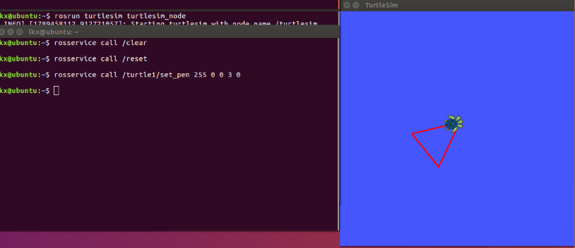
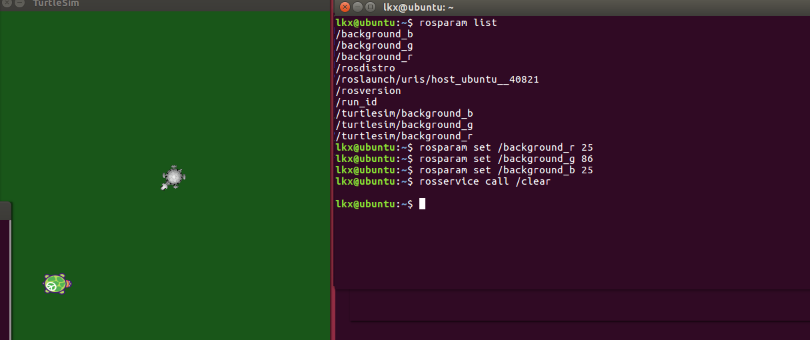
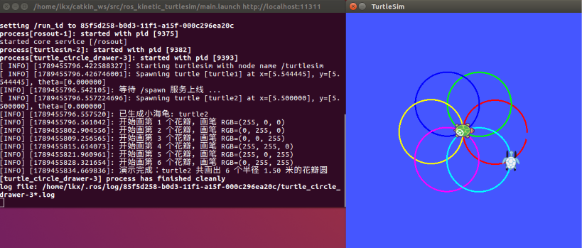

# 小海龟仿真实验报告（Ubuntu 16.04 + ROS Kinetic）

本实验在 Ubuntu 16.04 虚拟机中完成，内容按作业要求分为两部分：运行小海龟例程并用键盘控制其运动、通过小海龟仿真器练习常用的 ROS 命令。在完成这两项任务的基础上，把手动执行的过程整理成了一个可以 roslaunch 一键启动的小海龟自动画花瓣模块（源码在 src/ros_kinetic_turtlesim），并按附加题要求学习了 Carla 的 ROS 桥，笔记放在附录。文中所有命令都在虚拟机里实际执行过，配图均为实验时的截图。

## 一、实验目的

1. 学会运行小海龟例程，用键盘控制小海龟运动，理解控制背后的话题通信机制；
2. 通过小海龟仿真器练习 rosnode、rostopic、rosservice、rosparam 等常用命令，建立对 ROS 节点、话题、服务、参数的直观认识。

## 二、实验环境

| 项目 | 配置 |
| ---- | ---- |
| 宿主机 | Windows 11 |
| 虚拟化平台 | VMware Workstation 17.6 |
| 虚拟机系统 | Ubuntu 16.04.7 LTS（Xenial）desktop-amd64 |
| ROS 版本 | ROS Kinetic（ros 1.12.17） |
| 仿真器 | turtlesim |
| 键盘控制包 | ros-kinetic-teleop-twist-keyboard |
| 编程语言 | Python 2.7（拓展模块代码采用 2/3 兼容写法） |

开始前先用 lsb_release 和 rosversion 确认系统版本和 ROS 版本，确保环境无误：



## 三、实验步骤

### （一）运行小海龟并用键盘控制

#### 1. 启动仿真器

先安装键盘控制包：

```bash
sudo apt install ros-kinetic-teleop-twist-keyboard
```

然后开三个终端，分别执行：

```bash
roscore                                # 终端 1：启动 Master
rosrun turtlesim turtlesim_node        # 终端 2：启动小海龟仿真窗口
rosrun turtlesim turtle_teleop_key     # 终端 3：启动键盘控制节点
```

roscore 是 ROS 的节点注册中心（Master），所有节点通信前都要先在这里登记，所以能够通过输出里的 /rosdistro: kinetic 确认当前环境是 Kinetic：



rosrun 的用法是 `rosrun 包名 可执行文件名`，它会自己去 ROS_PACKAGE_PATH 里找程序，所以我们就可以不用关心程序装在哪个目录里。


#### 2. 键盘控制小海龟

通过实验我发现鼠标焦点必须放在 turtle_teleop_key 所在的那个终端上，按键才会起作用。一开始我焦点停在仿真窗口上，海龟一直不动，查了资料才发现是这个问题。

| 按键 | 作用 | 按键 | 作用 |
| :--- | :--- | :--- | :--- |
| `i` | 前进 | `,` | 后退 |
| `j` | 原地左转 | `l` | 原地右转 |
| `u` / `o` | 前进加左/右转（画弧线） | `k` | 停止 |
| `q` / `z` | 增大 / 减小速度档位 | | |

控制原理：teleop_turtle 节点把按键翻译成 geometry_msgs/Twist 类型的速度消息，发到 /turtle1/cmd_vel 话题上。Twist 里主要用到两个分量：linear.x 是线速度（正为前进，负为后退），angular.z 是绕 z 轴的角速度（正为逆时针左转）。两个速度同时不为零时海龟走圆弧。另外 turtlesim 有一个 0.5 秒的看门狗，超过 0.5 秒收不到新指令就会把海龟刹停，所以遥控时 teleop 节点是持续发送指令的，后面自己写控制节点时也必须循环发布。

下图中的白色轨迹就是用方向键画出来的：


#### 3. 查看小海龟的实时位姿

再开一个终端订阅位姿话题：

```bash
rostopic echo /turtle1/pose
```

其中 x、y 是坐标，theta 是朝向角，linear_velocity 和 angular_velocity 是当前速度。



### （二）通过小海龟熟悉 ROS 常用命令

ROS 的命令行工具按操作对象大致分五类：节点（rosnode）、话题（rostopic）、服务（rosservice）、参数（rosparam）、消息结构（rosmsg / rossrv）。下面在小海龟上逐个练习。

#### 1. 节点：rosnode

```bash
rosnode list              # 列出所有运行中的节点
rosnode info /turtlesim   # 查看某个节点的详细信息
```

列表里有三个节点：/rosout 是 roscore 自带的日志节点，/teleop_turtle 是键盘控制，/turtlesim 是仿真器。rosnode info /turtlesim 可以看到它订阅了 /turtle1/cmd_vel（接收速度指令），发布了 /turtle1/pose（对外广播位姿），和上一节的控制过程正好对得上；输出最后还列出了它提供的 /clear、/spawn 等服务，下面马上会用到。



#### 2. 话题：rostopic

```bash
rostopic list                   # 列出所有话题
rostopic info /turtle1/cmd_vel  # 查看消息类型、发布者和订阅者
rostopic type /turtle1/cmd_vel  # 只查看消息类型
rostopic echo /turtle1/pose     # 实时打印话题内容
```

rostopic info /turtle1/cmd_vel 显示这条话题的类型是 geometry_msgs/Twist，发布者是 /teleop_turtle，订阅者是 /turtlesim。发布者和订阅者只通过话题名联系，互相不需要知道对方是谁，这就是 ROS 的发布/订阅通信模型。

不按键盘，直接用命令发速度指令也能控制海龟：

```bash
rostopic pub /turtle1/cmd_vel geometry_msgs/Twist -r 10 -- '[1.0, 0.0, 0.0]' '[0.0, 0.0, 1.0]'
```

linear.x = 1.0 m/s、angular.z = 1.0 rad/s，海龟画出的圆半径正好是 v/ω = 1 米。-r 10 表示以 10 Hz 持续发布，因为看门狗的存在，只发一条的话海龟动 0.5 秒就停了。按 Ctrl+C 结束。



#### 3. 服务：rosservice

```bash
rosservice list                # 列出所有服务
rosservice type /spawn         # 查看服务类型：turtlesim/Spawn
rosservice call /spawn 2.0 2.0 0.0 'turtle2'   # 在 (2,2) 处再生成一只海龟
```

和话题的"广播"不同，服务是请求-应答式的：发出调用后会等仿真器返回结果，这里返回的是新海龟的名字 name: "turtle2"，右侧仿真窗口里也能看到 turtle1 和 turtle2 两只海龟：



小海龟还有画笔和画面控制类的服务，set_pen 的参数依次是 r、g、b、线宽、是否抬笔：

```bash
rosservice call /clear                          # 清空轨迹
rosservice call /reset                          # 重置仿真器
rosservice call /turtle1/set_pen 255 0 0 3 0   # 换成线宽 3 的红色画笔
```



#### 4. 参数：rosparam

```bash
rosparam list    # 列出参数服务器上的所有参数
```

参数列表里能看到两组背景色参数：一组在根命名空间下（/background_r、/background_g、/background_b），另一组挂在 /turtlesim/ 的私有命名空间下，改哪一组都可以，下面用根命名空间这组演示。把背景改成墨绿色：

```bash
rosparam set /background_r 25
rosparam set /background_g 86
rosparam set /background_b 25
rosservice call /clear    # 改完参数要调用 /clear 让仿真器重绘才生效
```

参数服务器相当于一个全局的配置表，所有节点都能读写，适合放背景色、速度上限这类配置项。



#### 5. 消息结构：rosmsg 和 rossrv

```bash
rosmsg show geometry_msgs/Twist   # 查看话题消息的结构
rossrv show turtlesim/Spawn       # 查看服务的数据结构
```

可以看到 Twist 由 linear 和 angular 两个 Vector3 组成，每个 Vector3 里有 x、y、z 三个分量，前面用到的速度指令、位姿消息对应的就是这些字段；下面的 rossrv 输出则是 Spawn 服务的数据结构。


#### 6. rqt_graph 查看节点关系

```bash
rqt_graph
```

图里 teleop_turtle 经 /turtle1/cmd_vel 指向 turtlesim 的箭头，这样就把前面几条命令查到的关系画成了一张图，让人很直观地了解它们之间的关系。


## 四、实验拓展：小海龟自动画花瓣模块

因为上面的命令手动一条条敲比较费力，于是就写了一个小模块把过程串起来，使得roslaunch 一键启动后，可以自动生成第二只海龟，并画出 6 个两两相扣的彩色花瓣圆。（源码按仓库约定放在 src/ros_kinetic_turtlesim，文档放在 docs/ros_kinetic_turtlesim。）

### 1. 目录结构

```text
src/ros_kinetic_turtlesim/
├── main.py           # 入口脚本：生成第二只海龟并控制其画花瓣
├── main.launch       # roslaunch 入口：一键启动 turtlesim + 画花瓣节点
├── package.xml       # catkin 包清单
├── CMakeLists.txt    # catkin 编译配置
└── README.md         # 运行环境与步骤说明
```

### 2. 实现思路

main.launch 的内容很简单，就是同时拉起 turtlesim_node 和画花瓣节点：

```xml
<launch>
  <node pkg="turtlesim" type="turtlesim_node" name="turtlesim" output="screen"/>
  <node pkg="ros_kinetic_turtlesim" type="main.py" name="turtle_circle_drawer" output="screen"/>
</launch>
```

main.py 的流程是：先等服务 /spawn 上线，在公共中心 (5.5, 5.5) 处生成 turtle2；然后以 50 Hz 的频率向 /turtle2/cmd_vel 发布 linear.x = 1.5、angular.z = 1.0 的速度指令（圆的半径 r = v/ω = 1.5 米，画一个整圆用时 T = 2π/ω ≈ 6.28 秒）；每画完一个花瓣就换一种画笔颜色，瞬移到下一个花瓣的起点再画。6 个花瓣的圆心均匀分布在公共中心四周，圆心到公共中心的距离正好等于圆的半径，所以每个圆都经过公共中心，画出来就是一圈两两相扣的花瓣。核心代码如下：

```python
# 等待 turtlesim 的 spawn 服务上线，避免节点比仿真器先启动导致调用失败
rospy.wait_for_service('/spawn')
spawn = rospy.ServiceProxy('/spawn', Spawn)
spawn(CENTER_X, CENTER_Y, 0.0, 'turtle2')   # 在公共中心生成第二只海龟

# 以 50 Hz 持续发布速度指令（远高于 0.5 秒看门狗的阈值）
pub = rospy.Publisher('/turtle2/cmd_vel', Twist, queue_size=10)
rate = rospy.Rate(50)
twist = Twist()
twist.linear.x = 1.5
twist.angular.z = 1.0

for i in range(petals):
    # 第 i 个花瓣：起点在公共中心外 2r 处，朝向取圆的切线方向
    theta = 2.0 * math.pi * i / petals
    start_x = CENTER_X + 2.0 * radius * math.cos(theta)
    start_y = CENTER_Y + 2.0 * radius * math.sin(theta)
    heading = theta + math.pi / 2.0

    set_pen(r, g, b, 3, 1)                  # 先抬笔，瞬移过程不画线
    teleport(start_x, start_y, heading)     # 瞬移到该花瓣的起点
    set_pen(r, g, b, 3, 0)                  # 落笔开画

    end_time = rospy.Time.now() + rospy.Duration(circle_period)
    while rospy.Time.now() < end_time and not rospy.is_shutdown():
        pub.publish(twist)
        rate.sleep()
```

画笔颜色通过 /turtle2/set_pen 服务设置，起点和朝向用 /turtle2/teleport_absolute 服务调整，瞬移前先抬笔，避免划出一条直线。完整代码见 src/ros_kinetic_turtlesim/main.py，写法上兼容 Python 2 和 Python 3。

### 3. 运行方法

```bash
# 方式一：roslaunch 一键启动（推荐）
mkdir -p ~/catkin_ws/src
cp -r <仓库路径>/src/ros_kinetic_turtlesim ~/catkin_ws/src/
chmod +x ~/catkin_ws/src/ros_kinetic_turtlesim/main.py
cd ~/catkin_ws && catkin_make
source devel/setup.bash
roslaunch ros_kinetic_turtlesim main.launch   # roslaunch 会自动启动 Master，不用单独开 roscore

# 方式二：手动开三个终端（roscore、turtlesim_node），最后直接运行 python main.py
```

运行效果：



## 五、遇到的问题及解决方法

1. 键盘按了海龟不动：原因是鼠标焦点不在 turtle_teleop_key 所在的终端上，点一下那个终端再按方向键就正常了；
2. rostopic pub 发一条指令海龟只动 0.5 秒：turtlesim 的看门狗把速度清零了，需要加 -r 参数循环发布；
3. 克隆 GitHub 仓库报 SSL certificate problems：开了加速器的缘故，关掉加速器再克隆就正常了；
4. 虚拟机画面卡顿：关闭 3D 加速、安装 open-vm-tools 后有明显改善。

## 六、实验总结

本次实验在 Ubuntu 16.04 虚拟机上跑通了小海龟例程，用键盘控制小海龟运动，练习了 rosnode、rostopic、rosservice、rosparam、rosmsg 等常用命令，最后把用到的服务调用和话题发布写成了一个自动画花瓣的小模块。

通过这次实验，对 ROS 的通信机制有了直观的认识：节点是运行中的程序，节点之间用话题做异步广播（比如速度指令、位姿），用服务做同步的请求-应答（比如生成海龟、改画笔颜色），全局配置放在参数服务器上；rqt_graph 能把节点和话题的关系画成一张图，调试时很有用。印象最深的是 turtlesim 的 0.5 秒看门狗：控制节点必须持续发布指令，这一点在写 main.py 时体会尤其明显。

实验中也留下了可以继续深入的方向，比如用 RViz 查看 TF 坐标系、写一个订阅 /turtle1/pose 的闭环控制节点，以及附录里学习的 Carla ROS 桥这类把完整仿真器接入 ROS 的工程实践。

## 附录：Carla 的 ROS 桥学习笔记

按照作业附加题的要求，学习并注释了 Carla 的 ROS 桥及其 C++ 实现，完整笔记见 [Carla 的 ROS 桥学习笔记](./carla_ros_bridge_cpp_notes.md)。主要内容包括：Python 版 ros-bridge 的包结构和话题体系；C++ 实现（LibCarla/source/carla/ros2）的目录结构和 ROS2 单例类的关键代码逐段中文注释；早期文档中 RosUtils、RosSink、RosAction、RosSubscriber、RosPublisher 五个类与当前版本结构的对照。

## 参考资料

1. ROS Wiki：turtlesim 及命令行工具教程（http://wiki.ros.org/turtlesim）
2. carla-simulator/ros-bridge（https://github.com/carla-simulator/ros-bridge）
3. CARLA 文档：RosBridge 以 C++ 实现（OpenHUTB 中文镜像，https://carla-openhutb.readthedocs.io/zh-cn/latest/ros/bridge_cpp/）

## 声明

本报告使用GLM辅助代码调试、语言润色。所有实验操作、数据、图表、分析和结论均由本人独立完成并核验。本人对提交内容负全部责任。
