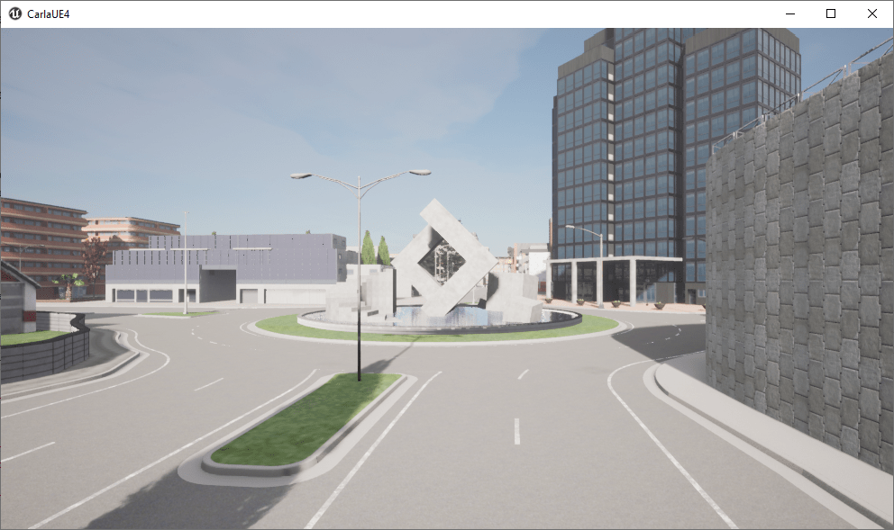
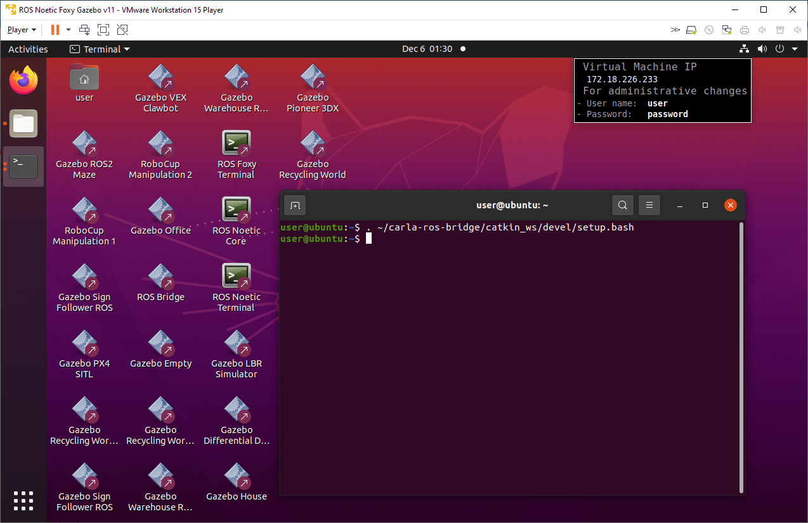
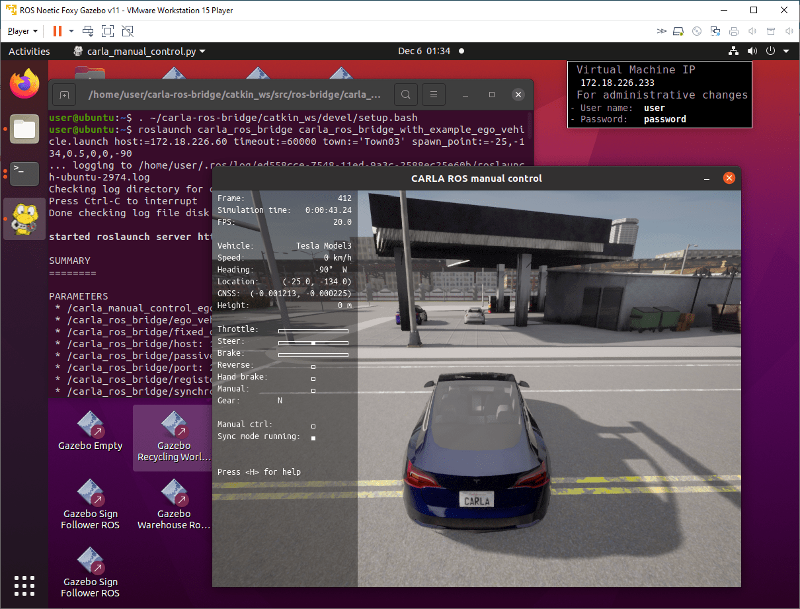
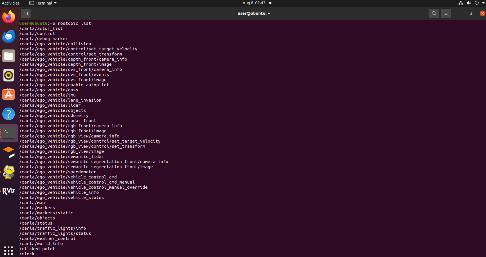
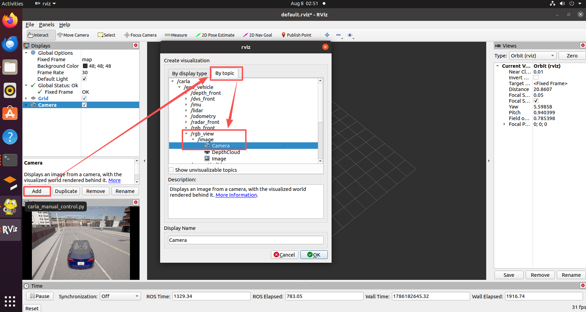

# [设置并连接到 Carla 模拟器](https://www.mathworks.com/help/ros/ug/set-up-and-connect-to-carla-simulator.html)

此示例展示如何使用 ROS Toolbox 设置并连接到 Carla 模拟器来模拟自动驾驶应用程序。

您可以利用 Carla 模拟器复制从城市到高速公路的各种驾驶场景，并在受控虚拟环境中评估其自动驾驶算法的有效性。该模拟器包括各种传感器模型、车辆动力学和交通状况，使用户可以模拟真实世界的设置。您可以使用 Simulink 软件向车辆控制发布者发送转向、制动和油门控制信号，并控制 Carla Ego 车辆并研究自动驾驶的各种元素。

从 [链接](https://github.com/carla-simulator/carla/releases) 中下载 Carla 0.9.13 版本的模拟器。如果您使用的是 Windows 机器，请同时[下载](https://ww2.mathworks.cn/support/product/robotics/ros2-vm-installation-instructions-v9.html)并安装好 ROS 的虚拟机。此虚拟机基于 Ubuntu Linux 操作系统，并已预先配置为支持使用 ROS Toolbox 构建的应用程序。

此示例在 Windows 主机上演示。

## 启动 Carla 服务器

要在 Windows 主机上启动 Carla 服务器，请导航到 Carla 的安装位置并单击应用程序可执行文件`CarlaUE4.exe`。




## 设置 Carla ROS Bridge
1.启动虚拟机。

2.在 Ubuntu 桌面上，单击 `ROS Noetic Core Terminal` 快捷方式以启动 ROS 主控。主控启动后，记下 `ROS_MASTER_URI`。

3.在 Ubuntu 桌面上，单击 `ROS Noetic Terminal` 快捷方式以启动 ROS 终端。运行此命令以设置 Carla ROS 桥接环境。

```shell
. ~/carla-ros-bridge/catkin_ws/devel/setup.bash
# 或者运行
source ~/carla-ros-bridge/catkin_ws/devel/setup.bash
```




## 使用 Carla 客户端启动 Ego Vehicle
在同一个终端中，运行 follow 命令以在您喜欢的 Carla 模拟器环境中启动 Ego 车辆。例如，您可以 follow 在 Carla 模拟器的 Town03 环境中运行命令以在加油站附近启动车辆。

运行此下面这一段命令，将命令中的主机地址**更改为您宿主机的IP主机地址**。
```shell
roslaunch carla_ros_bridge carla_ros_bridge_with_example_ego_vehicle.launch host:=172.18.226.60 timeout:=60000 town:='Town03' spawn_point:=-25,-134,0.5,0,0,-90
```
<!-- 192.168.159.129 -->



要手动驾驶车辆，请按“B”。按“H”查看说明。

!!! 注意
    您宿主机windows的IP地址通过`ipconfig`命令进行查看，一般和这里`172.18.226.60`的不一致，IP地址不正确只能看到黑屏。从 Town10HD_Opt 切换到 Town03 需要一定的时间，也会出现黑屏，这是正常现象


## 使用 rviz 进行可视化

查看主题
```shell
rostopic list
```


启动 RVIZ
```shell
rosrun rviz rviz
```

在 RVIZ 中按主题添加相机，即可在左下角看到模拟器的实时相机数据



<!-- 
## Python 验证 Carla ROS 连接

rclpy 是 ROS 2（Robot Operating System 2）的 Python 接口
```shell
pip install rosdepc
```
-->


## Matlab 验证 Carla ROS 连接
将 Matlab 连接到在 VM Ware 中运行的 ROS 主机的 11311 端口。
```shell
# 注意命令中的IP地址需要改为虚拟机中的地址，通过ifconfig查看
rosinit( 'http://172.18.226.233:11311' )
```

通过运行以下自省命令，验证您是否可以访问与 Carla 模拟器相关的 ROS 主题。
```shell
rostopic list
```


## 常见问题

* 执行 roslaunch 报错

    报错信息：AttributeError: 'CarlaRosBridge' object has no attribute 'shutdown'
    ```shell
      File "/home/user/carla-ros-bridge/catkin_ws/src/ros-bridge/carla_ros_bridge/src/carla_ros_bridge/bridge.py", line 349, in destroy
        self.shutdown.set()
    AttributeError: 'CarlaRosBridge' object has no attribute 'shutdown'
    ```

    解决：Carla服务端的版本切换到 0.9.13。
    杀死2000端口的CarlaUE4.exe进程，重新启动（通过ros来实现从Town10切换到Town03地图）。


* AttributeError: module 'numpy' has no attribute 'bool'.
    报错信息：
    ```shell
      File "/home/user/.local/lib/python3.8/site-packages/numpy/__init__.py", line 305, in __getattr__
        raise AttributeError(__former_attrs__[attr])
    AttributeError: module 'numpy' has no attribute 'bool'.
    ```


    原因：原来的numpy版本为 1.24.4

    解决：
    ```shell
    pip install numpy==1.23.1
    ```

## 参考

* [Set Up and Connect to CARLA Simulator](https://ww2.mathworks.cn/help/ros/ug/set-up-and-connect-to-carla-simulator.html)
* [支持 0.9.16](https://github.com/carla-simulator/ros-bridge/issues/763)

