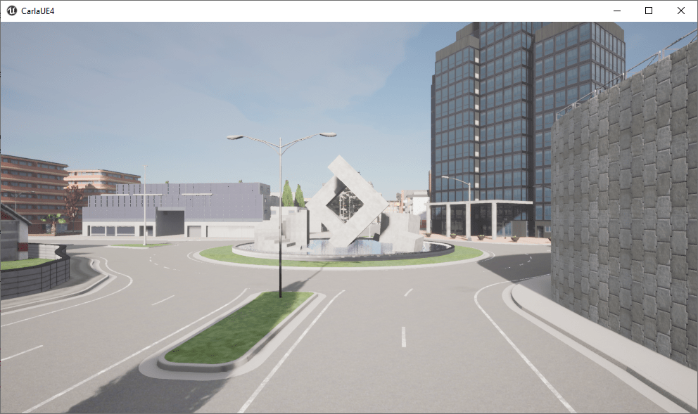
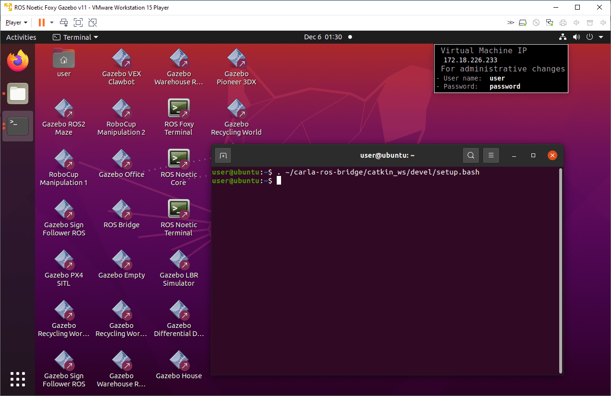
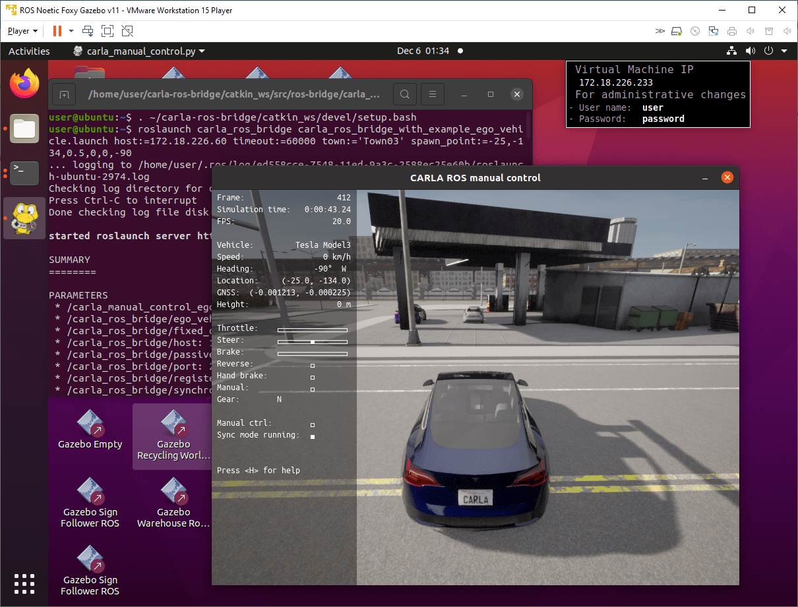
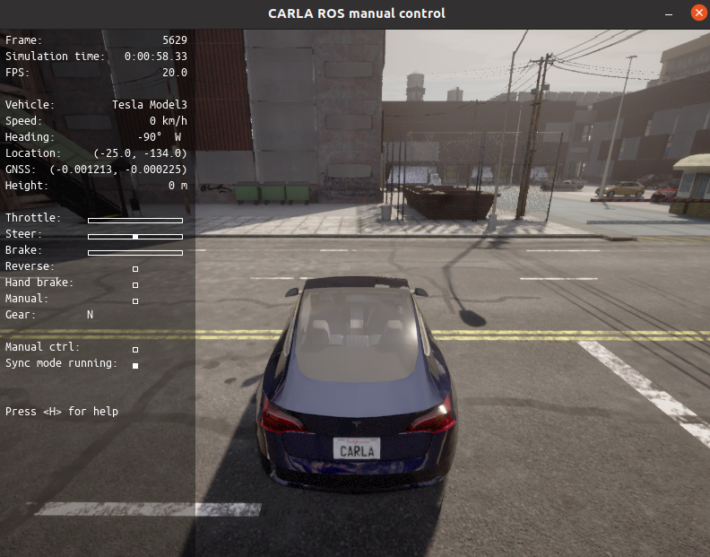
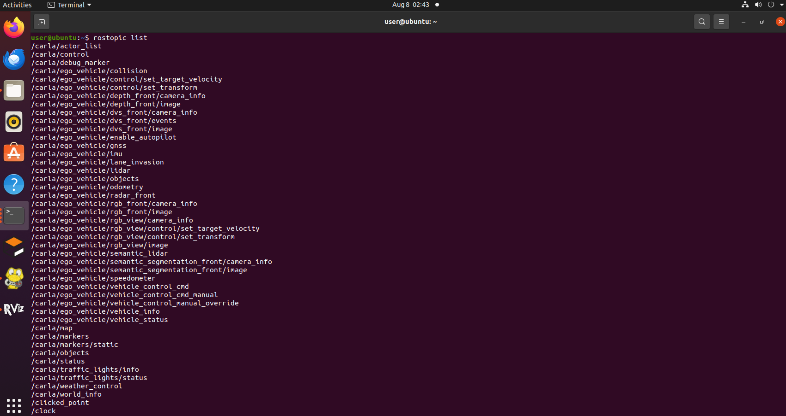
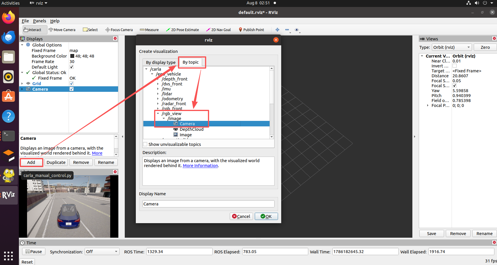
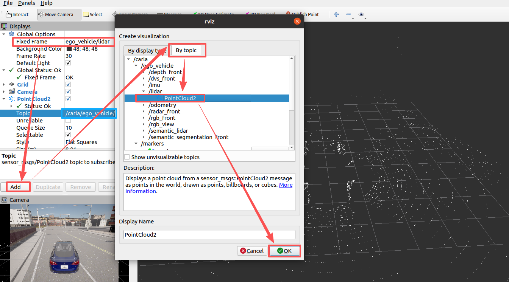
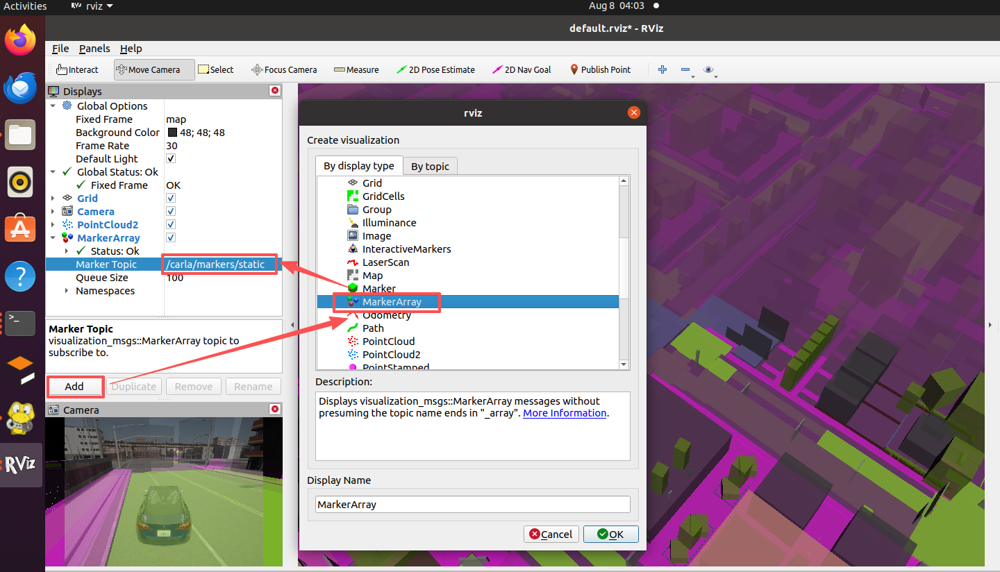
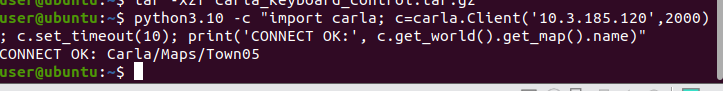
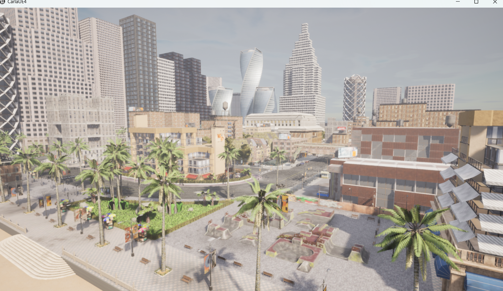

# [设置并连接到 Carla 模拟器](https://www.mathworks.com/help/ros/ug/set-up-and-connect-to-carla-simulator.html)

此示例展示如何设置并连接到 Carla 模拟器来模拟自动驾驶应用程序。

您可以利用 Carla 模拟器复制从城市到高速公路的各种驾驶场景，并在受控虚拟环境中评估其自动驾驶算法的有效性。该模拟器包括各种传感器模型、车辆动力学和交通状况，使用户可以模拟真实世界的设置。您可以向车辆控制发布者发送转向、制动和油门控制信号，并控制 Carla Ego 车辆并研究自动驾驶的各种元素。

从 [链接](https://github.com/carla-simulator/carla/releases) 中下载 Carla 0.9.13 版本的模拟器。如果您使用的是 Windows 机器，请同时[下载](https://ww2.mathworks.cn/support/product/robotics/ros2-vm-installation-instructions-v9.html)并安装好 ROS 的虚拟机。此虚拟机基于 Ubuntu Linux 操作系统，并已预先配置为支持使用 ROS 构建的应用程序。

此示例在 Windows 主机上演示。

## 启动 Carla 服务器

要在 Windows 主机上启动 Carla 服务器，请导航到 Carla 的安装位置并单击应用程序可执行文件`CarlaUE4.exe`。




## 设置 Carla ROS Bridge
1.启动虚拟机。

2.在 Ubuntu 桌面上，单击 `ROS Noetic Core Terminal` 快捷方式以启动 ROS 主控。主控启动后，记下 `ROS_MASTER_URI`。

3.在 Ubuntu 桌面上，单击 `ROS Noetic Terminal` 快捷方式以启动 ROS 终端。运行此命令以设置 Carla ROS 桥接环境。

```shell
. ~/carla-ros-bridge/catkin_ws/devel/setup.bash
# 或者运行
source ~/carla-ros-bridge/catkin_ws/devel/setup.bash
```



为了每次启动终端时不用每次都设置环境，可以将其加入到用户的初始化脚本中：
```shell
echo 'source ~/carla-ros-bridge/catkin_ws/devel/setup.bash' >> ~/.bashrc
source ~/.bashrc
```


## 使用 Carla 客户端启动 Ego Vehicle
在同一个终端中，运行 follow 命令以在您喜欢的 Carla 模拟器环境中启动 Ego 车辆。例如，您可以 follow 在 Carla 模拟器的 Town03 环境中运行命令以在加油站附近启动车辆。

运行此下面这一段命令，将命令中的主机地址**更改为您宿主机的IP主机地址**。
```shell
# ROS 1
roslaunch carla_ros_bridge carla_ros_bridge_with_example_ego_vehicle.launch host:=172.21.108.47 timeout:=60000 town:='Town03' spawn_point:=-25,-134,0.5,0,0,-90
# ROS 2
ros2 launch carla_ros_bridge carla_ros_bridge_with_example_ego_vehicle.launch.py host:=172.21.108.47 timeout:=60000 town:='Town03' spawn_point:=-25,-134,0.5,0,0,-90
```

**注意：** 如果按`B`切换到手动驾驶后，按`W`、`A`、`S`、`D`没反应，需要将 numpy 的版本 从 1.24.4 降到 numpy 1.23.1，避免报错：AttributeError: module 'numpy' has no attribute 'bool'
```
python -m pip install numpy==1.23.1
```



要手动驾驶车辆，请按“B”。按“H”查看说明。

!!! 注意
    您宿主机windows的IP地址通过`ipconfig`命令进行查看，一般和这里`172.21.108.47`的不一致，IP地址不正确只能看到黑屏。从 Town10HD_Opt 切换到 Town03 需要一定的时间，也会出现黑屏，这是正常现象


### 其他

在默认的 Town10HD_Opt 地图上启动手动控制（只修改参数 `town`），
```shell
roslaunch carla_ros_bridge carla_ros_bridge_with_example_ego_vehicle.launch host:=172.21.108.47 timeout:=60000 town:='Carla/Maps/Town10HD_Opt' spawn_point:=-25,-134,0.5,0,0,-90
```




## 使用 rviz 进行可视化

* 查看主题
    ```shell
    rostopic list
    ```
    

* 启动 RVIZ
    ```shell
    rosrun rviz rviz
    ```

* 在 RVIZ 中按主题添加相机，即可在左下角看到模拟器的实时相机数据
    

* 可视化雷达
    

* Marker Topic（标记话题）：显示发出的 3D 图形 

    


<!-- 
## Python 验证 Carla ROS 连接

rclpy 是 ROS 2（Robot Operating System 2）的 Python 接口
```shell
pip install rosdepc
```
-->


## Matlab 验证 Carla ROS 连接（可选）
将 Matlab 连接到在 VM Ware 中运行的 ROS 主机的 11311 端口。
```shell
# 注意命令中的IP地址需要改为虚拟机中的地址，通过ifconfig查看
rosinit( 'http://172.18.226.233:11311' )
```

通过运行以下自省命令，验证您是否可以访问与 Carla 模拟器相关的 ROS 主题。
```shell
rostopic list
```

## 解析

该 [carla_ros_bridge_with_example_ego_vehicle.launch](https://github.com/OpenHUTB/ros2/blob/master/src/ground/ros-bridge/carla_ros_bridge/launch/carla_ros_bridge_with_example_ego_vehicle.launch) 文件包含 3 个启动步骤

1. ROS 桥 [carla_ros_bridge.launch](https://github.com/OpenHUTB/ros2/tree/master/src/ground/ros-bridge/carla_ros_bridge/launch/carla_ros_bridge.launch) 用于连接模拟器

2. 主车 [carla_example_ego_vehicle.launch](https://github.com/OpenHUTB/ros2/blob/master/src/ground/ros-bridge/carla_spawn_objects/launch/carla_example_ego_vehicle.launch)

3. 手动控制 [carla_manual_control.launch](https://github.com/OpenHUTB/ros2/blob/master/src/ground/ros-bridge/carla_manual_control/launch/carla_manual_control.launch)


## 常见问题

* 执行 roslaunch 报错

    报错信息：AttributeError: 'CarlaRosBridge' object has no attribute 'shutdown'
    ```shell
      File "/home/user/carla-ros-bridge/catkin_ws/src/ros-bridge/carla_ros_bridge/src/carla_ros_bridge/bridge.py", line 349, in destroy
        self.shutdown.set()
    AttributeError: 'CarlaRosBridge' object has no attribute 'shutdown'
    ```

    解决：Carla服务端的版本切换到 0.9.13。
    杀死2000端口的CarlaUE4.exe进程，重新启动（通过ros来实现从Town10切换到Town03地图）。


* AttributeError: module 'numpy' has no attribute 'bool'.
    报错信息：
    ```shell
      File "/home/user/.local/lib/python3.8/site-packages/numpy/__init__.py", line 305, in __getattr__
        raise AttributeError(__former_attrs__[attr])
    AttributeError: module 'numpy' has no attribute 'bool'.
    ```


    原因：原来的numpy版本为 1.24.4

    解决：
    ```shell
    pip install numpy==1.23.1
    ```

## 拓展：自行实现地面载具键盘运动控制

本文上面的内容使用 `carla_ros_bridge` **复用车辆内置的手动驾驶**功能。下面是在该示例基础上
**自主实现**的一套键盘运动控制，代码位于
[`src/ground/carla_keyboard_control`](https://github.com/OpenHUTB/ros2/tree/master/src/ground/carla_keyboard_control)，
详细介绍（计算原理、源码解析、性能评价）见
[地面载具物理仿真与键盘运动控制](./ground/carla_keyboard_control.md)。

### 与本文示例的区别

| 对比项 | 本文示例 | 本拓展模块 |
|---|---|---|
| 技术路线 | `carla_ros_bridge` + 车辆内置手动驾驶 | CARLA Python API **直连** + 自研键盘控制节点 |
| 是否依赖 ros-bridge | 必须编译并运行 ros-bridge | **不需要** ros-bridge，仅需 `carla` Python 客户端 |
| 如何进入控制 | 车辆生成后按 `B` 切换到内置手动驾驶 | 程序启动即进入自研控制回路 |
| 控制信号 | ros-bridge 的 `carla_manual_control` 包 | 键盘 → `carla.VehicleControl(throttle, steer, brake, reverse)` |
| 倒车处理 | 由内置手动驾驶逻辑决定 | **显式倒挡判定**：低速按 `S` 挂倒挡，有速度按 `S` 刹车 |
| 传感器展示 | RViz 订阅 ros-bridge 话题 | 前视画面 + HUD（位置/速度/控制量/键位）实时叠加 |
| 仿真步进 | ros-bridge 内部驱动 | 模块**显式驱动**同步步进（固定 0.05 s），与传感器严格对齐 |

### 复用本文的配置步骤

以下步骤**与本文完全一致，此处不再重复**，请直接按本文对应小节完成：

* CARLA 服务端的启动与地图选择 → 见上文「启动 Carla 服务器」
* 宿主机 IP 的查看、端口 2000、`host` 参数的填写 → 见上文「使用 Carla 客户端启动 Ego Vehicle」
* 虚拟机网络设置、`numpy` 版本兼容等问题的排查 → 见上文「常见问题」

### 本拓展新增的内容

与本文示例不重叠、由本拓展模块新增的部分：

1. **自研键盘控制节点**：显式构造 `VehicleControl`，含倒挡判定逻辑（`v < v_th` 挂倒挡）。
2. **运行状态 HUD**：叠加显示位置、速度、控制量 `(th, st, br, rev)` 与键位状态。
3. **无窗口取证模式**：`--headless --demo --save_dir`，在无 3D 加速的虚拟机中
   无需图形界面即可运行，并逐帧导出相机画面 PNG 作为可运行性证据。
4. **双 ROS 版本 launch 封装**：ROS 2 Humble（`main.launch.py`）与 ROS 1 Noetic（`main.launch`）。
5. **课程约定的主入口**：`main.py` / `main.sh` / `main.bat`，支持独立运行与 `--launch` 两种方式。

### 运行本拓展模块

除本文所需的 ros-bridge 环境外，只需补装 CARLA 0.9.16 的 Python 客户端
（`carla` 的 0.9.16 版本已发布在 PyPI，会自动匹配当前解释器版本）：

```shell
pip3 install carla==0.9.16
```

若无法访问 PyPI，也可使用 CARLA 发行包自带的 wheel（`<CARLA>` 替换为实际解压路径）：

```shell
pip3 install "<CARLA>/PythonAPI/carla/dist/carla-0.9.16-cp310-cp310-manylinux_2_31_x86_64.whl"
```

!!! tip "Ubuntu 20.04（Noetic）请用 Python 3.10+ 解释器"
    系统默认 Python 3.8 装不上 cp310+ 的 wheel。请显式指定，并保证
    `pip` 与运行 `main.py` 使用同一个解释器：

    ```shell
    python3.10 -m pip install carla==0.9.16
    python3.10 src/ground/carla_keyboard_control/main.py --host 172.21.108.47 --follow
    ```

独立运行（`--host` 的填法与本文一致：填宿主机 IP）：

```shell
python3 src/ground/carla_keyboard_control/main.py --host 172.21.108.47 --follow
```

使用 launch 启动（ROS 2 / ROS 1）：

```shell
# ROS 2
ros2 launch carla_keyboard_control main.launch.py host:=172.21.108.47
# ROS 1
roslaunch carla_keyboard_control main.launch host:=172.21.108.47
```

### 虚拟机中的实测结果

在 Ubuntu 20.04 虚拟机中连接 Windows 宿主机的 CARLA 服务端运行本拓展模块：





## 参考

* [Carla 手动控制](https://openhutb.github.io/doc/carla_manual_control/)
* [Set Up and Connect to CARLA Simulator](https://ww2.mathworks.cn/help/ros/ug/set-up-and-connect-to-carla-simulator.html)
* [支持 0.9.16](https://github.com/carla-simulator/ros-bridge/issues/763)
* [ROS rviz工具使用](https://smarttofdoc.readthedocs.io/en/latest/Tutorial/ROS/rosrviz.html)

