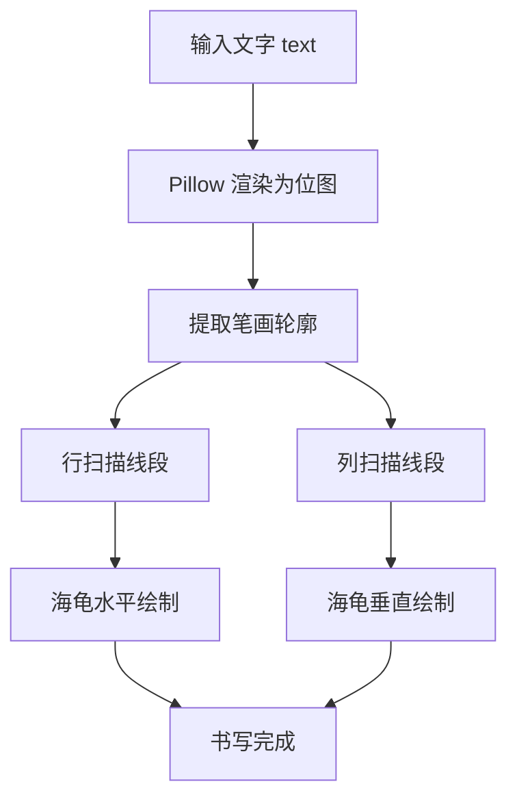

title: 小海龟写字机（turtle_text_writer）

# 小海龟写字机（turtle_text_writer）

## 模块简介

`turtle_text_writer` 是一个基于 ROS2 Humble 与 turtlesim 的入门示例模块：输入一段文字（中英文均可），控制小海龟把它书写出来。该模块演示了 ROS2 客户端库（rclpy）中**服务调用**（`teleport_absolute`、`set_pen`）的典型用法，以及"图像渲染 → 轮廓提取 → 轨迹生成"的完整流水线。

## 环境要求

- Ubuntu 22.04 + ROS2 Humble
- 依赖：
  - `ros-humble-turtlesim`（Humble 自带）
  - `python3-pil`、`fonts-noto-cjk`：`sudo apt install -y python3-pil fonts-noto-cjk`

## 目录结构

```
src/turtle_text_writer/
├── main.py                      # 主程序入口（书写逻辑）
├── launch/
│   └── turtle_writer.launch.py  # 一键启动文件
├── demo.gif                     # 运行效果演示
└── README.md                    # 模块说明
```

## 运行方法

```bash
cd src/turtle_text_writer
ros2 launch ./launch/turtle_writer.launch.py text:="你好"
```

默认书写 "HUTB"；`text:=` 参数可指定任意中英文文字。

## 效果演示


（GIF 演示："你好" 的书写过程）

## 计算原理

### 1. 文字渲染

使用 Pillow 将文字渲染为 440×220 的二值位图：

$$I(x,y) = \begin{cases} 1 & \text{像素为黑色笔画} \\ 0 & \text{像素为背景} \end{cases}$$

### 2. 轮廓提取

对每个黑色像素，检查其 4 邻域（上、下、左、右）；若任一邻域为背景，则判定为笔画轮廓点：

$$O(x,y) = I(x,y) \land \bigl(N(x,y) \text{ 中存在 0}\bigr)$$

轮廓点只保留笔画的边缘，海龟沿边缘绘制即可得到清晰的**空心描边字**，避免实心填充导致的笔画糊连。

### 3. 线段合并

对每一行/列的轮廓点序列，相邻间隙 ≤ 3 像素的连通点合并为一条线段：

$$\text{run} = [p_s, p_{s+1}, \ldots, p_e], \quad p_{i+1} - p_i \le 3$$

### 4. 坐标映射

将位图像素坐标映射到 turtlesim 画布坐标（画布范围 0~11，y 轴向上）：

$$x_t = 0.5 + x_p \cdot \frac{10}{440}, \qquad y_t = 11 - y_p \cdot \frac{9.5}{220}$$

### 5. 海龟绘制

通过服务调用驱动海龟：抬笔（`set_pen off=1`）→ 移动到线段起点 → 落笔（`set_pen off=0`）→ 移动到线段终点，逐段完成书写。

## 算法流程



## 源码解析

### main.py

- `pick_font(text, canvas_w, canvas_h)`：在候选字体列表中按字号从大到小尝试，返回能容纳整段文字的第一个字体；支持中文字体（Noto CJK / 文泉驿）。
- `TurtleTextWriter` 节点：
  - `wait_services()`：等待 turtlesim 的 `teleport_absolute` 与 `set_pen` 服务就绪；
  - `_render_segments()`：文字 → 位图 → 轮廓 → 横竖线段列表；
  - `draw()`：依次绘制水平线段与垂直线段，行间加入小停顿使书写过程可见。
- `main()`：命令行入口，支持 `--text` 参数，符合模块"入口以 main. 开头"的约定。

### launch/turtle_writer.launch.py

同时启动 `turtlesim_node` 与 `main.py`，通过 `text` 启动参数向书写程序传值，实现一键启动。
