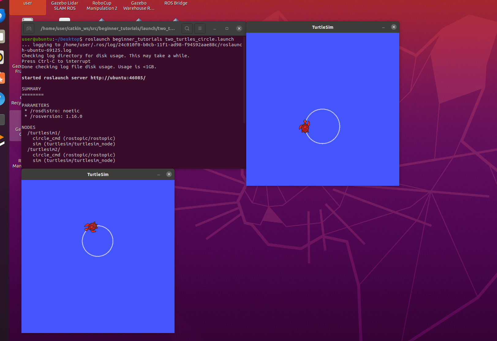
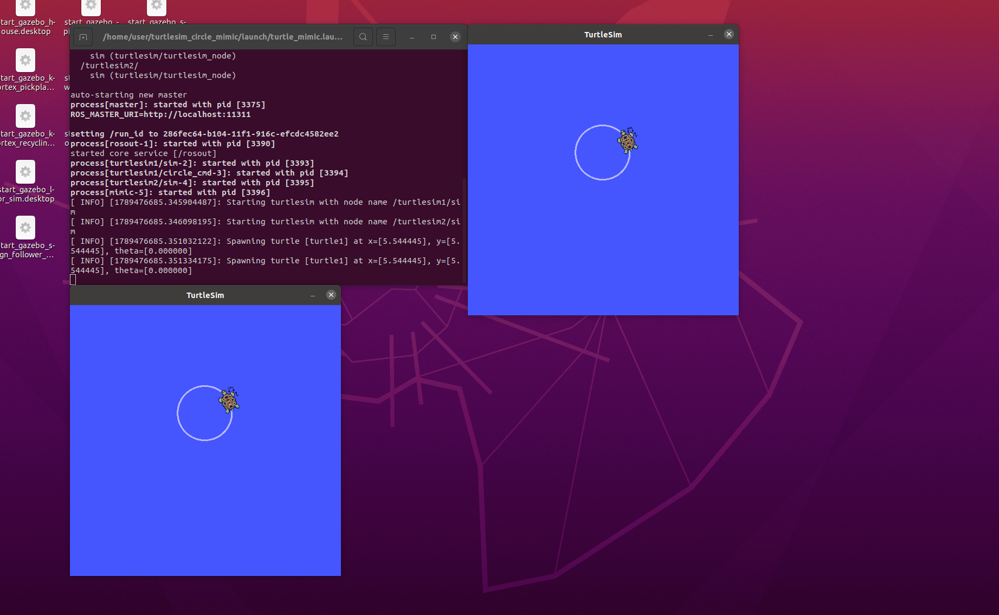

# 认识 ROS：两只海龟画圆与跟随

本实验使用 ROS1 的 turtlesim，在两个独立窗口中演示圆周运动和位置跟随，认识速度话题、命名空间、launch 启动和话题重映射。

## 实验环境

目标环境为 Ubuntu 20.04、ROS1 Noetic 和可用的图形桌面。Windows 可以编辑文件和预览本站，ROS 命令需要在 Ubuntu 中执行。其他 ROS1 发行版需要相应调整依赖。

源代码位于仓库 `src/turtlesim_circle_mimic/`，包含 main.sh、两个 launch 文件、package.xml、CMakeLists.txt 和运行说明。原始作业的两个 launch 示例已整理为独立模块。

## 准备与启动

把 `src/turtlesim_circle_mimic` 整个文件夹复制到 Ubuntu 的主目录，确认目录为 `~/turtlesim_circle_mimic`，然后执行：

```bash
source /opt/ros/noetic/setup.bash
sudo apt install ros-noetic-turtlesim ros-noetic-rostopic ros-noetic-roslaunch
cd ~/turtlesim_circle_mimic
bash main.sh circle
```

`main.sh` 调用 roslaunch 启动整个演示，无需单独运行 roscore。以下两种模式应先按 Ctrl+C 停止前一种，再启动后一种。

## 两只海龟独立画圆

`two_turtles_circle.launch` 在 `turtlesim1` 和 `turtlesim2` 命名空间下各启动一个仿真器和一个速度发布节点，均以 10 Hz 发布 `geometry_msgs/Twist`。

| 仿真器 | 速度话题 | linear.x | angular.z |
| --- | --- | --- | --- |
| turtlesim1 | /turtlesim1/turtle1/cmd_vel | 2.0 | 1.8 |
| turtlesim2 | /turtlesim2/turtle1/cmd_vel | 1.5 | -1.2 |

线速度和角速度保持不变时，理论圆周半径为 `r = abs(v / w)`，分别约为 1.11 和 1.25 个仿真坐标单位。角速度符号相反，因此两只海龟的旋转方向相反。

在另一个已加载 ROS 环境的终端检查：

```bash
rosnode list
rostopic echo -n 1 /turtlesim1/turtle1/cmd_vel
rostopic echo -n 1 /turtlesim2/turtle1/cmd_vel
```

## 两只海龟跟随

```bash
bash main.sh mimic
```

第一只海龟自动画圆，turtlesim 的 mimic 节点利用位置反馈控制第二只海龟跟踪第一只。这里的跟随是位置跟踪，不是简单复制速度消息，也不保证轨迹逐点完全相同。

launch 中通过 remap 设置输入与输出：

```xml
<remap from="input" to="/turtlesim1/turtle1"/>
<remap from="output" to="/turtlesim2/turtle1"/>
```

可用以下命令查看实际订阅和发布关系：

```bash
rosnode info /mimic
rostopic echo -n 1 /turtlesim1/turtle1/pose
rostopic echo -n 1 /turtlesim2/turtle1/pose
```

如需键盘控制，先停止自动演示，再运行：

```bash
bash main.sh mimic auto_drive:=false
```

另开 Ubuntu 终端：

```bash
source /opt/ros/noetic/setup.bash
rosrun turtlesim turtle_teleop_key /turtle1/cmd_vel:=/turtlesim1/turtle1/cmd_vel
```

保持键盘控制终端获得焦点，使用方向键控制第一只海龟，观察第二只跟随。

## 按 ROS 包启动

```bash
source /opt/ros/noetic/setup.bash
mkdir -p ~/ros_ws/src
cp -r ~/turtlesim_circle_mimic ~/ros_ws/src/
cd ~/ros_ws
catkin_make
source devel/setup.bash
roslaunch turtlesim_circle_mimic two_turtles_circle.launch
```

退出画圆演示后，启动跟随演示：

```bash
roslaunch turtlesim_circle_mimic turtle_mimic.launch
```

## 常见问题

- 找不到 roslaunch：先加载 `/opt/ros/noetic/setup.bash`，并确认安装了 ROS1。
- 找不到 turtlesim_circle_mimic：确认只将本模块放入工作空间，完成 catkin_make 后加载该工作空间的 `devel/setup.bash`。
- 无法打开窗口：在 Ubuntu 图形桌面的终端中启动，检查 DISPLAY；普通 Windows CMD 不能直接运行这些 ROS1 Linux 命令。
- 键盘不起作用：关闭自动驱动，确认控制终端获得焦点，并检查速度话题重映射。
- 节点被意外关闭：不要同时运行两个演示或原始 beginner_tutorials 的同名节点。

## 运行结果

原始作业已由提交者在 Ubuntu 中运行。以下截图展示原始 `beginner_tutorials` 包的画圆演示：终端运行 `roslaunch beginner_tutorials two_turtles_circle.launch`，两个 TurtleSim 窗口均出现圆形轨迹。终端显示 ROS Noetic，rosversion 为 1.16.0；Ubuntu 的具体版本仍需通过 `lsb_release -a` 记录。



提交者随后在 Ubuntu 中运行了整理后的跟随演示。下图终端路径指向 `turtlesim_circle_mimic/launch/turtle_mimic.launch`，日志显示 `turtlesim1/circle_cmd` 和 `mimic` 进程启动，两个窗口均显示圆形轨迹。这与第一只海龟自动画圆、第二只通过 mimic 跟随的配置一致。静态截图不用于判断长时间跟踪误差或退出行为。



## 大模型使用声明

使用 OpenAI Codex 辅助检查和整理原始 launch 文件、补充启动入口、依赖声明与说明文档。提交者须理解并核验所有命令、代码和实验结论，对最终提交内容负全部责任。
