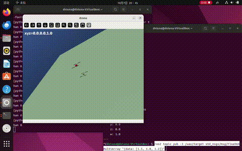

# uav_mujoco_keyboard 无人机模块文档

## 1. 模块简介

本模块基于 **Mujoco 3.15** 物理引擎构建四旋翼无人机仿真环境，
实现无人机的 **键盘运动控制（作业任务1）** 与 **ROS2 封装**：

- 自写四旋翼无人机模型（`models/drone.xml`）
- PID 悬停控制（高度环 + 姿态环 + 水平环）
- 键盘控制：`W/A/S/D/R/F` 六个方向
- ROS2 话题：发布 `/uav/pose`（实时位置姿态）、订阅 `/uav/target`（目标位置）

仿真器选型说明：作业允许 OpenHUTB 2.10.0 / Carla 0.9.16 / AirSim 1.8.1 /
HoloOcean 2.3.0 / Mujoco 3.12.0。因虚拟机环境无独立 GPU（VirtualBox 虚拟显卡
仅 OpenGL 4.1，UE4 系仿真器无法渲染），选用 **Mujoco**（纯 CPU 物理与渲染，
虚拟环境内稳定运行）。

## 2. 运行环境

| 项目 | 要求 |
| --- | --- |
| 系统 | Ubuntu 22.04 |
| ROS2 | Humble |
| Python | 3.10 |
| Mujoco | 3.15（`pip3 install mujoco`） |
| OpenCV | `pip3 install opencv-python` |

## 3. 运行步骤

```bash
cd ~/ros2/src/uav_mujoco_keyboard
source /opt/ros/humble/setup.bash
ros2 launch ./launch/uav_keyboard.launch.py
```

无人机自动起飞悬停至 z=1.0。点击弹窗获得焦点后键盘控制；另开终端可查看/遥控：

```bash
ros2 topic echo /uav/pose
ros2 topic pub -1 /uav/target std_msgs/msg/Float64MultiArray "{data: [2.0, 1.0, 1.5]}"
```

## 4. 控制原理

### 4.1 四旋翼推力模型

无人机为 X 构型，旋翼力臂 `L = 0.2 m`，机体质量 `m`，重力加速度 `g`。

4 个旋翼推力 `f1~f4` 合成为：

```
F  = f1 + f2 + f3 + f4              （总升力）
Mx = L(f1 + f2 - f3 - f4)           （滚转力矩）
My = L(-f1 + f2 + f3 - f4)          （俯仰力矩）
```

控制量 `(F, Mx, My)` 通过混合矩阵反解旋翼推力：

```
f1 = F/4 + (Mx - My)/(4L)
f2 = F/4 + (Mx + My)/(4L)
f3 = F/4 - (Mx - My)/(4L)
f4 = F/4 - (Mx + My)/(4L)
```

### 4.2 PID 控制律

**高度环**（重力前馈补偿）：

```math
F = mg + K_{p,z}(z_{des} - z) - K_{d,z} v_z
```

**水平环**（x、y 同理）：

```math
F_x = K_{p,xy}(x_{des} - x) - K_{d,xy} v_x
```

**姿态环**（保持机体水平）：

```math
M_x = -K_{p,a} \cdot roll - K_{d,a} \omega_x
```

## 5. 源码解析（main.py 关键流程）

```
rclpy.init()
  └─ UAVNode
      ├─ 发布 /uav/pose（PoseStamped）
      ├─ 订阅 /uav/target（Float64MultiArray → 目标位置）
      └─ run() 主循环
          ├─ rclpy.spin_once()     # 处理 ROS 回调
          ├─ mj_step ×10           # 物理仿真推进
          ├─ 读取状态（位置/速度/欧拉角）
          ├─ PID 计算 → xfrc_applied 施加升力与力矩
          ├─ 发布 /uav/pose
          ├─ 渲染 + 显示 + 键盘读取
          └─ 键盘 → 更新目标位置 target
```

## 6. 运行效果



## 7. 性能评价

| 指标 | 数值 |
| --- | --- |
| 悬停高度误差 | < 0.01 m |
| 姿态角误差 | < 0.01 rad |
| 目标跟踪收敛时间 | ~2 s |
