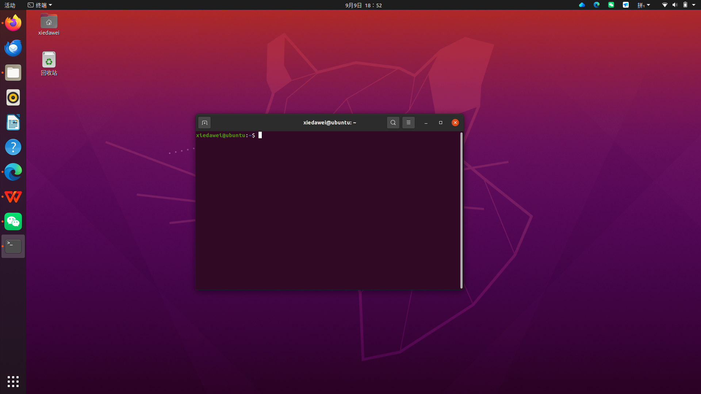
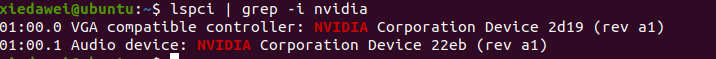
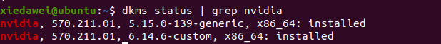
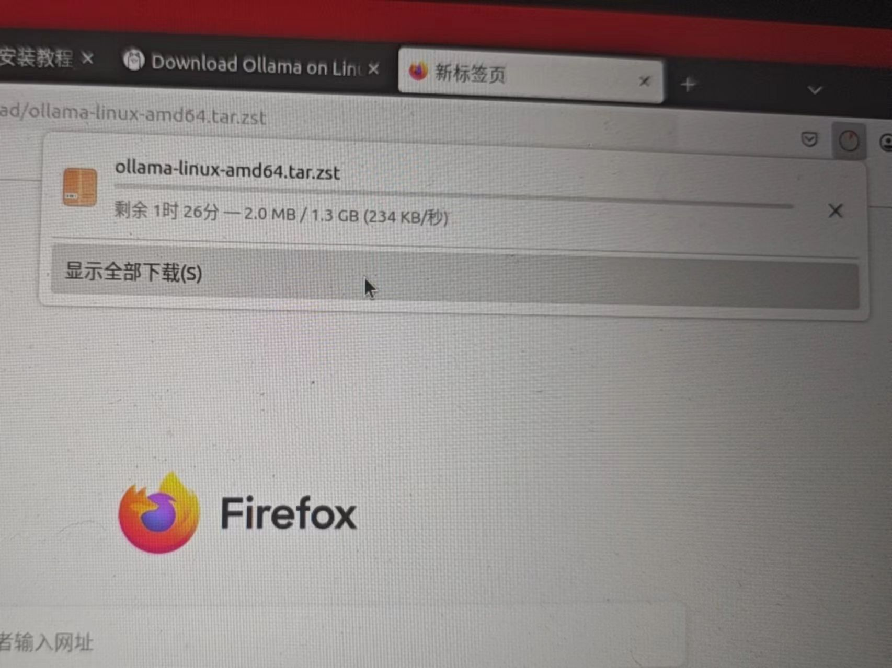
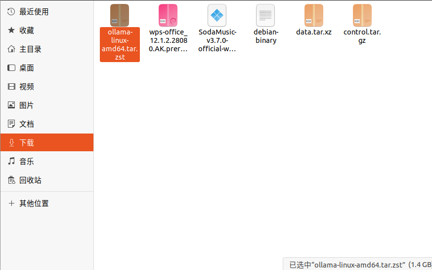
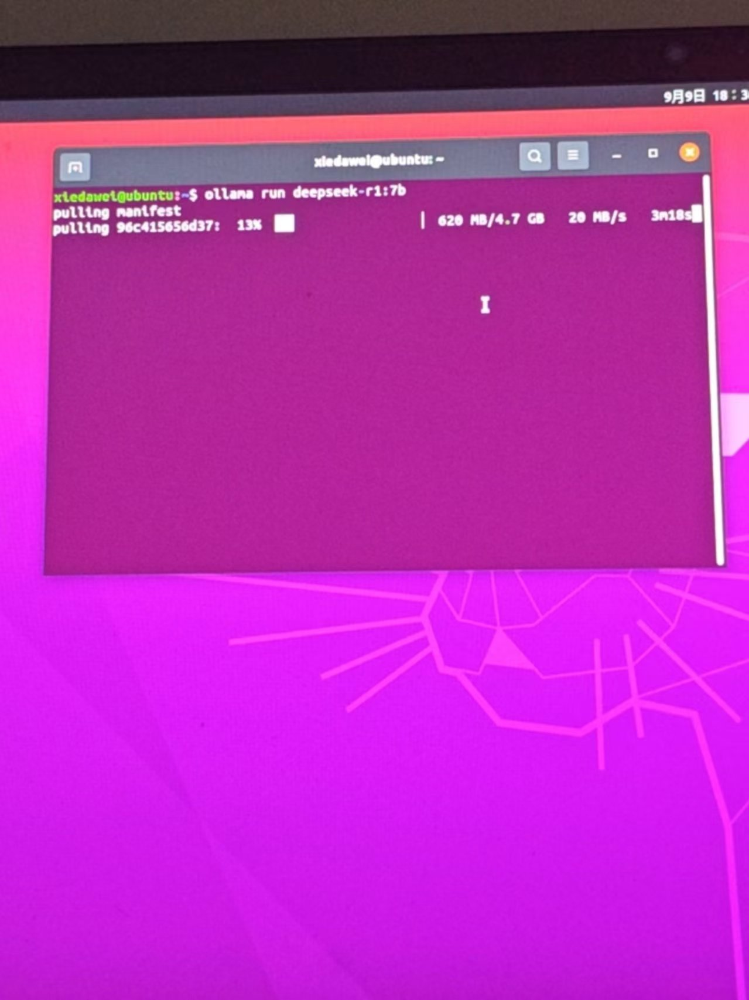
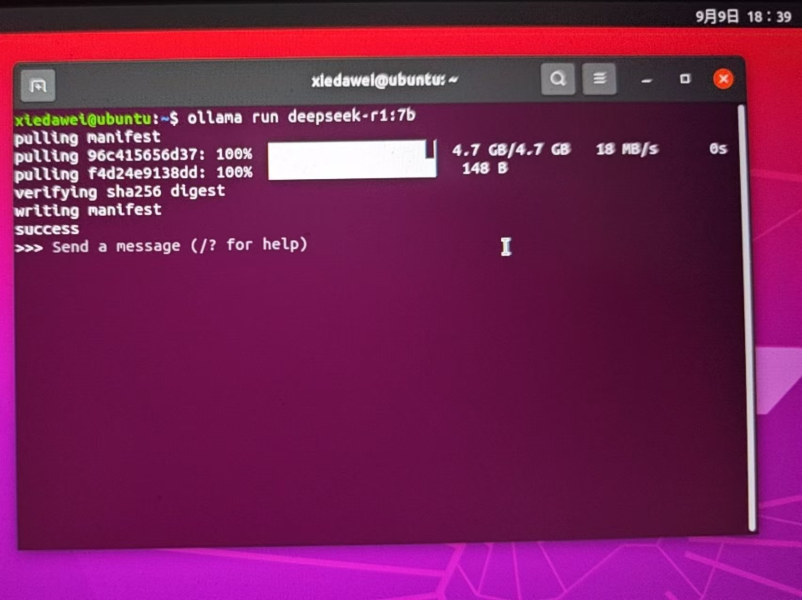

# 自装 ubuntu20.04 如何进行本地大模型部署教程及常见问题

> ctrl+alt+t 打开终端

## 1.查看驱动



### 一、查看本机 NVIDIA 显卡硬件

输入 `lspci | grep -i nvidia`，回车 



`lspci` 是查看主板 PCI 硬件设备的命令；`grep -i nvidia` 筛选出 NVIDIA 设备。

第一行：识别到 NVIDIA 独立显卡（Device 2d19 就是 RTX5060 的硬件 ID）。
第二行：显卡自带的 HDMI 音频设备。

如果这一行没有任何输出 → 主板没有识别到 NVIDIA 显卡，大概率硬件/BIOS 问题

### 二、查看系统提供了哪些驱动版本（看推荐版本）

输入 `ubuntu-drivers devices`，回车（因为一些问题，图暂时没有）会列出显卡型号，标着 `recommended` 的就是 Ubuntu 官方推荐稳定驱动。

记录当前已安装的驱动版本，方便升级后对比。

### 三、查看驱动版本

输入 `dkms status | grep nvidia`，回车（图示为 570 版本）


自装 Ubuntu20.04 的驱动版本通常为 `4xx` 驱动

4xx 驱动能支持的卡（可以 CUDA 加速跑大模型/深度学习）

- GTX10 系（Pascal）
- RTX20 系（Turing）
- RTX30 系（Ampere，3060、3070、3080）


> 上面这些卡，4xx 驱动下： `nvidia-smi` 识别显卡 + CUDA 可用，Ollama、PyTorch 都能 GPU 跑。
>
> 但目前（就本专业学生）而言，电脑显卡通常为 RTX40 系或 RTX50 系，4xx 版本不支持，最低要求为 570 版，CUDA 算力层面（大模型、深度学习）4xx 驱动内部根本没有 Blackwell（sm_120）的 CUDA 支持

- `nvidia-smi` 也许能读出显卡名字（只是基础 PCI 识别）
- 但是 CUDA 不可用，Ollama/PyTorch 只能 CPU 跑，显卡算力完全不参与计算，导致性能及其低下


所以，我们要更新驱动，确保后续大模型跑在显卡（GPU）上。

## 2. 升级驱动，这里提供两种方法

> ctrl+alt+t 打开终端

### 方式 1：自动安装系统推荐驱动

输入 `sudo ubuntu-drivers autoinstall`，回车

输入后会要求输入用户密码

等待 apt 下载、自动安装对应驱动包

> 这条命令自动选择系统推荐的稳定版本，不用手动记版本号，不容易选错

### 方式 2：手动指定版本安装（例如升级到 580，适合知道目标版本的情况）

 ` 
sudo apt update
 `
 `
sudo apt install nvidia-driver-580 
 `
 `
nvidia-utils-580-server
 ` 
回车

可以把 580 替换成想要的版本号（570、580 等）

安装完成**必须重启电脑！**
输入 `reboot`

重启后，验证驱动是否更新成功（这一步可能会出问题，可以直接跳后面）
输入 `nvidia-smi`
看左上角 `Driver Version`，数字变成新版本号，代表升级成功。

同时看 GPU 信息，确认显卡识别正常。

验证 Ollama CUDA 是否正常：
`sudo systemctl restart ollama`

#### 问题：

**情况 1：升级后黑屏、循环登录、nvidia-smi 找不到显卡**
大概率是 BIOS 开启了 Secure Boot（安全启动）
解决：重启电脑，进 BIOS，关闭 Secure Boot，再进系统。

**情况 2：新驱动有问题，需要回滚旧驱动**
卸载新版驱动（示例，把 580 换成你装的版本）
`sudo apt remove --purge nvidia-driver-580`

重装旧驱动 
`sudo apt install nvidia-driver-570 nvidia-utils-570-server`
`sudo reboot`

## 3. 下载 ollama，拉大模型

浏览器直接下载的正确链接（复制这一条，粘贴到火狐地址栏回车）
`https://ollama.com/download/ollama-linux-amd64.tar.zst`


输入后会直接下载到 Downloads（下载）文件夹

下载完成后，打开终端，复制这条解压命令执行
`sudo tar x -C /usr -f ~/Downloads/ollama-linux-amd64.tar.zst`



> 标蓝部分看自己文件名叫啥，记得改
>
> 输入你的电脑密码（输密码屏幕不会显示小黑点，正常，敲完回车）（有的可能没有）
>
> 解压完，验证是否装好
> `ollama -v`
> 能出版本号，说明 ollama 成功安装。
>
> 启动 ollama 服务
> `ollama serve`
>
> 这个终端窗口保持打开，再新建另外一个终端窗口，拉模型：
> （这里以 deepseek 为例）
> `ollama run deepseek-r1:7b`
>
> 
>
> 这样就完成了
> 

## 4. 后续启动，以 deepseek 为例

### 方式一：手动启动（现在这种方式，最简单，推荐调试 ROS+AI 时用）

1. 打开终端 A，启动服务
   `ollama serve`
   保持这个窗口一直开着，最小化可以，千万别关闭。启动成功后会打印 GPU 信息。
2. 打开终端 B，运行模型对话
   `ollama run deepseek-r1:7b`
   输入文字直接聊天；输入 `/exit` 退出对话，但是终端 A 的 serve 依旧保持运行。


如果想换别的模型： `ollama run 模型名`

### 方式二：设置开机后台自启（不用每次手动敲 ollama serve，适合长期开发）

如果你不想每次开机开两个终端，可以设置 systemd 服务，后台常驻。

创建服务文件
`sudo nano /etc/systemd/system/ollama.service`

粘贴下面内容：

```ini
[Unit]
Description=Ollama Service
After=network-online.target
[Service]
ExecStart=/usr/bin/ollama serve
User=root
Restart=always
RestartSec=3
[Install]
WantedBy=default.target
```

按  Ctrl+O  保存，回车；  Ctrl+X  退出 nano 编辑器。

然后执行：

```
 sudo systemctl daemon-reload 
 sudo systemctl enable ollama 
 sudo systemctl start ollama
```

设置完成：以后开机自动后台跑 ollama serve。
之后只需要新开任意终端直接运行：
 ollama run deepseek-r1:7b 
不再需要手动敲  ollama serve 。

查看服务状态：
 systemctl status ollama 

关闭自启：
 sudo systemctl disable ollama

### 常用命令备忘

| 功能                                        | 命令                              |
| ----------------------------------------- | ------------------------------- |
| 查看本地已经下载好的模型                              | `ollama list`                   |
| 删除模型                                      | `ollama rm deepseek-r1:7b`      |
| 停止后台 ollama 服务                            | `sudo systemctl stop ollama`    |
| 启动 ollama 服务                              | `sudo systemctl start ollama`   |
| 查看 ollama 服务运行状态                          | `systemctl status ollama`       |
| 设置开机自启 ollama                             | `sudo systemctl enable ollama`  |
| 关闭开机自启 ollama                             | `sudo systemctl disable ollama` |
| 重启 ollama 服务                              | `sudo systemctl restart ollama` |
| 查看 ollama 版本                              | `ollama -v`                     |
| 拉取模型（只下载不运行）                              | `ollama pull deepseek-r1:7b`    |
| 直接运行模型                                    | `ollama run deepseek-r1:7b`     |
| 重点提醒                                      |                                 |
| 1. 手动模式：ollama serve窗口关闭=服务停止             |                                 |
| 2. 自启模式：系统后台运行，关掉所有终端也能调用，ROS程序可以直接访问接口   |                                 |
| 注：因为部分原因，本人在摸索时没有拍照，所以很多步骤没有参考图片，希望各位能够补充 |                                 |

```

```
